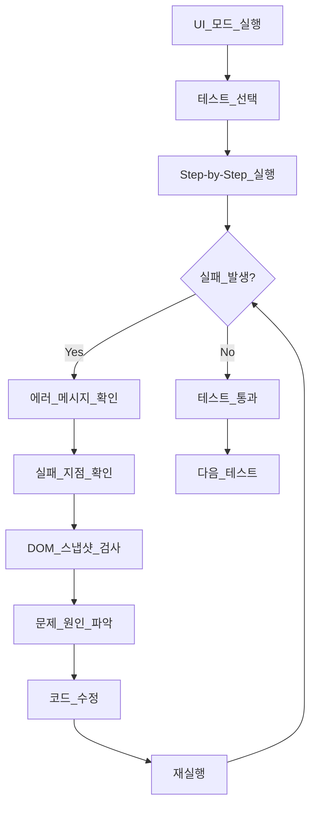

# E2E 테스트 디버깅 가이드

**작성일**: 2026-01-20  
**버전**: 1.0  
**목적**: Playwright UI 모드를 사용한 개별 테스트 디버깅 방법

---

## 1. Playwright UI 모드 사용법

### 1.1 UI 모드 실행

```bash
# 전체 테스트를 UI 모드로 실행
npx playwright test --ui

# 또는 npm 스크립트 사용
npm run test:e2e:ui
```

### 1.2 UI 모드 인터페이스 구성

UI 모드가 실행되면 브라우저에서 다음과 같은 인터페이스가 열립니다:

```
┌─────────────────────────────────────────────────────────┐
│  Playwright Test UI                                     │
├─────────────────────────────────────────────────────────┤
│                                                         │
│  [좌측 패널: 테스트 목록]                                 │
│  ├── e2e/tests/p0/                                      │
│  │   ├── feat-001-checkin.spec.ts                       │
│  │   │   ├── 시나리오 1-1: Day Mode 체크인              │
│  │   │   ├── 시나리오 1-2: Night Mode 체크인            │
│  │   │   ├── 시나리오 1-3: 위기 감지 플로우             │
│  │   │   └── 시나리오 1-4: 네트워크 오류 처리           │
│  │   ├── feat-011-onboarding.spec.ts                    │
│  │   └── ...                                            │
│                                                         │
│  [중앙 패널: 브라우저 화면]                               │
│  - 실제 테스트가 실행되는 브라우저 화면                   │
│  - 각 단계를 시각적으로 확인 가능                        │
│                                                         │
│  [우측 패널: 액션 목록 & 디버깅 도구]                     │
│  - 각 단계별 액션 표시                                   │
│  - 스크린샷, DOM 스냅샷                                 │
│  - 콘솔 로그, 네트워크 요청                              │
│                                                         │
└─────────────────────────────────────────────────────────┘
```

### 1.3 주요 기능

#### A. 테스트 선택 및 실행
- **좌측 패널**에서 실행할 테스트 선택
- **재생 버튼** 클릭하여 테스트 실행
- **체크박스**로 여러 테스트 동시 선택 가능

#### B. 단계별 실행 (Step-by-Step)
1. 테스트 선택 후 **"Step Over"** 버튼 클릭
2. 각 액션이 하나씩 실행됨
3. 각 단계에서 브라우저 상태 확인 가능

#### C. 시간 여행 (Time Travel)
- **우측 패널**에서 각 액션 클릭
- 해당 시점의 브라우저 상태로 이동
- DOM, 스크린샷, 콘솔 로그 확인 가능

#### D. 디버깅 도구
- **Locator 테스트**: 선택자가 올바른지 실시간 확인
- **콘솔 로그**: JavaScript 에러 확인
- **네트워크**: API 호출 확인
- **스크린샷**: 각 단계별 화면 캡처

---

## 2. 개별 테스트 디버깅 절차

### 2.1 특정 테스트만 실행

#### 방법 1: UI 모드에서 선택
```bash
npx playwright test --ui
```
좌측 패널에서 테스트 선택 → 재생 버튼 클릭

#### 방법 2: 파일 경로 지정
```bash
npx playwright test e2e/tests/p0/feat-001-checkin.spec.ts --ui
```

#### 방법 3: 특정 시나리오만
```bash
npx playwright test --ui --grep="Day Mode"
```

### 2.2 실패 원인 파악

#### Step 1: 실패한 테스트 찾기
- 좌측 패널에서 빨간색 X 표시된 테스트 확인

#### Step 2: 에러 메시지 확인
- 우측 패널 하단의 **"Errors"** 탭 확인
- 에러 메시지 및 스택 트레이스 읽기

#### Step 3: 실패 지점 찾기
- 우측 패널의 액션 목록에서 빨간색 표시된 액션 클릭
- 해당 시점의 브라우저 화면 확인

#### Step 4: DOM 검사
- **"DOM Snapshot"** 탭에서 HTML 구조 확인
- 예상한 요소가 존재하는지 확인
- `data-testid`가 올바르게 설정되었는지 확인

#### Step 5: 로케이터 테스트
- **"Locator"** 탭에서 선택자 입력
- 요소가 올바르게 선택되는지 실시간 확인

### 2.3 문제 수정

#### 케이스 1: 요소를 찾을 수 없음
```typescript
// 문제: 
await page.locator('[data-testid="emotion-joy"]').click();
// Error: Timeout waiting for locator

// 해결 1: 요소가 로드될 때까지 대기
await page.waitForSelector('[data-testid="emotion-joy"]', { timeout: 5000 });
await page.locator('[data-testid="emotion-joy"]').click();

// 해결 2: 다른 선택자 사용
await page.locator('button:has-text("완전 최고")').click();
```

#### 케이스 2: 타임아웃 오류
```typescript
// 문제:
await page.waitForSelector('[data-testid="ai-message"]', { timeout: 3000 });
// Error: Timeout 3000ms exceeded

// 해결: 타임아웃 증가
await page.waitForSelector('[data-testid="ai-message"]', { timeout: 10000 });
```

#### 케이스 3: 요소가 클릭 불가능
```typescript
// 문제:
await page.locator('button').click();
// Error: Element is not visible

// 해결: 요소가 보일 때까지 대기
await page.locator('button').waitFor({ state: 'visible' });
await page.locator('button').click();
```

---

## 3. 실전 디버깅 예제

### 예제 1: Day Mode 체크인 테스트 디버깅

#### 실행 명령
```bash
npx playwright test e2e/tests/p0/feat-001-checkin.spec.ts --ui --grep="시나리오 1-1"
```

#### 디버깅 순서

1. **UI 모드 열기**
   - 브라우저에서 Playwright UI 자동 실행

2. **테스트 선택**
   - 좌측에서 "시나리오 1-1: Day Mode 체크인" 선택

3. **Step-by-Step 실행**
   - "Step Over" 버튼 클릭하여 한 단계씩 실행
   - 각 단계마다 브라우저 상태 확인

4. **실패 지점 확인**
   - 예: `await chatPage.selectEmotion('joy')` 실패
   - 에러 메시지: "Timeout waiting for locator"

5. **DOM 검사**
   - DOM Snapshot 탭에서 HTML 확인
   - `data-testid="emotion-joy"` 요소 존재 여부 확인

6. **문제 발견**
   - 요소가 존재하지만 아직 렌더링되지 않음
   - 감정 모달이 애니메이션 중

7. **수정**
   ```typescript
   // 수정 전
   await chatPage.selectEmotion('joy');
   
   // 수정 후
   await page.waitForSelector('[data-testid="emotion-modal"]', { state: 'visible' });
   await chatPage.selectEmotion('joy');
   ```

8. **재실행**
   - 재생 버튼 클릭하여 테스트 재실행
   - 성공 확인 (녹색 체크 표시)

---

## 4. 일반적인 문제 및 해결책

### 4.1 localStorage 접근 오류

**문제**:
```
SecurityError: Failed to read the 'localStorage' property
```

**해결**:
```typescript
// 페이지 로드 후 localStorage 접근
await page.goto('/');
await page.waitForLoadState('domcontentloaded');
await page.evaluate(() => localStorage.setItem('key', 'value'));
```

### 4.2 Firebase 인증 타임아웃

**문제**:
```
Test timeout of 30000ms exceeded while running "beforeEach" hook
```

**해결**:
```typescript
// auth.ts 수정
export async function ensureAuthenticated(page: Page) {
  await page.waitForSelector('[data-testid="auth-loading"]', { 
    state: 'hidden', 
    timeout: 10000 // 타임아웃 증가
  });
  await page.waitForTimeout(2000);
}
```

### 4.3 요소 선택자 불일치

**문제**:
```
Error: locator.click: Test timeout of 30000ms exceeded.
  - waiting for locator('button:has-text("다음")')
```

**해결 방법**:

1. **UI 모드의 Locator Picker 사용**:
   - 브라우저에서 원하는 요소 클릭
   - 자동으로 최적의 선택자 생성

2. **data-testid 추가**:
   ```tsx
   // 컴포넌트 수정
   <button data-testid="next-button">다음</button>
   
   // 테스트 수정
   await page.locator('[data-testid="next-button"]').click();
   ```

3. **더 구체적인 선택자 사용**:
   ```typescript
   // 일반적
   await page.locator('button:has-text("다음")').click();
   
   // 더 구체적
   await page.locator('[data-testid="onboarding-step"] button:has-text("다음")').click();
   ```

### 4.4 애니메이션 대기

**문제**:
```
Element is not clickable at point (x, y)
```

**해결**:
```typescript
// 애니메이션 완료 대기
await page.waitForTimeout(500);

// 또는 요소가 안정될 때까지 대기
await page.locator('button').waitFor({ state: 'attached' });
await page.locator('button').waitFor({ state: 'visible' });
await page.locator('button').click();
```

---

## 5. 실전 워크플로우

### 5.1 개별 테스트 디버깅 워크플로우



### 5.2 구체적 단계

#### 1단계: UI 모드 실행
```bash
npx playwright test --ui
```

브라우저가 자동으로 열리고 Playwright UI가 표시됩니다.

#### 2단계: 테스트 선택
- 좌측 패널에서 디버깅할 테스트 선택
- 예: `feat-001-checkin.spec.ts` → `시나리오 1-1`

#### 3단계: 단계별 실행
- 상단의 **"Step Over"** 버튼 (또는 F10) 클릭
- 각 액션이 하나씩 실행됨
- 중앙 패널에서 브라우저 상태 확인

#### 4단계: 실패 지점 확인
실패가 발생하면:
- 우측 패널에 빨간색 에러 표시
- 에러 메시지 확인
- 스크린샷 확인

#### 5단계: DOM 검사
- **"DOM Snapshot"** 탭 클릭
- HTML 구조 확인
- 예상한 `data-testid`가 있는지 확인

예시:
```html
<!-- 예상 -->
<button data-testid="emotion-joy">완전 최고</button>

<!-- 실제 -->
<button>완전 최고</button>  <!-- data-testid 없음! -->
```

#### 6단계: Locator 테스트
- **"Locator"** 탭에서 선택자 입력
- 예: `[data-testid="emotion-joy"]`
- 요소가 하이라이트되는지 확인

#### 7단계: 코드 수정
- VSCode로 돌아가서 컴포넌트 또는 테스트 수정
- 저장 후 UI 모드는 자동으로 핫 리로드

#### 8단계: 재실행
- **재생 버튼** 클릭하여 테스트 재실행
- 통과하면 다음 테스트로 이동

---

## 6. 현재 프로젝트 디버깅 방법

### 6.1 localStorage 접근 오류 수정 완료 ✅

**문제**:
```
SecurityError: Failed to read the 'localStorage' property
```

**수정 내용** (`e2e/helpers/auth.ts`):
```typescript
export async function skipOnboarding(page: Page) {
  // 먼저 페이지를 로드하여 localStorage 접근 가능하게 함
  await page.goto('/');
  await page.waitForLoadState('domcontentloaded');
  
  const onboardingComplete = await page.evaluate(() => {
    try {
      return localStorage.getItem('onboarding_complete') === 'true';
    } catch {
      return false;
    }
  });

  if (!onboardingComplete) {
    await page.evaluate(() => {
      try {
        localStorage.setItem('onboarding_complete', 'true');
      } catch (e) {
        console.error('Failed to set localStorage:', e);
      }
    });
    await page.reload();
    await page.waitForLoadState('networkidle');
  }
}
```

### 6.2 다음 디버깅 대상

#### 우선순위 1: feat-001-checkin.spec.ts
```bash
# 체크인 테스트만 UI 모드로 실행
npx playwright test e2e/tests/p0/feat-001-checkin.spec.ts --ui
```

**확인 사항**:
1. 감정 선택 모달이 열리는가?
2. `data-testid="emotion-joy"` 요소가 존재하는가?
3. 강도 슬라이더가 작동하는가?
4. 대화 시작하기 버튼이 작동하는가?

#### 우선순위 2: feat-011-onboarding.spec.ts
```bash
npx playwright test e2e/tests/p0/feat-011-onboarding.spec.ts --ui
```

**확인 사항**:
1. 진행률 표시가 정확한가? (1/6, 2/6, ...)
2. 각 단계별 "다음" 버튼이 작동하는가?
3. "건너뛰기" 버튼이 작동하는가?

---

## 7. 디버깅 체크리스트

### 테스트 실패 시 확인 사항

- [ ] 페이지가 올바르게 로드되었는가?
- [ ] `data-testid` 속성이 올바르게 추가되었는가?
- [ ] 선택자가 정확한가?
- [ ] 요소가 화면에 표시되어 있는가?
- [ ] 애니메이션이 완료되었는가?
- [ ] 네트워크 요청이 성공했는가?
- [ ] Firebase 인증이 완료되었는가?
- [ ] localStorage 접근이 가능한가?

### 수정 후 확인 사항

- [ ] 테스트가 통과하는가?
- [ ] 다른 테스트에 영향을 주지 않는가?
- [ ] 성능 목표를 달성하는가?
- [ ] 플로우차트 순서와 일치하는가?

---

## 8. 유용한 단축키 (UI 모드)

| 단축키 | 기능 |
|--------|------|
| `F5` | 테스트 실행 |
| `F10` | Step Over (다음 액션) |
| `F11` | Step Into (내부로) |
| `Shift+F11` | Step Out (외부로) |
| `Ctrl+R` | 재실행 |
| `Ctrl+Shift+P` | Locator Picker |

---

## 9. 로그 및 스크린샷 확인

### 9.1 실패 시 생성되는 파일

테스트 실패 시 다음 파일들이 자동 생성됩니다:

```
test-results/
├── [테스트명]-chromium/
│   ├── test-failed-1.png     # 스크린샷
│   ├── video.webm             # 비디오 녹화
│   └── trace.zip              # 트레이스 파일
```

### 9.2 트레이스 뷰어 사용

```bash
# 트레이스 파일 열기
npx playwright show-trace test-results/[테스트명]-chromium/trace.zip
```

트레이스 뷰어에서:
- 시간 여행 가능
- 네트워크 요청 확인
- 콘솔 로그 확인
- DOM 스냅샷 확인

---

## 10. 빠른 참조

### 자주 사용하는 명령어

```bash
# UI 모드로 전체 테스트
npx playwright test --ui

# 특정 파일만 UI 모드
npx playwright test e2e/tests/p0/feat-001-checkin.spec.ts --ui

# 특정 시나리오만 (grep)
npx playwright test --ui --grep="Day Mode"

# 헤드리스 모드 (빠름)
npx playwright test

# 브라우저 보면서 실행
npx playwright test --headed

# 리포트 보기
npx playwright show-report e2e-report
```

### 자주 사용하는 Locator

```typescript
// data-testid (권장)
page.locator('[data-testid="emotion-joy"]')

// 텍스트 기반
page.locator('button:has-text("다음")')

// 역할 기반 (접근성)
page.getByRole('button', { name: '다음' })

// 레이블 기반
page.getByLabel('메시지 입력')

// 플레이스홀더 기반
page.getByPlaceholder('말씀해주세요')
```

---

## 11. 실제 사용 예시

### 시나리오: 감정 선택이 작동하지 않음

```bash
# 1. UI 모드 실행
npx playwright test e2e/tests/p0/feat-001-checkin.spec.ts --ui
```

**UI 모드에서 확인**:
1. 좌측: "시나리오 1-1" 선택
2. Step Over로 `await chatPage.selectEmotion('joy')` 실행
3. 에러 발생: "Timeout waiting for locator"

**DOM 검사**:
- DOM Snapshot 탭 확인
- `<button>완전 최고</button>` 발견
- `data-testid="emotion-joy"` 없음!

**수정**:
```tsx
// src/components/ui/EmotionSelectModal.tsx
<motion.div
  key={emotion.id}
  data-testid={`emotion-${emotion.id}`}  // 추가!
  whileHover={{ scale: 1.1 }}
  // ...
```

**재실행**:
- 파일 저장
- UI 모드에서 재생 버튼 클릭
- 성공! ✅

---

## 12. 현재 상태 및 다음 단계

### 현재 상태
- ✅ UI 모드 실행 가능
- ✅ localStorage 접근 오류 수정
- ⚠️ 일부 data-testid 누락으로 테스트 실패 중

### 다음 단계

1. **UI 모드 열기**:
   ```bash
   npx playwright test --ui
   ```

2. **feat-001-checkin.spec.ts 디버깅**:
   - Step-by-Step으로 각 액션 실행
   - 실패 지점 파악
   - 필요한 data-testid 추가

3. **순차적으로 모든 P0 테스트 수정**:
   - feat-001 → feat-002 → feat-003 → ...
   - 각 테스트 통과 확인

4. **P1, P2로 확대**

---

## 참고

- Playwright UI 모드는 개발 중 실시간으로 테스트를 확인하고 디버깅하는 가장 강력한 도구입니다.
- 각 단계를 시각적으로 확인할 수 있어 문제를 빠르게 파악할 수 있습니다.
- 코드 수정 시 핫 리로드되어 즉시 재테스트 가능합니다.
