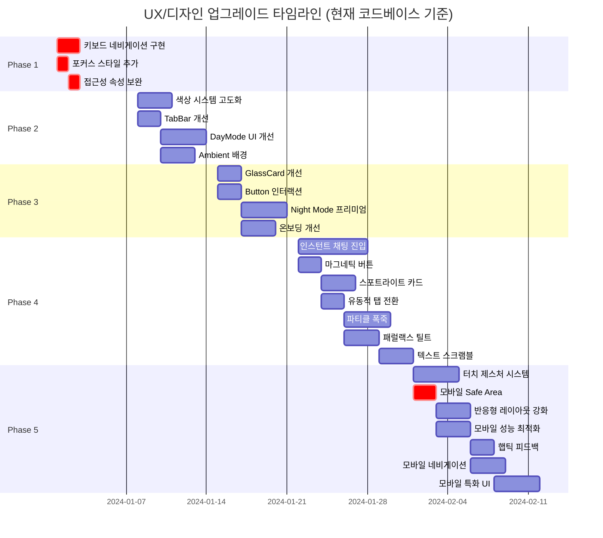

# MaumLog V5.0 프론트엔드 UX/디자인 업그레이드 상세 계획서

**작성일**: 2024년  
**최종 업데이트**: 2024년 (현재 코드베이스 기준 반영, 고감도 인터랙션 및 모바일 최적화 추가)  
**버전**: 4.0  
**대상**: MaumLog V5.0 프론트엔드 코드베이스

---

## 1. 요약 (Executive Summary)

### 1.1 목적

현재 MaumLog V5.0 프론트엔드 코드베이스를 분석하여 배포 시 예상되는 문제점을 해결하고, 사용자 경험(UX) 및 미적 측면을 최상위 수준으로 향상시키기 위한 상세 실행 계획을 수립합니다.

### 1.2 주요 발견 사항

- **Critical**: 접근성 키보드 네비게이션 부재, 포커스 스타일 미흡, 모바일 Safe Area 미적용
- **High**: 색상 시스템 단조로움, 감정 선택 UI 개선 필요, 진입 플로우 복잡함, 모바일 터치 제스처 부재
- **Medium**: GlassCard 효과 개선, Night Mode 프리미엄화 여지, 마이크로 인터랙션 부족, 모바일 성능 최적화 필요
- **Enhancement**: 고감도 인터랙션 시각 효과로 몰입감 극대화 가능, 모바일 친화적 React 컴포넌트 추가

### 1.3 개선 목표

1. 배포 안정성 확보 (Critical 이슈 해결)
2. 브랜드 아이덴티티 강화 (색상/타이포그래피)
3. 감정 웰빙 앱에 적합한 인터랙션 구현
4. 접근성 기준 준수 (WCAG AA)
5. **레이아웃 일관성 유지**: 모든 화면 전환에서도 그리드 시스템 보존
6. **포근하고 스르륵한 글래스모피즘**: 프리미엄 시각 효과로 사용자 몰입 극대화
7. **모바일 우선 설계**: 터치 제스처, Safe Area, 햅틱 피드백으로 모바일 경험 최적화

---

## 2. 현재 상태 분석

### 2.1 디자인 시스템 현황

#### 2.1.1 색상 시스템
- **현재**: Teal 기반 단색 팔레트 (`#2A8E9E`, `#99F6E4`, `#FDA4AF`)
- **문제점**: 
  - 감정 웰빙 앱에 적합한 색상 깊이 부족
  - Night Mode와 Day Mode 간 색상 대비율 미흡
  - 감정별 색상이 정의되어 있으나 활용도 낮음

#### 2.1.2 타이포그래피
- **현재**: Noto Sans KR (Google Fonts 사용 중)
- **상태**: ✅ 정상 작동 중
- **개선 여지**: 감정적 순간을 위한 Serif 폰트 추가 고려 (예: Noto Serif KR)

#### 2.1.3 컴포넌트 시스템
- **장점**: GlassCard, Button, TabBar 등 기본 컴포넌트 구조화됨
- **개선점**: 마이크로 인터랙션 부족, 접근성 속성 미흡

### 2.2 기술 스택 현황

```typescript
// 현재 의존성 (package.json 기준)
{
  "framer-motion": "^12.24.11",  // ✅ 애니메이션 라이브러리
  "lucide-react": "^0.562.0",    // ✅ 아이콘
  "recharts": "^3.6.0",          // ✅ 차트
  "react": "^19.2.3"             // ✅ 최신 React
}
```

**현재 상태**:
- ✅ `index.html`에서 import map 버전 고정됨 (`^` 제거)
- ✅ Tailwind CSS는 빌드 시스템(`tailwind.config.js`) 사용 중
- ⚠️ 개발 환경에서만 import map 사용 (프로덕션 빌드 시 번들링됨)

### 2.3 발견된 문제점 요약

| 우선순위 | 문제 | 영향도 | 파일 | 현재 상태 |
|---------|------|--------|------|----------|
| 🔴 Critical | 키보드 네비게이션 부재 | 높음 | `src/components/ui/TabBar.tsx` | 기본 접근성만 있음 |
| 🔴 Critical | 포커스 스타일 미흡 | 중간 | `src/components/ui/*.tsx` | 포커스 링 없음 |
| 🟡 High | 색상 시스템 단조로움 | 중간 | `src/design/tokens.ts` | 단색 팔레트만 사용 |
| 🟡 High | 감정 선택 UI 개선 필요 | 중간 | `components/DayMode.tsx` | 단순 그리드 버튼 |
| 🟡 High | Ambient 배경 시스템 부재 | 중간 | `App.tsx` | 정적 배경만 있음 |
| 🟢 Medium | GlassCard 효과 개선 | 낮음 | `src/components/ui/GlassCard.tsx` | 기본 글래스만 |
| 🟢 Medium | Button 마이크로 인터랙션 | 낮음 | `src/components/ui/Button.tsx` | 로딩만 있음 |
| 🟢 Medium | Night Mode 프리미엄화 | 낮음 | `components/NightMode.tsx` | 기본 다크 테마 |

---

## 3. Phase별 실행 계획

### 3.1 Phase 1: Critical (배포 전 필수)

**기간**: 1주  
**목표**: 배포 안정성 확보

#### 3.1.1 작업 항목

1. **키보드 네비게이션 구현**
   - 파일: `src/components/ui/TabBar.tsx`
   - 변경: 화살표 키로 탭 이동, Enter/Space로 선택
   - 예상 시간: 1.5시간

2. **포커스 스타일 추가**
   - 파일: `src/components/ui/TabBar.tsx`, `src/components/ui/Button.tsx`, `App.tsx`
   - 변경: `focus:ring-2 focus:ring-brand-primary` 등 포커스 링 추가
   - 예상 시간: 1시간

3. **접근성 속성 보완**
   - 파일: `components/DayMode.tsx`, `src/components/ui/Button.tsx`
   - 변경: `aria-pressed`, `aria-describedby`, `tabIndex` 관리
   - 예상 시간: 1시간

#### 3.1.2 검증 방법

```bash
# 접근성 검사 (Chrome DevTools Lighthouse)
# - Accessibility 점수 90+ 목표
# - 키보드만으로 모든 기능 사용 가능한지 확인
# - 포커스 스타일이 명확하게 보이는지 확인
```

---

### 3.2 Phase 2: High Priority (1주 내)

**기간**: 1주  
**목표**: UX 핵심 개선

#### 3.2.1 작업 항목

1. **색상 시스템 고도화**
   - 파일: `src/design/tokens.ts`
   - 변경: 감정별 그라디언트, 시간대별 테마 추가
   - 예상 시간: 3시간

2. **TabBar 접근성 및 애니메이션**
   - 파일: `src/components/ui/TabBar.tsx`
   - 변경: 키보드 네비게이션, 포커스 스타일, 스태거 애니메이션
   - 예상 시간: 2시간

3. **DayMode 감정 선택 UI 개선**
   - 파일: `components/DayMode.tsx`
   - 변경: 감정 오브 UI 또는 인터랙티브 휠
   - 예상 시간: 4시간

4. **App.tsx Ambient 배경 추가**
   - 파일: `App.tsx`
   - 변경: 감정에 반응하는 배경 오브 시스템
   - 예상 시간: 3시간

#### 3.2.2 검증 방법

- 색상 대비율: WebAIM Contrast Checker (WCAG AA 준수)
- 애니메이션 성능: Chrome DevTools Performance (60fps 유지)

---

### 3.3 Phase 3: Medium Priority (2-4주)

**기간**: 2주  
**목표**: 프리미엄 경험 구현

#### 3.3.1 작업 항목

1. **GlassCard 효과 개선**
   - 파일: `src/components/ui/GlassCard.tsx`
   - 변경: 레이어드 글래스, 노이즈 텍스처, 상단 하이라이트
   - 예상 시간: 2시간

2. **Button 마이크로 인터랙션**
   - 파일: `src/components/ui/Button.tsx`
   - 변경: Ripple 효과, 로딩 애니메이션 개선
   - 예상 시간: 2시간

3. **Night Mode 프리미엄 테마**
   - 파일: `components/NightMode.tsx`
   - 변경: 천체 배경, 별 효과, 오로라 효과
   - 예상 시간: 4시간

4. **온보딩 플로우 개선**
   - 파일: `src/components/onboarding/*.tsx`
   - 변경: 스태거 애니메이션, 진행률 표시 개선
   - 예상 시간: 3시간

---

### 3.4 Phase 4: Premium Visual Interactions (3-4주)

**기간**: 3-4주  
**목표**: 고감도 인터랙션 시각 효과로 사용자 몰입 극대화

#### 3.4.1 작업 항목

1. **인스턴트 채팅 진입 & 몰입 모드**
   - 파일: `components/DayMode.tsx`, `App.tsx`
   - 변경: AI가 먼저 인사, 입력 시 자동 확장, 레이아웃 일관성 유지하며 몰입
   - 예상 시간: 6시간
   - **우선순위**: High

2. **마그네틱 버튼**
   - 파일: `src/components/ui/Button.tsx`
   - 변경: 마우스 커서에 반응하여 버튼이 살짝 끌려오는 효과
   - 예상 시간: 2시간
   - **우선순위**: High

3. **스포트라이트 카드**
   - 파일: `src/components/ui/GlassCard.tsx`
   - 변경: 마우스 위치를 따라 은은한 빛이 비추는 효과
   - 예상 시간: 2.5시간
   - **우선순위**: High

4. **유동적 탭 전환**
   - 파일: `src/components/ui/TabBar.tsx`
   - 변경: 젤리처럼 늘어나며 이동하는 배경 효과
   - 예상 시간: 1.5시간
   - **우선순위**: Medium

5. **파티클 폭죽**
   - 파일: `src/components/ui/ParticleExplosion.tsx` (신규)
   - 변경: 긍정적 액션 완료 시 파티클이 터져나오는 효과
   - 예상 시간: 4시간
   - **우선순위**: Medium

6. **패럴랙스 틸트 (GlassCard 강화)**
   - 파일: `src/components/ui/GlassCard.tsx`
   - 변경: 마우스 위치에 따라 카드가 3D로 기울어지는 효과
   - 예상 시간: 3시간
   - **우선순위**: Medium

7. **텍스트 스크램블**
   - 파일: `src/components/ui/ScrambleText.tsx` (신규)
   - 변경: 로딩 중 텍스트가 스크램블되다가 안착하는 효과
   - 예상 시간: 3시간
   - **우선순위**: Low

#### 3.4.2 핵심 원칙

**레이아웃 일관성 (Layout Integrity) - 절대 준수**
- 몰입 모드 확장 시에도 내부 콘텐츠는 `max-w-2xl`, `px-6` 등 기존 그리드 유지
- Safe Area 존중 (`pt-safe-top`, `pb-safe-bottom`)
- 레이아웃 Shift 방지 (`layout="position"` 활용)

**성능 최적화**
- 모든 애니메이션은 `transform`, `opacity`만 사용 (GPU 가속)
- `will-change` 속성으로 성능 최적화
- 모바일에서는 일부 효과 비활성화 옵션 제공

**접근성 고려**
- `prefers-reduced-motion` 존중
- 키보드 사용자도 모든 효과를 경험할 수 있도록 설계

---

### 3.5 Phase 5: Mobile-First Optimization (React 기반)

**기간**: 2-3주  
**목표**: 모바일 환경에서 최적의 사용자 경험 제공

#### 3.5.1 작업 항목

1. **터치 제스처 시스템 구현**
   - 파일: `src/hooks/useTouchGestures.ts` (신규), `components/DayMode.tsx`
   - 변경: 스와이프, 핀치, 롱프레스 등 터치 제스처 지원
   - 예상 시간: 4시간
   - **우선순위**: High

2. **모바일 Safe Area 처리**
   - 파일: `App.tsx`, `src/components/ui/TabBar.tsx`
   - 변경: CSS `env()` 함수로 Safe Area 적용, Tailwind 플러그인 추가
   - 예상 시간: 2시간
   - **우선순위**: Critical

3. **반응형 레이아웃 강화**
   - 파일: `tailwind.config.js`, 모든 페이지 컴포넌트
   - 변경: 모바일 우선 반응형 그리드, 터치 친화적 버튼 크기
   - 예상 시간: 3시간
   - **우선순위**: High

4. **모바일 성능 최적화**
   - 파일: `src/utils/performance.ts` (신규), 각 컴포넌트
   - 변경: 모바일 감지 후 애니메이션 축소, 이미지 지연 로딩
   - 예상 시간: 3시간
   - **우선순위**: High

5. **햅틱 피드백 (Vibration API)**
   - 파일: `src/hooks/useHaptics.ts` (신규)
   - 변경: 감정 선택, 버튼 클릭 시 진동 피드백
   - 예상 시간: 2시간
   - **우선순위**: Medium

6. **모바일 네비게이션 패턴**
   - 파일: `src/components/ui/TabBar.tsx`, `App.tsx`
   - 변경: 하단 탭바 고정, 스와이프로 탭 전환
   - 예상 시간: 3시간
   - **우선순위**: Medium

7. **모바일 특화 UI 컴포넌트**
   - 파일: `src/components/ui/MobileSheet.tsx` (신규), `src/components/ui/PullToRefresh.tsx` (신규)
   - 변경: 바텀 시트, 당겨서 새로고침
   - 예상 시간: 4시간
   - **우선순위**: Medium

#### 3.5.2 핵심 원칙

**모바일 우선 설계 (Mobile-First)**
- 모든 컴포넌트는 모바일에서 먼저 테스트
- 터치 타겟 최소 44x44px (Apple HIG 기준)
- 스크롤 성능 최적화 (가상화 고려)

**성능 최적화**
- 모바일에서는 복잡한 애니메이션 축소 또는 비활성화
- `will-change` 속성 신중 사용
- 이미지 및 리소스 지연 로딩

**터치 친화적 인터랙션**
- 스와이프 제스처로 자연스러운 네비게이션
- 롱프레스로 컨텍스트 메뉴
- 핀치 줌으로 콘텐츠 확대 (필요 시)

---

### 3.6 Phase 6: Enhancement (4주 이후)

**기간**: 지속적  
**목표**: 지속적 개선

- Streak 시스템 UI
- Level Up 축하 애니메이션
- 성취감 게이미피케이션
- 시간대별 자동 테마 전환

---

## 4. 컴포넌트별 상세 개선 계획

### 4.1 src/components/ui/TabBar.tsx

#### 4.1.1 현재 상태

```tsx
// 기본 접근성만 있음, 키보드 네비게이션 없음
<motion.button
  key={tab.id}
  onClick={() => onTabChange(tab.id)}
  whileTap={{ scale: 0.9 }}
  className={...}
  aria-label={tab.label}
  aria-current={isActive ? 'page' : undefined}
>
  {tab.icon}
</motion.button>
```

**문제점**:
- 화살표 키로 탭 이동 불가
- 포커스 스타일 없음 (키보드 사용자에게 피드백 부족)
- 스태거 애니메이션 없음

#### 4.1.2 개선 방안

```tsx
// ✅ 키보드 네비게이션, 포커스 스타일, 스태거 애니메이션
<motion.nav
  initial="hidden"
  animate="show"
  variants={staggerContainer}
  className={...}
  role="navigation"
  aria-label="메인 네비게이션"
>
  {allTabs.map((tab, index) => {
    const isActive = activeTab === tab.id;
    
    return (
      <motion.button
        key={tab.id}
        variants={staggerItem}
        onClick={() => onTabChange(tab.id)}
        onKeyDown={(e) => {
          // 화살표 키 네비게이션
          if (e.key === 'ArrowRight') {
            e.preventDefault();
            const nextIndex = (index + 1) % allTabs.length;
            onTabChange(allTabs[nextIndex].id);
            // 포커스 이동
            const nextButton = e.currentTarget.parentElement?.children[nextIndex] as HTMLElement;
            nextButton?.focus();
          } else if (e.key === 'ArrowLeft') {
            e.preventDefault();
            const prevIndex = (index - 1 + allTabs.length) % allTabs.length;
            onTabChange(allTabs[prevIndex].id);
            const prevButton = e.currentTarget.parentElement?.children[prevIndex] as HTMLElement;
            prevButton?.focus();
          } else if (e.key === 'Home') {
            e.preventDefault();
            onTabChange(allTabs[0].id);
            const firstButton = e.currentTarget.parentElement?.children[0] as HTMLElement;
            firstButton?.focus();
          } else if (e.key === 'End') {
            e.preventDefault();
            const lastIndex = allTabs.length - 1;
            onTabChange(allTabs[lastIndex].id);
            const lastButton = e.currentTarget.parentElement?.children[lastIndex] as HTMLElement;
            lastButton?.focus();
          }
        }}
        whileTap={{ scale: 0.9 }}
        whileFocus={{ scale: 1.05 }}
        className={`
          ...기존 스타일...
          focus:outline-none 
          focus:ring-2 
          focus:ring-brand-primary 
          focus:ring-offset-2
          ${mode === 'day' ? 'focus:ring-offset-white' : 'focus:ring-offset-slate-900'}
        `}
        aria-label={tab.label}
        aria-current={isActive ? 'page' : undefined}
        tabIndex={isActive ? 0 : -1}
      >
        {tab.icon}
        {isActive && (
          <motion.div 
            layoutId="activeTabDot"
            className={`absolute -bottom-2 w-1 h-1 rounded-full ${mode === 'day' ? 'bg-brand-primary' : 'bg-brand-secondary'}`}
          />
        )}
      </motion.button>
    );
  })}
</motion.nav>

// 스태거 애니메이션 variants (파일 상단에 추가)
const staggerContainer = {
  hidden: { opacity: 0 },
  show: {
    opacity: 1,
    transition: {
      staggerChildren: 0.08,
      delayChildren: 0.1,
    }
  }
};

const staggerItem = {
  hidden: { opacity: 0, y: 20 },
  show: { 
    opacity: 1, 
    y: 0,
    transition: { type: "spring", stiffness: 300, damping: 24 }
  }
};
```

#### 4.1.3 변경 이유

- 키보드 사용자 접근성 향상 (WCAG 2.1 준수)
- 포커스 스타일로 시각적 피드백 제공
- 스태거 애니메이션으로 부드러운 로딩 경험
- Home/End 키로 첫/마지막 탭 빠른 이동

#### 4.1.4 영향 범위

- TabBar 컴포넌트 전체
- 키보드 사용자 경험 개선
- 스크린 리더 사용자 경험 개선

---

### 4.2 src/components/ui/Button.tsx

#### 4.2.1 현재 상태

```tsx
// 기본 로딩 상태만 있음, 마이크로 인터랙션 부족
<motion.button
  disabled={isLoading || props.disabled}
  {...props}
>
  {isLoading && <Loader2 className="w-4 h-4 animate-spin" />}
  {children}
</motion.button>
```

**문제점**:
- 클릭 시 시각적 피드백 부족
- 포커스 스타일 없음
- Ripple 효과 없음

#### 4.2.2 개선 방안

```tsx
// ✅ Ripple 효과, 포커스 스타일 추가
const Button: React.FC<ButtonProps> = ({ 
  children, 
  variant = 'primary', 
  isLoading, 
  className = '', 
  onClick,
  ...props 
}) => {
  const [ripples, setRipples] = useState<Array<{ x: number; y: number; id: number }>>([]);
  const buttonRef = useRef<HTMLButtonElement>(null);
  
  const handleClick = (e: React.MouseEvent<HTMLButtonElement>) => {
    if (!buttonRef.current || isLoading) return;
    
    const rect = buttonRef.current.getBoundingClientRect();
    const x = e.clientX - rect.left;
    const y = e.clientY - rect.top;
    
    const newRipple = { x, y, id: Date.now() };
    setRipples(prev => [...prev, newRipple]);
    
    setTimeout(() => {
      setRipples(prev => prev.filter(r => r.id !== newRipple.id));
    }, 600);
    
    onClick?.(e);
  };
  
  return (
    <motion.button
      ref={buttonRef}
      onClick={handleClick}
      disabled={isLoading || props.disabled}
      whileFocus={{ scale: 1.02 }}
      className={`
        relative overflow-hidden
        ...기존 스타일...
        focus:outline-none focus:ring-2 focus:ring-brand-primary focus:ring-offset-2
        ${className}
      `}
      {...props}
    >
      {/* Ripple Effects */}
      {ripples.map(ripple => (
        <motion.span
          key={ripple.id}
          className="absolute rounded-full bg-white/30 pointer-events-none"
          initial={{ width: 0, height: 0, x: ripple.x, y: ripple.y }}
          animate={{ 
            width: 200, 
            height: 200, 
            x: ripple.x - 100, 
            y: ripple.y - 100,
            opacity: [0.5, 0],
          }}
          transition={{ duration: 0.6 }}
        />
      ))}
      
      {isLoading && (
        <motion.div
          initial={{ opacity: 0 }}
          animate={{ opacity: 1 }}
          className="absolute inset-0 flex items-center justify-center bg-inherit rounded-full"
        >
          <Loader2 className="w-4 h-4 animate-spin" />
        </motion.div>
      )}
      
      <motion.span
        animate={{ opacity: isLoading ? 0 : 1 }}
        className="flex items-center justify-center gap-2"
      >
        {children}
      </motion.span>
    </motion.button>
  );
};
```

#### 4.2.3 변경 이유

- 클릭 시 시각적 피드백 강화 (Material Design 스타일)
- 포커스 스타일로 키보드 사용자 지원
- 로딩 상태 시 부드러운 전환

---

### 4.3 src/design/tokens.ts

#### 4.3.1 현재 상태

```typescript
// 단조로운 색상 팔레트
export const brandColors = {
  primary: '#2A8E9E',      // Muted Teal
  secondary: '#99F6E4',    // Teal 200
  accent: '#FDA4AF',       // Soft Pink
  dark: '#115E59',         // Teal 800
  light: '#F0FDFA',        // Teal 50
} as const;
```

#### 4.2.2 개선 방안

```typescript
// ✅ 풍부한 색상 시스템
export const brandColors = {
  primary: {
    50: '#f0fdfa',
    100: '#ccfbf1',
    200: '#99f6e4',
    300: '#5eead4',
    400: '#2dd4bf',
    500: '#2A8E9E',    // 기존 primary 유지
    600: '#0d9488',
    700: '#0f766e',
    800: '#115e59',
    900: '#134e4a',
  },
  secondary: {
    light: '#f0fdfa',
    DEFAULT: '#99f6e4',
    dark: '#5eead4',
  },
  accent: {
    light: '#fff1f2',
    DEFAULT: '#FDA4AF',
    dark: '#fb7185',
  },
  // Night Mode 전용 색상
  night: {
    surface: '#0f0f23',
    elevated: '#1a1a3e',
    glow: 'rgba(99, 102, 241, 0.15)',
    text: {
      primary: '#f8fafc',
      secondary: '#cbd5e1',
      muted: '#94a3b8',
    },
  },
} as const;

// ✅ 감정별 그라디언트 추가
export const emotionGradients = {
  joy: 'linear-gradient(135deg, #fef08a 0%, #fde047 50%, #facc15 100%)',
  peace: 'linear-gradient(135deg, #ccfbf1 0%, #5eead4 50%, #2dd4bf 100%)',
  anxiety: 'linear-gradient(135deg, #fed7aa 0%, #fdba74 50%, #fb923c 100%)',
  sadness: 'linear-gradient(135deg, #c4b5fd 0%, #a78bfa 50%, #8b5cf6 100%)',
  anger: 'linear-gradient(135deg, #fecaca 0%, #fca5a5 50%, #f87171 100%)',
} as const;
```

#### 4.3.3 변경 이유

- 감정 웰빙 앱에 적합한 색상 깊이 제공
- Night Mode 전용 색상으로 가독성 향상
- 감정별 그라디언트로 시각적 차별화

---

### 4.4 components/DayMode.tsx

#### 4.4.1 현재 상태

```tsx
// 단순 그리드 버튼 배열, 접근성 부족
<div className="grid grid-cols-2 sm:grid-cols-3 gap-4 mb-8">
  {EMOTIONS_CONFIG.map(emotion => (
    <motion.button
      key={emotion.id}
      onClick={() => setSelectedEmotion(emotion.id)}
      whileHover={{ scale: 1.05 }}
      whileTap={{ scale: 0.95 }}
      className={`
        relative overflow-hidden rounded-2xl p-6
        ${selectedEmotion === emotion.id 
          ? `bg-gradient-to-br ${emotion.bgGradient} border-2 border-brand-primary shadow-lg` 
          : 'bg-white/50 border border-white/60 hover:bg-white/70'
        }
        transition-all duration-300
      `}
    >
      <div className={`${emotion.color} mb-2 flex justify-center`}>
        {emotion.icon}
      </div>
      <p className={`text-sm font-medium ${selectedEmotion === emotion.id ? 'text-slate-900' : 'text-slate-600'}`}>
        {emotion.label}
      </p>
    </motion.button>
  ))}
</div>
```

**문제점**:
- 감정 웰빙 앱에 적합한 시각적 표현 부족
- 접근성 속성 부재 (`aria-pressed` 등)
- 선택 시 피드백이 단순함

#### 4.4.2 개선 방안: 감정 오브 UI

```tsx
// ✅ 감정 오브 UI 컴포넌트
const EmotionOrb: React.FC<{
  emotion: EmotionConfig;
  isSelected: boolean;
  onSelect: () => void;
}> = ({ emotion, isSelected, onSelect }) => {
  return (
    <motion.button
      onClick={onSelect}
      whileHover={{ scale: 1.1 }}
      whileTap={{ scale: 0.95 }}
      whileFocus={{ scale: 1.05 }}
      className="relative w-24 h-24 rounded-full focus:outline-none focus:ring-4 focus:ring-white/60"
      style={{
        background: `radial-gradient(circle at 30% 30%, 
          ${emotionColors[emotion.id][100]}, 
          ${emotionColors[emotion.id][400]})`,
        boxShadow: isSelected 
          ? `0 0 60px ${emotionColors[emotion.id][400]}40, inset 0 0 30px rgba(255,255,255,0.3)` 
          : `0 10px 40px ${emotionColors[emotion.id][400]}20`,
      }}
      aria-label={`${emotion.label} 감정 선택`}
      aria-pressed={isSelected}
    >
      <motion.span
        animate={{ 
          scale: isSelected ? [1, 1.2, 1] : 1,
          rotate: isSelected ? [0, 10, -10, 0] : 0,
        }}
        transition={{ duration: 0.5 }}
        className="text-4xl"
      >
        {emotion.emoji}
      </motion.span>
      
      {/* 펄스 효과 */}
      {isSelected && (
        <motion.div
          className="absolute inset-0 rounded-full border-2 border-white/60"
          animate={{
            scale: [1, 1.3, 1],
            opacity: [0.6, 0, 0.6],
          }}
          transition={{ duration: 1.5, repeat: Infinity }}
        />
      )}
    </motion.button>
  );
};

// 사용
<div className="flex flex-wrap justify-center gap-8 mb-8">
  {EMOTIONS_CONFIG.map(emotion => (
    <EmotionOrb
      key={emotion.id}
      emotion={emotion}
      isSelected={selectedEmotion === emotion.id}
      onSelect={() => setSelectedEmotion(emotion.id)}
    />
  ))}
</div>
```

#### 4.4.3 변경 이유

- 감정 웰빙 앱에 적합한 시각적 표현
- 선택 시 명확한 피드백 (펄스, 글로우)
- 접근성 속성 추가 (`aria-pressed`)
```

#### 4.3.3 변경 이유

- 키보드 사용자 접근성 향상
- 포커스 스타일로 시각적 피드백 제공
- 스태거 애니메이션으로 부드러운 로딩 경험

---

### 4.4 components/DayMode.tsx

#### 4.4.1 현재 상태

```tsx
// 단순 그리드 버튼 배열
<div className="grid grid-cols-2 sm:grid-cols-3 gap-4 mb-8">
  {EMOTIONS_CONFIG.map(emotion => (
    <motion.button
      key={emotion.id}
      onClick={() => setSelectedEmotion(emotion.id)}
      whileHover={{ scale: 1.05 }}
      whileTap={{ scale: 0.95 }}
      className={...}
    >
      <div className={`${emotion.color} mb-2`}>
        {emotion.icon}
      </div>
      <p>{emotion.label}</p>
    </motion.button>
  ))}
</div>
```

#### 4.4.2 개선 방안: 감정 오브 UI

```tsx
// ✅ 감정 오브 UI 컴포넌트
const EmotionOrb: React.FC<{
  emotion: EmotionConfig;
  isSelected: boolean;
  onSelect: () => void;
}> = ({ emotion, isSelected, onSelect }) => {
  return (
    <motion.button
      onClick={onSelect}
      whileHover={{ scale: 1.1 }}
      whileTap={{ scale: 0.95 }}
      className="relative w-24 h-24 rounded-full focus:outline-none focus:ring-4 focus:ring-white/60"
      style={{
        background: `radial-gradient(circle at 30% 30%, 
          ${emotionColors[emotion.id][100]}, 
          ${emotionColors[emotion.id][400]})`,
        boxShadow: isSelected 
          ? `0 0 60px ${emotionColors[emotion.id][400]}40, inset 0 0 30px rgba(255,255,255,0.3)` 
          : `0 10px 40px ${emotionColors[emotion.id][400]}20`,
      }}
      aria-label={`${emotion.label} 감정 선택`}
      aria-pressed={isSelected}
    >
      <motion.span
        animate={{ 
          scale: isSelected ? [1, 1.2, 1] : 1,
          rotate: isSelected ? [0, 10, -10, 0] : 0,
        }}
        transition={{ duration: 0.5 }}
        className="text-4xl"
      >
        {emotion.emoji}
      </motion.span>
      
      {/* 펄스 효과 */}
      {isSelected && (
        <motion.div
          className="absolute inset-0 rounded-full border-2 border-white/60"
          animate={{
            scale: [1, 1.3, 1],
            opacity: [0.6, 0, 0.6],
          }}
          transition={{ duration: 1.5, repeat: Infinity }}
        />
      )}
    </motion.button>
  );
};

// 사용
<div className="flex flex-wrap justify-center gap-8 mb-8">
  {EMOTIONS_CONFIG.map(emotion => (
    <EmotionOrb
      key={emotion.id}
      emotion={emotion}
      isSelected={selectedEmotion === emotion.id}
      onSelect={() => setSelectedEmotion(emotion.id)}
    />
  ))}
</div>
```

#### 4.4.3 변경 이유

- 감정 웰빙 앱에 적합한 시각적 표현
- 선택 시 명확한 피드백 (펄스, 글로우)
- 접근성 속성 추가 (`aria-pressed`)

---

### 4.6 src/components/ui/GlassCard.tsx

#### 4.5.1 현재 상태

```tsx
// 정적 배경 그라디언트
<div className="absolute inset-0 pointer-events-none z-0 overflow-hidden">
  <div className={`
    absolute top-[-10%] left-1/2 -translate-x-1/2 w-[120vw] h-[60vh] rounded-[100%] blur-[100px] opacity-40
    ${mode === 'day' ? 'bg-gradient-to-b from-brand-secondary to-transparent' : 'bg-gradient-to-b from-brand-dark to-transparent'}
  `} />
</div>
```

#### 4.5.2 개선 방안: Ambient Background

```tsx
// ✅ 감정에 반응하는 배경 시스템
const AmbientBackground: React.FC<{ 
  emotion?: EmotionType; 
  intensity?: number;
  mode: 'day' | 'night';
}> = ({ emotion = 'peace', intensity = 5, mode }) => {
  const emotionConfig = {
    joy: { colors: ['#fef08a', '#fde047', '#facc15'], speed: 1.2 },
    peace: { colors: ['#99f6e4', '#5eead4', '#2dd4bf'], speed: 0.8 },
    anxiety: { colors: ['#fed7aa', '#fdba74', '#fb923c'], speed: 1.5 },
    sadness: { colors: ['#c4b5fd', '#a78bfa', '#8b5cf6'], speed: 0.5 },
    anger: { colors: ['#fecaca', '#fca5a5', '#f87171'], speed: 1.8 },
  };
  
  const config = emotionConfig[emotion];
  const animationDuration = 20 / config.speed;
  
  if (mode === 'night') {
    return <CelestialBackground />; // 별 효과 포함
  }
  
  return (
    <div className="fixed inset-0 -z-10 overflow-hidden pointer-events-none">
      {[0, 1, 2].map((i) => (
        <motion.div
          key={i}
          className="absolute rounded-full mix-blend-multiply filter blur-3xl opacity-30"
          style={{
            background: `radial-gradient(circle, ${config.colors[i]} 0%, transparent 70%)`,
            width: `${40 + i * 20}vw`,
            height: `${40 + i * 20}vw`,
          }}
          animate={{
            x: [`${20 + i * 30}%`, `${50 - i * 20}%`, `${20 + i * 30}%`],
            y: [`${10 + i * 20}%`, `${60 - i * 10}%`, `${10 + i * 20}%`],
            scale: [1, 1 + intensity * 0.02, 1],
          }}
          transition={{
            duration: animationDuration + i * 5,
            repeat: Infinity,
            ease: "easeInOut",
          }}
        />
      ))}
    </div>
  );
};

// App.tsx에서 사용
<AmbientBackground 
  emotion={selectedEmotion} 
  intensity={intensity}
  mode={mode}
/>
```

#### 4.5.3 변경 이유

- 감정에 반응하는 살아있는 배경
- 사용자 입력에 따른 동적 변화
- Night Mode 별 효과로 몰입감 향상

---

### 4.6 src/components/ui/GlassCard.tsx

#### 4.6.1 현재 상태

```tsx
// 기본 글래스 효과
<motion.div
  className={`
    ${bgStyle} ${blurStyle}
    border border-white/60
    shadow-brand
    rounded-lg
  `}
>
  <div className="absolute inset-x-0 top-0 h-px bg-white/80 opacity-50" />
  <div className="relative z-10">{children}</div>
</motion.div>
```

#### 4.6.2 개선 방안

```tsx
// ✅ 레이어드 글래스 효과
<motion.div
  className={`
    relative overflow-hidden
    bg-white/40 
    backdrop-blur-2xl 
    backdrop-saturate-150
    border border-white/50
    rounded-3xl
    shadow-xl shadow-slate-900/5
    ${className}
  `}
  whileHover={{ scale: 1.005, y: -2 }}
>
  {/* 상단 하이라이트 */}
  <div className="absolute inset-x-0 top-0 h-px bg-gradient-to-r from-transparent via-white/80 to-transparent" />
  
  {/* 미세한 노이즈 텍스처 */}
  <div 
    className="absolute inset-0 opacity-[0.015] mix-blend-overlay pointer-events-none"
    style={{
      backgroundImage: `url("data:image/svg+xml,%3Csvg viewBox='0 0 200 200' xmlns='http://www.w3.org/2000/svg'%3E%3Cfilter id='noiseFilter'%3E%3CfeTurbulence type='fractalNoise' baseFrequency='0.8' numOctaves='3' stitchTiles='stitch'/%3E%3C/filter%3E%3Crect width='100%25' height='100%25' filter='url(%23noiseFilter)'/%3E%3C/svg%3E")`,
    }}
  />
  
  {/* 내부 그림자 (깊이감) */}
  <div className="absolute inset-0 rounded-3xl shadow-inner" />
  
  <div className="relative z-10">{children}</div>
</motion.div>
```

#### 4.6.3 변경 이유

- 더 정교한 글래스모피즘 효과
- 노이즈 텍스처로 프리미엄 느낌
- 호버 시 미세한 상승 효과

---

### 4.8 index.html (참고: 현재 상태)

#### 4.8.1 현재 상태

```html
<!-- ✅ 이미 Noto Sans KR 사용 중 (정상 작동) -->
<link href="https://fonts.googleapis.com/css2?family=Noto+Sans+KR:wght@300;400;500;600;700;800&display=swap" rel="stylesheet" />

<!-- ✅ Import map 버전 고정됨 (^ 제거됨) -->
<script type="importmap">
{
  "imports": {
    "@google/genai": "https://esm.sh/@google/genai@1.34.0",
    "framer-motion": "https://esm.sh/framer-motion@12.24.11",
    ...
  }
}
</script>
```

**상태**: ✅ 이미 개선 완료됨
- Noto Sans KR 정상 사용 중
- Import map 버전 고정됨
- Tailwind는 빌드 시스템 사용 중

**추가 개선 여지**:
- 감정적 순간을 위한 Serif 폰트 추가 (예: Noto Serif KR)

---

### 4.9 Entry Flow & Immersive Chat Experience

#### 4.9.1 현재 상태

```tsx
// 문제: 감정 선택 → 강도 조절 → "Start Check-in" 버튼 클릭 → 채팅 시작
// 3단계 과정이 필요하고, AI가 먼저 말을 걸지 않음
```

**문제점**:
- 첫 진입 시 AI가 먼저 말을 걸지 않음
- 3단계 과정(선택→조절→클릭)이 필요
- 채팅 시작해도 화면이 크게 확장되지 않음
- 대화에 몰입하는 느낌 부족

#### 4.9.2 개선 방안: 인스턴트 채팅 진입

**핵심 원칙: 레이아웃 일관성 유지**
- 몰입 모드 확장 시에도 내부 콘텐츠는 `max-w-2xl`, `px-6` 등 기존 그리드 유지
- Safe Area 존중 (`pt-safe-top`, `pb-safe-bottom`)
- 배경 컨테이너만 확장되고, 콘텐츠 래퍼는 일관된 패딩 유지

```tsx
// DayMode.tsx 개선안
export const DayMode: React.FC<DayModeProps> = ({ persona, onSave, setImmersive, ... }) => {
  // 첫 진입 시 AI가 먼저 인사
  useEffect(() => {
    if (messages.length === 0) {
      const greetings = [
        `안녕하세요! 오늘 하루는 어떠셨어요?`,
        `${persona.name}이에요. 지금 기분이 어때요?`,
        `오늘 마음의 날씨는 어떤가요? ☀️🌧️`,
      ];
      const randomGreeting = greetings[Math.floor(Math.random() * greetings.length)];
      
      setMessages([{
        id: 'greeting',
        role: 'assistant',
        content: randomGreeting,
        timestamp: new Date()
      }]);
    }
  }, []);

  // 입력 필드 포커스 시 몰입 모드 진입
  const handleInputFocus = () => {
    setImmersive(true);
  };

  // 첫 메시지 전송 시 몰입 모드 진입
  const handleSend = async () => {
    if (!input.trim()) return;
    
    // 첫 사용자 메시지면 몰입 모드 진입
    if (messages.filter(m => m.role === 'user').length === 0) {
      setImmersive(true);
    }
    
    // ... 기존 로직 ...
  };

  return (
    <div className="flex flex-col h-full">
      {/* 채팅 인터페이스 */}
      <div className="flex-1 overflow-y-auto p-6">
        {messages.map(msg => (
          <ChatMessage key={msg.id} message={msg} />
        ))}
      </div>
      
      {/* 빠른 감정 선택기 (작은 이모지 버튼) */}
      <QuickEmotionPicker 
        onSelect={(emotion) => {
          setSelectedEmotion(emotion);
          // AI가 해당 감정에 대해 질문
        }}
      />
      
      {/* 입력 필드 */}
      <input
        type="text"
        onFocus={handleInputFocus}
        onKeyPress={(e) => e.key === 'Enter' && handleSend()}
        className="px-6 py-4 rounded-full bg-white/60 border border-white/60 focus:outline-none focus:ring-2 focus:ring-brand-primary/50"
      />
    </div>
  );
};
```

**QuickEmotionPicker 컴포넌트**:
```tsx
// QuickEmotionPicker.tsx (신규 컴포넌트)
const QuickEmotionPicker: React.FC<{ onSelect: (emotion: EmotionType) => void }> = ({ onSelect }) => {
  const emotions = [
    { type: EmotionType.JOY, emoji: '😊' },
    { type: EmotionType.PEACE, emoji: '😌' },
    { type: EmotionType.ANXIETY, emoji: '😰' },
    { type: EmotionType.SADNESS, emoji: '😢' },
    { type: EmotionType.ANGER, emoji: '😤' },
  ];

  return (
    <motion.div 
      initial={{ opacity: 0, y: 20 }}
      animate={{ opacity: 1, y: 0 }}
      className="flex justify-center gap-2 py-3 px-6"
    >
      <span className="text-xs text-slate-400 mr-2 self-center">
        지금 기분:
      </span>
      {emotions.map(({ type, emoji }) => (
        <motion.button
          key={type}
          whileHover={{ scale: 1.2 }}
          whileTap={{ scale: 0.9 }}
          onClick={() => onSelect(type)}
          className="w-10 h-10 rounded-full bg-white/60 backdrop-blur-sm border border-white/40 flex items-center justify-center text-xl hover:shadow-lg transition-shadow focus:outline-none focus:ring-2 focus:ring-brand-primary"
          aria-label={`${type} 감정 선택`}
        >
          {emoji}
        </motion.button>
      ))}
    </motion.div>
  );
};
```

#### 4.9.3 App.tsx 몰입 모드 개선 (레이아웃 일관성 유지)

```tsx
// App.tsx 개선안 - 레이아웃 일관성 유지하며 확장
<main className="relative w-full h-full">
  <motion.div
    layout
    className={`
      // 컨테이너: 몰입 모드 시 전체 화면으로 확장
      ${isImmersive 
        ? 'fixed inset-0 z-50 rounded-none' 
        : 'relative z-10 mx-4 mt-24 mb-28 rounded-[36px]'
      }
      bg-white/40 backdrop-blur-lg border border-white/60 shadow-xl overflow-hidden
      transition-all duration-700 ease-[cubic-bezier(0.22, 1, 0.36, 1)]
    `}
  >
    {/* 내부 콘텐츠 래퍼: 언제나 일관된 패딩 유지 */}
    <div className="w-full h-full max-w-2xl mx-auto px-6 py-6 flex flex-col relative">
      
      {/* 나가기 버튼: 그리드 안에 배치 */}
      {isImmersive && (
        <motion.button
          initial={{ opacity: 0, y: -20 }}
          animate={{ opacity: 1, y: 0 }}
          onClick={() => setImmersive(false)}
          className="absolute top-6 right-6 z-50 p-3 rounded-full bg-white/20 backdrop-blur-md hover:bg-white/30 transition-colors focus:outline-none focus:ring-2 focus:ring-brand-primary"
          aria-label="몰입 모드 나가기"
        >
          <X size={20} />
        </motion.button>
      )}

      {/* 실제 콘텐츠: 패딩 유지 */}
      <div className="flex-1 overflow-hidden">
        {renderContent()}
      </div>
      
    </div>
  </motion.div>
</main>

// 헤더와 탭바: 몰입 모드 시 완전히 숨김
<div className={`
    fixed top-0 z-50 w-full flex justify-center pt-6 px-4 
    transition-all duration-500
    ${isImmersive 
      ? 'opacity-0 -translate-y-full pointer-events-none' 
      : 'opacity-100 translate-y-0'
    }
`}>
  {/* 헤더 */}
</div>

<div className={`
    fixed bottom-6 z-50 w-full flex justify-center px-4 
    transition-all duration-500
    ${isImmersive 
      ? 'opacity-0 translate-y-full pointer-events-none' 
      : 'opacity-100 translate-y-0'
    }
`}>
  {/* 탭바 */}
</div>
```

#### 4.9.4 변경 이유

- 사용자가 바로 대화에 집중할 수 있도록 진입 장벽 제거
- AI가 먼저 말을 걸어 자연스러운 대화 시작
- 몰입 모드로 대화에 집중할 수 있는 환경 제공
- **레이아웃 일관성 유지**: 확장되어도 콘텐츠는 안정적인 그리드 안에 위치

---

### 4.10 Premium Visual Interactions 상세 구현

#### 4.10.1 마그네틱 버튼 (Magnetic Buttons)

**파일**: `src/components/ui/MagneticButton.tsx` (신규 또는 Button.tsx 확장)

```tsx
import React, { useRef, useState } from 'react';
import { motion } from 'framer-motion';

export interface MagneticButtonProps {
  children: React.ReactNode;
  strength?: number; // 0.1 ~ 0.3
  className?: string;
  onClick?: () => void;
  disabled?: boolean;
}

export const MagneticButton: React.FC<MagneticButtonProps> = ({
  children,
  strength = 0.2,
  className = '',
  onClick,
  disabled = false,
}) => {
  const ref = useRef<HTMLButtonElement>(null);
  const [position, setPosition] = useState({ x: 0, y: 0 });

  const handleMouseMove = (e: React.MouseEvent<HTMLButtonElement>) => {
    if (!ref.current || disabled) return;
    
    const { clientX, clientY } = e;
    const { left, top, width, height } = ref.current.getBoundingClientRect();
    const centerX = left + width / 2;
    const centerY = top + height / 2;
    
    const x = (clientX - centerX) * strength;
    const y = (clientY - centerY) * strength;
    
    setPosition({ x, y });
  };

  const handleMouseLeave = () => {
    setPosition({ x: 0, y: 0 });
  };

  return (
    <motion.button
      ref={ref}
      onMouseMove={handleMouseMove}
      onMouseLeave={handleMouseLeave}
      onClick={onClick}
      disabled={disabled}
      animate={{ x: position.x, y: position.y }}
      transition={{ 
        type: "spring", 
        stiffness: 150, 
        damping: 15, 
        mass: 0.1 
      }}
      className={className}
      whileFocus={{ scale: 1.05 }}
      whileTap={{ scale: 0.95 }}
    >
      {children}
    </motion.button>
  );
};
```

**적용 위치**: 주요 CTA 버튼 (체크인 시작, 저장하기 등)

---

#### 4.10.2 스포트라이트 카드 (Spotlight Cards)

**파일**: `src/components/ui/GlassCard.tsx` 확장

```tsx
// GlassCard.tsx에 enableSpotlight prop 추가
export interface GlassCardProps {
  children: React.ReactNode;
  className?: string;
  onClick?: () => void;
  intensity?: 'low' | 'medium' | 'high';
  enableSpotlight?: boolean; // 새 prop
}

// handleMouseMove에서 스포트라이트 위치 계산
const [spotlight, setSpotlight] = useState({ x: 0, y: 0, opacity: 0 });

// 스포트라이트 오버레이 렌더링
{enableSpotlight && (
  <motion.div
    className="pointer-events-none absolute -inset-px rounded-lg transition-opacity duration-300"
    style={{
      opacity: spotlight.opacity * 0.3,
      background: `radial-gradient(600px circle at ${spotlight.x}px ${spotlight.y}px, rgba(42,142,158,0.15), transparent 40%)`,
    }}
  />
)}
```

**적용 위치**: 콘텐츠 갤러리 카드, 리포트 카드

---

#### 4.10.3 유동적 탭 전환 (Fluid Tab Indicator)

**파일**: `src/components/ui/TabBar.tsx` 개선

```tsx
// 기존 activeTabDot 대신 배경 전체가 이동
{isActive && (
  <motion.div
    layoutId="activeTabBackground"
    className={`absolute inset-0 rounded-xl -z-10 ${
      mode === 'day' 
        ? 'bg-brand-light shadow-sm' 
        : 'bg-white/20'
    }`}
    transition={{ 
      type: "spring", 
      bounce: 0.2, 
      duration: 0.6 
    }}
  />
)}
```

---

#### 4.10.4 파티클 폭죽 (Particle Explosion)

**파일**: `src/components/ui/ParticleExplosion.tsx` (신규)

```tsx
import React, { useEffect, useState } from 'react';
import { motion } from 'framer-motion';

interface Particle {
  id: number;
  x: number;
  y: number;
  vx: number;
  vy: number;
  color: string;
}

interface ParticleExplosionProps {
  trigger: boolean;
  colors?: string[];
  particleCount?: number;
  onComplete?: () => void;
}

export const ParticleExplosion: React.FC<ParticleExplosionProps> = ({
  trigger,
  colors = ['#fbbf24', '#f472b6', '#a78bfa', '#34d399'],
  particleCount = 30,
  onComplete,
}) => {
  const [particles, setParticles] = useState<Particle[]>([]);

  useEffect(() => {
    if (!trigger) return;

    const newParticles: Particle[] = Array.from({ length: particleCount }, (_, i) => ({
      id: i,
      x: 50,
      y: 50,
      vx: (Math.random() - 0.5) * 10,
      vy: (Math.random() - 0.5) * 10 - 5,
      color: colors[Math.floor(Math.random() * colors.length)],
    }));

    setParticles(newParticles);

    const timer = setTimeout(() => {
      setParticles([]);
      onComplete?.();
    }, 2000);

    return () => clearTimeout(timer);
  }, [trigger, particleCount, colors, onComplete]);

  return (
    <div className="fixed inset-0 pointer-events-none z-[200]">
      {particles.map(particle => (
        <motion.div
          key={particle.id}
          className="absolute w-2 h-2 rounded-full"
          style={{
            backgroundColor: particle.color,
            left: `${particle.x}%`,
            top: `${particle.y}%`,
          }}
          animate={{
            x: particle.vx * 50,
            y: particle.vy * 50,
            opacity: [1, 1, 0],
            scale: [1, 1.5, 0],
          }}
          transition={{
            duration: 2,
            ease: 'easeOut',
          }}
        />
      ))}
    </div>
  );
};
```

**적용 위치**: 체크인 저장 완료, 레벨업, 목표 달성

---

#### 4.10.5 패럴랙스 틸트 (Parallax Tilt)

**파일**: `src/components/ui/GlassCard.tsx` 확장

```tsx
// enableTilt prop 추가 및 마우스 위치에 따른 3D 기울임 효과
const [rotate, setRotate] = useState({ x: 0, y: 0 });

// 마우스 이동 시 회전 각도 계산
const rotateX = ((e.clientY - centerY) / rect.height) * -10;
const rotateY = ((e.clientX - centerX) / rect.width) * 10;

// 배경 레이어와 콘텐츠 레이어가 다른 속도로 움직임 (패럴랙스)
```

---

#### 4.10.6 텍스트 스크램블 (Text Scramble)

**파일**: `src/components/ui/ScrambleText.tsx` (신규)

```tsx
import React, { useEffect, useState } from 'react';
import { motion } from 'framer-motion';

interface ScrambleTextProps {
  text: string;
  duration?: number;
  characters?: string;
  className?: string;
}

export const ScrambleText: React.FC<ScrambleTextProps> = ({
  text,
  duration = 1000,
  characters = 'ABCDEFGHIJKLMNOPQRSTUVWXYZabcdefghijklmnopqrstuvwxyz0123456789!@#$%^&*',
  className = '',
}) => {
  const [displayText, setDisplayText] = useState('');
  const [isScrambling, setIsScrambling] = useState(true);

  useEffect(() => {
    setIsScrambling(true);
    setDisplayText('');
    
    let frame = 0;
    const framesPerChar = 3;
    const totalFrames = text.length * framesPerChar;
    
    const interval = setInterval(() => {
      frame++;
      
      if (frame >= totalFrames) {
        setDisplayText(text);
        setIsScrambling(false);
        clearInterval(interval);
        return;
      }
      
      const fixedChars = Math.floor(frame / framesPerChar);
      const scrambled = text
        .split('')
        .map((char, i) => {
          if (i < fixedChars) return char;
          if (char === ' ') return ' ';
          return characters[Math.floor(Math.random() * characters.length)];
        })
        .join('');
      
      setDisplayText(scrambled);
    }, duration / totalFrames);
    
    return () => clearInterval(interval);
  }, [text, duration, characters]);

  return (
    <motion.span
      className={className}
      animate={{ opacity: isScrambling ? [1, 0.8, 1] : 1 }}
      transition={{ duration: 0.1, repeat: isScrambling ? Infinity : 0 }}
    >
      {displayText}
    </motion.span>
  );
};
```

**적용 위치**: AI 응답 로딩 중, 통계 수치 표시

---

### 4.11 모바일 친화적 React 컴포넌트 및 훅

#### 4.11.1 터치 제스처 훅 (useTouchGestures)

**파일**: `src/hooks/useTouchGestures.ts` (신규)

```tsx
import { useState, useCallback, useRef } from 'react';

interface TouchGestureCallbacks {
  onSwipeLeft?: () => void;
  onSwipeRight?: () => void;
  onSwipeUp?: () => void;
  onSwipeDown?: () => void;
  onLongPress?: () => void;
}

interface TouchState {
  startX: number;
  startY: number;
  startTime: number;
  isLongPress: boolean;
}

export const useTouchGestures = (callbacks: TouchGestureCallbacks) => {
  const touchStateRef = useRef<TouchState | null>(null);
  const longPressTimerRef = useRef<NodeJS.Timeout | null>(null);
  const [isDragging, setIsDragging] = useState(false);

  const handleTouchStart = useCallback((e: React.TouchEvent) => {
    const touch = e.touches[0];
    touchStateRef.current = {
      startX: touch.clientX,
      startY: touch.clientY,
      startTime: Date.now(),
      isLongPress: false,
    };

    longPressTimerRef.current = setTimeout(() => {
      if (touchStateRef.current) {
        touchStateRef.current.isLongPress = true;
        callbacks.onLongPress?.();
      }
    }, 500);
  }, [callbacks]);

  const handleTouchMove = useCallback((e: React.TouchEvent) => {
    if (!touchStateRef.current) return;
    
    const touch = e.touches[0];
    const deltaX = touch.clientX - touchStateRef.current.startX;
    const deltaY = touch.clientY - touchStateRef.current.startY;
    
    if (Math.abs(deltaX) > 10 || Math.abs(deltaY) > 10) {
      if (longPressTimerRef.current) {
        clearTimeout(longPressTimerRef.current);
        longPressTimerRef.current = null;
      }
      setIsDragging(true);
    }
  }, []);

  const handleTouchEnd = useCallback((e: React.TouchEvent) => {
    if (!touchStateRef.current) return;
    
    if (longPressTimerRef.current) {
      clearTimeout(longPressTimerRef.current);
      longPressTimerRef.current = null;
    }

    if (!touchStateRef.current.isLongPress && isDragging) {
      const touch = e.changedTouches[0];
      const deltaX = touch.clientX - touchStateRef.current.startX;
      const deltaY = touch.clientY - touchStateRef.current.startY;
      const deltaTime = Date.now() - touchStateRef.current.startTime;
      
      const minDistance = 50;
      const maxTime = 300;
      
      if (deltaTime < maxTime) {
        if (Math.abs(deltaX) > Math.abs(deltaY)) {
          if (Math.abs(deltaX) > minDistance) {
            if (deltaX > 0) {
              callbacks.onSwipeRight?.();
            } else {
              callbacks.onSwipeLeft?.();
            }
          }
        } else {
          if (Math.abs(deltaY) > minDistance) {
            if (deltaY > 0) {
              callbacks.onSwipeDown?.();
            } else {
              callbacks.onSwipeUp?.();
            }
          }
        }
      }
    }
    
    touchStateRef.current = null;
    setIsDragging(false);
  }, [isDragging, callbacks]);

  return {
    onTouchStart: handleTouchStart,
    onTouchMove: handleTouchMove,
    onTouchEnd: handleTouchEnd,
  };
};
```

**사용 예시**:
```tsx
// TabBar.tsx에서 스와이프로 탭 전환
const gestures = useTouchGestures({
  onSwipeLeft: () => {
    const currentIndex = allTabs.findIndex(t => t.id === activeTab);
    const nextIndex = (currentIndex + 1) % allTabs.length;
    onTabChange(allTabs[nextIndex].id);
  },
  onSwipeRight: () => {
    const currentIndex = allTabs.findIndex(t => t.id === activeTab);
    const prevIndex = (currentIndex - 1 + allTabs.length) % allTabs.length;
    onTabChange(allTabs[prevIndex].id);
  },
});

<nav {...gestures} className="...">
  {/* 탭바 */}
</nav>
```

---

#### 4.11.2 햅틱 피드백 훅 (useHaptics)

**파일**: `src/hooks/useHaptics.ts` (신규)

```tsx
import { useCallback } from 'react';

type HapticType = 'light' | 'medium' | 'heavy' | 'success' | 'warning' | 'error';

const HAPTIC_PATTERNS: Record<HapticType, number[]> = {
  light: [10],
  medium: [20],
  heavy: [30],
  success: [20, 10, 20],
  warning: [30, 20, 30],
  error: [50, 20, 50],
};

export const useHaptics = () => {
  const triggerHaptic = useCallback((type: HapticType) => {
    if (!navigator.vibrate) return;
    const pattern = HAPTIC_PATTERNS[type] || HAPTIC_PATTERNS.medium;
    navigator.vibrate(pattern);
  }, []);

  return { triggerHaptic };
};
```

**사용 예시**:
```tsx
// DayMode.tsx에서 감정 선택 시 햅틱 피드백
const { triggerHaptic } = useHaptics();

const handleEmotionSelect = (emotion: EmotionType) => {
  triggerHaptic('light');
  setSelectedEmotion(emotion);
};
```

---

#### 4.11.3 모바일 감지 및 성능 최적화 훅 (useMobileOptimization)

**파일**: `src/hooks/useMobileOptimization.ts` (신규)

```tsx
import { useState, useEffect } from 'react';

interface MobileOptimizationConfig {
  reduceAnimations?: boolean;
  disableParallax?: boolean;
  disableSpotlight?: boolean;
}

export const useMobileOptimization = (config: MobileOptimizationConfig = {}) => {
  const [isMobile, setIsMobile] = useState(false);
  const [isLowPerformance, setIsLowPerformance] = useState(false);

  useEffect(() => {
    const checkMobile = () => {
      const userAgent = navigator.userAgent || navigator.vendor || (window as any).opera;
      const mobileRegex = /android|webos|iphone|ipad|ipod|blackberry|iemobile|opera mini/i;
      const isMobileDevice = mobileRegex.test(userAgent.toLowerCase());
      const isSmallScreen = window.innerWidth < 768;
      setIsMobile(isMobileDevice || isSmallScreen);
    };

    const checkPerformance = () => {
      const cores = (navigator as any).hardwareConcurrency || 4;
      const memory = (navigator as any).deviceMemory || 4;
      setIsLowPerformance(cores < 4 || memory < 4);
    };

    checkMobile();
    checkPerformance();

    const handleResize = () => checkMobile();
    window.addEventListener('resize', handleResize);
    return () => window.removeEventListener('resize', handleResize);
  }, []);

  const shouldReduceAnimations = isMobile && (config.reduceAnimations ?? true);
  const shouldDisableParallax = isMobile && (config.disableParallax ?? isLowPerformance);
  const shouldDisableSpotlight = isMobile && (config.disableSpotlight ?? isLowPerformance);

  return {
    isMobile,
    isLowPerformance,
    shouldReduceAnimations,
    shouldDisableParallax,
    shouldDisableSpotlight,
  };
};
```

---

#### 4.11.4 모바일 Safe Area 처리

**파일**: `tailwind.config.js` 확장, `App.tsx`

```js
// tailwind.config.js에 Safe Area 유틸리티 추가
export default {
  theme: {
    extend: {
      spacing: {
        'safe-top': 'env(safe-area-inset-top)',
        'safe-bottom': 'env(safe-area-inset-bottom)',
        'safe-left': 'env(safe-area-inset-left)',
        'safe-right': 'env(safe-area-inset-right)',
      },
    },
  },
}
```

**App.tsx 적용**:
```tsx
// Safe Area 적용
<div className={`
  relative w-full h-[100dvh] overflow-hidden
  pt-safe-top pb-safe-bottom
`}>
  {/* 콘텐츠 */}
</div>

// TabBar.tsx - 하단 Safe Area 적용
<nav className={`
  fixed bottom-0 left-0 right-0 z-50
  pb-safe-bottom pb-6
`}>
  {/* 탭바 */}
</nav>
```

---

#### 4.11.5 모바일 바텀 시트 (MobileSheet)

**파일**: `src/components/ui/MobileSheet.tsx` (신규)

```tsx
import React, { useEffect } from 'react';
import { motion, AnimatePresence } from 'framer-motion';
import { X } from 'lucide-react';

interface MobileSheetProps {
  isOpen: boolean;
  onClose: () => void;
  title?: string;
  children: React.ReactNode;
  snapPoints?: number[];
}

export const MobileSheet: React.FC<MobileSheetProps> = ({
  isOpen,
  onClose,
  title,
  children,
  snapPoints = [0.5, 0.8, 1.0],
}) => {
  const [currentSnap, setCurrentSnap] = React.useState(0);

  useEffect(() => {
    if (isOpen) {
      document.body.style.overflow = 'hidden';
    } else {
      document.body.style.overflow = '';
    }
    return () => {
      document.body.style.overflow = '';
    };
  }, [isOpen]);

  return (
    <AnimatePresence>
      {isOpen && (
        <>
          <motion.div
            initial={{ opacity: 0 }}
            animate={{ opacity: 1 }}
            exit={{ opacity: 0 }}
            onClick={onClose}
            className="fixed inset-0 bg-black/50 backdrop-blur-sm z-[100]"
          />
          
          <motion.div
            initial={{ y: '100%' }}
            animate={{ y: `${(1 - snapPoints[currentSnap]) * 100}%` }}
            exit={{ y: '100%' }}
            transition={{ type: 'spring', damping: 30, stiffness: 300 }}
            drag="y"
            dragConstraints={{ top: 0, bottom: 0 }}
            dragElastic={0.2}
            onDragEnd={(_, info) => {
              const threshold = 50;
              if (info.offset.y > threshold) {
                onClose();
              } else if (info.offset.y < -threshold) {
                setCurrentSnap(Math.min(currentSnap + 1, snapPoints.length - 1));
              }
            }}
            className="fixed bottom-0 left-0 right-0 z-[101] bg-white rounded-t-[32px] shadow-2xl max-h-[90vh] flex flex-col"
            style={{ paddingBottom: 'env(safe-area-inset-bottom)' }}
          >
            <div className="flex justify-center pt-3 pb-2">
              <div className="w-12 h-1.5 bg-slate-300 rounded-full" />
            </div>
            
            {title && (
              <div className="flex items-center justify-between px-6 pb-4">
                <h3 className="text-lg font-bold">{title}</h3>
                <button onClick={onClose} className="p-2 rounded-full hover:bg-slate-100">
                  <X size={20} />
                </button>
              </div>
            )}
            
            <div className="flex-1 overflow-y-auto px-6 pb-6">
              {children}
            </div>
          </motion.div>
        </>
      )}
    </AnimatePresence>
  );
};
```

---

#### 4.11.6 당겨서 새로고침 (PullToRefresh)

**파일**: `src/components/ui/PullToRefresh.tsx` (신규)

```tsx
import React, { useState, useRef, useEffect } from 'react';
import { motion, useMotionValue, useTransform } from 'framer-motion';
import { RefreshCw } from 'lucide-react';

interface PullToRefreshProps {
  onRefresh: () => Promise<void>;
  children: React.ReactNode;
  threshold?: number;
}

export const PullToRefresh: React.FC<PullToRefreshProps> = ({
  onRefresh,
  children,
  threshold = 80,
}) => {
  const [isRefreshing, setIsRefreshing] = useState(false);
  const [canPull, setCanPull] = useState(true);
  const containerRef = useRef<HTMLDivElement>(null);
  const y = useMotionValue(0);
  const rotate = useTransform(y, [0, threshold], [0, 180]);
  const opacity = useTransform(y, [0, threshold / 2, threshold], [0, 0.5, 1]);

  useEffect(() => {
    const container = containerRef.current;
    if (!container) return;

    let startY = 0;

    const handleTouchStart = (e: TouchEvent) => {
      if (!canPull || isRefreshing) return;
      const scrollTop = container.scrollTop;
      if (scrollTop === 0) {
        startY = e.touches[0].clientY;
      } else {
        setCanPull(false);
      }
    };

    const handleTouchMove = (e: TouchEvent) => {
      if (!canPull || isRefreshing) return;
      const currentY = e.touches[0].clientY;
      const deltaY = currentY - startY;
      if (deltaY > 0 && container.scrollTop === 0) {
        e.preventDefault();
        y.set(deltaY);
      }
    };

    const handleTouchEnd = async () => {
      const currentYValue = y.get();
      if (currentYValue >= threshold && !isRefreshing) {
        setIsRefreshing(true);
        await onRefresh();
        setIsRefreshing(false);
      }
      y.set(0);
      setCanPull(true);
    };

    container.addEventListener('touchstart', handleTouchStart);
    container.addEventListener('touchmove', handleTouchMove, { passive: false });
    container.addEventListener('touchend', handleTouchEnd);

    return () => {
      container.removeEventListener('touchstart', handleTouchStart);
      container.removeEventListener('touchmove', handleTouchMove);
      container.removeEventListener('touchend', handleTouchEnd);
    };
  }, [canPull, isRefreshing, threshold, y, onRefresh]);

  return (
    <div ref={containerRef} className="relative h-full overflow-y-auto">
      <motion.div
        style={{ y, rotate, opacity }}
        className="absolute top-0 left-1/2 -translate-x-1/2 z-10 flex items-center gap-2"
      >
        <RefreshCw size={24} className="text-brand-primary" />
        <span className="text-sm text-brand-primary font-medium">
          {y.get() >= threshold ? '놓으면 새로고침' : '당겨서 새로고침'}
        </span>
      </motion.div>
      
      <motion.div style={{ y }} className="min-h-full">
        {children}
      </motion.div>
    </div>
  );
};
```

---

#### 4.11.7 모바일 반응형 그리드 시스템

**파일**: `tailwind.config.js` 확장

```js
// tailwind.config.js - 모바일 우선 반응형 설정
export default {
  theme: {
    extend: {
      screens: {
        'xs': '375px',
        'sm': '640px',
        'md': '768px',
        'lg': '1024px',
        'xl': '1280px',
      },
      spacing: {
        'touch-target': '44px', // 최소 터치 타겟 크기
      },
    },
  },
}
```

**컴포넌트 적용 예시**:
```tsx
// 버튼 최소 크기 보장
<button className="min-w-[44px] min-h-[44px] px-4 py-3">
  {/* 터치 친화적 크기 */}
</button>

// 모바일에서 그리드 변경
<div className="grid grid-cols-2 sm:grid-cols-3 md:grid-cols-4 gap-4">
  {/* 모바일: 2열, 태블릿: 3열, 데스크톱: 4열 */}
</div>
```

---

#### 4.11.8 모바일 네비게이션 개선 (TabBar)

**파일**: `src/components/ui/TabBar.tsx` 확장

```tsx
// TabBar.tsx에 모바일 최적화 추가
export const TabBar: React.FC<TabBarProps> = ({ 
  activeTab, 
  onTabChange, 
  mode = 'day' 
}) => {
  const { isMobile } = useMobileOptimization();
  const { triggerHaptic } = useHaptics();
  const gestures = useTouchGestures({
    onSwipeLeft: () => {
      const currentIndex = allTabs.findIndex(t => t.id === activeTab);
      const nextIndex = (currentIndex + 1) % allTabs.length;
      onTabChange(allTabs[nextIndex].id);
      triggerHaptic('light');
    },
    onSwipeRight: () => {
      const currentIndex = allTabs.findIndex(t => t.id === activeTab);
      const prevIndex = (currentIndex - 1 + allTabs.length) % allTabs.length;
      onTabChange(allTabs[prevIndex].id);
      triggerHaptic('light');
    },
  });

  return (
    <nav
      {...(isMobile ? gestures : {})}
      className={`
        flex items-center justify-between
        ${isMobile ? 'px-4 py-4 fixed bottom-0 left-0 right-0 pb-safe-bottom' : 'px-6 py-3'}
        backdrop-blur-2xl border rounded-xl
        // ...
      `}
    >
      {/* 탭 버튼들 */}
    </nav>
  );
};
```

---

#### 4.7.1 현재 상태

```tsx
// 기본 다크 배경
<div className="w-full max-w-4xl mx-auto h-full flex flex-col px-4 text-white">
  {/* 정적 배경 */}
</div>
```

#### 4.7.2 개선 방안: Celestial Background

```tsx
// ✅ 천체 배경 컴포넌트
const CelestialBackground: React.FC = () => {
  return (
    <div className="fixed inset-0 bg-gradient-to-b from-[#0a0a1f] via-[#0f0f2d] to-[#1a1a3a] -z-10">
      {/* Stars Layer */}
      <div className="absolute inset-0">
        {[...Array(100)].map((_, i) => {
          const size = Math.random() > 0.9 ? 2 : 1;
          return (
            <motion.div
              key={i}
              className="absolute rounded-full bg-white"
              style={{
                width: size,
                height: size,
                left: `${Math.random() * 100}%`,
                top: `${Math.random() * 100}%`,
              }}
              animate={{
                opacity: [0.3, 0.8, 0.3],
                scale: [1, 1.2, 1],
              }}
              transition={{
                duration: 2 + Math.random() * 3,
                repeat: Infinity,
                delay: Math.random() * 2,
              }}
            />
          );
        })}
      </div>
      
      {/* Moon */}
      <motion.div
        className="absolute top-20 right-20 w-32 h-32"
        animate={{ y: [0, -10, 0] }}
        transition={{ duration: 8, repeat: Infinity, ease: "easeInOut" }}
      >
        <div className="w-full h-full rounded-full bg-gradient-to-br from-slate-100 to-slate-300 shadow-[0_0_60px_rgba(255,255,255,0.3)]">
          {/* Moon Craters */}
          <div className="absolute top-6 left-8 w-4 h-4 rounded-full bg-slate-300/50" />
          <div className="absolute top-12 right-6 w-6 h-6 rounded-full bg-slate-300/30" />
        </div>
      </motion.div>
      
      {/* Aurora Effect */}
      <motion.div
        className="absolute inset-x-0 top-0 h-96 opacity-20"
        style={{
          background: `
            radial-gradient(ellipse at 20% 0%, rgba(147, 51, 234, 0.3) 0%, transparent 50%),
            radial-gradient(ellipse at 80% 10%, rgba(34, 211, 238, 0.3) 0%, transparent 50%)
          `,
        }}
        animate={{
          opacity: [0.1, 0.25, 0.1],
        }}
        transition={{
          duration: 10,
          repeat: Infinity,
          ease: "easeInOut",
        }}
      />
    </div>
  );
};
```

#### 4.7.3 변경 이유

- Night Mode의 몰입감 극대화
- 별 효과로 감정적 연결 강화
- 오로라 효과로 프리미엄 느낌

---


---

## 5. 레이아웃 일관성 원칙 (Layout Integrity)

### 5.1 핵심 원칙

**모든 화면 전환과 확장 효과에서도 레이아웃 일관성을 절대적으로 유지해야 합니다.**

#### 5.1.1 그리드 시스템 유지

- **기본 그리드**: `max-w-2xl`, `mx-auto`, `px-6`
- **몰입 모드 확장 시**: 배경 컨테이너는 `fixed inset-0`로 확장되지만, 내부 콘텐츠 래퍼는 여전히 `max-w-2xl mx-auto px-6` 유지
- **절대 금지**: 패딩이 갑자기 사라지거나(`px-0`), 콘텐츠가 화면 끝에 붙는 현상

#### 5.1.2 Safe Area 존중

```css
/* 모바일 노치 및 홈 인디케이터 영역 보호 */
.container {
  padding-top: env(safe-area-inset-top);
  padding-bottom: env(safe-area-inset-bottom);
  padding-left: env(safe-area-inset-left);
  padding-right: env(safe-area-inset-right);
}
```

#### 5.1.3 레이아웃 Shift 방지

- **Framer Motion `layoutId` 사용 시**: 부모 컨테이너의 크기만 변경하고, 자식 요소는 `layout="position"`으로 자연스럽게 따라오게 설정
- **Scroll Lock**: 화면 전환 시 배경 스크롤 방지 (`overflow: hidden`)

#### 5.1.4 구현 패턴

```tsx
// ✅ 올바른 패턴: 배경은 확장되지만 콘텐츠는 그리드 유지
<motion.div
  layout
  className={`
    ${isImmersive ? 'fixed inset-0 z-50' : 'relative z-10 mx-4 mt-24 mb-28'}
    bg-white/40 backdrop-blur-lg
  `}
>
  {/* 내부 콘텐츠 래퍼: 언제나 일관된 패딩 */}
  <div className="w-full h-full max-w-2xl mx-auto px-6 py-6">
    {/* 실제 콘텐츠 */}
  </div>
</motion.div>

// ❌ 잘못된 패턴: 패딩이 사라짐
<motion.div
  className={`
    ${isImmersive ? 'fixed inset-0 p-0' : 'relative p-6'}
  `}
>
  {/* 콘텐츠가 화면 끝에 붙어버림 */}
</motion.div>
```

### 5.2 검증 체크리스트

모든 화면 전환 후 다음을 확인:

- [ ] 콘텐츠가 `max-w-2xl` 안에 위치하는가?
- [ ] 좌우 패딩(`px-6`)이 유지되는가?
- [ ] Safe Area가 침범되지 않는가?
- [ ] 레이아웃 Shift가 발생하지 않는가?
- [ ] 모바일에서도 일관된 레이아웃인가?

---

## 6. 디자인 토큰 개선안

### 6.1 색상 시스템 확장

```typescript
// src/design/tokens.ts에 추가할 내용

// 시간대별 테마
export const timeBasedThemes = {
  dawn: {
    background: 'linear-gradient(180deg, #fef3c7 0%, #fce7f3 100%)',
    primary: '#f472b6',
    mood: 'gentle awakening',
  },
  day: {
    background: 'linear-gradient(180deg, #ecfeff 0%, #f0fdfa 100%)',
    primary: '#2A8E9E',
    mood: 'energetic',
  },
  dusk: {
    background: 'linear-gradient(180deg, #fdf4ff 0%, #fae8ff 100%)',
    primary: '#a78bfa',
    mood: 'peaceful',
  },
  night: {
    background: 'linear-gradient(180deg, #0c0a1d 0%, #1a1033 100%)',
    primary: '#8b5cf6',
    mood: 'calm',
  },
} as const;

// 감정 강도별 색상
export const intensityColors = {
  1: { opacity: 0.2, scale: 0.8 },
  2: { opacity: 0.3, scale: 0.85 },
  3: { opacity: 0.4, scale: 0.9 },
  4: { opacity: 0.5, scale: 0.95 },
  5: { opacity: 0.6, scale: 1.0 },
  6: { opacity: 0.7, scale: 1.05 },
  7: { opacity: 0.8, scale: 1.1 },
  8: { opacity: 0.9, scale: 1.15 },
  9: { opacity: 1.0, scale: 1.2 },
  10: { opacity: 1.0, scale: 1.3 },
} as const;
```

### 6.2 애니메이션 토큰 확장

```typescript
// 추가 애니메이션 variants
export const animationVariants = {
  staggerContainer: {
    hidden: { opacity: 0 },
    show: {
      opacity: 1,
      transition: {
        staggerChildren: 0.08,
        delayChildren: 0.1,
      }
    }
  },
  staggerItem: {
    hidden: { opacity: 0, y: 20 },
    show: { 
      opacity: 1, 
      y: 0,
      transition: { type: "spring", stiffness: 300, damping: 24 }
    }
  },
  fadeInUp: {
    hidden: { opacity: 0, y: 20 },
    visible: { opacity: 1, y: 0 },
  },
  scaleIn: {
    hidden: { opacity: 0, scale: 0.8 },
    visible: { opacity: 1, scale: 1 },
  },
} as const;
```

---

## 7. 위험 요소 및 완화 전략

### 7.1 성능 위험

| 위험 | 영향 | 완화 전략 |
|------|------|----------|
| 애니메이션 과다로 인한 성능 저하 | 높음 | `will-change` 속성 사용, GPU 가속 활용 |
| 배경 오브 애니메이션 복잡도 | 중간 | 오브 개수 제한 (최대 3개), `transform`만 사용 |
| Night Mode 별 효과 렌더링 | 낮음 | 별 개수 최적화 (100개), `opacity` 애니메이션만 사용 |

### 7.2 접근성 위험

| 위험 | 영향 | 완화 전략 |
|------|------|----------|
| 키보드 네비게이션 누락 | 높음 | 모든 인터랙티브 요소에 키보드 이벤트 핸들러 추가 |
| 색상 대비율 미달 | 중간 | WebAIM Contrast Checker로 검증, WCAG AA 준수 |

### 7.3 모바일 최적화 위험

| 위험 | 영향 | 완화 전략 |
|------|------|----------|
| 터치 타겟 크기 부족 | 높음 | 최소 44x44px 터치 타겟 보장 (`touch-target` 유틸리티 사용) |
| Safe Area 미적용 | 높음 | `env(safe-area-inset-*)` CSS 변수로 노치/홈 인디케이터 영역 보호 |
| 모바일 성능 저하 | 중간 | `useMobileOptimization` 훅으로 저사양 기기 감지 후 애니메이션 축소 |
| 스와이프 제스처 충돌 | 중간 | 스크롤 가능 영역과 제스처 영역 명확히 구분, `passive: false` 신중 사용 |
| 햅틱 피드백 미지원 | 낮음 | `navigator.vibrate` 지원 확인 후 사용, 미지원 시 무시 |
| 스크린 리더 호환성 | 중간 | `aria-label`, `aria-current` 등 속성 추가 |

### 7.3 호환성 위험

| 위험 | 영향 | 완화 전략 |
|------|------|----------|
| 브라우저별 `backdrop-blur` 지원 차이 | 중간 | `@supports` 쿼리로 폴백 제공 |
| 모바일 성능 저하 | 중간 | 모바일에서는 애니메이션 축소 또는 비활성화 옵션 |

---

## 8. 검증 체크리스트

### 8.1 Phase 1 검증

- [x] Noto Sans KR 폰트가 정상 로딩되는지 확인 (✅ 이미 완료)
- [x] Import map 버전 고정 확인 (✅ 이미 완료)
- [ ] Lighthouse Accessibility 점수 90+ 달성
- [ ] 키보드로 모든 기능 사용 가능한지 확인 (TabBar 화살표 키 네비게이션)
- [ ] 포커스 스타일이 명확하게 보이는지 확인

### 8.2 Phase 2 검증

- [ ] 색상 대비율 WCAG AA 준수 확인
- [ ] TabBar 키보드 네비게이션 동작 확인
- [ ] 감정 선택 UI가 직관적인지 사용자 테스트
- [ ] Ambient 배경이 60fps 유지하는지 확인

### 8.3 Phase 3 검증

- [ ] GlassCard 효과가 모든 브라우저에서 정상 표시
- [ ] Button Ripple 효과가 부드럽게 동작
- [ ] Night Mode 별 효과가 성능에 영향 없는지 확인
- [ ] 온보딩 플로우가 자연스러운지 확인

### 8.4 Phase 4 검증 (Premium Visual Interactions)

- [ ] 인스턴트 채팅 진입이 자연스러운가?
- [ ] 몰입 모드 확장 시 레이아웃 일관성이 유지되는가?
- [ ] 마그네틱 버튼이 부드럽게 동작하는가?
- [ ] 스포트라이트 카드 효과가 60fps 유지하는가?
- [ ] 파티클 폭죽이 성능에 영향 없는가?
- [ ] 모든 효과가 모바일에서도 부드러운가?

### 8.5 Phase 5 검증 (Mobile-First Optimization)

- [ ] 터치 제스처가 모든 주요 화면에서 작동하는가?
  - [ ] TabBar에서 스와이프로 탭 전환
  - [ ] 감정 선택에서 롱프레스 메뉴 표시
  - [ ] 콘텐츠 갤러리에서 당겨서 새로고침
- [ ] 햅틱 피드백이 적절한 시점에 작동하는가?
  - [ ] 감정 선택 시
  - [ ] 버튼 클릭 시
  - [ ] 저장 완료 시
- [ ] 모바일 Safe Area가 올바르게 적용되었는가?
  - [ ] iPhone 노치 영역 보호
  - [ ] 하단 홈 인디케이터 영역 보호
  - [ ] Android 상태바 영역 보호
- [ ] 모바일 성능 최적화가 작동하는가?
  - [ ] 저사양 기기에서 애니메이션 축소
  - [ ] 모바일에서 스포트라이트/패럴랙스 비활성화
  - [ ] 60fps 유지 확인
- [ ] 바텀 시트가 자연스럽게 작동하는가?
  - [ ] 드래그로 열기/닫기
  - [ ] 스냅 포인트 동작
  - [ ] Safe Area 적용
- [ ] 반응형 그리드가 모든 화면 크기에서 올바른가?
  - [ ] 모바일 (375px): 2열 그리드
  - [ ] 태블릿 (768px): 3열 그리드
  - [ ] 데스크톱 (1024px+): 4열 그리드
- [ ] 터치 타겟 크기가 최소 44x44px인가?
  - [ ] 모든 버튼
  - [ ] 탭 아이템
  - [ ] 감정 선택 카드
- [ ] 모바일에서도 레이아웃 일관성이 유지되는가?
  - [ ] 몰입 모드 전환 시 패딩 유지
  - [ ] 바텀 시트 열릴 때 레이아웃 Shift 없음

### 8.6 통합 검증

- [ ] 모든 페이지에서 일관된 디자인 시스템 적용
- [ ] 모바일 반응형 레이아웃 정상 동작
- [ ] 다크 모드 전환 시 깜빡임 없음
- [ ] 로딩 상태가 명확하게 표시됨

---

## 9. 실행 타임라인



**참고**: 
- 폰트(Noto Sans KR) 및 Import map 버전 고정은 이미 완료된 상태입니다.
- Phase 4의 모든 작업은 레이아웃 일관성 원칙을 준수하며 진행됩니다.

---

## 10. 참고 자료

### 10.1 디자인 가이드라인

- [WCAG 2.1 가이드라인](https://www.w3.org/WAI/WCAG21/quickref/)
- [Material Design 3](https://m3.material.io/)
- [Apple Human Interface Guidelines](https://developer.apple.com/design/human-interface-guidelines/)

### 10.2 기술 문서

- [Pretendard 폰트 공식 문서](https://github.com/orioncactus/pretendard)
- [Framer Motion 문서](https://www.framer.com/motion/)
- [Tailwind CSS 문서](https://tailwindcss.com/docs)

---

## 11. 부록: 코드 스니펫 모음

### 11.1 접근성 헬퍼 함수

```typescript
// src/utils/accessibility.ts
export const getAriaLabel = (label: string, state?: string) => {
  return state ? `${label}, ${state}` : label;
};

export const getFocusStyles = (mode: 'day' | 'night') => {
  return mode === 'day'
    ? 'focus:outline-none focus:ring-2 focus:ring-brand-primary focus:ring-offset-2'
    : 'focus:outline-none focus:ring-2 focus:ring-brand-secondary focus:ring-offset-2 focus:ring-offset-slate-900';
};
```

### 11.2 애니메이션 헬퍼

```typescript
// src/utils/animations.ts
import { Variants } from 'framer-motion';

export const createStaggerContainer = (delay: number = 0.1): Variants => ({
  hidden: { opacity: 0 },
  show: {
    opacity: 1,
    transition: {
      staggerChildren: 0.08,
      delayChildren: delay,
    }
  }
});

export const createStaggerItem = (): Variants => ({
  hidden: { opacity: 0, y: 20 },
  show: { 
    opacity: 1, 
    y: 0,
    transition: { type: "spring", stiffness: 300, damping: 24 }
  }
});
```

---

## 12. 최종 요약 및 핵심 원칙

### 12.1 핵심 원칙 (절대 준수 사항)

#### 레이아웃 일관성 (Layout Integrity)
- ✅ **모든 화면 전환에서도 그리드 시스템 유지**: `max-w-2xl`, `px-6` 등 기본 패딩 절대 변경 금지
- ✅ **Safe Area 존중**: 모바일 노치 및 홈 인디케이터 영역 보호
- ✅ **레이아웃 Shift 방지**: Framer Motion `layoutId` 사용 시 자식 요소는 자연스럽게 따라오도록 설정

#### 성능 최적화
- ✅ **GPU 가속 활용**: 모든 애니메이션은 `transform`, `opacity`만 사용
- ✅ **60fps 유지**: Chrome DevTools Performance로 검증
- ✅ **모바일 최적화**: 일부 효과는 모바일에서 비활성화 옵션 제공

#### 접근성
- ✅ **키보드 네비게이션**: 모든 인터랙티브 요소에 키보드 이벤트 핸들러
- ✅ **포커스 스타일**: 명확한 포커스 링 (`focus:ring-2`)
- ✅ **애니메이션 선호도**: `prefers-reduced-motion` 존중

### 12.2 선별된 고감도 인터랙션 (구현 가능한 것만)

| 효과 | 구현 방법 | 우선순위 | 레이아웃 영향 |
|------|----------|---------|--------------|
| **인스턴트 채팅 진입** | AI 먼저 인사, 입력 시 자동 확장 | High | ✅ 그리드 유지 |
| **마그네틱 버튼** | Framer Motion spring 애니메이션 | High | ✅ 위치만 미세 이동 |
| **스포트라이트 카드** | CSS radial-gradient + 마우스 좌표 | High | ✅ 오버레이만 추가 |
| **유동적 탭 전환** | Framer Motion layoutId | Medium | ✅ 배경만 이동 |
| **파티클 폭죽** | Framer Motion animate | Medium | ✅ 절대 위치, 영향 없음 |
| **패럴랙스 틸트** | 3D transform (rotateX/Y) | Medium | ✅ transform만 사용 |
| **텍스트 스크램블** | 상태 기반 문자 교체 | Low | ✅ 텍스트만 변경 |

### 12.3 제외된 항목 (구현 복잡도/성능 문제)

- ❌ WebGL 기반 Liquid Morphing (복잡도 높음)
- ❌ 실시간 사운드스케이프 (Web Audio API 복잡도)
- ❌ Variable Font (폰트 파일 크기 증가)
- ❌ 과도한 3D 효과 (성능 저하 위험)

### 12.4 예상 효과

**사용자 경험**:
- 진입 장벽 제거: 바로 대화 시작 가능
- 몰입감 극대화: 화면 확장으로 집중 환경 제공
- 시각적 즐거움: 마이크로 인터랙션으로 사용자 만족도 향상

**기술적 성과**:
- 레이아웃 일관성 유지로 안정적인 사용자 경험
- 성능 최적화로 부드러운 애니메이션
- 접근성 준수로 모든 사용자가 사용 가능

---

**문서 끝**
