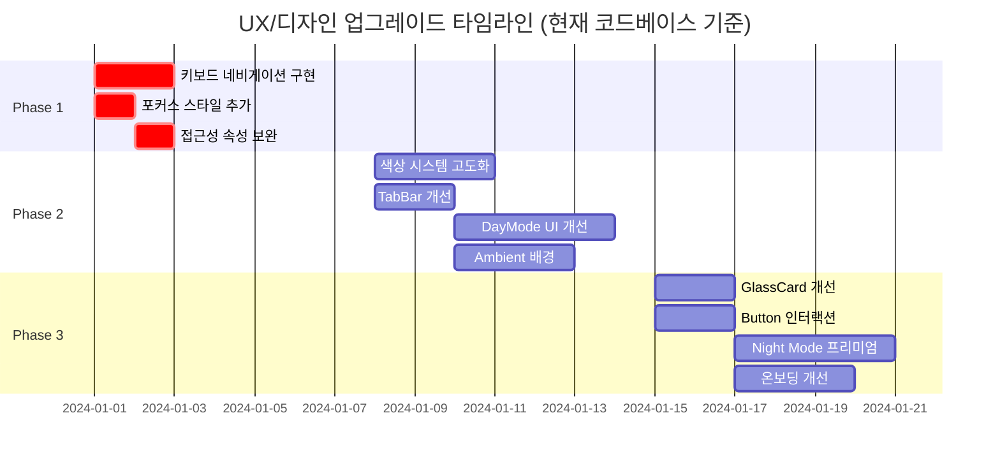

# MaumLog V5.0 프론트엔드 UX/디자인 업그레이드 상세 계획서

**작성일**: 2024년  
**최종 업데이트**: 2024년 (현재 코드베이스 기준 반영)  
**버전**: 2.0  
**대상**: MaumLog V5.0 프론트엔드 코드베이스

---

## 1. 요약 (Executive Summary)

### 1.1 목적

현재 MaumLog V5.0 프론트엔드 코드베이스를 분석하여 배포 시 예상되는 문제점을 해결하고, 사용자 경험(UX) 및 미적 측면을 최상위 수준으로 향상시키기 위한 상세 실행 계획을 수립합니다.

### 1.2 주요 발견 사항

- **Critical**: 접근성 키보드 네비게이션 부재, 포커스 스타일 미흡
- **High**: 색상 시스템 단조로움, 감정 선택 UI 개선 필요
- **Medium**: GlassCard 효과 개선, Night Mode 프리미엄화 여지, 마이크로 인터랙션 부족

### 1.3 개선 목표

1. 배포 안정성 확보 (Critical 이슈 해결)
2. 브랜드 아이덴티티 강화 (색상/타이포그래피)
3. 감정 웰빙 앱에 적합한 인터랙션 구현
4. 접근성 기준 준수 (WCAG AA)

---

## 2. 현재 상태 분석

### 2.1 디자인 시스템 현황

#### 2.1.1 색상 시스템
- **현재**: Teal 기반 단색 팔레트 (`#2A8E9E`, `#99F6E4`, `#FDA4AF`)
- **문제점**: 
  - 감정 웰빙 앱에 적합한 색상 깊이 부족
  - Night Mode와 Day Mode 간 색상 대비율 미흡
  - 감정별 색상이 정의되어 있으나 활용도 낮음

#### 2.1.2 타이포그래피
- **현재**: Noto Sans KR (Google Fonts 사용 중)
- **상태**: ✅ 정상 작동 중
- **개선 여지**: 감정적 순간을 위한 Serif 폰트 추가 고려 (예: Noto Serif KR)

#### 2.1.3 컴포넌트 시스템
- **장점**: GlassCard, Button, TabBar 등 기본 컴포넌트 구조화됨
- **개선점**: 마이크로 인터랙션 부족, 접근성 속성 미흡

### 2.2 기술 스택 현황

```typescript
// 현재 의존성 (package.json 기준)
{
  "framer-motion": "^12.24.11",  // ✅ 애니메이션 라이브러리
  "lucide-react": "^0.562.0",    // ✅ 아이콘
  "recharts": "^3.6.0",          // ✅ 차트
  "react": "^19.2.3"             // ✅ 최신 React
}
```

**현재 상태**:
- ✅ `index.html`에서 import map 버전 고정됨 (`^` 제거)
- ✅ Tailwind CSS는 빌드 시스템(`tailwind.config.js`) 사용 중
- ⚠️ 개발 환경에서만 import map 사용 (프로덕션 빌드 시 번들링됨)

### 2.3 발견된 문제점 요약

| 우선순위 | 문제 | 영향도 | 파일 | 현재 상태 |
|---------|------|--------|------|----------|
| 🔴 Critical | 키보드 네비게이션 부재 | 높음 | `src/components/ui/TabBar.tsx` | 기본 접근성만 있음 |
| 🔴 Critical | 포커스 스타일 미흡 | 중간 | `src/components/ui/*.tsx` | 포커스 링 없음 |
| 🟡 High | 색상 시스템 단조로움 | 중간 | `src/design/tokens.ts` | 단색 팔레트만 사용 |
| 🟡 High | 감정 선택 UI 개선 필요 | 중간 | `components/DayMode.tsx` | 단순 그리드 버튼 |
| 🟡 High | Ambient 배경 시스템 부재 | 중간 | `App.tsx` | 정적 배경만 있음 |
| 🟢 Medium | GlassCard 효과 개선 | 낮음 | `src/components/ui/GlassCard.tsx` | 기본 글래스만 |
| 🟢 Medium | Button 마이크로 인터랙션 | 낮음 | `src/components/ui/Button.tsx` | 로딩만 있음 |
| 🟢 Medium | Night Mode 프리미엄화 | 낮음 | `components/NightMode.tsx` | 기본 다크 테마 |

---

## 3. Phase별 실행 계획

### 3.1 Phase 1: Critical (배포 전 필수)

**기간**: 1주  
**목표**: 배포 안정성 확보

#### 3.1.1 작업 항목

1. **키보드 네비게이션 구현**
   - 파일: `src/components/ui/TabBar.tsx`
   - 변경: 화살표 키로 탭 이동, Enter/Space로 선택
   - 예상 시간: 1.5시간

2. **포커스 스타일 추가**
   - 파일: `src/components/ui/TabBar.tsx`, `src/components/ui/Button.tsx`, `App.tsx`
   - 변경: `focus:ring-2 focus:ring-brand-primary` 등 포커스 링 추가
   - 예상 시간: 1시간

3. **접근성 속성 보완**
   - 파일: `components/DayMode.tsx`, `src/components/ui/Button.tsx`
   - 변경: `aria-pressed`, `aria-describedby`, `tabIndex` 관리
   - 예상 시간: 1시간

#### 3.1.2 검증 방법

```bash
# 접근성 검사 (Chrome DevTools Lighthouse)
# - Accessibility 점수 90+ 목표
# - 키보드만으로 모든 기능 사용 가능한지 확인
# - 포커스 스타일이 명확하게 보이는지 확인
```

---

### 3.2 Phase 2: High Priority (1주 내)

**기간**: 1주  
**목표**: UX 핵심 개선

#### 3.2.1 작업 항목

1. **색상 시스템 고도화**
   - 파일: `src/design/tokens.ts`
   - 변경: 감정별 그라디언트, 시간대별 테마 추가
   - 예상 시간: 3시간

2. **TabBar 접근성 및 애니메이션**
   - 파일: `src/components/ui/TabBar.tsx`
   - 변경: 키보드 네비게이션, 포커스 스타일, 스태거 애니메이션
   - 예상 시간: 2시간

3. **DayMode 감정 선택 UI 개선**
   - 파일: `components/DayMode.tsx`
   - 변경: 감정 오브 UI 또는 인터랙티브 휠
   - 예상 시간: 4시간

4. **App.tsx Ambient 배경 추가**
   - 파일: `App.tsx`
   - 변경: 감정에 반응하는 배경 오브 시스템
   - 예상 시간: 3시간

#### 3.2.2 검증 방법

- 색상 대비율: WebAIM Contrast Checker (WCAG AA 준수)
- 애니메이션 성능: Chrome DevTools Performance (60fps 유지)

---

### 3.3 Phase 3: Medium Priority (2-4주)

**기간**: 2주  
**목표**: 프리미엄 경험 구현

#### 3.3.1 작업 항목

1. **GlassCard 효과 개선**
   - 파일: `src/components/ui/GlassCard.tsx`
   - 변경: 레이어드 글래스, 노이즈 텍스처, 상단 하이라이트
   - 예상 시간: 2시간

2. **Button 마이크로 인터랙션**
   - 파일: `src/components/ui/Button.tsx`
   - 변경: Ripple 효과, 로딩 애니메이션 개선
   - 예상 시간: 2시간

3. **Night Mode 프리미엄 테마**
   - 파일: `components/NightMode.tsx`
   - 변경: 천체 배경, 별 효과, 오로라 효과
   - 예상 시간: 4시간

4. **온보딩 플로우 개선**
   - 파일: `src/components/onboarding/*.tsx`
   - 변경: 스태거 애니메이션, 진행률 표시 개선
   - 예상 시간: 3시간

---

### 3.4 Phase 4: Enhancement (4주 이후)

**기간**: 지속적  
**목표**: 지속적 개선

- Streak 시스템 UI
- Level Up 축하 애니메이션
- 성취감 게이미피케이션
- 시간대별 자동 테마 전환

---

## 4. 컴포넌트별 상세 개선 계획

### 4.1 src/components/ui/TabBar.tsx

#### 4.1.1 현재 상태

```tsx
// 기본 접근성만 있음, 키보드 네비게이션 없음
<motion.button
  key={tab.id}
  onClick={() => onTabChange(tab.id)}
  whileTap={{ scale: 0.9 }}
  className={...}
  aria-label={tab.label}
  aria-current={isActive ? 'page' : undefined}
>
  {tab.icon}
</motion.button>
```

**문제점**:
- 화살표 키로 탭 이동 불가
- 포커스 스타일 없음 (키보드 사용자에게 피드백 부족)
- 스태거 애니메이션 없음

#### 4.1.2 개선 방안

```tsx
// ✅ 키보드 네비게이션, 포커스 스타일, 스태거 애니메이션
<motion.nav
  initial="hidden"
  animate="show"
  variants={staggerContainer}
  className={...}
  role="navigation"
  aria-label="메인 네비게이션"
>
  {allTabs.map((tab, index) => {
    const isActive = activeTab === tab.id;
    
    return (
      <motion.button
        key={tab.id}
        variants={staggerItem}
        onClick={() => onTabChange(tab.id)}
        onKeyDown={(e) => {
          // 화살표 키 네비게이션
          if (e.key === 'ArrowRight') {
            e.preventDefault();
            const nextIndex = (index + 1) % allTabs.length;
            onTabChange(allTabs[nextIndex].id);
            // 포커스 이동
            const nextButton = e.currentTarget.parentElement?.children[nextIndex] as HTMLElement;
            nextButton?.focus();
          } else if (e.key === 'ArrowLeft') {
            e.preventDefault();
            const prevIndex = (index - 1 + allTabs.length) % allTabs.length;
            onTabChange(allTabs[prevIndex].id);
            const prevButton = e.currentTarget.parentElement?.children[prevIndex] as HTMLElement;
            prevButton?.focus();
          } else if (e.key === 'Home') {
            e.preventDefault();
            onTabChange(allTabs[0].id);
            const firstButton = e.currentTarget.parentElement?.children[0] as HTMLElement;
            firstButton?.focus();
          } else if (e.key === 'End') {
            e.preventDefault();
            const lastIndex = allTabs.length - 1;
            onTabChange(allTabs[lastIndex].id);
            const lastButton = e.currentTarget.parentElement?.children[lastIndex] as HTMLElement;
            lastButton?.focus();
          }
        }}
        whileTap={{ scale: 0.9 }}
        whileFocus={{ scale: 1.05 }}
        className={`
          ...기존 스타일...
          focus:outline-none 
          focus:ring-2 
          focus:ring-brand-primary 
          focus:ring-offset-2
          ${mode === 'day' ? 'focus:ring-offset-white' : 'focus:ring-offset-slate-900'}
        `}
        aria-label={tab.label}
        aria-current={isActive ? 'page' : undefined}
        tabIndex={isActive ? 0 : -1}
      >
        {tab.icon}
        {isActive && (
          <motion.div 
            layoutId="activeTabDot"
            className={`absolute -bottom-2 w-1 h-1 rounded-full ${mode === 'day' ? 'bg-brand-primary' : 'bg-brand-secondary'}`}
          />
        )}
      </motion.button>
    );
  })}
</motion.nav>

// 스태거 애니메이션 variants (파일 상단에 추가)
const staggerContainer = {
  hidden: { opacity: 0 },
  show: {
    opacity: 1,
    transition: {
      staggerChildren: 0.08,
      delayChildren: 0.1,
    }
  }
};

const staggerItem = {
  hidden: { opacity: 0, y: 20 },
  show: { 
    opacity: 1, 
    y: 0,
    transition: { type: "spring", stiffness: 300, damping: 24 }
  }
};
```

#### 4.1.3 변경 이유

- 키보드 사용자 접근성 향상 (WCAG 2.1 준수)
- 포커스 스타일로 시각적 피드백 제공
- 스태거 애니메이션으로 부드러운 로딩 경험
- Home/End 키로 첫/마지막 탭 빠른 이동

#### 4.1.4 영향 범위

- TabBar 컴포넌트 전체
- 키보드 사용자 경험 개선
- 스크린 리더 사용자 경험 개선

---

### 4.2 src/components/ui/Button.tsx

#### 4.2.1 현재 상태

```tsx
// 기본 로딩 상태만 있음, 마이크로 인터랙션 부족
<motion.button
  disabled={isLoading || props.disabled}
  {...props}
>
  {isLoading && <Loader2 className="w-4 h-4 animate-spin" />}
  {children}
</motion.button>
```

**문제점**:
- 클릭 시 시각적 피드백 부족
- 포커스 스타일 없음
- Ripple 효과 없음

#### 4.2.2 개선 방안

```tsx
// ✅ Ripple 효과, 포커스 스타일 추가
const Button: React.FC<ButtonProps> = ({ 
  children, 
  variant = 'primary', 
  isLoading, 
  className = '', 
  onClick,
  ...props 
}) => {
  const [ripples, setRipples] = useState<Array<{ x: number; y: number; id: number }>>([]);
  const buttonRef = useRef<HTMLButtonElement>(null);
  
  const handleClick = (e: React.MouseEvent<HTMLButtonElement>) => {
    if (!buttonRef.current || isLoading) return;
    
    const rect = buttonRef.current.getBoundingClientRect();
    const x = e.clientX - rect.left;
    const y = e.clientY - rect.top;
    
    const newRipple = { x, y, id: Date.now() };
    setRipples(prev => [...prev, newRipple]);
    
    setTimeout(() => {
      setRipples(prev => prev.filter(r => r.id !== newRipple.id));
    }, 600);
    
    onClick?.(e);
  };
  
  return (
    <motion.button
      ref={buttonRef}
      onClick={handleClick}
      disabled={isLoading || props.disabled}
      whileFocus={{ scale: 1.02 }}
      className={`
        relative overflow-hidden
        ...기존 스타일...
        focus:outline-none focus:ring-2 focus:ring-brand-primary focus:ring-offset-2
        ${className}
      `}
      {...props}
    >
      {/* Ripple Effects */}
      {ripples.map(ripple => (
        <motion.span
          key={ripple.id}
          className="absolute rounded-full bg-white/30 pointer-events-none"
          initial={{ width: 0, height: 0, x: ripple.x, y: ripple.y }}
          animate={{ 
            width: 200, 
            height: 200, 
            x: ripple.x - 100, 
            y: ripple.y - 100,
            opacity: [0.5, 0],
          }}
          transition={{ duration: 0.6 }}
        />
      ))}
      
      {isLoading && (
        <motion.div
          initial={{ opacity: 0 }}
          animate={{ opacity: 1 }}
          className="absolute inset-0 flex items-center justify-center bg-inherit rounded-full"
        >
          <Loader2 className="w-4 h-4 animate-spin" />
        </motion.div>
      )}
      
      <motion.span
        animate={{ opacity: isLoading ? 0 : 1 }}
        className="flex items-center justify-center gap-2"
      >
        {children}
      </motion.span>
    </motion.button>
  );
};
```

#### 4.2.3 변경 이유

- 클릭 시 시각적 피드백 강화 (Material Design 스타일)
- 포커스 스타일로 키보드 사용자 지원
- 로딩 상태 시 부드러운 전환

---

### 4.3 src/design/tokens.ts

#### 4.3.1 현재 상태

```typescript
// 단조로운 색상 팔레트
export const brandColors = {
  primary: '#2A8E9E',      // Muted Teal
  secondary: '#99F6E4',    // Teal 200
  accent: '#FDA4AF',       // Soft Pink
  dark: '#115E59',         // Teal 800
  light: '#F0FDFA',        // Teal 50
} as const;
```

#### 4.2.2 개선 방안

```typescript
// ✅ 풍부한 색상 시스템
export const brandColors = {
  primary: {
    50: '#f0fdfa',
    100: '#ccfbf1',
    200: '#99f6e4',
    300: '#5eead4',
    400: '#2dd4bf',
    500: '#2A8E9E',    // 기존 primary 유지
    600: '#0d9488',
    700: '#0f766e',
    800: '#115e59',
    900: '#134e4a',
  },
  secondary: {
    light: '#f0fdfa',
    DEFAULT: '#99f6e4',
    dark: '#5eead4',
  },
  accent: {
    light: '#fff1f2',
    DEFAULT: '#FDA4AF',
    dark: '#fb7185',
  },
  // Night Mode 전용 색상
  night: {
    surface: '#0f0f23',
    elevated: '#1a1a3e',
    glow: 'rgba(99, 102, 241, 0.15)',
    text: {
      primary: '#f8fafc',
      secondary: '#cbd5e1',
      muted: '#94a3b8',
    },
  },
} as const;

// ✅ 감정별 그라디언트 추가
export const emotionGradients = {
  joy: 'linear-gradient(135deg, #fef08a 0%, #fde047 50%, #facc15 100%)',
  peace: 'linear-gradient(135deg, #ccfbf1 0%, #5eead4 50%, #2dd4bf 100%)',
  anxiety: 'linear-gradient(135deg, #fed7aa 0%, #fdba74 50%, #fb923c 100%)',
  sadness: 'linear-gradient(135deg, #c4b5fd 0%, #a78bfa 50%, #8b5cf6 100%)',
  anger: 'linear-gradient(135deg, #fecaca 0%, #fca5a5 50%, #f87171 100%)',
} as const;
```

#### 4.3.3 변경 이유

- 감정 웰빙 앱에 적합한 색상 깊이 제공
- Night Mode 전용 색상으로 가독성 향상
- 감정별 그라디언트로 시각적 차별화

---

### 4.4 components/DayMode.tsx

#### 4.4.1 현재 상태

```tsx
// 단순 그리드 버튼 배열, 접근성 부족
<div className="grid grid-cols-2 sm:grid-cols-3 gap-4 mb-8">
  {EMOTIONS_CONFIG.map(emotion => (
    <motion.button
      key={emotion.id}
      onClick={() => setSelectedEmotion(emotion.id)}
      whileHover={{ scale: 1.05 }}
      whileTap={{ scale: 0.95 }}
      className={`
        relative overflow-hidden rounded-2xl p-6
        ${selectedEmotion === emotion.id 
          ? `bg-gradient-to-br ${emotion.bgGradient} border-2 border-brand-primary shadow-lg` 
          : 'bg-white/50 border border-white/60 hover:bg-white/70'
        }
        transition-all duration-300
      `}
    >
      <div className={`${emotion.color} mb-2 flex justify-center`}>
        {emotion.icon}
      </div>
      <p className={`text-sm font-medium ${selectedEmotion === emotion.id ? 'text-slate-900' : 'text-slate-600'}`}>
        {emotion.label}
      </p>
    </motion.button>
  ))}
</div>
```

**문제점**:
- 감정 웰빙 앱에 적합한 시각적 표현 부족
- 접근성 속성 부재 (`aria-pressed` 등)
- 선택 시 피드백이 단순함

#### 4.4.2 개선 방안: 감정 오브 UI

```tsx
// ✅ 감정 오브 UI 컴포넌트
const EmotionOrb: React.FC<{
  emotion: EmotionConfig;
  isSelected: boolean;
  onSelect: () => void;
}> = ({ emotion, isSelected, onSelect }) => {
  return (
    <motion.button
      onClick={onSelect}
      whileHover={{ scale: 1.1 }}
      whileTap={{ scale: 0.95 }}
      whileFocus={{ scale: 1.05 }}
      className="relative w-24 h-24 rounded-full focus:outline-none focus:ring-4 focus:ring-white/60"
      style={{
        background: `radial-gradient(circle at 30% 30%, 
          ${emotionColors[emotion.id][100]}, 
          ${emotionColors[emotion.id][400]})`,
        boxShadow: isSelected 
          ? `0 0 60px ${emotionColors[emotion.id][400]}40, inset 0 0 30px rgba(255,255,255,0.3)` 
          : `0 10px 40px ${emotionColors[emotion.id][400]}20`,
      }}
      aria-label={`${emotion.label} 감정 선택`}
      aria-pressed={isSelected}
    >
      <motion.span
        animate={{ 
          scale: isSelected ? [1, 1.2, 1] : 1,
          rotate: isSelected ? [0, 10, -10, 0] : 0,
        }}
        transition={{ duration: 0.5 }}
        className="text-4xl"
      >
        {emotion.emoji}
      </motion.span>
      
      {/* 펄스 효과 */}
      {isSelected && (
        <motion.div
          className="absolute inset-0 rounded-full border-2 border-white/60"
          animate={{
            scale: [1, 1.3, 1],
            opacity: [0.6, 0, 0.6],
          }}
          transition={{ duration: 1.5, repeat: Infinity }}
        />
      )}
    </motion.button>
  );
};

// 사용
<div className="flex flex-wrap justify-center gap-8 mb-8">
  {EMOTIONS_CONFIG.map(emotion => (
    <EmotionOrb
      key={emotion.id}
      emotion={emotion}
      isSelected={selectedEmotion === emotion.id}
      onSelect={() => setSelectedEmotion(emotion.id)}
    />
  ))}
</div>
```

#### 4.4.3 변경 이유

- 감정 웰빙 앱에 적합한 시각적 표현
- 선택 시 명확한 피드백 (펄스, 글로우)
- 접근성 속성 추가 (`aria-pressed`)
```

#### 4.3.3 변경 이유

- 키보드 사용자 접근성 향상
- 포커스 스타일로 시각적 피드백 제공
- 스태거 애니메이션으로 부드러운 로딩 경험

---

### 4.4 components/DayMode.tsx

#### 4.4.1 현재 상태

```tsx
// 단순 그리드 버튼 배열
<div className="grid grid-cols-2 sm:grid-cols-3 gap-4 mb-8">
  {EMOTIONS_CONFIG.map(emotion => (
    <motion.button
      key={emotion.id}
      onClick={() => setSelectedEmotion(emotion.id)}
      whileHover={{ scale: 1.05 }}
      whileTap={{ scale: 0.95 }}
      className={...}
    >
      <div className={`${emotion.color} mb-2`}>
        {emotion.icon}
      </div>
      <p>{emotion.label}</p>
    </motion.button>
  ))}
</div>
```

#### 4.4.2 개선 방안: 감정 오브 UI

```tsx
// ✅ 감정 오브 UI 컴포넌트
const EmotionOrb: React.FC<{
  emotion: EmotionConfig;
  isSelected: boolean;
  onSelect: () => void;
}> = ({ emotion, isSelected, onSelect }) => {
  return (
    <motion.button
      onClick={onSelect}
      whileHover={{ scale: 1.1 }}
      whileTap={{ scale: 0.95 }}
      className="relative w-24 h-24 rounded-full focus:outline-none focus:ring-4 focus:ring-white/60"
      style={{
        background: `radial-gradient(circle at 30% 30%, 
          ${emotionColors[emotion.id][100]}, 
          ${emotionColors[emotion.id][400]})`,
        boxShadow: isSelected 
          ? `0 0 60px ${emotionColors[emotion.id][400]}40, inset 0 0 30px rgba(255,255,255,0.3)` 
          : `0 10px 40px ${emotionColors[emotion.id][400]}20`,
      }}
      aria-label={`${emotion.label} 감정 선택`}
      aria-pressed={isSelected}
    >
      <motion.span
        animate={{ 
          scale: isSelected ? [1, 1.2, 1] : 1,
          rotate: isSelected ? [0, 10, -10, 0] : 0,
        }}
        transition={{ duration: 0.5 }}
        className="text-4xl"
      >
        {emotion.emoji}
      </motion.span>
      
      {/* 펄스 효과 */}
      {isSelected && (
        <motion.div
          className="absolute inset-0 rounded-full border-2 border-white/60"
          animate={{
            scale: [1, 1.3, 1],
            opacity: [0.6, 0, 0.6],
          }}
          transition={{ duration: 1.5, repeat: Infinity }}
        />
      )}
    </motion.button>
  );
};

// 사용
<div className="flex flex-wrap justify-center gap-8 mb-8">
  {EMOTIONS_CONFIG.map(emotion => (
    <EmotionOrb
      key={emotion.id}
      emotion={emotion}
      isSelected={selectedEmotion === emotion.id}
      onSelect={() => setSelectedEmotion(emotion.id)}
    />
  ))}
</div>
```

#### 4.4.3 변경 이유

- 감정 웰빙 앱에 적합한 시각적 표현
- 선택 시 명확한 피드백 (펄스, 글로우)
- 접근성 속성 추가 (`aria-pressed`)

---

### 4.6 src/components/ui/GlassCard.tsx

#### 4.5.1 현재 상태

```tsx
// 정적 배경 그라디언트
<div className="absolute inset-0 pointer-events-none z-0 overflow-hidden">
  <div className={`
    absolute top-[-10%] left-1/2 -translate-x-1/2 w-[120vw] h-[60vh] rounded-[100%] blur-[100px] opacity-40
    ${mode === 'day' ? 'bg-gradient-to-b from-brand-secondary to-transparent' : 'bg-gradient-to-b from-brand-dark to-transparent'}
  `} />
</div>
```

#### 4.5.2 개선 방안: Ambient Background

```tsx
// ✅ 감정에 반응하는 배경 시스템
const AmbientBackground: React.FC<{ 
  emotion?: EmotionType; 
  intensity?: number;
  mode: 'day' | 'night';
}> = ({ emotion = 'peace', intensity = 5, mode }) => {
  const emotionConfig = {
    joy: { colors: ['#fef08a', '#fde047', '#facc15'], speed: 1.2 },
    peace: { colors: ['#99f6e4', '#5eead4', '#2dd4bf'], speed: 0.8 },
    anxiety: { colors: ['#fed7aa', '#fdba74', '#fb923c'], speed: 1.5 },
    sadness: { colors: ['#c4b5fd', '#a78bfa', '#8b5cf6'], speed: 0.5 },
    anger: { colors: ['#fecaca', '#fca5a5', '#f87171'], speed: 1.8 },
  };
  
  const config = emotionConfig[emotion];
  const animationDuration = 20 / config.speed;
  
  if (mode === 'night') {
    return <CelestialBackground />; // 별 효과 포함
  }
  
  return (
    <div className="fixed inset-0 -z-10 overflow-hidden pointer-events-none">
      {[0, 1, 2].map((i) => (
        <motion.div
          key={i}
          className="absolute rounded-full mix-blend-multiply filter blur-3xl opacity-30"
          style={{
            background: `radial-gradient(circle, ${config.colors[i]} 0%, transparent 70%)`,
            width: `${40 + i * 20}vw`,
            height: `${40 + i * 20}vw`,
          }}
          animate={{
            x: [`${20 + i * 30}%`, `${50 - i * 20}%`, `${20 + i * 30}%`],
            y: [`${10 + i * 20}%`, `${60 - i * 10}%`, `${10 + i * 20}%`],
            scale: [1, 1 + intensity * 0.02, 1],
          }}
          transition={{
            duration: animationDuration + i * 5,
            repeat: Infinity,
            ease: "easeInOut",
          }}
        />
      ))}
    </div>
  );
};

// App.tsx에서 사용
<AmbientBackground 
  emotion={selectedEmotion} 
  intensity={intensity}
  mode={mode}
/>
```

#### 4.5.3 변경 이유

- 감정에 반응하는 살아있는 배경
- 사용자 입력에 따른 동적 변화
- Night Mode 별 효과로 몰입감 향상

---

### 4.6 src/components/ui/GlassCard.tsx

#### 4.6.1 현재 상태

```tsx
// 기본 글래스 효과
<motion.div
  className={`
    ${bgStyle} ${blurStyle}
    border border-white/60
    shadow-brand
    rounded-lg
  `}
>
  <div className="absolute inset-x-0 top-0 h-px bg-white/80 opacity-50" />
  <div className="relative z-10">{children}</div>
</motion.div>
```

#### 4.6.2 개선 방안

```tsx
// ✅ 레이어드 글래스 효과
<motion.div
  className={`
    relative overflow-hidden
    bg-white/40 
    backdrop-blur-2xl 
    backdrop-saturate-150
    border border-white/50
    rounded-3xl
    shadow-xl shadow-slate-900/5
    ${className}
  `}
  whileHover={{ scale: 1.005, y: -2 }}
>
  {/* 상단 하이라이트 */}
  <div className="absolute inset-x-0 top-0 h-px bg-gradient-to-r from-transparent via-white/80 to-transparent" />
  
  {/* 미세한 노이즈 텍스처 */}
  <div 
    className="absolute inset-0 opacity-[0.015] mix-blend-overlay pointer-events-none"
    style={{
      backgroundImage: `url("data:image/svg+xml,%3Csvg viewBox='0 0 200 200' xmlns='http://www.w3.org/2000/svg'%3E%3Cfilter id='noiseFilter'%3E%3CfeTurbulence type='fractalNoise' baseFrequency='0.8' numOctaves='3' stitchTiles='stitch'/%3E%3C/filter%3E%3Crect width='100%25' height='100%25' filter='url(%23noiseFilter)'/%3E%3C/svg%3E")`,
    }}
  />
  
  {/* 내부 그림자 (깊이감) */}
  <div className="absolute inset-0 rounded-3xl shadow-inner" />
  
  <div className="relative z-10">{children}</div>
</motion.div>
```

#### 4.6.3 변경 이유

- 더 정교한 글래스모피즘 효과
- 노이즈 텍스처로 프리미엄 느낌
- 호버 시 미세한 상승 효과

---

### 4.8 index.html (참고: 현재 상태)

#### 4.8.1 현재 상태

```html
<!-- ✅ 이미 Noto Sans KR 사용 중 (정상 작동) -->
<link href="https://fonts.googleapis.com/css2?family=Noto+Sans+KR:wght@300;400;500;600;700;800&display=swap" rel="stylesheet" />

<!-- ✅ Import map 버전 고정됨 (^ 제거됨) -->
<script type="importmap">
{
  "imports": {
    "@google/genai": "https://esm.sh/@google/genai@1.34.0",
    "framer-motion": "https://esm.sh/framer-motion@12.24.11",
    ...
  }
}
</script>
```

**상태**: ✅ 이미 개선 완료됨
- Noto Sans KR 정상 사용 중
- Import map 버전 고정됨
- Tailwind는 빌드 시스템 사용 중

**추가 개선 여지**:
- 감정적 순간을 위한 Serif 폰트 추가 (예: Noto Serif KR)

#### 4.7.1 현재 상태

```tsx
// 기본 다크 배경
<div className="w-full max-w-4xl mx-auto h-full flex flex-col px-4 text-white">
  {/* 정적 배경 */}
</div>
```

#### 4.7.2 개선 방안: Celestial Background

```tsx
// ✅ 천체 배경 컴포넌트
const CelestialBackground: React.FC = () => {
  return (
    <div className="fixed inset-0 bg-gradient-to-b from-[#0a0a1f] via-[#0f0f2d] to-[#1a1a3a] -z-10">
      {/* Stars Layer */}
      <div className="absolute inset-0">
        {[...Array(100)].map((_, i) => {
          const size = Math.random() > 0.9 ? 2 : 1;
          return (
            <motion.div
              key={i}
              className="absolute rounded-full bg-white"
              style={{
                width: size,
                height: size,
                left: `${Math.random() * 100}%`,
                top: `${Math.random() * 100}%`,
              }}
              animate={{
                opacity: [0.3, 0.8, 0.3],
                scale: [1, 1.2, 1],
              }}
              transition={{
                duration: 2 + Math.random() * 3,
                repeat: Infinity,
                delay: Math.random() * 2,
              }}
            />
          );
        })}
      </div>
      
      {/* Moon */}
      <motion.div
        className="absolute top-20 right-20 w-32 h-32"
        animate={{ y: [0, -10, 0] }}
        transition={{ duration: 8, repeat: Infinity, ease: "easeInOut" }}
      >
        <div className="w-full h-full rounded-full bg-gradient-to-br from-slate-100 to-slate-300 shadow-[0_0_60px_rgba(255,255,255,0.3)]">
          {/* Moon Craters */}
          <div className="absolute top-6 left-8 w-4 h-4 rounded-full bg-slate-300/50" />
          <div className="absolute top-12 right-6 w-6 h-6 rounded-full bg-slate-300/30" />
        </div>
      </motion.div>
      
      {/* Aurora Effect */}
      <motion.div
        className="absolute inset-x-0 top-0 h-96 opacity-20"
        style={{
          background: `
            radial-gradient(ellipse at 20% 0%, rgba(147, 51, 234, 0.3) 0%, transparent 50%),
            radial-gradient(ellipse at 80% 10%, rgba(34, 211, 238, 0.3) 0%, transparent 50%)
          `,
        }}
        animate={{
          opacity: [0.1, 0.25, 0.1],
        }}
        transition={{
          duration: 10,
          repeat: Infinity,
          ease: "easeInOut",
        }}
      />
    </div>
  );
};
```

#### 4.7.3 변경 이유

- Night Mode의 몰입감 극대화
- 별 효과로 감정적 연결 강화
- 오로라 효과로 프리미엄 느낌

---


---

## 5. 디자인 토큰 개선안

### 5.1 색상 시스템 확장

```typescript
// src/design/tokens.ts에 추가할 내용

// 시간대별 테마
export const timeBasedThemes = {
  dawn: {
    background: 'linear-gradient(180deg, #fef3c7 0%, #fce7f3 100%)',
    primary: '#f472b6',
    mood: 'gentle awakening',
  },
  day: {
    background: 'linear-gradient(180deg, #ecfeff 0%, #f0fdfa 100%)',
    primary: '#2A8E9E',
    mood: 'energetic',
  },
  dusk: {
    background: 'linear-gradient(180deg, #fdf4ff 0%, #fae8ff 100%)',
    primary: '#a78bfa',
    mood: 'peaceful',
  },
  night: {
    background: 'linear-gradient(180deg, #0c0a1d 0%, #1a1033 100%)',
    primary: '#8b5cf6',
    mood: 'calm',
  },
} as const;

// 감정 강도별 색상
export const intensityColors = {
  1: { opacity: 0.2, scale: 0.8 },
  2: { opacity: 0.3, scale: 0.85 },
  3: { opacity: 0.4, scale: 0.9 },
  4: { opacity: 0.5, scale: 0.95 },
  5: { opacity: 0.6, scale: 1.0 },
  6: { opacity: 0.7, scale: 1.05 },
  7: { opacity: 0.8, scale: 1.1 },
  8: { opacity: 0.9, scale: 1.15 },
  9: { opacity: 1.0, scale: 1.2 },
  10: { opacity: 1.0, scale: 1.3 },
} as const;
```

### 5.2 애니메이션 토큰 확장

```typescript
// 추가 애니메이션 variants
export const animationVariants = {
  staggerContainer: {
    hidden: { opacity: 0 },
    show: {
      opacity: 1,
      transition: {
        staggerChildren: 0.08,
        delayChildren: 0.1,
      }
    }
  },
  staggerItem: {
    hidden: { opacity: 0, y: 20 },
    show: { 
      opacity: 1, 
      y: 0,
      transition: { type: "spring", stiffness: 300, damping: 24 }
    }
  },
  fadeInUp: {
    hidden: { opacity: 0, y: 20 },
    visible: { opacity: 1, y: 0 },
  },
  scaleIn: {
    hidden: { opacity: 0, scale: 0.8 },
    visible: { opacity: 1, scale: 1 },
  },
} as const;
```

---

## 6. 위험 요소 및 완화 전략

### 6.1 성능 위험

| 위험 | 영향 | 완화 전략 |
|------|------|----------|
| 애니메이션 과다로 인한 성능 저하 | 높음 | `will-change` 속성 사용, GPU 가속 활용 |
| 배경 오브 애니메이션 복잡도 | 중간 | 오브 개수 제한 (최대 3개), `transform`만 사용 |
| Night Mode 별 효과 렌더링 | 낮음 | 별 개수 최적화 (100개), `opacity` 애니메이션만 사용 |

### 6.2 접근성 위험

| 위험 | 영향 | 완화 전략 |
|------|------|----------|
| 키보드 네비게이션 누락 | 높음 | 모든 인터랙티브 요소에 키보드 이벤트 핸들러 추가 |
| 색상 대비율 미달 | 중간 | WebAIM Contrast Checker로 검증, WCAG AA 준수 |
| 스크린 리더 호환성 | 중간 | `aria-label`, `aria-current` 등 속성 추가 |

### 6.3 호환성 위험

| 위험 | 영향 | 완화 전략 |
|------|------|----------|
| 브라우저별 `backdrop-blur` 지원 차이 | 중간 | `@supports` 쿼리로 폴백 제공 |
| 모바일 성능 저하 | 중간 | 모바일에서는 애니메이션 축소 또는 비활성화 옵션 |

---

## 7. 검증 체크리스트

### 7.1 Phase 1 검증

- [x] Noto Sans KR 폰트가 정상 로딩되는지 확인 (✅ 이미 완료)
- [x] Import map 버전 고정 확인 (✅ 이미 완료)
- [ ] Lighthouse Accessibility 점수 90+ 달성
- [ ] 키보드로 모든 기능 사용 가능한지 확인 (TabBar 화살표 키 네비게이션)
- [ ] 포커스 스타일이 명확하게 보이는지 확인

### 7.2 Phase 2 검증

- [ ] 색상 대비율 WCAG AA 준수 확인
- [ ] TabBar 키보드 네비게이션 동작 확인
- [ ] 감정 선택 UI가 직관적인지 사용자 테스트
- [ ] Ambient 배경이 60fps 유지하는지 확인

### 7.3 Phase 3 검증

- [ ] GlassCard 효과가 모든 브라우저에서 정상 표시
- [ ] Button Ripple 효과가 부드럽게 동작
- [ ] Night Mode 별 효과가 성능에 영향 없는지 확인
- [ ] 온보딩 플로우가 자연스러운지 확인

### 7.4 통합 검증

- [ ] 모든 페이지에서 일관된 디자인 시스템 적용
- [ ] 모바일 반응형 레이아웃 정상 동작
- [ ] 다크 모드 전환 시 깜빡임 없음
- [ ] 로딩 상태가 명확하게 표시됨

---

## 8. 실행 타임라인



**참고**: 폰트(Noto Sans KR) 및 Import map 버전 고정은 이미 완료된 상태입니다.

---

## 9. 참고 자료

### 9.1 디자인 가이드라인

- [WCAG 2.1 가이드라인](https://www.w3.org/WAI/WCAG21/quickref/)
- [Material Design 3](https://m3.material.io/)
- [Apple Human Interface Guidelines](https://developer.apple.com/design/human-interface-guidelines/)

### 9.2 기술 문서

- [Pretendard 폰트 공식 문서](https://github.com/orioncactus/pretendard)
- [Framer Motion 문서](https://www.framer.com/motion/)
- [Tailwind CSS 문서](https://tailwindcss.com/docs)

---

## 10. 부록: 코드 스니펫 모음

### 10.1 접근성 헬퍼 함수

```typescript
// src/utils/accessibility.ts
export const getAriaLabel = (label: string, state?: string) => {
  return state ? `${label}, ${state}` : label;
};

export const getFocusStyles = (mode: 'day' | 'night') => {
  return mode === 'day'
    ? 'focus:outline-none focus:ring-2 focus:ring-brand-primary focus:ring-offset-2'
    : 'focus:outline-none focus:ring-2 focus:ring-brand-secondary focus:ring-offset-2 focus:ring-offset-slate-900';
};
```

### 10.2 애니메이션 헬퍼

```typescript
// src/utils/animations.ts
import { Variants } from 'framer-motion';

export const createStaggerContainer = (delay: number = 0.1): Variants => ({
  hidden: { opacity: 0 },
  show: {
    opacity: 1,
    transition: {
      staggerChildren: 0.08,
      delayChildren: delay,
    }
  }
});

export const createStaggerItem = (): Variants => ({
  hidden: { opacity: 0, y: 20 },
  show: { 
    opacity: 1, 
    y: 0,
    transition: { type: "spring", stiffness: 300, damping: 24 }
  }
});
```

---

**문서 끝**
