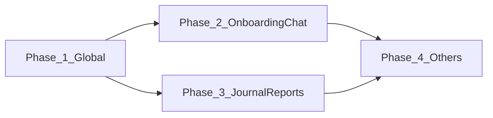

# 모바일 UX 개선 구현 계획서

**기준 문서**: MOBILE_UX_IMPROVEMENT_REPORT_20260120.md v2.0  
**작성일**: 2026-01-20  
**현재 코드베이스**: Phase 0 MVP 완료  
**목표**: "Ethereal Crystal" 디자인 시스템 적용

---

## 실행 요약

MOBILE_UX_IMPROVEMENT_REPORT에서 제시된 "평면적인 유리(Flat Glass)"에서 "공간감이 느껴지는 빛의 유리(Volumetric Light Glass)"로의 전환을 현재 코드베이스에 적용합니다. 35개 스크린에 대한 개선안을 4단계(Phase)로 나누어 순차적으로 구현합니다.

---

## 목차

1. [구현 범위 및 우선순위](#1-구현-범위-및-우선순위)
2. [Phase 1: Global Design System](#2-phase-1-global-design-system)
3. [Phase 2: Onboarding & Chat](#3-phase-2-onboarding--chat)
4. [Phase 3: Journal & Reports](#4-phase-3-journal--reports)
5. [Phase 4: Content, Profile, Safety](#5-phase-4-content-profile-safety)
6. [검증 및 배포](#6-검증-및-배포)

---

## 1. 구현 범위 및 우선순위

### 1.1 전체 스크린 매핑

| 탭 | 스크린 수 | 주요 페이지 | 우선순위 |
|-----|---------|-----------|---------|
| **Onboarding** | 6개 | Welcome ~ Tutorial | P0 (1순위) |
| **Chat** | 6개 | DayMode, NightMode | P0 (1순위) |
| **Journal** | 4개 | Timeline, Journey | P1 (2순위) |
| **Reports** | 4개 | Weekly, Monthly, Monitor | P1 (2순위) |
| **Content** | 5개 | Main, Poems, Music, Immersion | P2 (3순위) |
| **Profile** | 7개 | Main, Settings, Persona | P2 (3순위) |
| **Safety** | 3개 | Main, Crisis, Tools | P2 (3순위) |

**총 스크린**: 35개

### 1.2 구현 우선순위 전략



**근거**:
- **Phase 1**: 전체 디자인 시스템 기반 구축 (모든 Phase에서 재사용)
- **Phase 2**: 첫인상(온보딩) + 핵심 기능(채팅) 우선
- **Phase 3**: 데이터 시각화 강화
- **Phase 4**: 나머지 탭 완성

---

## 2. Phase 1: Global Design System (1-2일)

### 2.1 Tailwind 설정 확장

**파일**: [`tailwind.config.js`](tailwind.config.js)

**추가 내용**:
```javascript
module.exports = {
  theme: {
    extend: {
      // 기존 설정 유지...
      
      // 새로운 애니메이션
      animation: {
        'float': 'float 6s ease-in-out infinite',
        'pulse-slow': 'pulse 4s cubic-bezier(0.4, 0, 0.6, 1) infinite',
        'glow': 'glow 2s ease-in-out infinite alternate',
      },
      keyframes: {
        float: {
          '0%, 100%': { transform: 'translateY(0px)' },
          '50%': { transform: 'translateY(-20px)' },
        },
        glow: {
          '0%': { boxShadow: '0 0 5px rgba(var(--brand-primary-rgb), 0.3)' },
          '100%': { boxShadow: '0 0 20px rgba(var(--brand-primary-rgb), 0.6)' },
        },
      },
      // Box Shadow 확장 (네온 효과)
      boxShadow: {
        'neon': '0 0 10px rgba(var(--brand-primary-rgb), 0.5), 0 0 20px rgba(var(--brand-primary-rgb), 0.3)',
        'neon-lg': '0 0 20px rgba(var(--brand-primary-rgb), 0.6), 0 0 40px rgba(var(--brand-primary-rgb), 0.4)',
        'glass': '0 8px 32px 0 rgba(31, 38, 135, 0.07)',
        'glass-lg': '0 8px 32px 0 rgba(31, 38, 135, 0.12)',
      },
      // Blur 확장
      backdropBlur: {
        'xs': '2px',
        'xl': '20px',
        '2xl': '40px',
      },
    },
  },
  plugins: [
    // 플러그인 유지...
  ],
}
```

### 2.2 Global CSS 유틸리티 추가

**파일**: [`src/index.css`](src/index.css)

**추가 내용**:
```css
/* Ethereal Crystal Design System */

/* Glass Crystal - 기본 유리 질감 */
.glass-crystal {
  @apply bg-white/60 backdrop-blur-xl 
         border border-white/40 
         shadow-glass
         relative overflow-hidden;
}

/* Glass Border - 얇고 세련된 윤곽선 */
.glass-border {
  @apply border border-white/20;
  box-shadow: inset 0 0 0 1px rgba(255, 255, 255, 0.1);
}

/* Glass Panel - 강화된 유리 */
.glass-panel {
  @apply bg-white/80 backdrop-blur-2xl
         border border-white/60
         shadow-glass-lg;
}

/* Floating Shadow - 공중에 떠 있는 효과 */
.shadow-floating {
  box-shadow: 0 20px 60px -15px rgba(0, 0, 0, 0.1),
              0 10px 30px -10px rgba(0, 0, 0, 0.05);
}

/* Glow Effect - 빛나는 효과 */
.glow-primary {
  box-shadow: 0 0 10px rgba(255, 107, 157, 0.3),
              0 0 20px rgba(255, 107, 157, 0.2);
}

/* Noise Overlay - 필름 질감 */
.noise-overlay {
  position: relative;
}
.noise-overlay::before {
  content: '';
  position: absolute;
  inset: 0;
  background-image: url("data:image/svg+xml,%3Csvg viewBox='0 0 200 200' xmlns='http://www.w3.org/2000/svg'%3E%3Cfilter id='noiseFilter'%3E%3CfeTurbulence type='fractalNoise' baseFrequency='0.9' numOctaves='3' stitchTiles='stitch'/%3E%3C/filter%3E%3Crect width='100%25' height='100%25' filter='url(%23noiseFilter)'/%3E%3C/svg%3E");
  opacity: 0.04;
  pointer-events: none;
}

/* Specular Highlight - 반사광 */
.specular-highlight::after {
  content: '';
  position: absolute;
  top: 8px;
  left: 8px;
  width: 40%;
  height: 20%;
  background: rgba(255, 255, 255, 0.4);
  border-radius: 9999px;
  filter: blur(4px);
  transform: rotate(-15deg);
  pointer-events: none;
}
```

### 2.3 공통 컴포넌트 생성

**파일**: [`src/components/ui/NoiseOverlay.tsx`](src/components/ui/NoiseOverlay.tsx) (신규)

```typescript
import React from 'react';

interface NoiseOverlayProps {
  opacity?: number;
}

export const NoiseOverlay: React.FC<NoiseOverlayProps> = ({ opacity = 0.04 }) => {
  return (
    <div 
      className="absolute inset-0 pointer-events-none" 
      style={{
        backgroundImage: `url("data:image/svg+xml,%3Csvg viewBox='0 0 200 200' xmlns='http://www.w3.org/2000/svg'%3E%3Cfilter id='noiseFilter'%3E%3CfeTurbulence type='fractalNoise' baseFrequency='0.9' numOctaves='3' stitchTiles='stitch'/%3E%3C/filter%3E%3Crect width='100%25' height='100%25' filter='url(%23noiseFilter)'/%3E%3C/svg%3E")`,
        opacity,
      }}
    />
  );
};
```

**파일**: [`src/components/ui/FloatingOrbs.tsx`](src/components/ui/FloatingOrbs.tsx) (신규)

```typescript
import React from 'react';
import { motion } from 'framer-motion';

export const FloatingOrbs: React.FC = () => {
  return (
    <>
      <motion.div 
        className="absolute top-[-10%] left-[-10%] w-[80vw] h-[80vw] bg-brand-primary/20 rounded-full blur-[100px]"
        animate={{
          y: [0, -20, 0],
          scale: [1, 1.05, 1],
        }}
        transition={{
          duration: 8,
          repeat: Infinity,
          ease: "easeInOut"
        }}
      />
      <motion.div 
        className="absolute bottom-[-10%] right-[-20%] w-[70vw] h-[70vw] bg-brand-secondary/20 rounded-full blur-[80px]"
        animate={{
          y: [0, 20, 0],
          scale: [1, 0.95, 1],
        }}
        transition={{
          duration: 10,
          repeat: Infinity,
          ease: "easeInOut"
        }}
      />
    </>
  );
};
```

---

## 3. Phase 2: Onboarding & Chat (3-4일)

### 3.1 온보딩 스크린 개선

#### 파일 1: [`src/components/onboarding/WelcomeScreen.tsx`](src/components/onboarding/WelcomeScreen.tsx)

**개선 사항**:
- 배경에 FloatingOrbs 추가
- 로고에 Specular Highlight 추가
- NoiseOverlay 적용

**수정 예시**:
```tsx
import { FloatingOrbs } from '../ui/FloatingOrbs';
import { NoiseOverlay } from '../ui/NoiseOverlay';

export const WelcomeScreen: React.FC = () => {
  return (
    <div className="relative w-full h-full bg-[#FDFBF9] overflow-hidden">
      {/* Floating Orbs Background */}
      <FloatingOrbs />
      <NoiseOverlay opacity={0.04} />
      
      {/* Content */}
      <div className="relative z-10 flex flex-col items-center justify-center h-full px-6">
        {/* 로고 with Specular Highlight */}
        <div className="relative w-32 h-32 mb-8 specular-highlight">
          <div className="w-full h-full rounded-[32px] bg-gradient-to-br from-brand-primary to-brand-secondary flex items-center justify-center shadow-neon-lg">
            <Sparkles size={60} className="text-white" />
          </div>
        </div>
        
        {/* 제목 및 슬로건 */}
        <h1 className="text-4xl font-bold text-slate-800 mb-3">마음로그</h1>
        <p className="text-slate-500 text-center mb-12">내 마음을 읽어주는 영혼의 단짝</p>
        
        {/* CTA 버튼 */}
        <Button className="glass-panel px-12 py-4 rounded-2xl text-brand-primary font-bold hover:shadow-floating transition-all">
          시작하기
        </Button>
      </div>
    </div>
  );
};
```

#### 파일 2: [`src/components/onboarding/GoalSetting.tsx`](src/components/onboarding/GoalSetting.tsx)

**개선 사항**:
- 선택 카드에 "떠오르는 효과" 추가
- 선택 시 내부 빛나는 그라데이션
- 호버 시 부드러운 리프트

**수정 예시**:
```tsx
<motion.button
  key={goal.id}
  onClick={() => handleSelect(goal.id)}
  whileTap={{ scale: 0.98 }}
  whileHover={{ y: -4 }}
  className={`
    relative overflow-hidden p-6 rounded-3xl text-left transition-all duration-500
    ${selected 
      ? 'bg-white/80 shadow-floating border-2 border-brand-primary/30' 
      : 'bg-white/40 border border-white/40 hover:bg-white/60 shadow-glass'}
    backdrop-blur-xl
  `}
>
  {/* Inner Glow for Selected */}
  {selected && (
    <div className="absolute inset-0 bg-gradient-to-r from-brand-primary/10 to-transparent opacity-50" />
  )}
  
  {/* Content */}
  <div className="relative z-10 flex items-center gap-4">
    <div className={`w-12 h-12 rounded-2xl flex items-center justify-center transition-all ${selected ? 'bg-brand-primary text-white shadow-neon' : 'bg-white/50 text-slate-400'}`}>
      {goal.icon}
    </div>
    <div>
      <h3 className="font-bold text-slate-800">{goal.title}</h3>
      <p className="text-xs text-slate-500">{goal.description}</p>
    </div>
  </div>
</motion.button>
```

### 3.2 채팅 스크린 개선

#### 파일 3: [`src/components/ui/EmotionSelectModal.tsx`](src/components/ui/EmotionSelectModal.tsx)

**개선 사항**:
- 감정 버튼을 "보석(Gemstone)" 스타일로
- Specular Highlight 추가
- 호버 시 떠오르는 애니메이션

**수정 예시**:
```tsx
<motion.button
  data-testid={`emotion-${emotion.id}`}
  onClick={() => handleEmotionSelect(emotion.id)}
  whileHover={{ y: -4, scale: 1.05 }}
  whileTap={{ scale: 0.95 }}
  className="relative group"
>
  {/* Glow Background */}
  <div className={`absolute inset-0 ${emotion.color} blur-xl opacity-20 group-hover:opacity-40 transition-opacity`} />
  
  {/* Gemstone Button */}
  <div className={`
    relative w-20 h-20 rounded-[24px] 
    bg-gradient-to-br from-white/90 to-white/40
    border border-white/60 shadow-lg
    flex items-center justify-center text-3xl
    transition-all duration-300
    ${isSelected ? 'shadow-neon' : ''}
  `}>
    {emotion.icon}
    
    {/* Specular Highlight */}
    <div className="absolute top-2 left-2 w-8 h-4 bg-white/40 rounded-full blur-[2px] rotate-[-15deg]" />
  </div>
  
  {/* Label */}
  <span className="block text-xs font-medium text-slate-600 mt-2">{emotion.label}</span>
</motion.button>
```

#### 파일 4: [`src/components/chat/DayMode.tsx`](src/components/chat/DayMode.tsx)

**개선 사항**:
- Adaptive Blur 헤더 (스크롤 감지)
- 메시지 버블에 부드러운 그림자
- AI Thinking Animation 강화

**수정 예시**:
```tsx
const [scrollY, setScrollY] = useState(0);

useEffect(() => {
  const handleScroll = (e: Event) => {
    const target = e.target as HTMLDivElement;
    setScrollY(target.scrollTop);
  };
  
  const chatContainer = document.getElementById('chat-messages');
  chatContainer?.addEventListener('scroll', handleScroll);
  
  return () => chatContainer?.removeEventListener('scroll', handleScroll);
}, []);

return (
  <motion.div data-testid="day-mode" className="...">
    {/* Adaptive Blur Header */}
    <motion.header 
      className="fixed top-0 inset-x-0 z-50 px-6 pt-safe-top pb-4 transition-all duration-500"
      style={{ 
        background: scrollY > 10 ? 'rgba(255,255,255,0.7)' : 'transparent',
        backdropFilter: scrollY > 10 ? 'blur(20px)' : 'none',
        borderBottom: scrollY > 10 ? '1px solid rgba(255,255,255,0.2)' : 'none'
      }}
    >
      {/* Header Content */}
    </motion.header>
    
    {/* Messages */}
    <div id="chat-messages" className="flex-1 overflow-y-auto">
      {displayMessages.map((msg) => (
        <motion.div
          data-testid={msg.role === 'user' ? 'user-message' : 'ai-message'}
          className={`
            p-4 rounded-2xl 
            ${msg.role === 'user'
              ? 'bg-gradient-to-br from-brand-primary to-brand-secondary text-white shadow-neon'
              : 'bg-white/90 backdrop-blur-xl text-slate-900 border border-white/70 shadow-glass'}
          `}
          whileHover={{ scale: 1.01 }}
        >
          {msg.content}
          
          {/* Specular Highlight for AI messages */}
          {msg.role === 'assistant' && (
            <div className="absolute top-2 right-2 w-16 h-8 bg-white/20 rounded-full blur-sm rotate-12" />
          )}
        </motion.div>
      ))}
    </div>
  </motion.div>
);
```

---

## 4. Phase 3: Journal & Reports (2-3일)

### 4.1 Journal Timeline 개선

**파일**: [`src/pages/journal/JournalTimeline.tsx`](src/pages/journal/JournalTimeline.tsx)  
**참조**: [`components/JournalView.tsx`](components/JournalView.tsx)

**개선 사항**:
- 타임라인 점에 Glow 효과
- 카드 간 간격 증가 및 그림자 강화
- 호버 시 떠오르는 애니메이션

**수정 예시**:
```tsx
<div className="relative pl-8 border-l-2 border-gradient-to-b from-brand-primary/20 to-brand-primary/5 ml-4 space-y-8">
  {entries.map((entry) => (
    <div className="relative group">
      {/* Glowing Timeline Dot */}
      <div className="absolute -left-[39px] top-6 w-5 h-5 rounded-full bg-white border-4 border-brand-primary/20 shadow-neon group-hover:scale-125 group-hover:shadow-neon-lg transition-all" />
      
      {/* Glass Card */}
      <motion.div 
        data-testid="timeline-entry"
        whileHover={{ y: -4 }}
        className="
          p-5 rounded-3xl glass-crystal
          hover:shadow-floating
          transition-all duration-300
        "
      >
        <div className="flex items-center gap-3 mb-3">
          <div data-testid="emotion-icon" className={`${getEmotionColor(entry.emotion)} p-2 rounded-xl bg-white/80 shadow-sm specular-highlight`}>
            {getEmotionIcon(entry.emotion, 20)}
          </div>
          <span data-testid="intensity-badge" className={`px-3 py-1.5 rounded-full text-xs font-bold ${getIntensityColor(entry.intensity)} shadow-sm`}>
            강도 {entry.intensity}/10
          </span>
        </div>
        <p className="text-slate-700 leading-relaxed">{entry.summary}</p>
      </motion.div>
    </div>
  ))}
</div>
```

### 4.2 Reports 차트 개선

**파일**: [`src/pages/reports/WeeklyReport.tsx`](src/pages/reports/WeeklyReport.tsx)

**개선 사항**:
- 차트에 Neon Glow 효과
- 배경 투명도 증가
- 홀로그램 스타일 데이터 시각화

**수정 예시**:
```tsx
<div className="glass-crystal p-6 rounded-[2rem]">
  <ResponsiveContainer width="100%" height={300}>
    <AreaChart data={chartData}>
      <defs>
        {/* Glow Filter */}
        <filter id="glow" height="300%" width="300%" x="-100%" y="-100%">
          <feGaussianBlur stdDeviation="4" result="coloredBlur" />
          <feMerge>
            <feMergeNode in="coloredBlur" />
            <feMergeNode in="SourceGraphic" />
          </feMerge>
        </filter>
        
        {/* Gradient Fill */}
        <linearGradient id="fillGradient" x1="0" y1="0" x2="0" y2="1">
          <stop offset="0%" stopColor="var(--brand-primary)" stopOpacity={0.3} />
          <stop offset="100%" stopColor="var(--brand-primary)" stopOpacity={0} />
        </linearGradient>
      </defs>
      
      <Area 
        type="monotone" 
        dataKey="value" 
        stroke="var(--brand-primary)" 
        strokeWidth={3}
        fill="url(#fillGradient)"
        filter="url(#glow)"
      />
    </AreaChart>
  </ResponsiveContainer>
</div>
```

---

## 5. Phase 4: Content, Profile, Safety (2-3일)

### 5.1 Content 카드 개선

**파일**: [`src/pages/content/ContentMain.tsx`](src/pages/content/ContentMain.tsx)

**개선 사항**:
- 이미지 위 Frosted Glass Overlay
- 텍스트 가독성 향상
- 호버 시 이미지 확대

**수정 예시**:
```tsx
<div className="relative h-48 rounded-[2rem] overflow-hidden group cursor-pointer">
  {/* Background Image */}
  
  
  {/* Frosted Glass Overlay */}
  <div className="absolute inset-x-4 bottom-4 p-4 rounded-2xl bg-white/10 backdrop-blur-md border border-white/20 shadow-lg">
    <h3 className="text-white font-bold text-lg drop-shadow-[0_2px_4px_rgba(0,0,0,0.3)]">
      {category.title}
    </h3>
    <p className="text-white/80 text-xs mt-1 drop-shadow-sm">
      {category.subtitle}
    </p>
  </div>
</div>
```

### 5.2 Profile Settings 개선

**파일**: [`src/pages/profile/Settings.tsx`](src/pages/profile/Settings.tsx)

**개선 사항**:
- 설정 항목을 "Floating Glass Cards"로
- 구분선 대신 간격과 그림자로 구분
- Active 상태 시 스케일 애니메이션

**수정 예시**:
```tsx
<div className="space-y-3 px-4">
  {settings.map(item => (
    <motion.div 
      key={item.id}
      whileTap={{ scale: 0.98 }}
      className="
        flex items-center justify-between p-4 rounded-2xl
        bg-white/50 backdrop-blur-sm border border-white/60
        shadow-glass
        active:shadow-glass-lg transition-all
      "
    >
      <div className="flex items-center gap-3">
        <div className="w-10 h-10 rounded-xl bg-gradient-to-br from-brand-primary/10 to-brand-secondary/10 flex items-center justify-center">
          {item.icon}
        </div>
        <span className="text-slate-700 font-medium">{item.label}</span>
      </div>
      <Switch checked={item.value} />
    </motion.div>
  ))}
</div>
```

### 5.3 Safety 스크린 개선

**파일**: [`src/pages/safety/CrisisSupport.tsx`](src/pages/safety/CrisisSupport.tsx)

**개선 사항**:
- 날카로운 빨간색 → 부드러운 코랄 톤
- "경고" → "보호" 느낌의 UI
- 두꺼운 유리 질감

**수정 예시**:
```tsx
<div className="
  p-8 rounded-[2.5rem] text-center
  bg-gradient-to-b from-rose-50/90 to-white/90
  backdrop-blur-2xl border-2 border-rose-100
  shadow-[0_20px_40px_-10px_rgba(244,63,94,0.2)]
">
  {/* Icon with Soft Shadow */}
  <div className="w-20 h-20 mx-auto bg-rose-100 rounded-full flex items-center justify-center text-rose-500 mb-6 shadow-lg">
    <ShieldHeart size={40} />
  </div>
  
  <h2 className="text-2xl font-bold text-slate-800 mb-2">혼자가 아니에요</h2>
  <p className="text-slate-500 mb-8">지금 바로 도움을 받을 수 있습니다.</p>
  
  {/* CTA Button */}
  <Button className="
    w-full h-14 rounded-2xl font-bold text-lg
    bg-gradient-to-r from-rose-500 to-rose-600 
    text-white shadow-[0_8px_20px_rgba(244,63,94,0.3)]
    hover:shadow-[0_12px_30px_rgba(244,63,94,0.4)]
    transition-all
  ">
    24시간 상담 전화 연결
  </Button>
</div>
```

---

## 6. 검증 및 배포

### 6.1 Phase별 검증 체크리스트

각 Phase 완료 후 다음을 확인:

- [ ] 스크린샷 비교 (Before/After)
- [ ] 모바일 디바이스 실제 테스트 (iPhone, Android)
- [ ] 성능 영향 확인 (blur, animation)
- [ ] 접근성 유지 (명암비, 텍스트 가독성)
- [ ] 브라우저 호환성 (Safari, Chrome, Firefox)

### 6.2 성능 최적화

```css
/* index.css */
/* 성능을 위한 will-change 최적화 */
.glass-crystal {
  will-change: transform, opacity;
}

/* GPU 가속 활용 */
.animate-float {
  transform: translateZ(0);
}

/* Reduced motion 사용자 고려 */
@media (prefers-reduced-motion: reduce) {
  .animate-float,
  .animate-pulse-slow {
    animation: none;
  }
}
```

---

## 7. 구현 일정

| Phase | 기간 | 작업 내용 | 파일 수 |
|-------|------|----------|--------|
| **Phase 1** | 1-2일 | Global Design System | 3개 |
| **Phase 2** | 3-4일 | Onboarding (6개) + Chat (6개) | 12개 |
| **Phase 3** | 2-3일 | Journal (4개) + Reports (4개) | 8개 |
| **Phase 4** | 2-3일 | Content (5개) + Profile (7개) + Safety (3개) | 15개 |
| **검증** | 1-2일 | 전체 스크린 검증 및 최적화 | - |

**총 소요 기간**: 9-14일 (약 2주)

---

## 8. 예상 효과

### 8.1 디자인 품질

- **Before**: 평면적인 유리 (Flat Glass) - 2D 느낌
- **After**: 공간감 있는 빛의 유리 (Volumetric Light Glass) - 3D 느낌

### 8.2 사용자 경험

- 감정의 무게감과 소중함을 시각적으로 표현
- 몰입도 증가 (Floating Orbs, Adaptive Blur)
- 브랜드 정체성 강화 (일관된 "Crystal" 언어)

### 8.3 기술적 개선

- 재사용 가능한 디자인 시스템 (Tailwind utilities)
- 성능 최적화 (will-change, GPU acceleration)
- 접근성 유지 (Reduced motion 지원)

---

## 9. 리스크 및 완화 방안

| 리스크 | 영향 | 완화 방안 |
|--------|------|----------|
| 성능 저하 (blur, animation) | Medium | GPU 가속, will-change 사용 |
| 브라우저 호환성 | Low | Fallback CSS 제공 |
| 과도한 디자인 변경 | Medium | Phase별 점진적 적용 및 사용자 피드백 |
| 개발 시간 증가 | High | 우선순위 기반 구현, 자동화 도구 활용 |

---

## 10. 다음 단계

1. **Phase 1 시작**: Tailwind 설정 및 Global CSS 추가
2. **컴포넌트 생성**: FloatingOrbs, NoiseOverlay
3. **Phase 2 적용**: Onboarding + Chat 스크린
4. **검증**: 모바일 실제 디바이스 테스트
5. **Phase 3-4 순차 진행**

---

## 참고 문서

- [MOBILE_UX_IMPROVEMENT_REPORT_20260120.md](MOBILE_UX_IMPROVEMENT_REPORT_20260120.md) - 디자인 개선안
- [PRD.md](PRD.md) - 제품 요구사항 명세서
- [Tailwind CSS Documentation](https://tailwindcss.com/docs) - Tailwind 공식 문서
