# 마음로그 V5.0 제품 요구사항 명세서 (PRD)

---

## 요약 정리 (Executive Summary)

### 프로젝트 개요
**마음로그 V5.0**은 사용자의 감정을 함께 돌아보고, AI 동반자와의 정서적 공명을 통해 감정 여정을 함께하는 웹 기반 디지털 웰빙 플랫폼입니다. 사용자가 직접 설정한 AI 페르소나와의 대화를 통해 감정을 정리하고, 콘텐츠 큐레이션을 통해 감성적 치유를 경험할 수 있습니다.

### 핵심 가치 제안 (Value Proposition)
**"정서적 공명 및 동반자"** - 사용자가 직접 설정한 AI 동반자와의 대화를 통해 감정을 정리하고, 과거 대화 맥락을 기억하는 RAG 기반 기억 시스템으로 "나를 아는" 대화를 구현합니다. 낮에는 빠른 체크인, 밤에는 깊은 성찰을 지원하는 이중 속도 커뮤니케이션과 콘텐츠 매개 대화(Bibliotherapy)를 통해 감성적 치유를 제공합니다.

### 주요 기능 (P0 핵심 기능)
1. **커스텀 AI 페르소나 (RAG 기반 기억)**: 사용자가 직접 설정하는 AI 동반자, 과거 대화 맥락을 기억하여 "나를 아는" 대화 구현
2. **이중 속도 커뮤니케이션 (Day/Night Mode)**: 낮에는 빠른 체크인(Woebot 스타일), 밤에는 깊은 성찰(답다 스타일)을 지원하는 모드 전환
3. **콘텐츠 매개 대화 (Bibliotherapy)**: 감정에 맞는 시, 명상, 음악 등을 큐레이션하여 제공하는 감성적 치유 경험
4. **월간 회고록 (선공감 후분석 UX)**: 사용자의 감정 여정을 따뜻한 서사로 재구성하여 제공하는 월간 회고록
5. **감정 여정 시각화**: Sankey Flow, Year in Pixels 등 다양한 시각화를 통해 감정 여정을 한눈에 확인
6. **실시간 모니터**: Youper 스타일의 실시간 감정 모니터링 및 인사이트 제공
7. **안전망 시스템**: 위기 신호 감지 및 공식 위기 자원 연결

### 기술 스택 (확정)
- **프론트엔드**: TypeScript + Vite + React, Tailwind CSS, Framer Motion, Recharts
- **백엔드/인프라**: Firebase (Firestore, Cloud Functions, Storage, Auth, Hosting)
- **AI**: Gemini API (Gemini 3.0 Pro Preview, 서버 사이드 호출, RAG 활용)
- **벡터 데이터베이스**: Pinecone (RAG 기반 기억 시스템, 선택 근거: 관리형 서비스, 확장성 우수, 무료 티어 제공)[^부록-B-1]
- **데이터 분석**: Google BigQuery (주간/월간 리포트 배치 전용)
- **프로젝트**: GCP INEESm (Iiness-mlog)

### 개발 단계 (Phase별 로드맵)
- **Phase 0 (MVP)**: 0-6개월 (2026 Q1-Q2) - 핵심 기능 구현 및 기본 UX 완성
- **Phase 1 (성장)**: 6-12개월 (2026 Q3-Q4) - 리텐션 강화 및 개인화 고도화
- **Phase 2 (확장)**: 12-24개월 (2027년) - 생체 데이터 연동 및 고급 분석 기능

### 핵심 성공 지표 (KPI)
- **North Star Metric**: 주간 유효 감정 여정 세션 수 (Weekly Valid Emotion Journey Sessions) - 사용자가 AI 동반자와 의미 있는 대화를 완료한 세션 수
- **Supporting Metrics**: 체크인 완료율, 평균 체크인 시간, AI 페르소나 설정률, RAG 기억 활용률, 콘텐츠 열람률, 리텐션
- **Guardrail Metrics**: 알림 차단율, 압박감 피드백율, 위기 신호 오탐률, 앱 삭제율

### 문서 구조
본 문서는 다음 3부와 부록으로 구성됩니다:
- **1부: 기획 및 컨셉** - 프로젝트 개요, 핵심 가치, 페르소나, 경쟁사 분석, 비즈니스 모델, KPI, 리스크 관리
- **2부: 사이트맵 및 정보 구조** - 전체 사이트맵, 와이어프레임, 유저 플로우, 태스크 플로우, 스크린-기능-기술 명세 매칭표
- **3부: 개발 및 기능 명세** - 기술 스택, 기능 명세, 기술 명세서(TSD), 기능 요구사항 명세서(FRD), Phase별 로드맵
- **부록** - 부록 구조 개요, 데이터 모델 상세 정의, 기술 스택 상세 스펙, 기능 구현 상세 스펙, FRD 상세 명세서, UX 플로우 상세 다이어그램, 기능 ID 매핑표

### 문서 상태
- **버전**: 5.6 (PRD 점검 및 수정 완료)
- **최종 수정일**: 2025-01-15
- **상태**: 점검 완료 및 수정 완료
- **개발 준비 상태**: 준비 완료

---

## 문서 정보
- **버전**: 5.6 (PRD 점검 및 수정 완료)
- **작성일**: 2025-01-15
- **최종 수정일**: 2025-01-15
- **상태**: 점검 완료 및 수정 완료
- **프로젝트 정보**:
  - GCP 프로젝트명: INEESm
  - 프로젝트 ID: Iiness-mlog
  - Firebase 프로젝트: Iiness-mlog
- **결정 사항(고정)**:
  - 프론트엔드: TypeScript + Vite + React
  - 백엔드/인프라: Firebase (Firestore, Cloud Functions, Storage, Auth, Hosting)
  - AI: Gemini API (키 기반, Cloud Functions 서버 사이드 호출, 모델: **Gemini 3.0 Pro Preview**, RAG 활용)
  - 벡터 데이터베이스: Pinecone (RAG 기반 기억 시스템, 선택 근거: 관리형 서비스, 확장성 우수, 무료 티어 제공)[^부록-B-1]
  - 데이터 분석: BigQuery (주간/월간 리포트 배치 전용)
  - 제외: Neo4j, CI/CD 자동화
- **근거 문서(웹그라운딩 완료)**:
  - 환경분석: `docs/mindlog-v4-environment-research.md` (v1.1)[^env-research]
- **주의**:
  - GCP 프로젝트 ID는 일반적으로 소문자/숫자/하이픈만 허용됩니다. 표기된 `Iiness-mlog`의 실제 ID는 콘솔에서 최종 확인 필요[^gcp-id]

---

# 1부: 기획 및 컨셉

## 1.1 프로젝트 개요

### 프로젝트명
**마음로그 V5.0**

### 프로젝트 식별 정보
- **GCP 프로젝트명**: INEESm
- **프로젝트 ID**: Iiness-mlog
- **Firebase 프로젝트**: Iiness-mlog

### 프로젝트 타입
웹 기반 감정 기록 및 자기관리(웰빙) 플랫폼

### 프로젝트 목적
개인의 감정을 체계적으로 기록하고, 사용자가 직접 설정한 AI 동반자와의 정서적 공명을 통해 감정 여정을 함께하는 디지털 웰빙 플랫폼. 낮에는 빠른 체크인, 밤에는 깊은 성찰을 지원하며, 콘텐츠 큐레이션을 통해 감성적 치유를 제공합니다.

### 시장/정책 근거(요약) — 환경분석 v1.1 반영(확정)
- **시장 정의 주의**: “디지털 멘탈헬스(광의)”와 “정신건강 앱(협의)”은 범위가 달라 규모가 크게 다름 (PRD 내 표기 혼동 금지)
- **글로벌(광의)**: Digital Mental Health 2024 USD 20.10B, CAGR 18.44% (2030년 USD 55.82B 전망)
- **글로벌(협의)**: Mental Health Apps 2024 USD 6.52B → 2032 USD 23.80B, CAGR 18.0%
- **국내**: 정신건강 “앱” 시장 규모에 대한 공식 통계는 부재 → PRD에서는 “보수적 시나리오 추정(예: 297억원)”을 **가정 기반 추정치**로만 사용
- **정책/안전(P0)**: 위기 신호 감지 시 **공식 위기 자원(상담전화/지역센터/긴급 119·112)**으로 즉시 유도(의료행위 아님 고지 포함)

## 1.2 컨셉

### 핵심 가치(Value Proposition) — 정서적 공명 및 동반자 (V5.0 피봇, 확정)

**정의**: 사용자가 직접 설정한 AI 동반자와의 정서적 공명을 통해 감정 여정을 함께하는 경험. RAG 기반 기억 시스템으로 "나를 아는" 대화를 구현하고, 낮에는 빠른 체크인, 밤에는 깊은 성찰을 지원하는 이중 속도 커뮤니케이션을 제공합니다.

**V4.1에서 V5.0으로의 변화**:
- **V4.1**: 데이터 기반 행동 코칭 (Data-Driven Coaching)
- **V5.0**: 정서적 공명 및 동반자 (Emotional Resonance & Companionship)
- **핵심 전환**: "코칭 제공" → "정서적 동반자", "행동 추천" → "감정 정리 및 공명"

**왜 차별화인가**:
- **기록 앱(Daylio 등)**: 데이터는 쌓이지만 "나를 아는 동반자"가 없다
- **범용 콘텐츠 앱(Headspace/Calm 등)**: 좋은 콘텐츠는 많지만 개인화된 감정 정리가 약하다
- **AI 챗봇(Woebot 등)**: CBT 기반 대화는 제공하지만 "나를 기억하는" 관계가 없다
- **마음로그 V5.0**: **"나를 아는 AI 동반자와 함께하는 감정 여정, 낮과 밤에 맞춘 이중 속도 커뮤니케이션"**

**제품 구조(필수 일관성)**:
- **Input(수집)**: 감정+강도+맥락(스마트 상황 태그: GPS/시간대 기반 추천, 스킵 가능), Day/Night Mode 구분
- **Processing(분석)**: RAG 기반 기억 시스템으로 과거 대화 맥락 활용, 감정 패턴 분석, 콘텐츠 큐레이션
- **Output(공명)**: AI 페르소나 기반 대화, 콘텐츠 매개 대화(Bibliotherapy), 감정 정리 및 위로
- **Feedback(피드백)**: 감정 여정 시각화, 월간 회고록(선공감 후분석), 실시간 모니터

**표현 원칙(안전/신뢰)**:
- "인과 단정" 대신 "반복 패턴/경향/가능성"으로 표현하고, 근거(표본 수/기간)를 함께 제시
- 의료적 진단/치료/처방 금지, 위기 신호는 Safety로 우선 유도
- AI 페르소나는 "동반자" 역할이며, 위기 상황에서는 Character Break로 전문가 모드 전환

### 핵심 컨셉
**"내 마음을 읽어주는 영혼의 단짝, 마음로그"** + **"나를 아는 AI 동반자와 함께하는 감정 여정"**

- 사용자가 직접 설정한 AI 페르소나와의 관계 형성
- RAG 기반 기억 시스템으로 "나를 아는" 대화 구현
- 낮에는 빠른 체크인(Woebot 스타일), 밤에는 깊은 성찰(답다 스타일)
- 콘텐츠 큐레이션을 통한 감성적 치유(Bibliotherapy)
- 감정 여정을 시각화하여 한눈에 확인
- 월간 회고록으로 감정 여정을 따뜻한 서사로 재구성

### 디자인 철학
- **미니멀리즘**: 복잡한 감정을 단순하고 아름답게 표현
- **게이미피케이션**: XP 시스템, 레벨업, 벚꽃 정원으로 지속적 참여 유도
- **즉시성(UX)**:
  - 감정 저장/피드백: P95 < 800ms
  - AI 인사이트 표시: P95 < 8s (타임아웃 시 폴백/재시도)
- **신뢰성**: 투명한 데이터 관리 및 개인정보 보호 중심
- **접근성**: 모든 사용자가 사용할 수 있도록 설계 (WCAG AA 기준)

### 디자인 시스템 (기본 스펙)

#### 색상 시스템

**브랜드 컬러**:
- Primary: #FF6B9D (핑크, 벚꽃 컨셉)
- Secondary: #87CEEB (하늘색, 평온)
- Accent: #90EE90 (연두색, 성장)

**감정별 색상**:
- 기쁨: #FFD700 (노란색)
- 평온: #87CEEB (하늘색)
- 불안: #FF6B6B (빨간색)
- 슬픔: #4A90E2 (파란색)
- 분노: #FF8C42 (주황색)

**상태 색상**:
- 성공: #4CAF50 (초록색)
- 경고: #FF9800 (주황색)
- 오류: #F44336 (빨간색)
- 정보: #2196F3 (파란색)

**중성 색상**:
- 배경: #FFFFFF (흰색), #F5F5F5 (회색 배경)
- 텍스트: #000000 (검은색), #666666 (회색), #999999 (연한 회색)
- 테두리: #E0E0E0 (연한 회색)

#### 타이포그래피 시스템

**폰트 패밀리**:
- 본문: "Pretendard", -apple-system, BlinkMacSystemFont, "Segoe UI", sans-serif
- 코드: "Consolas", "Monaco", monospace

**폰트 크기 스케일**:
- 12px: 작은 텍스트 (라벨, 캡션)
- 14px: 본문 (기본)
- 16px: 본문 (강조)
- 20px: 소제목
- 24px: 제목
- 32px: 대제목

**폰트 굵기**:
- Regular (400): 본문 기본
- Medium (500): 강조 텍스트
- Bold (700): 제목, 강조

**행간(Line Height)**:
- 기본: 1.5배 (예: 14px → 21px)
- 제목: 1.2배 (예: 24px → 28.8px)

**간격(Spacing) 시스템**:
- 4px: 매우 작은 간격
- 8px: 작은 간격
- 16px: 기본 간격
- 24px: 중간 간격
- 32px: 큰 간격
- 48px: 매우 큰 간격

## 1.3 슬로건

> **[미식별요인]**[^미식별요인] (리브랜딩 반영) 다음 중 선택 또는 신규 제안 필요:
- "내 데이터로, 오늘을 코칭하다"
- "쓸수록 더 나를 아는 코치"
- "나의 패턴을 읽고, 오늘 1개로 바꾸는 코치"
- "내 마음의 데이터로 작은 실천을 설계하다"
- "나에게 통했던 방법을 다시 꺼내주는 코치"
- "벚꽃처럼 피어나는 당신의 성장" (기존 유지 가능)

**결정 필요**: 최종 슬로건 확정[^슬로건-결정]

## 1.4 문제 정의

### 시장 문제 (Market Problem)

1. **감정 인식의 어려움**
   - 많은 사람들이 자신의 감정을 명확히 인식하지 못함
   - 감정이 복합적이고 시간에 따라 변화하는데 이를 추적하기 어려움

2. **일관성 없는 기록 습관**
   - 전통적인 일기 작성은 지속하기 어려움
   - 기록의 가치를 즉시 느끼기 어려워 중단됨

3. **전문가 접근성 부족**
   - 정신건강 전문가 상담 비용이 높음
   - 대기 시간이 길고 접근성이 낮음

4. **데이터 기반 인사이트 부재**
   - 개인의 감정 패턴을 객관적으로 분석할 도구 부족
   - 주관적 기억에 의존한 자기 이해

### 사용자 문제 (User Problem)

1. **"내 감정이 왜 이럴까?"**
   - 감정의 원인과 패턴을 이해하고 싶음
   - 트리거와 반응의 관계를 파악하고 싶음

2. **"계속 기록하고 싶은데 잊어버려"**
   - 일기 쓰는 습관을 유지하기 어려움
   - 간편하고 빠른 기록 방법 필요

3. **"위기 상황에서 도움이 필요해"**
   - 급격한 감정 변화나 위기 상황 대처 방법 필요
   - 즉시 접근 가능한 지원 도구 필요

4. **"내 데이터가 안전한가?"**
   - 개인정보 및 감정 데이터 보호에 대한 우려
   - 데이터 사용 목적과 범위에 대한 투명성 필요

## 1.5 문제 해결 방안

### 솔루션 1: 대화형 감정 체크인 (메인) + 스마트 상황 태그 (GPS/시간대 기반 추천, MVP)
- **문제**: 복잡한 감정 입력 과정, 기록의 부담, "왜(Why)"와 "언제(When)" 맥락 부재
- **해결**: 대화형 체크인 (감정/강도) + **스마트 상황 태그(GPS/시간대 기반 자동 추천, 스킵 가능)** → 즉시 한 줄 피드백 → 오늘 1개 액션
- **차별점**: 대화로 자연스럽게 정리하고, 맥락을 자동으로 잡아 "나를 더 잘 알게" 만드는 코치 경험 (폼 기반 체크인도 옵션으로 제공)
- **스마트 상황 태그 상세**:
  - GPS 기반: 평일 오전 9시 + 회사 위치 → '출근', '업무', '동료' 태그 우선 노출
  - 시간대 기반: 오후 6시 이후 → '퇴근 후', '저녁' 태그 추천
  - 사용자가 일일이 입력하지 않아도 데이터가 쌓여, 나중에 **"너는 주로 '월요일 오전 회의' 때 불안도가 높아져"**라고 말해줄 수 있음

### 솔루션 2: 내 데이터 기반 코칭 엔진 (Processing → Output)
- **문제**: "이번 주 기쁨 3번" 같은 현황 통계는 코칭이 아니다. 단순 통계가 아닌 "인과관계"가 필요
- **해결**: 내 데이터에서 **"트리거 후보/회복 패턴/액션 효과"**를 찾고, 다음 행동을 **'성공경험 기반'**으로 제안
- **핵심 산출물(유저에게 보이는 것)**:
  - **트리거 후보**: "월요일 오전 회의(태그)에서 불안 강도가 자주 높아져요(최근 4주 중 3주)"
  - **회복 패턴**: "불안 → 평온으로 돌아오는 시간이 최근 2주간 짧아졌어요"
  - **성공 경험(나의 필살기)**: "지난번에 '2분 박스 호흡' 후 강도가 8에서 5로 내려간 기록이 있어요. 오늘도 해볼까요?"
- **차별점**: '나에게 효과 있었던 방법'을 재사용하는 개인화(검증된 성공 경험 기반)

### 솔루션 2-1: 실시간 AI 인사이트 (보강)
- **문제**: 기록의 즉각적 가치 부재
- **해결**: 감정은 즉시 저장하고, AI 인사이트는 비동기 생성/표시(로딩/폴백 포함)
- **차별점**: Gemini API 기반 패턴 분석으로 정확도 향상, **트리거/회복 분석 포함**

### 솔루션 3: 효과 시각화(Feedback) — Before/After + 성장 궤적
- **문제**: 실천해도 "변화가 보이지 않으면" 신뢰가 안 쌓인다
- **해결**:
  - **액션 직후(선택) 5초 리체크**로 전/후 변화를 표시(예: "방금 2분 호흡으로 불안도가 8에서 5로 내려갔어요!")
  - 주간/월간에서 **회복력(회복 시간/빈도) 변화 추이**를 해석해 제공(예: "지난달보다 부정적 감정의 지속 시간이 20% 짧아졌어요. 회복력이 좋아지고 있다는 증거예요.")
- **차별점**: 코칭 효과를 데이터로 증명("내가 좋아지고 있다"를 눈으로 확인)

### 솔루션 4: 게이미피케이션 기반 지속성
- **문제**: 기록 습관 유지 어려움
- **해결**: XP 시스템, 레벨업, 벚꽃 정원 시각화로 동기부여
- **차별점**: 성장 메타포를 통한 자연스러운 참여 유도

### 솔루션 5: 통합 안전망 시스템
- **문제**: 위기 상황 대처 도구 부재
- **해결**: 공식 위기 자원(상담전화/지역센터) 안내·연결 + 대처 도구 + (선택) 전문가 연결 통합 제공  
  - 상담전화: 1577-0199(정신건강 위기상담), 1393(자살예방상담)  
  - 긴급 상황: 119/112
- **차별점**: 감정 데이터 기반 위기 상황 자동 감지 및 개입

### 솔루션 6: 투명한 데이터 관리 및 대화 저장/삭제 정책
- **문제**: 개인정보 보호 우려, 대화 데이터 저장에 대한 불안
- **해결**: 데이터 프라이버시 센터, 명확한 권한 관리, GDPR 준수 + **대화 저장(영구, 명시적 동의) + 개별 메시지 삭제 권한 + 파생데이터(비식별 집계) 처리 정책**
- **차별점**: 사용자가 데이터 사용을 완전히 제어 가능, 언제든 삭제/내보내기/저장 중지 가능

## 1.6 페르소나

### 페르소나 1: "감정을 이해하고 싶은 일반인" (Primary)

**기본 정보**
- 이름: 김민수 (가상)
- 나이: 28세
- 직업: 회사원
- 거주지: 서울

**행동 패턴**
- 평소 감정 변화에 관심이 많음
- 스마트폰 앱을 자주 사용
- 자기계발 콘텐츠를 즐겨 봄
- SNS 활동 활발

**니즈**
- 자신의 감정 패턴을 이해하고 싶음
- 간단하고 빠른 기록 방법 필요
- 기록에 대한 즉각적 피드백 원함
- 데이터 기반 인사이트로 자기 이해 향상

**페인 포인트**
- 일기 쓰는 습관을 유지하기 어려움
- 감정이 복잡해서 표현하기 어려움
- 기록해도 뭔가 변화가 없어 보임

**사용 시나리오**
- 출근 전 지하철에서 오늘의 감정 체크인
- 주말에 주간 리포트 확인하며 패턴 파악
- 스트레스 받을 때 대처 도구 활용

### 페르소나 2: "정신건강 관리를 필요로 하는 사람" (Secondary)

**기본 정보**
- 이름: 이지은 (가상)
- 나이: 32세
- 직업: 프리랜서
- 거주지: 부산

**행동 패턴**
- 우울감이나 불안감을 주기적으로 경험
- 전문가 상담을 고려하지만 비용 부담
- 온라인 커뮤니티에서 정보 수집
- 자기 관리에 적극적

**니즈**
- 감정 변화 추적 및 패턴 파악
- 위기 상황 대처 방법 학습
- 전문가 연결 경로
- 비용 부담 없는 정신건강 관리 도구

**페인 포인트**
- 전문가 상담 비용이 부담됨
- 위기 상황에서 즉시 도움을 받기 어려움
- 감정 기록이 오히려 부담이 될 수 있음

**사용 시나리오**
- 매일 저녁 감정 체크인으로 하루 마무리
- 위기 감지 시 자동으로 대처 도구 제안 받음
- 월간 리포트를 전문가와 상담 시 공유

**[미식별요인]** 추가 페르소나 정의 필요 여부 검토

## 1.7 경쟁사 분석

### 직접 경쟁사

1. **Daylio** (감정 추적 앱)
   - 강점: 간단한 UI, 긴 사용 이력, 글로벌 인지도
   - 약점: AI 인사이트 부족, 기본적인 분석만 제공
   - 마음로그 차별화: RAG 기반 기억 시스템으로 "나를 아는" 대화 제공

2. **Mood Meter** (예일 대학 감정 앱)
   - 강점: 과학적 근거 기반, 구조화된 감정 평가
   - 약점: UI가 복잡함, 한국어 지원 부족
   - 마음로그 차별화: 한국 문화 맞춤, AI 페르소나 기반 대화

3. **답다 (LG유플러스)** (국내 직접 경쟁사)
   - 강점: AI 캐릭터 기반 공감 메시지, 감정 선택 인터페이스, 한국적 톤
   - 약점: 일기 중심으로 구조화된 분석 부족, RAG 기반 기억 시스템 부재
   - 마음로그 차별화: RAG 기반 기억 시스템, Day/Night Mode 이중 속도 커뮤니케이션, 콘텐츠 매개 대화

4. **무드패스 (Moodpath)** (해외 직접 경쟁사)
   - 강점: 구조화된 감정 평가 도구, 감정 여정 시각화
   - 약점: AI 인사이트 부족, 한국어 지원 부족
   - 마음로그 차별화: AI 페르소나 기반 대화, RAG 기반 기억 시스템, 한국 문화 맞춤

### 간접 경쟁사

1. **Headspace / Calm** (명상 앱)
   - 강점: 브랜드 인지도 높음, 고품질 콘텐츠
   - 약점: 감정 기록 기능 부재, 개인화된 감정 정리 부족
   - 마음로그 차별화: 감정 기록과 콘텐츠 큐레이션 통합, AI 페르소나 기반 개인화

2. **일기 앱들** (Journey, Day One 등)
   - 강점: 자유로운 텍스트 기록, 아름다운 UI
   - 약점: 구조화된 감정 분석 부족, AI 인사이트 부재
   - 마음로그 차별화: AI 페르소나 기반 대화, RAG 기반 기억 시스템, 감정 여정 시각화

3. **굿리딩 (부여군)** (콘텐츠 큐레이션 앱)
   - 강점: 시집 기반 감성적 치유, 한국 문학 콘텐츠
   - 약점: AI 분석 부족, 개인화된 큐레이션 부족
   - 마음로그 차별화: 감정 상태 기반 자동 큐레이션, AI 페르소나와의 콘텐츠 매개 대화

4. **마보 (Mabo)** (명상 및 감정 기록 앱)
   - 강점: 명상 콘텐츠와 감정 기록 결합
   - 약점: AI 인사이트 부족, 개인화 부족
   - 마음로그 차별화: AI 기반 패턴 분석 + 콘텐츠 큐레이션, RAG 기반 기억 시스템

5. **웨봇 (Woebot)** (AI 치료 챗봇)
   - 강점: CBT 기반 대화, 과학적 근거, 빠른 응답
   - 약점: RAG 기반 기억 시스템 부재, 한국어 지원 부족
   - 마음로그 차별화: RAG 기반 기억 시스템, Day/Night Mode 이중 속도 커뮤니케이션, 한국 문화 맞춤

### 벤치마크 서비스 (UI/UX 및 기능 참고)

1. **리플렉틀리 (Reflectly)** (UI/UX 벤치마크)
   - 강점: 미니멀하고 아름다운 인터페이스, 감성적 디자인
   - 약점: AI 분석 깊이 부족, RAG 기반 기억 시스템 부재
   - 마음로그 차별화: Reflectly 스타일 UI + AI 페르소나 기반 대화, RAG 기반 기억 시스템

2. **유퍼 (Youper)** (리포트 및 모니터 벤치마크)
   - 강점: 모니터 시스템, 실시간 감정 추적, 인사이트 제공
   - 약점: 한국어 지원 부족, RAG 기반 기억 시스템 부재
   - 마음로그 차별화: 한국 문화 맞춤, RAG 기반 기억 시스템, 월간 회고록(선공감 후분석 UX)

3. **인월드 AI (Inworld AI)** (AI 커스터마이징 벤치마크)
   - 강점: 캐릭터 성격 설정, 상황별 대사 생성, 고도화된 AI 페르소나
   - 약점: 정신건강 특화 아님, RAG 기반 기억 시스템 부재
   - 마음로그 차별화: 정신건강 특화 + 커스터마이징, RAG 기반 기억 시스템, Day/Night Mode

### 차별화 포인트
- **AI 기반 실시간 인사이트**: Gemini API 활용
- **갤러리 스타일 UI**: 감정을 예술 작품처럼 시각화
- **통합 안전망**: 위기 상황 대처 도구 내장
- **게이미피케이션**: 벚꽃 정원 메타포로 지속성 유도

## 1.8 전략 피라미드 (환경분석 v1.1 반영)

### 최상위 비전
**한국인의 정신건강 파트너 (Mental Wellness Partner for Koreans)**

### 전략적 포지셔닝
AI 인사이트 + 한국 문화 맞춤 + 게이미피케이션으로 감정 관리의 새로운 표준을 제시

### 전술적 실행 (Phase별)
- **Phase 0 (MVP, 0-6개월)**: 자기계발 직장인 타겟, 1만 사용자 확보
- **Phase 1 (성장, 6-12개월)**: 우울·불안 관리층 확대, 프리미엄 전환 5%
- **Phase 2 (확장, 12-24개월)**: 대중화, B2B 진출

### 핵심 KPI (환경분석 기반)
- **DAU/MAU**: 측정 및 추적
- **프리미엄 전환율**: 측정 및 추적
- **사용자 만족도**: 측정 및 추적
- **리텐션 (7일)**: 측정 및 추적
- **AI 인사이트 만족도**: 측정 및 추적

## 1.9 SWOT/TOWS 전략 분석 (환경분석 v1.1 반영)

### 강점 (Strengths)
- **S1**: Gemini API 기반 AI 인사이트 (경쟁사 Daylio, 마보 대비 AI 분석 부재) - 차별화 수준: 매우 높음
- **S2**: 갤러리 스타일 UI (감정을 예술 작품처럼 시각화, 감성적 차별화) - 차별화 수준: 높음
- **S3**: 게이미피케이션 (벚꽃 정원 메타포, 사용자 리텐션 향상 예상) - 차별화 수준: 높음
- **S4**: Firebase 실시간 동기화 (지연 시간 측정 및 추적, 빠른 피드백) - 차별화 수준: 보통
- **S5**: 한국 문화 맞춤 (직장인 스트레스, 한국어 자연어 처리) - 차별화 수준: 매우 높음

### 약점 (Weaknesses)
- **W1**: 레퍼런스 부재 (초기 신뢰도 낮음) → 완화: 베타 테스터 후기 100개 확보
- **W2**: 마케팅 예산 제한 (낮은 인지도) → 완화: 그로스 해킹 (리퍼럴, 콘텐츠)
- **W3**: AI 비용 증가 위험 (사용자 증가 시 Gemini API 비용 급증) → 완화: 사용량 모니터링, 캐싱 전략
- **W4**: 팀 규모 제한 (개발·마케팅 인력 부족) → 완화: 외주 활용, 단계적 기능 출시

### 기회 (Opportunities)
- **O1**: 국내 정신건강 시장 고성장 (연평균 30% 성장 예상) → 활용: 조기 시장 진입으로 선점
- **O2**: MZ세대 멘탈케어 관심 급증 (검색량 300% 증가 추정) → 활용: SNS 마케팅, Z세대 타겟 광고
- **O3**: 직장인 번아웃 문제 심화 (62.1% 스트레스 경험) → 활용: 기업 EAP 제휴, B2B 사업
- **O4**: 정부 디지털 헬스케어 육성 (R&D 지원, 바우처 사업) → 활용: 지원 사업 신청
- **O5**: 글로벌 앱 한국어 지원 미흡 (Calm, Headspace 한국 마케팅 약함) → 활용: 한국 특화 기능으로 Lock-in

### 위협 (Threats)
- **T1**: 대형 플랫폼 진입 (카카오헬스케어, 네이버 헬스 확장 시 위협) → 대응: 조기 사용자 확보 + 커뮤니티 형성
- **T2**: 글로벌 앱 한국어 지원 강화 → 대응: 한국 문화 맞춤 기능으로 차별화
- **T3**: 의료기기 규제 강화 → 대응: "자가 관리 도구" 포지셔닝 명확화
- **T4**: 사용자 이탈률 높음 → 대응: 게이미피케이션, 리텐션 캠페인
- **T5**: 개인정보 유출 (치명적) → 대응: 보안 우선 개발, 정기 감사

### TOWS 전략 (핵심 실행 전략)
- **SO1**: AI 인사이트(S1) + 정신건강 시장 성장(O1) → 차별화 마케팅 ("AI가 분석하는 내 감정 패턴" 캠페인)
- **SO2**: 게이미피케이션(S3) + MZ세대 관심(O2) → SNS 바이럴 ("30일 벚꽃 정원 챌린지" 인스타그램 캠페인)
- **SO3**: 한국 문화 맞춤(S5) + 직장인 스트레스(O3) → B2B 진출 (스타트업 대상 EAP 파일럿 제안)
- **ST1**: AI 기술력(S1) + 대형 플랫폼 위협(T1) → 특화 포지셔닝 ("정신건강 전문 AI" 브랜딩)
- **WO1**: 레퍼런스 부재(W1) + 시장 성장(O1) → 베타 프로그램 (100명 베타 테스터 모집, 후기 수집)
- **WT1**: AI 비용(W3) + 대형 플랫폼(T1) → 비용 최적화 (Gemini API 캐싱, 사용량 알림)

## 1.10 비즈니스 모델 및 4P 전략 (환경분석 v1.1 반영)

### 제품 전략 (Product)
- **MVP 기능 범위**: 감정 체크인, AI 인사이트, 마이크로 액션, 주간 리포트, 안전망 기본 기능
- **차별화 포인트**: Gemini 기반 AI 인사이트(경쟁사 대비 10배 깊은 분석), 갤러리 UI, 게이미피케이션, 한국 문화 맞춤

### 가격 전략 (Price)
- **무료**: 기본 감정 기록, 주간 리포트, 마이크로 액션(오늘 1개)
- **프리미엄 (월 9,900원)**: 월간 리포트, 전문가 연결, 고급 인사이트, 벚꽃 정원 시각화, 데이터 내보내기
- **가격 근거**: 경쟁 앱(Calm, Headspace) 연 $70-100 구독료 대비 저렴한 가격으로 진입, 국내 시장 수용성 고려

### 유통 전략 (Place)
- **채널**: iOS/Android 앱스토어, 웹 플랫폼(Firebase Hosting)
- **ASO 전략**: 제목 "마음로그 - 감정일기 & AI 인사이트", 키워드 최적화, 갤러리 UI 스크린샷
- **B2B 채널**: 기업 EAP 제휴, 정부 파일럿 사업 (Phase 1 이후)

### 촉진 전략 (Promotion)
- **런칭 캠페인 (MVP, 예산 1,500만원)**: SNS 마케팅, 인플루언서 협업, 베타 테스터 모집
- **핵심 메시지**: "30초 체크인으로 내 감정을 이해하세요", "AI가 당신의 감정 패턴을 분석해드려요", "한국인을 위한 정신건강 자가 관리 앱"
- **그로스 해킹**: 리퍼럴 프로그램, 콘텐츠 마케팅, 커뮤니티 형성

### 수익 모델 (결정 필요)
**[미식별요인]** 다음 중 선택 또는 하이브리드:
- **옵션 1**: 프리미엄 구독 모델 (무료 + 프리미엄)
- **옵션 2**: B2B2C 모델 (기업 직원 웰빙 프로그램)
- **옵션 3**: 하이브리드 모델 (기본 기능 무료 + 프리미엄 구독 + B2B 판매)

## 1.11 성공 지표 (KPI) 및 메트릭스 — 환경분석 v1.1 반영

### 사용자 참여 지표 (Engagement Metrics)

**DAU/MAU 비율**:
- 측정 방법: 일일 활성 사용자 수 / 월간 활성 사용자 수
- 추적 주기: 일일

**감정 체크인 완료율**:
- 측정 방법: 체크인 완료 수 / 체크인 시작 수
- 추적 주기: 일일

**사용자 유지율 (Retention)**:
- 7일 리텐션: 측정 및 추적
- 30일 리텐션: 측정 및 추적
- 측정 방법: N일 후 재방문 사용자 수 / N일 전 신규 사용자 수
- 추적 주기: 주간

### 제품 지표 (Product Metrics)

**체크인 평균 소요시간**:
- 측정 방법: 체크인 시작 시간 ~ 저장 완료 시간
- 추적 주기: 일일

**AI 인사이트 생성 시간**:
- 측정 방법: 인사이트 요청 시간 ~ 표시 시간
- 추적 주기: 일일
- 타임아웃 처리: 10초 초과 시 폴백 메시지

**앱 크래시율**:
- 측정 방법: 크래시 발생 수 / 총 세션 수
- 추적 주기: 일일

**에러 발생률**:
- 측정 방법: 에러 발생 수 / 총 요청 수
- 추적 주기: 일일

**페이지 로드 시간**:
- 측정 방법: Web Vitals API
- 추적 주기: 일일

**평균 세션 시간**:
- 측정 방법: 세션 종료 시간 - 세션 시작 시간
- 추적 주기: 일일

**기능 사용률**:
- 측정 방법: 기능별 사용자 수 / 총 활성 사용자 수
- 추적 주기: 주간

**AI 인사이트 만족도**:
- 측정 방법: 사용자 설문 (월 1회)
- 추적 주기: 월간

**사용자 만족도 (전체)**:
- 측정 방법: 앱스토어 리뷰 + 인앱 설문
- 추적 주기: 월간

### 비즈니스 지표 (Business Metrics)

**프리미엄 전환율**:
- 측정 방법: 프리미엄 구독자 수 / 총 활성 사용자 수
- 추적 주기: 주간

**월간 수익 (MRR)**:
- 측정 방법: 프리미엄 구독자 수 × 월 구독료
- 추적 주기: 월간

**고객 획득 비용 (CAC)**:
- 측정 방법: 마케팅 비용 / 신규 사용자 수
- 추적 주기: 월간

**고객 생애 가치 (LTV)**:
- 측정 방법: 평균 구독 기간 × 월 구독료
- 추적 주기: 분기별

**이탈률 (Churn Rate)**:
- 측정 방법: 구독 취소 수 / 총 구독자 수
- 추적 주기: 월간

**다운로드 수**:
- 측정 방법: 앱스토어 통계
- 추적 주기: 월간

### 시장 지표
- **베타 테스터 후기**: 측정 및 추적
- **앱스토어 평점**: 측정 및 추적

## 1.12 리스크 관리 전략 (환경분석 v1.1 반영)

| 리스크 | 발생 가능성 | 영향도 | 대응 전략 | 담당 |
|--------|------------|--------|---------|------|
| **의료기기 규제** | 낮음 | 높음 | "자가 관리 도구" 포지셔닝 명확화, 법률 자문 | 법무 |
| **AI 비용 초과** | 중간 | 중간 | 사용량 모니터링, 캐싱 전략, 알림 설정 | 개발 |
| **경쟁사 진입** | 높음 | 중간 | 조기 사용자 확보, 커뮤니티 형성, 차별화 강화 | 전략 |
| **사용자 이탈률 높음** | 높음 | 높음 | 게이미피케이션, 리텐션 캠페인, 푸시 알림 | 마케팅 |
| **개인정보 유출** | 낮음 | 치명적 | 보안 우선 개발, 정기 감사, Firebase 보안 규칙 | 개발 |

## 1.13 Primary Persona 기반 제품 전략 (확정)

### Primary Persona (일반 성인 / 자기관리)
- **대상**: 바쁜 일상 속 스트레스/기분 기복을 관리하고 싶은 일반 성인
- **핵심 기대**: “감정을 어렵지 않게 기록하고, 작게라도 행동으로 연결해서 회복감을 얻는 것”
- **톤 가이드(기획 원칙)**:
  - 의료적 진단/처방/치료 톤 금지
  - 과도한 심리 분석 금지
  - 죄책감/압박 유발 카피 금지(‘못 해도 괜찮다’가 기본)

### 제품 포지셔닝(한 줄)
**30초 기록 + 오늘 1개 실천 + 주간 회고**로 “감정 관리 습관”을 만드는 자기관리 앱

## 1.14 North Star Metric(NSM) 및 측정 프레임

### North Star Metric (NSM)

**NSM**: 주간 유효 감정 여정 세션 수(Weekly Valid Emotion Journey Sessions)

**정의**:
- AI 페르소나와의 의미 있는 대화 완료 (Day Mode 또는 Night Mode)
- 감정 체크인 완료 (대화형 또는 폼)
- RAG 기반 기억 활용 (과거 대화 맥락 참조) 또는 콘텐츠 큐레이션 제공
- 사용자가 대화에 만족하고 다음 대화를 기대하는 상태

**V5.0 피봇 반영**:
- V4.1: "코치 세션" (마이크로 액션 중심)
- V5.0: "감정 여정 세션" (정서적 공명 중심)
- 핵심 변화: 행동 추천 → 감정 정리 및 공명

**측정 방법**:
```sql
-- BigQuery 집계 예시
SELECT 
  user_id,
  COUNT(DISTINCT session_id) as valid_sessions
FROM analytics.sessions
WHERE 
  checkin_completed = true
  AND action_card_shown = true
  AND action_status IN ('done', 'skip', 'defer')
  AND date >= DATE_SUB(CURRENT_DATE(), INTERVAL 7 DAY)
GROUP BY user_id
```

**목표**:
- Phase 0: 주당 평균 3회 이상 (사용자당)
- Phase 1: 주당 평균 5회 이상 (사용자당)

**추적 주기**: 주간

### Supporting Metrics (핵심 지표)

**체크인 완료율**:
- 정의: 체크인 완료 수 / 체크인 시작 수
- 추적 주기: 일일
- 측정 위치: Firestore `emotions` 컬렉션

**체크인 평균 소요시간**:
- 정의: 체크인 시작 ~ 저장 완료 시간
- 추적 주기: 일일
- 측정 위치: 클라이언트 측정 → Firestore `emotions.metadata.duration`

**마이크로 액션 실행률**:
- 정의: 액션 완료 수 / 액션 노출 수
- 추적 주기: 일일
- 측정 위치: Firestore `actionLogs` 컬렉션

**7일/30일 리텐션**:
- 정의: N일 후 재방문 사용자 수 / N일 전 신규 사용자 수
- 추적 주기: 주간
- 측정 위치: Firebase Analytics 또는 BigQuery

**주간 유효 코치 세션 수**:
- 정의: NSM과 동일
- 추적 주기: 주간
- 측정 위치: BigQuery 집계

### Guardrail Metrics (가드레일 지표)

**알림 차단율/수신 거부율**:
- 정의: 알림 차단 사용자 수 / 총 사용자 수
- 추적 주기: 주간
- 측정 위치: Firebase Cloud Messaging 통계

**"압박감/불편함" 피드백 비율**:
- 정의: 부정적 피드백 수 / 총 피드백 수
- 추적 주기: 주간
- 측정 방법: 인앱 설문 또는 피드백 수집

**위기 신호 false positive 비율**:
- 정의: 위기 신호 감지 후 실제 위기가 아닌 경우 / 총 위기 신호 감지 수
- 추적 주기: 주간
- 측정 방법: 사용자 피드백 또는 안전망 진입 후 조기 이탈

**앱 삭제율**:
- 정의: 앱 삭제 사용자 수 / 총 설치 수
- 추적 주기: 월간
- 측정 위치: 앱스토어 통계

### 기능별 메트릭스

#### 체크인 기능 메트릭스

**체크인 완료율**:
- 측정: 체크인 완료 / 체크인 시작
- 추적: 일일

**체크인 소요시간**:
- 측정: 시작 시간 ~ 저장 완료 시간
- 추적: 일일

**대화형 vs 폼 기반 사용률**:
- 측정: 대화형 체크인 수 / 총 체크인 수
- 추적: 주간

#### AI 인사이트 메트릭스

**인사이트 생성 성공률**:
- 측정: 성공한 인사이트 생성 / 총 요청 수
- 추적: 일일

**인사이트 생성 시간**:
- 측정: 요청 시간 ~ 표시 시간
- 추적: 일일

**인사이트 만족도**:
- 측정: 사용자 설문 (월 1회)
- 추적: 월간

#### 마이크로 액션 메트릭스

**액션 노출률**:
- 측정: 액션 노출 수 / 체크인 완료 수
- 추적: 일일

**액션 실행률**:
- 측정: 액션 완료 수 / 액션 노출 수
- 추적: 일일

**액션 완료율**:
- 측정: 완료 수 / 노출 수
- 추적: 일일

**액션 패스율**:
- 측정: 패스 수 / 노출 수
- 추적: 일일

#### 리포트 메트릭스

**리포트 생성 성공률**:
- 측정: 성공한 리포트 생성 / 총 요청 수
- 추적: 주간

**리포트 조회율**:
- 측정: 리포트 조회 수 / 리포트 생성 수
- 추적: 주간

**다음 주 실험 선택률**:
- 측정: 실험 선택 수 / 리포트 조회 수
- 추적: 주간

#### 안전망 메트릭스

**위기 신호 감지율**:
- 측정: 위기 신호 감지 수 / 실제 위기 상황 수 (추정)
- 추적: 주간

**안전망 진입률**:
- 측정: 안전망 진입 수 / 위기 신호 감지 수
- 추적: 일일

**응급 연락처 연결률**:
- 측정: 연결 성공 수 / 연결 시도 수
- 추적: 일일

### 대시보드 구성 (제안)

**실시간 대시보드**:
- DAU/MAU (일일/주간/월간)
- 체크인 완료율 (실시간)
- NSM (주간 유효 감정 여정 세션 수)
- 에러 발생률 (실시간)

**주간 리포트 대시보드**:
- 사용자 참여 지표 (DAU/MAU, 리텐션)
- 제품 지표 (체크인 완료율, 소요시간)
- 기능별 메트릭스 (인사이트, 액션, 리포트)
- 가드레일 지표 (알림 차단율, 압박감 피드백)

**월간 리포트 대시보드**:
- 비즈니스 지표 (MRR, CAC, LTV, Churn)
- 사용자 성장 지표 (신규 사용자, 리텐션)
- 기능 사용률 (대화형 vs 폼, 액션 실행률)
- 사용자 만족도 (설문 결과)

### 메트릭스 측정 도구

**Firebase Analytics**:
- 사용자 행동 추적
- 이벤트 로깅
- 리텐션 분석

**BigQuery**:
- 대용량 데이터 집계
- 주간/월간 리포트 생성
- 사용자 세그먼트 분석

**커스텀 이벤트**:
- 체크인 완료
- 액션 노출/완료/패스
- 리포트 생성/조회
- 위기 신호 감지

**측정 이벤트 정의**:
```typescript
// 예시 이벤트
{
  event: 'checkin_completed',
  properties: {
    emotion: 'joy',
    intensity: 7,
    duration: 28, // 초
    method: 'chat' // 'chat' | 'form'
  }
}

{
  event: 'action_completed',
  properties: {
    actionId: 'MA-001',
    duration: 120, // 초
    status: 'done' // 'done' | 'skip' | 'defer'
  }
}
```

## 1.15 핵심 루프(Loop) 설계 (V5.0 피봇 반영)

### Emotion Journey Loop (핵심 루프) — Input → Processing → Output → Feedback (P0)

**V5.0 핵심 루프**: AI 페르소나와 함께하는 감정 여정

#### Day Mode (낮 모드) — 빠른 체크인
1) **모드 진입**: Day Mode 자동 활성화 (오전 6시 ~ 오후 6시) 또는 수동 선택
2) **빠른 체크인**(감정 + 강도, 3~5턴 대화, 5분 이내)
3) **즉시 응답**: AI 페르소나의 빠르고 실용적인 공감 + 가벼운 인사이트
4) **선택적 콘텐츠 제안**: 감정에 맞는 짧은 시 1~2줄 또는 명상 가이드
5) **저장 및 마무리**: "밤에 더 자세히" 옵션 제공

#### Night Mode (밤 모드) — 깊은 성찰
1) **모드 진입**: Night Mode 자동 활성화 (오후 6시 ~ 오전 6시) 또는 수동 선택
2) **감정 선택**: 기쁨/평온/불안/슬픔/분노 + 강도
3) **일기 작성**: 최대 500자 자유 텍스트 (Day Mode 요약 자동 인입)
4) **AI 편지 생성**: RAG 기반 기억을 활용한 따뜻한 편지 형식 응답
5) **반응 및 저장**: "공감해요" / "도움이 됐어요" 피드백 수집
6) **감정 여정 기록**: 다음날 아침 월간 회고록에 반영

#### 공통 요소
- **RAG 기반 기억**: 과거 대화 맥락 자동 참조 ("지난주에 회의 때문에 불안했던 거 기억해?")
- **콘텐츠 큐레이션**: 감정 상태에 맞는 시, 명상, 음악 큐레이션
- **감정 여정 시각화**: Sankey Flow, Year in Pixels 등으로 감정 여정 확인
- **월간 회고록**: 선공감 후분석 UX로 감정 여정을 따뜻한 서사로 재구성

### Weekly Reflection Loop (주간 루프) — "다음 주 실험"으로 연결(P1)
주간 리포트(패턴/트리거/회복 지표) → 관찰 2~3개(감정×상황 포함) → 다음 주 실험 1개 선택 → 다음 리포트에서 회고

## 1.16 핵심 기능 강화안(P0/P1) (리브랜딩 반영)

### P0 (출시 핵심)
- **초간편 체크인(30초)** + **(추천) 스마트 상황 태그(GPS/시간대 기반, 스킵 가능)**
- **체크인 직후 가치 제공**: "한 줄 코칭 + 오늘의 1개 액션"
- **성공 경험 기반 재추천(나의 필살기)**: ActionLog 기반으로 "효과 있었던 액션" 우선순위 상승
- **액션 효과 피드백**: (선택) 5초 리체크로 Before/After 표시
- **습관화(압박 방지)**: 알림 제어 + 누적 성장(패널티 없음)
- **가벼운 인사이트 스펙 제한**: 요약 1~2문장 + 추천 1개(+선택 패턴 1개)

### P1 (리텐션 강화)
- **트리거/회복(Resilience) 분석 강화**: 주간/월간 리포트에 "감정×상황" 관찰 + 회복 지표 포함
- **예측 넛지(Predictive Nudge, 선택)**: 반복 패턴 시간대에 '예방 코칭' 제안(압박 금지)
- **주간 리포트(BigQuery 배치)** + 다음 주 실험 1개 제안/추적
- **월간 리포트(BigQuery 배치)**
- 마이크로 액션 라이브러리 확장/개인화(선호/시간대/패턴 기반) **[미식별요인]**
- **(추후) 수면/활동 데이터 연동(선택, 명시적 동의)**: 코칭 품질 강화 **[미식별요인]**

## 1.17 마이크로 액션 시스템(기획 스펙)

### 액션 카드 규격(확정)
- **소요 시간**: 2~5분
- **CTA**: 시작 / 완료 / 오늘은 패스 / 내일로
- **원칙**: 완료 강제 금지(패스도 정상 플로우), "치료"가 아니라 "자기관리 루틴"

**마이크로 액션 카드 UI/UX 스펙**:

**카드 레이아웃**:
- 크기: 모바일 화면 너비의 90% (최대 400px)
- 패딩: 24px (상하좌우)
- 그림자: 부드러운 그림자 (elevation 2, 0 2px 8px rgba(0,0,0,0.1))
- 둥근 모서리: 16px (border-radius)
- 배경: 흰색 (#FFFFFF)

**카드 구성**:
- 상단: 카테고리 아이콘 (24x24px) + 라벨 (12px, 회색, 대문자)
- 중앙: 제목 (20px, 볼드, 검은색) + 설명 (14px, 회색, 2-3줄)
- 하단: 소요 시간 배지 (예: "2분", 12px, 브랜드 컬러 배경) + CTA 버튼

**CTA 버튼**:
- 기본: "시작하기" (브랜드 컬러 배경, 흰색 텍스트, 48px 높이, 전체 너비)
- 진행 중: "진행 중..." (비활성화, 회색 배경, 스피너 아이콘)
- 완료: "완료" (체크 아이콘 + "완료했어요!", 초록색 배경)
- 패스: "오늘은 패스" (회색 텍스트 버튼, 작은 크기, 우측 정렬)
- 내일로: "내일로" (회색 텍스트 버튼, 작은 크기, 우측 정렬)

**완료 피드백**:
- 완료 시: 체크 애니메이션 (스케일 0.8 → 1.2 → 1.0, 0.5s) + "완료했어요!" 메시지
- XP 획득 표시: "+10 XP" 배지 (위쪽으로 페이드 아웃 애니메이션)
- 다음 액션: "다음 액션 보기" 버튼 (선택적)

**인터랙션 피드백**:
- 버튼 호버: 배경색 10% 어둡게 (데스크톱)
- 버튼 클릭: 스케일 다운 (0.95, 0.1s) + 햅틱 피드백 (모바일)
- 버튼 비활성화: 투명도 50% + 커서 not-allowed

### 액션 카테고리(초기 제안)
- 호흡/짧은 이완(2분)
- 몸 움직임(스트레칭/걷기 3분)
- 인지 전환(감사 1줄/생각 내려놓기)
- 관계/환경(메시지 보내기/정리 2분)

### 액션 추천 원칙(확정)
- 개인정보 추가 수집 없이(최소) 추천
- 사용자의 시간대/선호도 기반 가벼운 개인화 **[미식별요인]**
- 위기 신호 감지 시 액션 대신 Safety로 유도(비의료 고지 포함)

### 초기 마이크로 액션 라이브러리 (v0.1, 30개)

> 목적: “치료”가 아니라 **일상 자기관리 루틴**을 2~5분 단위로 제안해, 체크인 직후 행동 연결을 만든다.  
> 원칙: **부담↓ / 실행↑ / 죄책감 0 / 안전 우선(Safety gating)**  

| ID | 카테고리 | 소요 | 제목 | 지시문(1~3문장) | 추천 상황(예시) |
|---|---|---:|---|---|---|
| MA-001 | breath | 2분 | 2분 박스 호흡 | 4초 들이마시기 → 4초 멈춤 → 4초 내쉬기 → 4초 멈춤. 4번 반복. | 강도 높음(8~10), 마음이 급할 때 |
| MA-002 | breath | 2분 | 4-6 호흡(긴 내쉬기) | 4초 들이마시고 6초 내쉬기. 8번 반복. | 사색/긴장, 집중 전환 |
| MA-003 | breath | 2분 | 긴 내쉬기 10번 | 숨을 편하게 들이마신 뒤, 내쉬는 호흡을 “조금 더 길게” 10번. | 빠르게 안정이 필요할 때 |
| MA-004 | breath | 3분 | 5-4-3-2-1 감각 체크 | 보이는 것 5개, 만져지는 것 4개, 들리는 것 3개, 냄새 2개, 맛 1개를 조용히 확인. | 생각이 많을 때(사색), 불안정할 때 |
| MA-005 | breath | 2분 | 손을 가슴에(자기 체크) | 한 손을 가슴에 두고 “지금 이 순간”에 집중하며 호흡 10번. | 평온 유지/자기돌봄 |
| MA-006 | breath | 2분 | 1분 바디 스캔 + 1분 호흡 | 머리→어깨→가슴→배→다리 순서로 긴장 부위를 찾고, 마지막 1분은 호흡만. | 활력/사색 모두 가능 |
| MA-007 | breath | 3분 | 3문장 마음 정리 | “지금 느끼는 감정은 ___.” “몸은 ___.” “다음에 필요한 건 ___.” 3문장만 작성. | 사색, 성취감 이후 정리 |
| MA-008 | movement | 3분 | 어깨/목 풀기(3분) | 어깨를 10번 돌리고, 목을 좌/우 천천히 10초씩. 마지막에 깊게 기지개. | 장시간 앉아있을 때 |
| MA-009 | movement | 3분 | 3분 걷기 | 집/사무실에서라도 3분만 천천히 걷기. 걸으며 발바닥 감각에 집중. | 활력 높음/전환 필요 |
| MA-010 | movement | 2분 | 전신 기지개 2분 | 팔을 머리 위로 올려 10초 유지 → 옆구리 늘리기 좌/우 → 몸통 비틀기. | 평온/사색, 에너지 리셋 |
| MA-011 | movement | 2분 | 손목/등 스트레칭 | 손목을 가볍게 풀고, 등(견갑)을 30초씩 늘리기. | 컴퓨터 작업 후 |
| MA-012 | movement | 4분 | 제자리 걷기(4분) | 1분 제자리 걷기 + 30초 쉬기 × 2세트. 숨이 너무 차지 않게. | 활력/성취감, 몸 깨우기 |
| MA-013 | movement | 3분 | 물 한 잔 + 자세 리셋 | 물 한 잔 마시고, 의자에 앉아 골반/등/목을 곧게 30초 유지. | 피곤/멍함, 집중 회복 |
| MA-014 | cognitive | 2분 | 감정 이름 붙이기 | “나는 지금 ___을 느낀다” 한 줄 + 이유(한 줄)만. | 모든 감정 공통(P0) |
| MA-015 | cognitive | 2분 | 오늘 잘한 것 1개 | 오늘 내가 한 “작은 성공” 1가지만 적기. | 성취감 강화 |
| MA-016 | cognitive | 2분 | 감사 1줄 | 감사한 것 1개를 1줄로 적기(사람/상황/나 자신). | 기쁨/평온 강화 |
| MA-017 | cognitive | 3분 | 다음 ‘가장 작은 한 걸음’ | 지금 해야 할 일/목표가 있다면 “5분 안에 가능한 1단계”를 적고, 시작 버튼만 누르기(실행은 선택). | 성취감/사색 |
| MA-018 | cognitive | 3분 | 머릿속 비우기 3줄 | 떠오르는 생각을 3줄로 적고, 마지막 줄에 “지금은 여기까지”라고 마무리. | 사색/과부하 |
| MA-019 | cognitive | 3분 | 걱정 타임박스 | 걱정을 2분 동안 적고, 마지막 1분은 “다음에 할 수 있는 1개”만 적기. | 사색, 압박감 |
| MA-020 | cognitive | 2분 | 오늘의 우선순위 1개 | 오늘 가장 중요한 것 1개만 정하고, 나머지는 잠시 내려놓기. | 활력 분산/사색 |
| MA-021 | cognitive | 2분 | 하루 마무리 한 줄 | “오늘의 나에게 한 줄”을 쓰기. | 평온/성취감 |
| MA-022 | relationship | 2분 | 고마움 메시지 1개 | 고마운 사람에게 짧게 “고마웠어” 한 문장 보내기(길게 X). | 기쁨/성취감 |
| MA-023 | relationship | 2분 | 나에게 응원 한 줄 | “나는 지금도 충분히 하고 있어”처럼 나에게 한 문장. | 압박감 완화 |
| MA-024 | relationship | 3분 | 안부 한 줄(가벼운 연결) | 부담 없는 안부 1줄 보내기(답을 기대하지 않기). | 평온/사색 |
| MA-025 | relationship | 2분 | 미소/표정 풀기 | 턱/미간 힘을 풀고, 어깨를 내리며 10초 미소. | 긴장 완화(가벼운 리셋) |
| MA-026 | environment | 2분 | 책상 위 2분 정리 | 눈에 보이는 3가지만 제자리로. 끝나면 “완료”만 누르기. | 사색/과부하 정리 |
| MA-027 | environment | 2분 | 창문 열기 + 공기 바꾸기 | 창문을 열고 10번 천천히 호흡. 창문이 없다면 자리에서 몸을 펴기. | 기분 전환 |
| MA-028 | environment | 3분 | 빛/소리 세팅 | 화면 밝기/조명 조정, 불필요한 알림 끄기(10분만). | 집중 회복 |
| MA-029 | environment | 3분 | 내일을 위한 1분 준비 | 내일의 첫 할 일 1개를 적고(1분), 필요한 것 1가지만 꺼내두기(2분). | 성취감/사색 |
| MA-030 | environment | 3분 | 좋아하는 음악 1곡 | 좋아하는 음악 1곡을 들으며 호흡/몸 감각만 느끼기. | 평온/활력 조절 |

### P0 추천 로직(규칙 기반) (초기 제안)
- **Safety gating**: `safety=warning|crisis` 시 마이크로 액션 대신 Safety 화면/도구를 우선 노출
- **강도 우선 규칙**:
  - 강도 8~10: breath 1개 우선
  - 강도 5~7: movement 또는 breath 우선
  - 강도 1~4: cognitive 또는 environment 우선
- **감정별 보정(초기)**:
  - 기쁨/성취감: relationship/cognitive 비중↑ (칭찬/감사/다음 한 걸음)
  - 평온: breath/cognitive 비중↑ (유지/정리)
  - 활력: movement 비중↑ (몸으로 전환)
  - 사색: cognitive/environment 비중↑ (생각 정리/환경 정돈)

## 1.18 리마인드/습관화 정책(압박 방지)

### 리마인드 기본 정책(초기값 제안)
- 하루 1회 이하(기본), 사용자 조절 가능
- “못 해도 괜찮다” 카피 사용
- 연속 기록(스트릭) 강제 금지: 끊겨도 누적 성장 유지

### 리마인드 카피 가이드(Do/Don't) (확정)

**Do**
- “지금 아니어도 괜찮다”, “부담 없이” 같은 **선택권/자율성**을 강조
- “30초면 충분”처럼 **행동의 크기를 줄여** 진입 장벽을 낮추기
- “기록=성공, 미기록=실패” 구조를 만들지 않기(누적 성장)
- 알림은 **도움/초대** 톤, 평가/재촉 금지

**Don't**
- “왜 안 했나요”, “아직도 안 했나요”, “연속 기록이 끊겼어요” 같은 **죄책감 유발**
- 진단/처방/치료 뉘앙스(의료 톤)
- ‘반드시/무조건/꼭’ 같은 강제 표현

### 리마인드 메시지 샘플 (10종)

> 용도: MVP는 **인앱 카드/배지** 우선, (선택) 푸시/웹푸시로 확장  

1. **30초 체크인**: “지금의 마음을 30초만 남겨볼까요? 지금 아니어도 괜찮아요.”
2. **부담↓**: “오늘 기록이 비어 있어도 괜찮아요. 필요할 때만 돌아오면 돼요.”
3. **루틴화**: “하루를 마무리하기 전에, 오늘의 마음을 한 줄로 남겨볼까요?”
4. **가벼운 동기**: “오늘의 1개 작은 실천을 같이 골라볼까요? (2~5분)”
5. **평온 톤**: “잠깐 숨 고르기. 지금 기분을 가볍게 체크해도 좋아요.”
6. **성취 톤**: “오늘 잘한 것 1개만 남겨볼까요? 짧게, 가볍게.”
7. **사색 톤**: “생각이 많은 날엔 1줄 정리만 해도 충분해요.”
8. **리포트 연결**: “이번 주 리포트가 준비됐어요. 다음 주 실험 1개만 골라볼까요?”
9. **스누즈 유도**: “바쁘면 나중에 해도 돼요. 원하면 ‘내일로’로 미뤄둘까요?”
10. **압박 방지**: “오늘은 쉬어도 괜찮아요. 기록은 당신의 속도로.”

### 주간 보상(예시)
- 주간 리포트 공개 + “이번 주의 작은 칭찬” + 다음 주 실험 1개

## 1.19 주간/월간 리포트 산출물 템플릿 (기획 스펙)

### 주간 리포트(Weekly) 산출물(권장)

**리포트 헤더**
- 기간: weekStart~weekEnd
- 체크인 수: N회
- 마이크로 액션: 완료/패스/내일로 비율(주간)

**차트(최소 3개)**
1. 감정 분포(막대/도넛)
2. 일자별 평균 강도 추이(라인)
3. 시간대별 체크인 히트맵(아침/점심/저녁/밤) **[미식별요인]**

**텍스트(짧게, 1분 내 읽기)**
- 이번 주 관찰 2~3개(사실 기반, 평가/진단 금지)
- 이번 주의 작은 칭찬 1개(누적 성장 톤)
- 다음 주 실험 1개(아래 템플릿 사용)

### “다음 주 실험 1개” 템플릿
- 실험 제목: (예) “점심 후 3분 걷기”
- 이유(1문장): 이번 주 패턴에서 무엇을 봤는지
- 실행 계획:
  - 요일: (예) 월/수/금
  - 시간: (예) 점심 직후
  - 소요: 3분
- 성공 기준(가볍게): 3회 시도하면 성공(완료 강제 금지, “시도” 기준) **[미식별요인]**

### 월간 리포트(Monthly) 산출물(권장)
- 주간 요약의 상위 버전: “이번 달의 흐름” 중심(변화/추이)
- 차트: 주차별 추이 + 감정 분포 + 마이크로 액션 카테고리 비율
- 텍스트: 관찰 3개 + 다음 달 실험 1개

## 1.20 벤치마크 기반 콘텐츠/아이템 융합 (기획 스펙, 확정)

> 목적: 경쟁 앱의 “검증된 콘텐츠 단위”를 그대로 베끼지 않고, **마음로그의 Daily Check-in Loop(30초 체크인→즉시 가치→다음 기록 동기)**에 맞게 **아이템 형태로 재구성**해 MVP에 녹인다.

### 1) 스마트 상황 태그(Smart Context Tag) — GPS/시간대 기반 자동 추천 (MVP)
- **입력 방식**: 체크인 완료 직후 "오늘은 어떤 상황이었나요?" 태그 **0~3개 선택(선택사항)**
- **스마트 추천**: GPS/시간대 기반으로 자동 추천 태그 노출(예: 평일 오전 9시 + 회사 위치 → '출근', '업무', '동료' 태그 우선 노출)
- **목표**: 사용자가 일일이 입력하지 않아도 데이터가 쌓여, 나중에 **"너는 주로 '월요일 오전 회의' 때 불안도가 높아져"**라고 말해줄 수 있음
- **초기 제공(제안)**: 직장/수면/관계/건강/환경 중심 30개 내외 **[미식별요인]**
- **GPS 권한**: 명시적 동의 필수(온보딩 또는 설정에서), 위치 데이터는 사용자 계정 삭제 시 함께 삭제

### 2) 상황 팩(Action Pack) — Headspace/Calm 스타일 ‘상황별 2~5분 콘텐츠 묶음’
- **팩 정의**: 시간대/상황별로 큐레이션된 마이크로 액션 묶음(각 5개 내외)
- **초기 팩(확정, MVP)**:
  - 출근 전(긴장↓)
  - 회의 전/후(정리↑)
  - 퇴근 후(회복↑)
  - 잠들기 전(이완↑)
- **표시 위치**: 홈 상단 “오늘의 1개” 아래에 “상황별 추천” 카드(접기/펼치기)

### 3) 2턴 마이크로 코치(Reflection Mini-Coach) — Woebot 스타일 '대화형 정리(비의료)'
- **트리거**: 체크인 완료 후 "더 말해보기(선택)" 버튼
- **형태**: 질문 2개(고정 템플릿) + 사용자 짧은 답변 2개 → **요약 1줄** 생성(로컬 또는 서버) **[미식별요인]**
- **원칙**: 진단/치료/처방 금지, 위기 신호 감지 시 Safety로 우선 유도

## 1.21 대화 저장 및 개인정보 관리 정책 (확정)

### 대화 저장 정책

**기본 원칙**: 영구 저장 (사용자 명시적 동의 필수)

**저장 목적**:
- 기능 제공: 체크인/리포트/액션 추천, AI 인사이트 생성
- 사용자 경험 개선: 대화 히스토리 기반 개인화
- 리포트 생성: 주간/월간 리포트 집계 및 분석

**보관기간**: 영구 (사용자 삭제 요청 시까지)

**사용 제한**:
- 목적 제한: 기능 제공/리포트 생성 목적만 사용
- 외부 공유/학습 금지: 대화 데이터를 외부에 공유하거나 모델 학습에 사용하지 않음
- 접근 제한: 운영자/리포트 생성 함수만 접근 가능

### 동의 및 철회

**동의 절차**:
- 첫 대화 시작 시 1회 동의 UI 표시 (목적/보관기간/삭제 권한 안내)
- 동의 없이 저장 불가 (대화 저장 기능 비활성화)
- 동의 로그 저장 (ConsentLog, 감사 목적)

**철회 절차**:
- 설정에서 언제든 철회 가능 (`/profile/settings` 또는 `/profile/privacy`)
- 철회 시 새 대화 저장 중지 (기존 대화는 유지)
- 철회 로그 저장 (ConsentLog `revokedAt` 기록)

**동의 로그 보관**:
- 감사 목적으로 영구 보관 (사용자 삭제 요청 시에도 로그는 유지)
- 동의 버전 추적 (정책 변경 시 버전 관리)

### 삭제 권한

**개별 메시지 삭제**:
- 위치: 대화 화면에서 롱프레스 또는 메뉴
- 처리: `isDeleted: true` 플래그 설정, `deletedAt` 기록 (소프트 삭제)
- 복구: 30일 이내 복구 가능

**대화 스레드 삭제**:
- 위치: 프로필 > 대화 관리 (`/profile/conversations`)
- 처리: Conversation `isDeleted: true`, 관련 메시지도 소프트 삭제
- 복구: 30일 이내 복구 가능

**전체 대화 삭제**:
- 위치: 프로필 > 개인정보 관리 > 전체 데이터 삭제 (`/profile/privacy`)
- 처리: 사용자 계정 삭제 또는 전체 대화 삭제 요청
- 소프트 삭제: 30일 복구 기간 후 영구 삭제
- 완전 삭제: 사용자 요청 시 즉시 삭제 또는 30일 후

**소프트 삭제 정책**:
- `isDeleted: true` 플래그로 표시
- 실제 삭제는 30일 후 (사용자 복구 기간)
- Cloud Function 스케줄러로 자동 처리

### 파생데이터 처리

**BigQuery 리포트/집계**:
- 비식별 집계로 유지 (user_id 해싱, 개별 메시지 내용 제외)
- 개별 대화 삭제 시: Firestore에서 삭제, BigQuery 집계는 유지
- 사용자 계정 삭제 시: BigQuery에서 해당 user_id_hash 관련 행 삭제 또는 익명화

**해싱 알고리즘**: SHA-256 (기본값) **[미식별요인]**

### 고지 사항 (사용자에게 명시)

**필수 고지**:
- "언제든 삭제/내보내기/저장 중지 가능"
- "의료행위 아님 / 위기 시 안전망 안내"
- "AI 제공을 위해 처리될 수 있으나, 모델 학습에 사용하지 않음"
- "대화 데이터는 영구 저장되며, 삭제 요청 시 30일 복구 기간 후 영구 삭제됩니다"

**동의 UI 텍스트 (초안)**:
> "대화 저장에 동의하시겠습니까?
> 
> - 목적: 체크인/리포트/액션 추천, AI 인사이트 생성
> - 보관기간: 영구 (삭제 요청 시까지)
> - 삭제 권한: 언제든 개별 메시지/대화/전체 삭제 가능
> - 내보내기: JSON/CSV 형식으로 내보내기 가능
> 
> 동의 없이도 기본 기능은 사용 가능하나, 대화 저장 기능은 사용할 수 없습니다."

**[미식별요인]** 동의 UI 텍스트/디자인 최종 확정 필요

**동의 UI 레이아웃 스펙 (초안)**:
- 모달 형태: 중앙 정렬, 배경 오버레이 (투명도 50%)
- 제목: "대화 저장에 동의하시겠습니까?" (20px, 볼드)
- 본문: 목적/보관기간/삭제 권한 안내 (14px, 회색)
- 체크박스: "동의합니다" (필수)
- 버튼: "동의하고 시작하기" (브랜드 컬러, 56px 높이) / "나중에" (회색, 텍스트 버튼)
- 링크: "자세히 보기" (하단, 작은 텍스트)

**철회 UI 스펙**:
- 위치: 설정 > 개인정보 관리
- 형태: 토글 스위치 + 설명 텍스트
- 경고: "철회 시 새 대화 저장이 중지됩니다. 기존 대화는 유지됩니다."

---

# 2부: 사이트맵 및 정보 구조

## 2.1 전체 사이트맵

### 네비게이션 구조
하단 탭 네비게이션 (Bottom Tab Navigation) - 5개 주요 섹션 (Reflectly 스타일, Chat-first 구조)

**V5.0 피봇 반영**: Reflectly 스타일 5개 탭 구조 + Safety 플로팅 버튼

```
마음로그 V5.0
├── 채팅 (Chat) - /chat (메인 홈 화면)
│   ├── 채팅 메인 (/chat)
│   │   ├── Day Mode (빠른 체크인, Woebot 스타일)
│   │   └── Night Mode (깊은 성찰, 답다 스타일)
│   ├── 모드 전환 UI (상단 헤더)
│   ├── AI 페르소나 설정 (/chat/persona) [신규]
│   └── 콘텐츠 매개 대화 세션 (/chat/bibliotherapy) [신규]
│
├── 기록 (Journal) - /journal
│   ├── 대화 타임라인 (/journal)
│   ├── 감정 일기 (/journal/diary) [신규]
│   ├── 감정 여정 시각화 (/journal/journey) [신규]
│   │   ├── Sankey Flow
│   │   ├── Year in Pixels
│   │   └── Timeline View
│   ├── 대화 상세 (/journal/detail/:id)
│   └── 검색 (/journal/search)
│
├── 리포트 (Reports) - /reports
│   ├── 주간 리포트 (/reports/weekly)
│   ├── 월간 리포트 (/reports/monthly)
│   ├── 월간 회고록 (/reports/monthly-retrospective) [신규]
│   └── 실시간 모니터 (/reports/monitor) [신규]
│
├── 콘텐츠 (Content) - /content [신규]
│   ├── 큐레이션 메인 (/content)
│   ├── 시집 (/content/poems)
│   ├── 명상 (/content/meditations)
│   └── 음악 (/content/music)
│
└── 프로필 (Profile) - /profile
    ├── 프로필 메인 (/profile)
    ├── AI 페르소나 설정 (/profile/persona) [신규]
    ├── Day/Night 모드 설정 (/profile/daynight) [신규]
    ├── 설정 (/profile/settings)
    ├── 개인정보 관리 (/profile/privacy)
    └── 대화 관리 (/profile/conversations)

[플로팅 버튼]
└── 안전망 (Safety) - /safety (플로팅 버튼, 항상 접근 가능)
    ├── 안전망 메인 (/safety)
    ├── 위기 지원 (/safety/crisis)
    └── 대처 도구 (/safety/tools)
```

**V5.0 주요 변경사항**:
- 채팅 화면: Day/Night Mode 통합, AI 페르소나 설정 추가
- 기록 화면: 감정 일기 추가, 감정 여정 시각화 추가
- 리포트 화면: 월간 회고록 추가, 실시간 모니터 추가
- 콘텐츠 탭: 신규 추가 (시집, 명상, 음악 큐레이션)
- 프로필 화면: AI 페르소나 설정, Day/Night 모드 설정 추가
- Safety: 플로팅 버튼으로 변경 (항상 접근 가능)

## 2.2 개별 사이트맵 상세

### 2.2.1 채팅 (Chat) — 메인 홈 화면

**경로**: `/chat` (메인 홈 화면)

**V5.0 주요 기능**
- **Day Mode (낮 모드)**: 빠른 체크인 (Woebot 스타일, 3~5턴, 5분 이내)
  - 감정 선택 + 강도 슬라이더
  - 1~2개 후속 질문
  - 즉시 응답 (P95 < 3초)
  - 선택적 콘텐츠 제안 (시 1~2줄, 명상 가이드)
- **Night Mode (밤 모드)**: 깊은 성찰 (답다 스타일, 일기 + 편지)
  - 감정 선택 + 일기 작성 (최대 500자)
  - Day Mode 요약 자동 인입
  - AI 편지 생성 (RAG 기반 기억 활용)
  - 반응 및 저장
- **모드 전환**: 자동(시간대별) 또는 수동 전환
- **AI 페르소나**: RAG 기반 기억 시스템으로 "나를 아는" 대화
- **콘텐츠 매개 대화**: Bibliotherapy 세션 (선택적)

**퀵칩 (상단 고정)**
- "오늘 체크인" / "이번 주 요약" / "오늘 1개" / "안전 도움" (빠른 진입)

**예정 컴포넌트(제안)** *(신규 개발 기준, 파일명은 초기 제안이며 변경 가능)*
- `ChatInterface.tsx`: 메인 채팅 인터페이스
- `ChatMessage.tsx`: 개별 메시지 컴포넌트 (사용자/어시스턴트/시스템)
- `QuickChip.tsx`: 퀵칩 컴포넌트 (체크인/리포트/액션/안전)
- `MicroActionCard`: 오늘의 1개 마이크로 액션 카드 (채팅 내 표시)
- `BlossomGrowthVisual`: 벚꽃 성장 시각화 (옵션: 채팅 하단 또는 별도 탭)

**옵션**: 폼 기반 체크인도 제공 (사용자 선택, `/chat/form-checkin`)

**빈 상태 (첫 사용자)**:
- 일러스트: 벚꽃 새싹 일러스트
- 메시지: "오늘의 감정을 기록해보세요"
- CTA: "체크인 시작하기" 버튼 (브랜드 컬러, 56px 높이)
- 하위 텍스트: "30초만 투자하면 AI가 오늘의 피드백을 제공합니다" (14px, 회색)

**로딩 상태**:
- AI 인사이트 생성 중: 스켈레톤 UI + "AI가 분석 중이에요..." 메시지
- 타임아웃: 8초 초과 시 "분석에 시간이 걸리고 있어요. 잠시 후 다시 시도해주세요" + 재시도 버튼

**상태**: 미구현 (새로 개발 예정)

### 2.2.2 기록 (Journal)

**경로**: `/journal`

**주요 기능**
- 대화 타임라인: 시간순 대화 기록 확인
- 대화 상세: 개별 대화 스레드 조회 (메시지별 삭제 가능)
- 검색: 텍스트 기반 대화 검색
- (옵션) 캘린더 뷰: 날짜별 대화 요약
- (옵션) 감정 필터: 특정 감정과 연결된 대화 필터링

**구현 상태**: 미구현 (새로 개발 예정)

**빈 상태 (데이터 없음)**:
- 일러스트: 빈 타임라인 일러스트
- 메시지: "아직 기록한 감정이 없어요"
- CTA: "첫 체크인 하기" 버튼
- 하위 텍스트: "매일 기록하면 패턴을 발견할 수 있어요"

**필요 작업**
- 대화 타임라인 컴포넌트 구현
- 대화 상세 뷰 구현 (개별 메시지 삭제 기능 포함)
- 검색 로직 구현 (Firestore 쿼리)

### 2.2.3 리포트 (Reports)

**경로**: `/reports` (기존 `/insights`에서 변경)

**주요 기능**
- 주간 리포트: 지난 주 감정 패턴 분석 (`/reports/weekly`)
- 월간 리포트: 한 달간의 종합 분석 (`/reports/monthly`, 프리미엄)
- 패턴 분석: 반복되는 감정 패턴 식별
- 다음 주 실험: "다음 주 실험 1개" 제안/선택/추적

**빈 상태 (리포트 없음)**:
- 일러스트: 차트 아이콘
- 메시지: "아직 리포트가 없어요"
- 하위 텍스트: "7일 이상 기록하면 주간 리포트를 받을 수 있어요"
- CTA: 없음 (자동 생성 안내)

**구현 상태**: 미구현 (새로 개발 예정)

**필요 작업**
- 리포트 생성 로직 (Firebase Functions)
- 차트/그래프 시각화 (Recharts 활용)
- AI 분석 결과 표시

**리포트 시각화 스펙**:
- 감정 분포: 도넛 차트 (5가지 감정, 색상 코딩)
- 감정 추이: 라인 차트 (시간별, 호버 시 툴팁)
- 강도 분포: 히스토그램
- 시간대별 패턴: 히트맵 (아침/점심/저녁/밤)
- 리포트 레이아웃: 상단 요약(2-3문장) + 중앙 차트(2-3개) + 하단 다음 주 실험 카드

**로딩 상태**:
- 리포트 생성 중: 진행률 바 (0-100%) + "리포트를 생성하고 있어요... (예상 시간: 30초)"
- 취소 가능: 예
- 백그라운드 처리: 60초 초과 시 백그라운드 처리 안내 + 완료 시 알림

### 2.2.4 안전망 (Safety)

**경로**: `/safety`

**주요 기능**
- 위기 상황 체크: 자동 위기 감지
- 응급 연락처: 상담전화(1577-0199, 1393) + 긴급(119/112) 안내/연결 *(운영시간은 기관 정책에 따름)*
- 대처 도구: 호흡 운동, 그라운딩 기법 등
- 전문가 연결: 상담사 매칭

**구현 상태**: 미구현 (새로 개발 예정)

**[미식별요인]** 위기 감지 알고리즘 상세 스펙 필요

**빈 상태 (위기 도구 없음)**:
- 일러스트: 안전 아이콘
- 메시지: "위기 상황 대처 도구를 준비해두었어요"
- CTA: "도구 보기" 버튼

### 2.2.5 프로필 (Profile)

**경로**: `/profile`

**주요 기능**
- 사용자 정보: 프로필 편집
- 벚꽃 정원: 성장 시각화
- 뱃지/업적: 게이미피케이션 요소
- 설정: 앱 설정 관리

**구현 상태**: 미구현 (새로 개발 예정)

### 2.2.6 대화 관리 (Conversations) [신규]

**경로**: `/profile/conversations`

**주요 기능**
- 대화 목록 조회: 모든 대화 스레드 목록 (타임라인/리스트 뷰)
- 개별 메시지 삭제: 대화 상세에서 롱프레스 또는 메뉴로 삭제
- 대화 스레드 삭제: 대화 전체 삭제 (소프트 삭제, 30일 복구 기간)
- 전체 대화 삭제: 프로필 > 개인정보 관리에서 전체 삭제
- 대화 내보내기: JSON/CSV 형식으로 내보내기 (프리미엄 또는 무료)

**구현 상태**: 미구현 (새로 개발 예정)

## 2.3 정보 구조 (IA) {#정보구조}

### 정보 계층 구조

```
Level 1: 주요 섹션 (6개)
├── 채팅 (Chat) - 메인 홈
├── 기록 (Journal)
├── 리포트 (Reports)
├── 콘텐츠 (Content) - 감각적 몰입, 사회적 연대
├── 안전망 (Safety) - 플로팅 버튼
└── 프로필 (Profile)

Level 2: 하위 페이지 (14개)
├── 채팅 (Chat)
│   ├── 채팅 메인 (/chat)
│   ├── 체크인 대화 (/chat/checkin)
│   ├── 리포트 대화 (/chat/report)
│   └── 안전 도움 (/chat/safety)
├── 기록 (Journal)
│   ├── 대화 타임라인 (/journal)
│   ├── 대화 상세 (/journal/detail/:id)
│   └── 검색 (/journal/search)
├── 리포트 (Reports)
│   ├── 주간 리포트 (/reports/weekly)
│   └── 월간 리포트 (/reports/monthly)
├── 콘텐츠 (Content)
│   └── 콘텐츠 몰입 (/content/immersion)
├── 안전망 (Safety)
│   ├── 안전망 메인 (/safety)
│   ├── 위기 지원 (/safety/crisis)
│   └── 대처 도구 (/safety/tools)
└── 프로필 (Profile)
    ├── 프로필 메인 (/profile)
    ├── 설정 (/profile/settings)
    ├── 개인정보 관리 (/profile/privacy)
    └── 대화 관리 (/profile/conversations)

Level 3: 모달/오버레이 (동적)
├── 동의 다이얼로그 (대화 저장)
├── 삭제 확인 다이얼로그
├── 마이크로 액션 카드 모달
├── 설정 모달
└── 리포트 상세 모달
```

### 네비게이션 규칙

**인증 필요 페이지**
- `/journal/*`
- `/reports/*`
- `/profile/*`
- `/chat/*` (대화 저장 기능 사용 시)

**프리미엄 필요 기능** (P1/P2, 신규 개발)
- `/reports/monthly` (월간 리포트) **[미식별요인]**
- `/expert_network` (전문가 연결)
- `/ai_coach` (AI 코치)

**오프라인 지원 페이지**
- `/journal` (읽기 전용)
- `/safety/tools`
- `/safety/crisis` (응급 연락처)

## 2.4 와이어프레임 (Wireframe) 스펙 {#와이어프레임}

### 2.4.1 채팅 화면 (메인 홈)

**레이아웃 구조**:
```
┌─────────────────────────────────┐
│ [헤더] 마음로그 [Day/Night] [설정] │
├─────────────────────────────────┤
│ [퀵칩] 오늘 체크인 | 이번 주 요약│
│        오늘 1개 | 안전 도움     │
├─────────────────────────────────┤
│                                  │
│ [AI] 오늘 기분은 어때요?         │
│                                  │
│ [사용자] 기쁨                    │
│                                  │
│ [AI] 강도는 어느 정도인가요?     │
│                                  │
│ [사용자] 7 정도                  │
│                                  │
│ [AI] 오늘의 한 줄 피드백...      │
│                                  │
│ [마이크로 액션 카드]             │
│ ┌─────────────────────────────┐ │
│ │ [아이콘] 호흡               │ │
│ │ 2분 박스 호흡               │ │
│ │ 4초 들이마시기...           │ │
│ │ [시작하기] [오늘은 패스]    │ │
│ └─────────────────────────────┘ │
│                                  │
├─────────────────────────────────┤
│ [입력 필드] 메시지를 입력하세요 │
│                    [전송 버튼]   │
├─────────────────────────────────┤
│ [하단 탭] 채팅 기록 리포트 안전 프로필 │
└─────────────────────────────────┘
```

**요소별 상세**:
- 헤더: 높이 56px, 좌측 로고/제목, 중앙 Day/Night Mode 전환 토글, 우측 설정 아이콘
- 퀵칩: 높이 48px, 4개 칩 가로 스크롤, 각 칩 너비 100px
- 메시지 영역: 가변 높이, 스크롤 가능, 최소 높이 400px
- 입력 필드: 하단 고정, 높이 56px, 좌우 패딩 16px
- 하단 탭: 높이 64px, 5개 탭 균등 분할

### 2.4.2 기록 화면 (대화 타임라인)

**레이아웃 구조**:
```
┌─────────────────────────────────┐
│ [헤더] 기록            [검색]   │
├─────────────────────────────────┤
│ [필터] 전체 | 기쁨 | 평온 | ... │
├─────────────────────────────────┤
│                                  │
│ ┌─────────────────────────────┐ │
│ │ 2025-12-30 오전 9:30        │ │
│ │ [AI] 오늘의 한 줄 피드백... │ │
│ │ [사용자] 기쁨 (7)           │ │
│ └─────────────────────────────┘ │
│                                  │
│ ┌─────────────────────────────┐ │
│ │ 2025-12-29 오후 3:15        │ │
│ │ [AI] 패턴 분석...            │ │
│ │ [사용자] 평온 (5)            │ │
│ └─────────────────────────────┘ │
│                                  │
│ [더 보기]                        │
│                                  │
└─────────────────────────────────┘
│ [하단 탭] 채팅 기록 리포트 안전 프로필 │
└─────────────────────────────────┘
```

**요소별 상세**:
- 헤더: 높이 56px, 좌측 제목, 우측 검색 아이콘
- 필터: 높이 48px, 가로 스크롤 칩
- 대화 카드: 최소 높이 120px, 패딩 16px, 그림자
- 날짜 구분선: 높이 1px, 회색, 좌우 마진 16px

### 2.4.3 리포트 화면 (주간 리포트)

**레이아웃 구조**:
```
┌─────────────────────────────────┐
│ [헤더] 리포트                   │
├─────────────────────────────────┤
│ [탭] 주간 | 월간(프리미엄)       │
├─────────────────────────────────┤
│                                  │
│ [요약 텍스트]                    │
│ "이번 주는 평온한 감정이..."    │
│                                  │
│ [차트 1] 감정 분포 (도넛)       │
│ ┌─────────────────────────────┐ │
│ │      [차트 영역]            │ │
│ └─────────────────────────────┘ │
│                                  │
│ [차트 2] 감정 추이 (라인)        │
│ ┌─────────────────────────────┐ │
│ │      [차트 영역]            │ │
│ └─────────────────────────────┘ │
│                                  │
│ [다음 주 실험 카드]              │
│ ┌─────────────────────────────┐ │
│ │ 다음 주 실험 1개            │ │
│ │ "매일 아침 5분 호흡..."     │ │
│ │ [선택하기]                  │ │
│ └─────────────────────────────┘ │
│                                  │
├─────────────────────────────────┤
│ [하단 탭] 채팅 기록 리포트 안전 프로필 │
└─────────────────────────────────┘
```

**요소별 상세**:
- 헤더: 높이 56px
- 탭: 높이 48px, 2개 탭
- 요약 텍스트: 높이 가변, 최대 3줄, 패딩 16px
- 차트: 높이 200px, 좌우 마진 16px
- 다음 주 실험 카드: 높이 120px, 패딩 16px

### 2.4.4 안전망 화면

**레이아웃 구조**:
```
┌─────────────────────────────────┐
│ [헤더] 안전망                   │
├─────────────────────────────────┤
│                                  │
│ [위기 상황 체크 카드]            │
│ ┌─────────────────────────────┐ │
│ │ 지금 안전하신가요?           │ │
│ │ [체크하기]                  │ │
│ └─────────────────────────────┘ │
│                                  │
│ [응급 연락처]                    │
│ ┌─────────────────────────────┐ │
│ │ [전화 아이콘] 1577-0199     │ │
│ │ 정신건강 위기상담            │ │
│ │ [전화 걸기]                 │ │
│ └─────────────────────────────┘ │
│                                  │
│ [대처 도구]                      │
│ ┌─────────────────────────────┐ │
│ │ [아이콘] 호흡 운동         │ │
│ │ [아이콘] 그라운딩 기법      │ │
│ └─────────────────────────────┘ │
│                                  │
└─────────────────────────────────┘
│ [하단 탭] 채팅 기록 리포트 안전 프로필 │
└─────────────────────────────────┘
```

### 2.4.5 프로필 화면

**레이아웃 구조**:
```
┌─────────────────────────────────┐
│ [헤더] 프로필                   │
├─────────────────────────────────┤
│                                  │
│ [프로필 정보]                    │
│ ┌─────────────────────────────┐ │
│ │ [아바타] 김민수             │ │
│ │ 레벨 5 | XP 1,250          │ │
│ │ [편집]                     │ │
│ └─────────────────────────────┘ │
│                                  │
│ [벚꽃 정원]                      │
│ ┌─────────────────────────────┐ │
│ │ [시각화 영역]               │ │
│ └─────────────────────────────┘ │
│                                  │
│ [메뉴]                           │
│ ┌─────────────────────────────┐ │
│ │ 설정                        │ │
│ │ 개인정보 관리               │ │
│ │ 대화 관리                   │ │
│ │ 도움말                      │ │
│ └─────────────────────────────┘ │
│                                  │
└─────────────────────────────────┘
│ [하단 탭] 채팅 기록 리포트 안전 프로필 │
└─────────────────────────────────┘
```

### 2.4.6 온보딩 화면 (1단계: 환영)

**레이아웃 구조**:
```
┌─────────────────────────────────┐
│                                  │
│                                  │
│        [벚꽃 일러스트]           │
│                                  │
│        마음로그                  │
│    30초 대화로 정리하고,         │
│    바로 오늘 1개 실천으로        │
│    연결하는 자가관리 코치        │
│                                  │
│    [시작하기 버튼]               │
│                                  │
│                                  │
└─────────────────────────────────┘
```

**요소별 상세**:
- 일러스트: 중앙 정렬, 높이 200px
- 제목: 중앙 정렬, 32px, 볼드
- 슬로건: 중앙 정렬, 16px, 회색, 3줄
- 시작하기 버튼: 중앙 정렬, 너비 200px, 높이 56px, 하단에서 80px

### 2.4.7 동의 다이얼로그 (모달)

**레이아웃 구조**:
```
┌─────────────────────────────────┐
│        [배경 오버레이]           │
│                                  │
│    ┌───────────────────────┐    │
│    │ 대화 저장에 동의하시겠습니까?│    │
│    │                       │    │
│    │ 목적: 체크인/리포트... │    │
│    │ 보관기간: 영구...      │    │
│    │ 삭제 권한: 언제든...  │    │
│    │                       │    │
│    │ ☐ 동의합니다          │    │
│    │                       │    │
│    │ [동의하고 시작하기]    │    │
│    │        [나중에]       │    │
│    │                       │    │
│    │ [자세히 보기]         │    │
│    └───────────────────────┘    │
│                                  │
└─────────────────────────────────┘
```

**요소별 상세**:
- 모달: 너비 90% (최대 400px), 중앙 정렬, 둥근 모서리 16px
- 배경 오버레이: 투명도 50%, 검은색
- 제목: 20px, 볼드, 상단 패딩 24px
- 본문: 14px, 회색, 좌우 패딩 24px
- 버튼: 높이 56px, 하단 패딩 24px

## 2.5 유저 플로우 (플로우차트)

### 플로우차트 범례
- `[ ]`: 사용자 액션
- `{ }`: 시스템 처리
- `( )`: 조건 분기
- `→`: 다음 단계
- `↓`: 하위 플로우

### 플로우 1: 온보딩

```
시작
  ↓
1단계: 환영 화면 (10초)
  - 벚꽃 일러스트 + 제품명 + 슬로건
  - CTA: "시작하기" 버튼
  - 스킵 불가
  ↓
2단계: 권한 요청 (15초)
  - 알림 권한: "매일 체크인을 도와드릴게요" (선택 가능)
  - 위치 권한: "스마트 상황 태그를 위해 위치 정보가 필요해요" (명시적 동의 필수, MVP)
  - 스킵 가능: 예 (알림 권한), 위치 권한은 스킵 가능하나 스마트 태그 기능 제한
  ↓
3단계: 초기 평가 (1-2분)
  - 질문 1: "요즘 감정 상태는 어떠신가요?" (5점 척도)
  - 질문 2: "어떤 도움이 필요하신가요?" (다중 선택)
  - 질문 3: "체크인 목표는 무엇인가요?" (단일 선택)
  - 스킵 가능: 예
  ↓
4단계: 목표 설정
  - 목표 카드 선택 (예: "감정 패턴 이해", "일상 자기관리", "스트레스 관리")
  - 기본값: "일상 자기관리"
  - 스킵 가능: 예
  ↓
5단계: 개인화 설정 (30초)
  - 알림 시간 설정 (기본값: 오전 9시)
  - 알림 빈도 설정 (기본값: 하루 1회)
  - 스킵 가능: 예 (모두 기본값)
  ↓
6단계: 첫 체크인 가이드 (1분)
  - 인터랙티브 튜토리얼 (3단계)
    - "대화로 감정을 입력해보세요"
    - "AI가 오늘의 피드백을 제공합니다"
    - "작은 액션 1개로 시작하세요"
  - 스킵 가능: 예
  ↓
채팅 화면 (첫 체크인 유도)
```

**소요 시간**: 측정 및 추적  
**구현 상태**: 미구현 (새로 개발 예정)

**각 단계별 상세 스펙**:
- 화면 구성: 레이아웃, 콘텐츠, CTA 버튼 위치
- 인터랙션: 버튼 클릭 피드백, 전환 애니메이션
- 빈 상태: 첫 사용자 가이드 메시지
- 에러 처리: 네트워크 오류, 뒤로가기 처리

**온보딩 플로우 상세 플로우차트**:

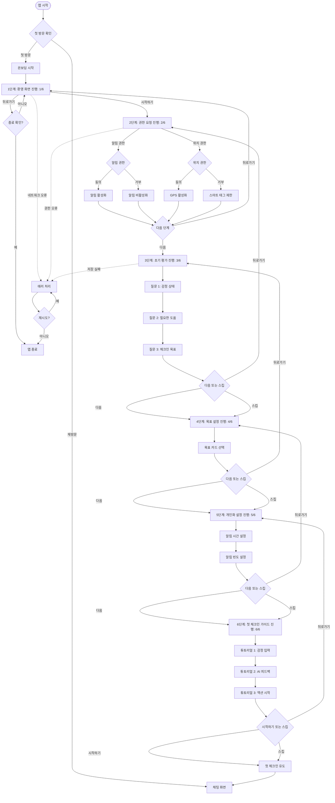

### 플로우 2: 대화형 일일 감정 체크인 (상세 플로우차트)

```mermaid
flowchart TD
    Start([진입점]) --> EntryPoint{진입 방식}
    EntryPoint -->|채팅 화면| ChatScreen[채팅 화면]
    EntryPoint -->|알림 클릭| NotificationClick[알림에서 진입]
    EntryPoint -->|위젯 탭| WidgetTap[위젯에서 진입]
    
    ChatScreen --> ModeCheck{현재 모드 확인}
    NotificationClick --> ModeCheck
    WidgetTap --> ModeCheck
    
    ModeCheck -->|"Day Mode 06:00-18:00"| DayMode[Day Mode 플로우]
    ModeCheck -->|"Night Mode 18:00-06:00"| NightMode[Night Mode 플로우]
    ModeCheck -->|수동 전환| ManualSwitch{모드 선택}
    ManualSwitch -->|Day| DayMode
    ManualSwitch -->|Night| NightMode
    
    DayMode --> DayGreeting["AI: 오늘 기분은 어때요"]
    DayGreeting --> EmotionSelect{감정 선택 방식}
    EmotionSelect -->|칩 선택| ChipSelect[5가지 감정 칩]
    EmotionSelect -->|자유 입력| FreeInput[자연어 입력]
    
    ChipSelect --> EmotionChosen[감정 선택 완료]
    FreeInput --> NLPProcess{자연어 처리}
    NLPProcess -->|성공| EmotionChosen
    NLPProcess -->|실패| EmotionRetry{재입력?}
    EmotionRetry -->|예| EmotionSelect
    EmotionRetry -->|아니오| Exit[종료]
    
    EmotionChosen --> IntensitySelect[강도 선택 1-10]
    IntensitySelect --> SmartTagCheck{스마트 태그 추천}
    SmartTagCheck -->|GPS/시간대 기반| TagRecommend[태그 추천 0-3개]
    SmartTagCheck -->|수동 입력| ManualTag[수동 태그 입력]
    
    TagRecommend --> TagSelected{태그 선택}
    ManualTag --> TagSelected
    TagSelected -->|0-3개 선택| MemoCheck{메모 입력?}
    TagSelected -->|스킵| MemoCheck
    
    MemoCheck -->|입력| MemoInput[한 줄 메모 최대 200자]
    MemoCheck -->|스킵| SaveProcess[저장 처리]
    MemoInput --> SaveProcess
    
    SaveProcess --> Validation{입력 검증}
    Validation -->|성공| FirestoreSave[Firestore 저장]
    Validation -->|실패| ValidationError[검증 오류 표시]
    ValidationError --> SaveProcess
    
    FirestoreSave --> SaveSuccess{저장 성공?}
    SaveSuccess -->|성공| ImmediateFeedback[즉시 피드백 P95 < 800ms]
    SaveSuccess -->|실패| SaveRetry{재시도?}
    SaveRetry -->|예 최대 3회| FirestoreSave
    SaveRetry -->|아니오| SaveError[저장 실패 알림]
    SaveError --> Exit
    
    ImmediateFeedback --> AsyncInsight[AI 인사이트 생성 비동기]
    AsyncInsight --> InsightCheck{인사이트 생성 완료?}
    InsightCheck -->|8초 이내| InsightSuccess[AI 피드백 표시]
    InsightCheck -->|타임아웃 8초| InsightTimeout[폴백 메시지 + 재시도]
    InsightCheck -->|실패| InsightFail[기본 메시지 + 재시도]
    
    InsightTimeout --> InsightRetry{재시도?}
    InsightFail --> InsightRetry
    InsightRetry -->|예| AsyncInsight
    InsightRetry -->|아니오| InsightSuccess
    
    InsightSuccess --> ActionRecommend[마이크로 액션 추천]
    ActionRecommend --> ActionCard[오늘의 1개 액션 카드]
    ActionCard --> ActionChoice{액션 선택}
    ActionChoice -->|완료| ActionComplete[액션 완료]
    ActionChoice -->|오늘은 패스| ActionSkip[액션 스킵]
    ActionChoice -->|내일로| ActionDefer[다음날 재제안]
    
    ActionComplete --> Recheck{5초 리체크?}
    Recheck -->|예| BeforeAfter[Before/After 표시]
    Recheck -->|아니오| MicroCoach
    ActionSkip --> MicroCoach{2턴 마이크로 코치?}
    ActionDefer --> MicroCoach
    
    MicroCoach -->|더 말해보기| CoachQ1[질문 1]
    CoachQ1 --> CoachA1[답변 1]
    CoachA1 --> CoachQ2[질문 2]
    CoachQ2 --> CoachA2[답변 2]
    CoachA2 --> CoachSummary[요약 1줄 생성]
    MicroCoach -->|스킵| GrowthReflect
    CoachSummary --> GrowthReflect[성장 반영]
    BeforeAfter --> GrowthReflect
    
    GrowthReflect --> XPGain[XP 획득]
    XPGain --> LevelCheck{레벨업?}
    LevelCheck -->|예| LevelUp[레벨업 축하]
    LevelCheck -->|아니오| BlossomUpdate
    LevelUp --> BlossomUpdate[벚꽃 정원 업데이트]
    BlossomUpdate --> Complete([완료])
    
    NightMode --> NightGreeting["AI: 오늘 하루를 정리해볼까요"]
    NightGreeting --> NightEmotionSelect[감정 선택]
    NightEmotionSelect --> NightIntensity[강도 선택]
    NightIntensity --> DaySummaryCheck{Day Mode 요약 있음?}
    DaySummaryCheck -->|예| AutoFill[Day Mode 요약 자동 인입]
    DaySummaryCheck -->|아니오| DiaryWrite
    AutoFill --> DiaryWrite[일기 작성 최대 500자]
    DiaryWrite --> NightSave[저장 처리]
    NightSave --> LetterGenerate[AI 편지 생성]
    LetterGenerate --> LetterShow[편지 표시]
    LetterShow --> UserReaction{사용자 반응}
    UserReaction -->|공감해요| NightComplete
    UserReaction -->|도움이 됐어요| NightComplete
    UserReaction -->|별로예요| FeedbackCollect[피드백 수집]
    FeedbackCollect --> NightComplete[저장 완료]
    NightComplete --> Complete
    
    FirestoreSave -.->|오프라인| OfflineMode[오프라인 모드]
    OfflineMode --> LocalSave[로컬 저장 IndexedDB]
    LocalSave --> SyncQueue[동기화 대기열]
    SyncQueue -->|온라인 복귀| AutoSync[자동 동기화]
    AutoSync --> FirestoreSave
    
    EmotionChosen -.->|위기 신호 감지| CrisisDetect[위기 감지]
    NightEmotionSelect -.->|위기 신호 감지| CrisisDetect
    CrisisDetect --> SafetyFlow[안전망 플로우로 전환]
```

**플로우 상세 명세**:
- **진입점**: 채팅 화면, 알림, 위젯
- **핵심 단계**: 감정 선택 → 강도 조절 → (선택) 스마트 태그 → 저장 → 피드백 → 액션
- **성공 경로**: 모든 필수 단계 완료, 선택 단계는 스킵 가능
- **에러 경로**: 네트워크 오류 → 재시도 로직, 저장 실패 → 사용자 알림
- **소요 시간**: 체크인 30초 + (선택) 액션 2~5분
- **구현 상태**: 미구현 (새로 개발 예정)

**옵션**: 폼 기반 체크인도 제공 (사용자 선택, `/chat/form-checkin`)

**첫 체크인 경험**:
- 첫 체크인 시 인터랙티브 튜토리얼 제공
- 단계별 가이드: 감정 선택 → 강도 조절 → 저장
- 완료 시 축하 메시지: "첫 체크인을 완료했어요! 🎉" + XP 획득 표시

**재방문 사용자 경험**:
- 재방문 시 간단한 환영 메시지 (선택적)
- 마지막 체크인 이후 경과 시간 표시 (예: "3일 만이에요")
- "이전 기록 보기" 링크 제공

### 플로우 3: 위기 상황 대응 (상세 플로우차트)

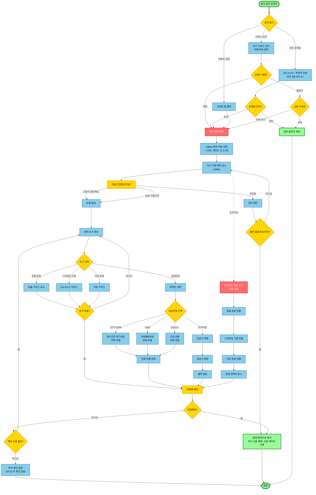

**플로우 상세 명세**:
- **우선순위**: 최고 (Highest)
- **응답 시간**: 위기 감지 → 도구 제공 시간 측정 및 추적
- **오프라인 지원**: 대처 도구는 번들에 포함되어 오프라인 접근 가능
- **안전 정책**: 의료행위 아님 고지, 공식 자원 안내

**우선순위**: 최고 (Highest)
**구현 상태**: 미구현 (새로 개발 예정)

### 위기 감지 알고리즘 상세 스펙

**감지 기준**:
1. 키워드 기반 감지
   - 자해 관련: "자해", "자상", "칼", "약물 과다복용", "목매기", "손목", "약 먹고 싶다" 등
   - 자살 관련: "죽고 싶다", "끝내고 싶다", "더 이상 못 살겠다", "생명을 끊고 싶다", "자살하고 싶다" 등
   - 임계값: 1개 이상 키워드 감지 시 위기 신호
   - 처리: 키워드 목록은 정기적으로 업데이트 (분기 1회)

2. 감정 강도 임계값
   - 부정적 감정 (불안, 슬픔, 분노) + 강도 9-10
   - 연속 3일 이상 부정적 감정 강도 8 이상
   - 임계값: 위 조건 중 1개 이상 충족 시 위기 신호

3. 패턴 기반 감지
   - 급격한 감정 변화 (강도 3 이하 → 9 이상, 1일 내)
   - 장기간 부정적 감정 지속 (7일 이상 강도 7 이상)
   - 감정 기록 중단 후 재개 시 급격한 변화 (3일 이상 기록 없음 → 강도 9 이상)

**오탐/미탐 처리 로직**:
- 오탐 처리: 사용자가 "안전함" 선택 시 위기 신호 해제, 해당 키워드/패턴에 가중치 감소
- 미탐 처리: 사용자가 수동으로 Safety 화면 접근 시 해당 감정 데이터에 위기 신호 플래그 추가
- 학습: 오탐/미탐 데이터를 수집하여 알고리즘 개선 (Phase 1)

**개입 프로토콜**:
1. 위기 신호 감지 시 즉시 Safety 화면으로 전환 (< 10초)
   - 전환 애니메이션: 페이드 인 (0.3초)
   - 컨텍스트 알림: "지금 도움이 필요하신가요?" 메시지 표시
2. "지금 안전하신가요?" 확인 질문 표시
   - 버튼: "안전해요" (초록색), "도움이 필요해요" (빨간색)
   - 응답 시간: 30초 이내 (타임아웃 시 자동으로 "도움이 필요해요"로 처리)
3. 안전함 선택 시: 일반 플로우로 복귀
   - 위기 신호 해제
   - 오탐 데이터 기록
4. 도움 필요 선택 시: 대처 도구 제안 → 상담전화 연결
   - 대처 도구 3개 제안 (호흡 운동, 그라운딩 기법, 이완 운동)
   - 도구 완료 후 안정화 확인 질문
   - 계속 도움 필요 시 상담전화 연결 옵션 제공

### 플로우 4: AI 페르소나 설정 (상세 플로우차트)

**기능 ID**: FEAT-012  
**우선순위**: P0 (Critical)

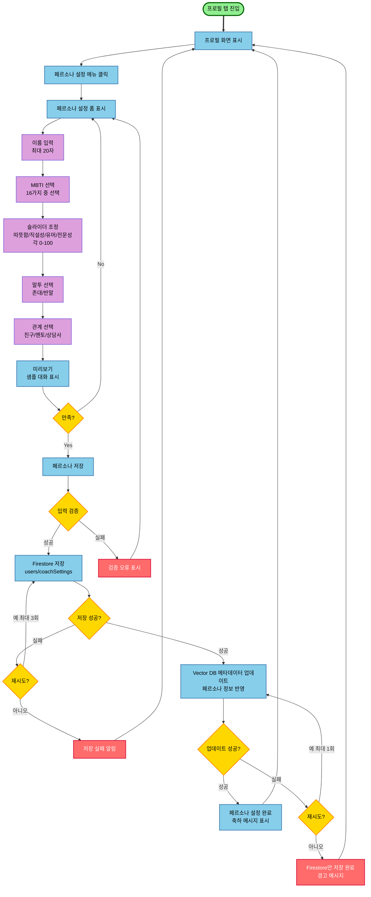

**플로우 상세 명세**:
- **우선순위**: P0 (Critical)
- **소요 시간**: 페르소나 설정 완료 시간 측정 및 추적
- **에러 처리**: Firestore 저장 실패 시 재시도 (최대 3회), Vector DB 업데이트 실패 시 부분 성공 처리
- **구현 상태**: 미구현 (새로 개발 예정)

### 플로우 5: 콘텐츠 매개 대화 (Bibliotherapy) 세션 (상세 플로우차트)

**기능 ID**: FEAT-013  
**우선순위**: P0 (Critical)

```mermaid
flowchart TD
    Start([콘텐츠 탭 진입]):::startEnd
    ContentTab[콘텐츠 탭 화면]:::process
    
    Start ==> ContentTab
    
    ContentTab --> EmotionAnalysis[현재 감정 상태 분석<br/>최근 체크인 데이터]:::process
    EmotionAnalysis --> VectorSearch[Vector DB 검색<br/>감정 기반 콘텐츠 검색]:::process
    
    VectorSearch --> SearchSuccess{검색 성공?}:::decision
    SearchSuccess -->|성공| ContentRanking[콘텐츠 랭킹<br/>감정 관련성 + 선호도]:::process
    SearchSuccess -->|실패| FallbackContent[기본 콘텐츠 목록<br/>인기 콘텐츠]:::error
    
    ContentRanking --> ContentList[콘텐츠 목록 표시<br/>3-5개 추천]:::inputOutput
    FallbackContent --> ContentList
    
    ContentList --> ContentSelect{콘텐츠 선택}:::decision
    ContentSelect -->|Yes| ContentView[콘텐츠 표시<br/>시/명상/음악/명언]:::process
    ContentSelect -->|No| End([종료]):::startEnd
    
    ContentView --> ContentRead{콘텐츠 읽음?}:::decision
    ContentRead -->|Yes| ReadLog[열람 로그 저장<br/>Firestore contentLogs]:::process
    ContentRead -->|No| End
    
    ReadLog --> AIReaction[AI 페르소나 반응<br/>콘텐츠에 대한 감상]:::process
    AIReaction --> Bibliotherapy{대화 이어가기?}:::decision
    
    Bibliotherapy -->|Yes| SessionStart[Bibliotherapy 세션 시작]:::process
    Bibliotherapy -->|No| End
    
    SessionStart --> AIQuestion[AI: 이 시가 어떤 느낌이야?<br/>또는 콘텐츠 관련 질문]:::process
    AIQuestion --> UserResponse[사용자 응답 입력]:::inputOutput
    
    UserResponse --> AIInsight[AI 인사이트 생성<br/>Gemini API 호출]:::process
    AIInsight --> InsightSuccess{인사이트 생성 성공?}:::decision
    
    InsightSuccess -->|성공| InsightDisplay[AI 인사이트 표시]:::inputOutput
    InsightSuccess -->|실패| FallbackInsight[기본 응답 메시지]:::error
    FallbackInsight --> InsightDisplay
    
    InsightDisplay --> ContinueChat{대화 계속?}:::decision
    ContinueChat -->|Yes 최대 5턴| AIQuestion
    ContinueChat -->|No| SessionEnd[세션 종료<br/>요약 1줄 생성]:::process
    
    SessionEnd --> SummarySave[세션 요약 저장<br/>Firestore bibliotherapySessions]:::process
    SummarySave --> Complete([완료]):::startEnd
    
    End --> Complete
    
    %% 에러 처리
    VectorSearch -.->|네트워크 오류| NetworkError[네트워크 오류 처리]:::error
    AIInsight -.->|타임아웃| TimeoutError[타임아웃 처리<br/>폴백 메시지]:::error
    NetworkError --> FallbackContent
    TimeoutError --> FallbackInsight
    
    classDef startEnd fill:#90EE90,stroke:#006400,stroke-width:3px,color:#000
    classDef process fill:#87CEEB,stroke:#4682B4,stroke-width:2px,color:#000
    classDef decision fill:#FFD700,stroke:#FF8C00,stroke-width:2px,color:#000
    classDef inputOutput fill:#DDA0DD,stroke:#9370DB,stroke-width:2px,color:#000
    classDef error fill:#FF6B6B,stroke:#DC143C,stroke-width:2px,color:#fff
    classDef idealFlow fill:#98FB98,stroke:#228B22,stroke-width:3px,color:#000
```

**플로우 상세 명세**:
- **우선순위**: P0 (Critical)
- **소요 시간**: 콘텐츠 선택 → 세션 종료 시간 측정 및 추적
- **에러 처리**: Vector DB 검색 실패 시 기본 콘텐츠 제공, AI 인사이트 생성 실패 시 폴백 메시지
- **구현 상태**: 미구현 (새로 개발 예정)

### 플로우 6: 기록 타임라인 조회 (상세 플로우차트)

**기능 ID**: FEAT-005, FEAT-006  
**우선순위**: P1 (High)

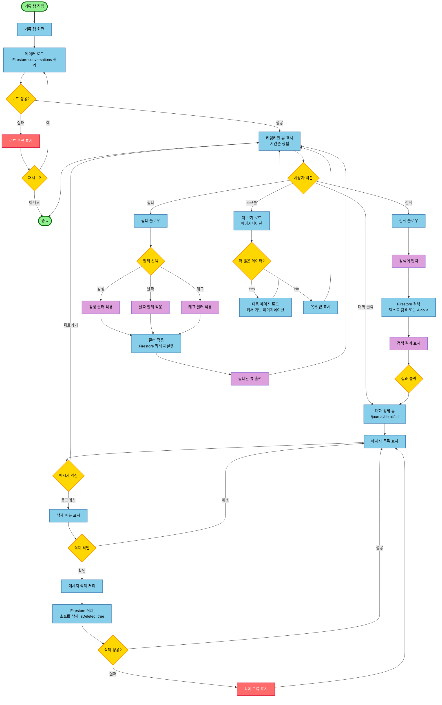

**플로우 상세 명세**:
- **우선순위**: P1 (High)
- **소요 시간**: 타임라인 로딩 시간, 검색 결과 표시 시간 측정 및 추적
- **에러 처리**: 데이터 로드 실패 시 재시도, 검색 실패 시 오류 메시지 표시
- **구현 상태**: 미구현 (새로 개발 예정)

### 플로우 7: 대화 저장/삭제 관리 (상세 플로우차트)

**기능 ID**: FEAT-017  
**우선순위**: P0 (Critical)

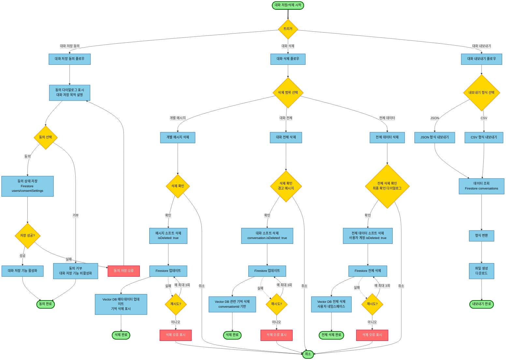

**플로우 상세 명세**:
- **우선순위**: P0 (Critical)
- **소요 시간**: 동의 완료 시간, 삭제 처리 시간 측정 및 추적
- **에러 처리**: Firestore 삭제 실패 시 재시도 (최대 3회), Vector DB 삭제 실패 시 부분 성공 처리
- **구현 상태**: 미구현 (새로 개발 예정)

## 2.5 태스크 플로우 (기획/디자인)

### 태스크 1: 감정 체크인 완료하기

**목표**: 사용자가 오늘의 감정을 기록하고 AI 인사이트를 받는다

**단계별 태스크**
1. 홈 화면 접근
2. "지금 이 순간, 당신의 마음은?" 질문 확인
3. 5가지 감정 중 하나 선택 (기쁨, 평온, 불안, 슬픔, 분노)
4. 선택한 감정의 강도 조절 (1-10)
5. (선택) 간단한 메모 작성
6. (선택) 상황 태그 0~3개 선택(예: work/meeting, sleep 등)
7. "기록하기" 버튼 클릭
8. 저장 성공 피드백(즉시) 확인
9. 오늘의 한 줄 피드백 확인(권장: 8초 이내, 타임아웃 10초 후 폴백/재시도 제공)
10. 오늘의 마이크로 액션 1개 제안 확인
11. (선택) “더 말해보기” 2턴 마이크로 코치 진행(요약 1줄) **[미식별요인]**
12. (선택) 액션 수행 후 완료/패스/내일로 선택
13. 누적 XP/성장 반영 확인
14. 완료

**성공 기준**
- 체크인 완료 시간 P95 측정 및 추적 **[미식별요인]**
- (선택) 액션 완료까지의 전체 시간 측정 및 추적 **[미식별요인]**
- 사용자 만족도 측정 및 추적
- 에러 발생률 측정 및 추적

**구현 상태**: 미구현 (새로 개발 예정, 모든 단계)

### 태스크 2: 주간 리포트 확인하기

**목표**: 사용자가 지난 주 감정 패턴을 확인하고 인사이트를 얻는다

**단계별 태스크**
1. 인사이트 탭 접근
2. "주간 리포트" 카드 확인
3. 리포트 생성 대기 (처음 접근 시)
4. 감정 분포 차트 확인
5. 패턴 분석 결과 읽기
6. 성장 제안 확인
7. "다음 주 실험 1개" 제안 확인
8. (선택) 실험 선택 및 알림/추적 설정

**성공 기준**
- 리포트 조회(이미 생성된 경우) 시간 측정 및 추적
- 온디맨드 생성 요청 완료 시간 측정 **[미식별요인]**
- 데이터 정확도 측정
- 사용자 이해도 측정

**현재 구현**: 미구현 (새로 개발 예정)

### 태스크 3: 위기 상황 대처하기

**목표**: 사용자가 위기 상황에서 즉시 도움을 받는다

**단계별 태스크**
1. 위기 상황 감지 (자동 또는 수동)
2. 안전망 화면 자동 표시
3. 대처 도구 선택
4. 호흡 운동/그라운딩 기법 실행
5. (필요 시) 핫라인 연결
6. 상황 안정화 확인

**성공 기준**
- 위기 감지 → 도구 제공 시간 측정 및 추적
- 사용자 만족도 측정 및 추적
- 재발 방지율 측정 및 추적

**현재 구현**: 미구현 (새로 개발 예정)

### 플로우 8: 리포트 생성 및 조회 (상세 플로우차트)

**기능 ID**: FEAT-007  
**우선순위**: P1 (High)

```mermaid
flowchart TD
    Start([리포트 탭 진입]):::startEnd
    ReportTab[리포트 탭 화면]:::process
    
    Start ==> ReportTab
    
    ReportTab --> ReportType{리포트 타입 선택}:::decision
    ReportType -->|주간| WeeklyFlow[주간 리포트 플로우]:::process
    ReportType -->|월간| MonthlyFlow[월간 리포트 플로우]:::process
    
    %% 주간 리포트 플로우
    WeeklyFlow --> CheckWeekly{주간 리포트 존재?}:::decision
    CheckWeekly -->|Yes| LoadWeekly[주간 리포트 로드<br/>Firestore weeklyReports]:::process
    CheckWeekly -->|No| GenerateWeekly[주간 리포트 생성]:::process
    
    LoadWeekly --> WeeklyView[주간 리포트 뷰 표시]:::process
    WeeklyView --> WeeklyCharts[차트 데이터 출력<br/>감정 분포, 추이]:::inputOutput
    WeeklyCharts --> WeeklySummary[요약 텍스트 출력<br/>패턴 분석]:::inputOutput
    WeeklySummary --> ExperimentCard[다음 주 실험 카드 출력]:::inputOutput
    ExperimentCard --> ExperimentSelect{실험 선택?}:::decision
    ExperimentSelect -->|Yes| ExperimentSave[실험 저장<br/>Firestore experiments]:::process
    ExperimentSelect -->|No| CompleteWeekly([완료]):::startEnd
    ExperimentSave --> CompleteWeekly
    
    GenerateWeekly --> BigQueryQuery[BigQuery 집계 쿼리<br/>최근 7일 데이터]:::process
    BigQueryQuery --> QuerySuccess{쿼리 성공?}:::decision
    QuerySuccess -->|성공| DataProcess[데이터 처리<br/>감정 분포, 패턴 분석]:::process
    QuerySuccess -->|실패| QueryRetry{재시도?}:::decision
    QueryRetry -->|예 최대 2회| BigQueryQuery
    QueryRetry -->|아니오| QueryError[쿼리 오류 표시]:::error
    QueryError --> CompleteWeekly
    
    DataProcess --> GeminiNarrative{Gemini 내러티브 생성?}:::decision
    GeminiNarrative -->|Yes| NarrativeGen[내러티브 생성<br/>Gemini API 호출]:::process
    GeminiNarrative -->|No| ReportData[리포트 데이터 출력]:::inputOutput
    
    NarrativeGen --> NarrativeSuccess{생성 성공?}:::decision
    NarrativeSuccess -->|성공| ReportData
    NarrativeSuccess -->|실패| NarrativeRetry{재시도?}:::decision
    NarrativeRetry -->|예 최대 1회| NarrativeGen
    NarrativeRetry -->|아니오| FallbackNarrative[기본 내러티브 사용]:::error
    FallbackNarrative --> ReportData
    
    ReportData --> FirestoreSave[Firestore 저장<br/>weeklyReports 컬렉션]:::process
    FirestoreSave --> SaveSuccess{저장 성공?}:::decision
    SaveSuccess -->|성공| WeeklyView
    SaveSuccess -->|실패| GenerateError[생성 오류 표시]:::error
    GenerateError --> RetryGenerate{재시도?}:::decision
    RetryGenerate -->|예| GenerateWeekly
    RetryGenerate -->|아니오| CompleteWeekly
    
    %% 월간 리포트 플로우
    MonthlyFlow --> CheckMonthly{월간 리포트 존재?}:::decision
    CheckMonthly -->|Yes| LoadMonthly[월간 리포트 로드<br/>Firestore monthlyReports]:::process
    CheckMonthly -->|No| GenerateMonthly[월간 리포트 생성]:::process
    
    LoadMonthly --> MonthlyView[월간 리포트 뷰 표시]:::process
    MonthlyView --> RetroModal{회고록 모달?}:::decision
    RetroModal -->|Yes| RetroModalShow[서사적 회고록 모달 표시]:::process
    RetroModal -->|No| MonthlyCharts[차트 데이터 출력]:::inputOutput
    
    RetroModalShow --> RetroRead{회고록 읽기}:::decision
    RetroRead --> RetroClose{닫기}:::decision
    RetroClose --> MonthlyCharts
    
    MonthlyCharts --> MonthlySummary[월간 요약 출력]:::inputOutput
    MonthlySummary --> ActionPlan[다음 달 액션 플랜 출력]:::inputOutput
    ActionPlan --> CompleteMonthly([완료]):::startEnd
    
    GenerateMonthly --> BigQueryMonthly[BigQuery 월간 집계<br/>최근 30일 데이터]:::process
    BigQueryMonthly --> MonthlyDataProcess[월간 데이터 처리<br/>감정 여정, 패턴 분석]:::process
    MonthlyDataProcess --> RetroGenerate[회고록 생성<br/>Gemini API 서사적 회고록]:::process
    
    RetroGenerate --> RetroSuccess{생성 성공?}:::decision
    RetroSuccess -->|성공| MonthlyReportData[월간 리포트 데이터 출력]:::inputOutput
    RetroSuccess -->|실패| RetroRetry{재시도?}:::decision
    RetroRetry -->|예 최대 1회| RetroGenerate
    RetroRetry -->|아니오| FallbackRetro[기본 회고록 사용]:::error
    FallbackRetro --> MonthlyReportData
    
    MonthlyReportData --> FirestoreSaveMonthly[Firestore 저장<br/>monthlyReports 컬렉션]:::process
    FirestoreSaveMonthly --> MonthlyView
    
    CompleteWeekly --> End([종료]):::startEnd
    CompleteMonthly --> End
    
    classDef startEnd fill:#90EE90,stroke:#006400,stroke-width:3px,color:#000
    classDef process fill:#87CEEB,stroke:#4682B4,stroke-width:2px,color:#000
    classDef decision fill:#FFD700,stroke:#FF8C00,stroke-width:2px,color:#000
    classDef inputOutput fill:#DDA0DD,stroke:#9370DB,stroke-width:2px,color:#000
    classDef error fill:#FF6B6B,stroke:#DC143C,stroke-width:2px,color:#fff
    classDef idealFlow fill:#98FB98,stroke:#228B22,stroke-width:3px,color:#000
```

**플로우 상세 명세**:
- **우선순위**: P1 (High)
- **소요 시간**: 리포트 조회 시간, 온디맨드 생성 시간 측정 및 추적
- **에러 처리**: BigQuery 쿼리 실패 시 재시도 (최대 2회), Gemini API 실패 시 폴백 내러티브 사용
- **구현 상태**: 미구현 (새로 개발 예정)

### 플로우 9: RAG 기반 기억 시스템 (상세 플로우차트)

**기능 ID**: FEAT-003 (일부), FEAT-012 (일부)  
**우선순위**: P0 (Critical)

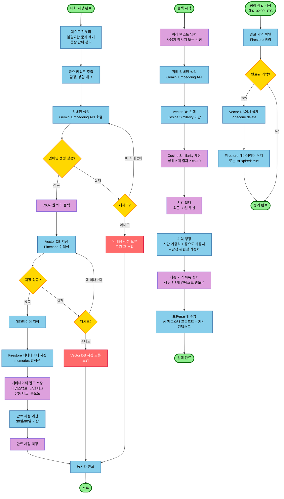

**플로우 상세 명세**:
- **우선순위**: P0 (Critical)
- **소요 시간**: 기억 저장 시간, 검색 시간 (P95 < 500ms) 측정 및 추적
- **에러 처리**: 임베딩 생성 실패 시 재시도 (최대 2회), Vector DB 저장 실패 시 로깅 후 스킵
- **구현 상태**: 미구현 (새로 개발 예정)

## 2.6 상태 머신 다이어그램

### 상태 머신 1: 체크인 상태 머신

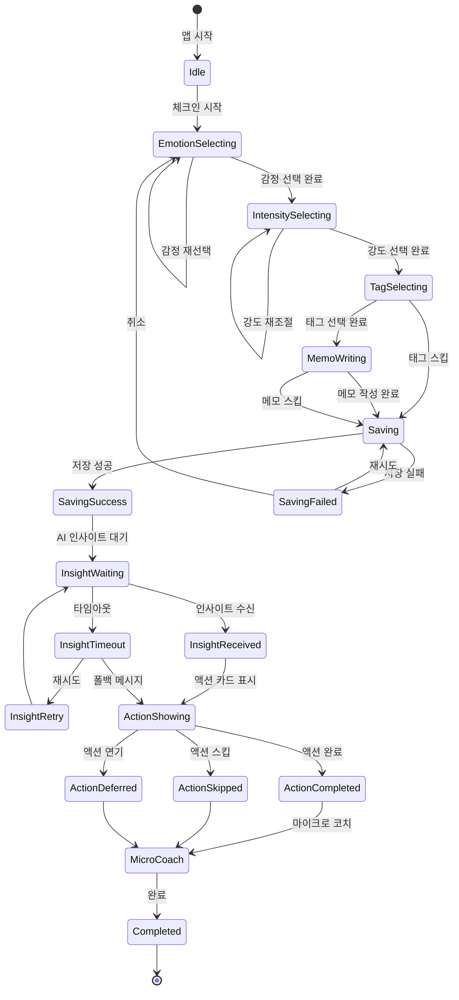

### 상태 머신 2: 온보딩 상태 머신

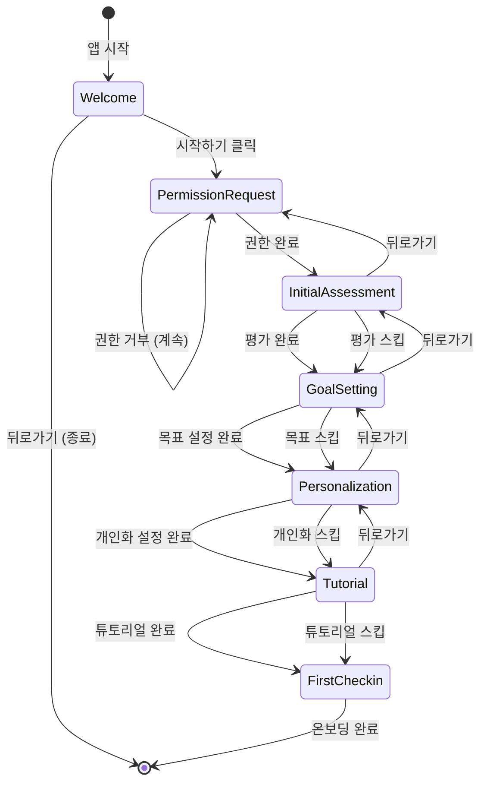

### 상태 머신 3: 위기 감지 상태 머신

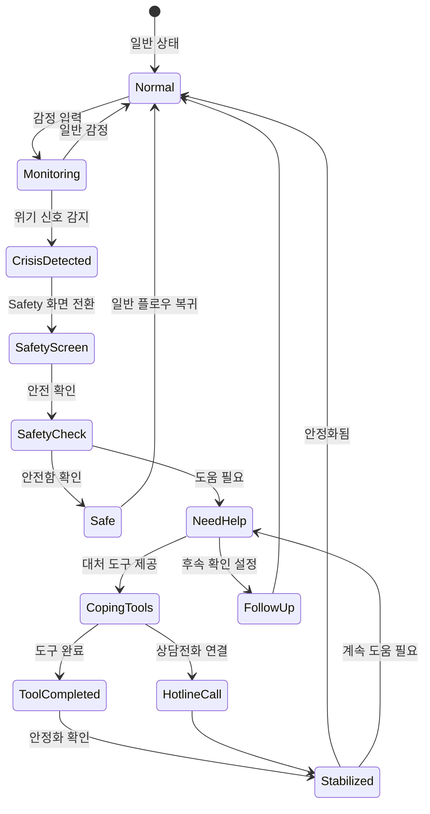

## 2.7 데이터 흐름 다이어그램

### 전체 데이터 흐름 다이어그램

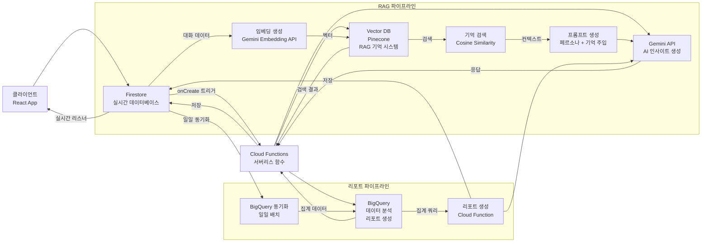

### RAG 파이프라인 상세 플로우

```mermaid
flowchart TD
    Start([대화 저장]) --> TextPreprocess[텍스트 전처리]
    TextPreprocess --> EmbeddingAPI[Gemini Embedding API<br/>768차원 벡터 생성]
    EmbeddingAPI --> Vector768[768차원 벡터 출력]
    Vector768 --> PineconeSave[Pinecone 저장<br/>인덱싱 자동 생성]
    PineconeSave --> MetadataCreate[메타데이터 생성]
    MetadataCreate --> FirestoreMeta[Firestore 메타데이터 저장<br/>memories 컬렉션]
    
    subgraph 검색_플로우["검색 플로우"]
        SearchStart([검색 요청]) --> QueryText[쿼리 텍스트<br/>사용자 메시지]
        QueryText --> QueryEmbedding[쿼리 임베딩 생성<br/>Gemini Embedding API]
        QueryEmbedding --> PineconeQuery[Pinecone 검색<br/>유사도 기반]
        PineconeQuery --> CosineSim[Cosine Similarity 계산<br/>상위 K개 결과]
        CosineSim --> TopK[상위 K개 결과<br/>K=5-10]
        TopK --> Ranking[랭킹 알고리즘<br/>시간/중요도/감정 가중치]
        Ranking --> TimeWeight[시간 가중치<br/>최근 30일 우선]
        TimeWeight --> ImportanceWeight[중요도 가중치<br/>사용자 지정 중요도]
        ImportanceWeight --> EmotionWeight[감정 관련성 가중치<br/>현재 감정과 매칭]
        EmotionWeight --> FinalRanking[최종 랭킹 점수]
        FinalRanking --> ContextWindow[컨텍스트 윈도우 구성<br/>상위 3-5개]
        ContextWindow --> PromptInject[프롬프트에 주입<br/>AI 페르소나 프롬프트]
    end
    
    FirestoreMeta --> SearchStart
    PromptInject --> GeminiCall[Gemini API 호출<br/>대화 생성]
    GeminiCall --> Response[AI 응답 출력<br/>기억 활용 대화]
```

**구현 상태**: 미구현 (새로 개발 예정)

## 2.8 스크린-기능-기술 명세 매칭표 (신규 추가)

### 전체 매칭 개요

| 화면 (Screen) | 경로 (Route) | 주요 기능 (Features) | 기능 ID (FEAT) | FRD ID | 컴포넌트 (Components) | 기술 스택 |
|--------------|-------------|-------------------|--------------|--------|---------------------|----------|
| 채팅 메인 | `/chat` | 대화형 체크인, AI 피드백, 마이크로 액션 | FEAT-001, FEAT-003, FEAT-009 | FRD-001, FRD-002, FRD-004 | ChatInterface, ChatMessage, QuickChip, MicroActionCard, DayNightModeToggle | React, Firestore, Gemini API |
| 기록 타임라인 | `/journal` | 대화 조회, 검색, 필터 | FEAT-005, FEAT-006 | FRD-003 | JournalTimeline, ConversationCard, SearchBar | React, Firestore |
| 감정 여정 시각화 | `/journal/journey` | Sankey Flow, Year in Pixels | FEAT-015 | FRD-012 | JourneyView, SankeyChart, YearInPixels | React, Recharts |
| 실시간 모니터 | `/reports/monitor` | 실시간 감정 모니터링 | FEAT-016 | - | MonitorDashboard, RealTimeChart | React, Firestore, Recharts |
| 리포트 주간 | `/reports/weekly` | 패턴 분석, 차트, 다음 주 실험 | FEAT-007 | FRD-006 | WeeklyReport, MonthlyReport, ChartContainer, ExperimentCard, RetrospectiveCard | React, BigQuery, Recharts |
| 안전망 메인 | `/safety` | 위기 감지, 대처 도구, 연락처 | FEAT-008 | - | SafetyMain, CrisisCard, EmergencyContacts | React, Firestore |
| 프로필 메인 | `/profile` | 사용자 정보, 벚꽃 정원, 설정 | FEAT-004, FEAT-010, FEAT-012 | FRD-005, FRD-008 | ProfileMain, BlossomGarden, SettingsMenu, PersonaSetup, PersonaEditor | React, Firestore |
| 온보딩 | `/onboarding` | 환영, 권한 요청, 초기 설정 | FEAT-011 | - | OnboardingFlow, PermissionRequest, InitialSetup | React, Firebase Auth |
| 대화 관리 | `/profile/conversations` | 대화 목록, 삭제, 내보내기 | FEAT-017 | FRD-007 | ConversationList, DeleteDialog, ExportDialog | React, Firestore |
| 콘텐츠 몰입 | `/content/immersion` | 감각적 몰입, 사회적 연대 | FEAT-014 | - | ImmersionView, CommunityView, VoicePlayer | React, TTS API |

### 화면별 상세 매칭

#### 1. 채팅 메인 화면 (`/chat`)

**와이어프레임**: 2.4.1 채팅 화면 (메인 홈)

**주요 기능**:
1. 대화형 감정 체크인 (FEAT-001, FRD-001)
   - 컴포넌트: `ChatInterface.tsx`, `EmotionSelector.tsx`, `IntensitySlider.tsx`, `SmartContextTag.tsx`, `DayNightModeToggle.tsx`
   - 기술: Firestore 실시간 저장, GPS API (위치 권한), 시간대 기반 추천 로직
   - 측정: 체크인 완료 시간 (P95)

2. AI 인사이트 생성 (FEAT-003, FRD-002)
   - 컴포넌트: `InsightCard.tsx`, `LoadingSpinner.tsx`
   - 기술: Cloud Functions, Gemini API (서버 사이드)
   - 측정: 인사이트 표시 시간 (P95), 만족도

3. 마이크로 액션 제안 (FEAT-009, FRD-004)
   - 컴포넌트: `MicroActionCard.tsx`, `ActionFeedback.tsx`
   - 기술: SignatureMove 우선순위 계산, Before/After 피드백
   - 측정: 액션 노출률, 실행률

4. 실시간 동기화 (FEAT-002)
   - 컴포넌트: `useRealtime.ts` (Hook)
   - 기술: Firestore onSnapshot 리스너
   - 측정: 지연 시간, 재연결 시간

**기술 명세**:
- 상태 관리: ChatContext (전역), 로컬 상태 (입력 필드)
- 데이터 흐름: 사용자 입력 → Firestore 저장 → Cloud Function 트리거 → Gemini API → Firestore 저장 → 실시간 리스너 → UI 업데이트
- 에러 처리: 네트워크 오류 재시도 (최대 3회), 타임아웃 폴백 메시지

#### 2. 기록 타임라인 화면 (`/journal`)

**와이어프레임**: 2.4.2 기록 화면 (대화 타임라인)

**주요 기능**:
1. 대화 타임라인 조회 (FEAT-006, FRD-003)
   - 컴포넌트: `JournalTimeline.tsx`, `ConversationCard.tsx`, `DateDivider.tsx`
   - 기술: Firestore 쿼리 (시간순 정렬, 페이지네이션)
   - 측정: 로딩 시간, 오프라인 읽기 지원

2. 검색 기능 (FEAT-006, FRD-003)
   - 컴포넌트: `SearchBar.tsx`, `SearchResults.tsx`
   - 기술: Firestore 텍스트 검색 (Cloud Functions 또는 Algolia)
   - 측정: 검색 결과 표시 시간

3. 필터링 (FEAT-006, FRD-003)
   - 컴포넌트: `EmotionFilter.tsx`, `ContextTagFilter.tsx`
   - 기술: Firestore 쿼리 필터
   - 목표: 필터 적용 즉시 반영

**기술 명세**:
- 상태 관리: 로컬 상태 (필터, 검색어)
- 데이터 흐름: Firestore 쿼리 → 페이지네이션 → 무한 스크롤
- 최적화: 가상화 (react-window) 대량 데이터 처리

#### 3. 리포트 주간 화면 (`/reports/weekly`)

**와이어프레임**: 2.4.3 리포트 화면 (주간 리포트)

**주요 기능**:
1. 리포트 생성/조회 (FEAT-007, FRD-006)
   - 컴포넌트: `WeeklyReport.tsx`, `MonthlyReport.tsx`, `ReportSummary.tsx`, `ChartContainer.tsx`, `RetrospectiveCard.tsx`
   - 기술: BigQuery 배치 분석, Cloud Functions 스케줄러
   - 측정: 리포트 조회 시간, 온디맨드 생성 시간

2. 차트 시각화 (FEAT-007, FRD-006)
   - 컴포넌트: `EmotionDistributionChart.tsx`, `EmotionTrendChart.tsx`, `HeatmapChart.tsx`
   - 기술: Recharts 라이브러리
   - 측정: 차트 렌더링 시간, 반응형 지원

3. 다음 주 실험 제안 (FEAT-007, FRD-006)
   - 컴포넌트: `ExperimentCard.tsx`, `ExperimentSelector.tsx`
   - 기술: BigQuery 패턴 분석 결과 기반 추천
   - 측정: 실험 선택률

**기술 명세**:
- 상태 관리: 로컬 상태 (리포트 데이터, 선택된 실험)
- 데이터 흐름: BigQuery 집계 → Cloud Function 리포트 생성 → Firestore 저장 → 클라이언트 조회
- 트리거/회복 분석: Gemini API로 패턴 해석 (배치)

#### 4. 안전망 메인 화면 (`/safety`)

**와이어프레임**: 2.4.4 안전망 화면

**주요 기능**:
1. 위기 감지 (FEAT-008)
   - 컴포넌트: `CrisisDetector.tsx`, `SafetyAlert.tsx`
   - 기술: 키워드 기반 감지, 감정 강도 임계값
   - 측정: 위기 감지 → 도구 제공 시간

2. 대처 도구 제공 (FEAT-008)
   - 컴포넌트: `CopingTools.tsx`, `BreathingExercise.tsx`, `GroundingTechnique.tsx`
   - 기술: 로컬 컴포넌트 (오프라인 지원)
   - 측정: 오프라인 접근 가능 여부

3. 응급 연락처 (FEAT-008)
   - 컴포넌트: `EmergencyContacts.tsx`
   - 기술: 전화 연결 API (tel: 링크)
   - 측정: 연결 시도 성공률

**기술 명세**:
- 상태 관리: 로컬 상태 (위기 감지 상태)
- 데이터 흐름: 감정 데이터 분석 → 위기 신호 감지 → Safety 화면 자동 전환
- 오프라인 지원: 대처 도구는 번들에 포함

#### 5. 프로필 메인 화면 (`/profile`)

**와이어프레임**: 2.4.5 프로필 화면

**주요 기능**:
1. 사용자 정보 표시 (FEAT-004)
   - 컴포넌트: `ProfileHeader.tsx`, `UserAvatar.tsx`
   - 기술: Firestore UserProfile 조회
   - 측정: 프로필 로딩 시간

2. 벚꽃 정원 시각화 (FEAT-004)
   - 컴포넌트: `BlossomGarden.tsx`, `GrowthVisualization.tsx`
   - 기술: Canvas 또는 SVG 렌더링, Framer Motion 애니메이션
   - 측정: 시각화 렌더링 시간

3. 설정 메뉴 (FEAT-010, FRD-005)
   - 컴포넌트: `SettingsMenu.tsx`, `NotificationSettings.tsx`, `PrivacySettings.tsx`
   - 기술: Firestore 설정 저장
   - 목표: 설정 저장 즉시 반영

4. AI 페르소나 설정 (FEAT-012, FRD-008)
   - 컴포넌트: `PersonaSetup.tsx`, `PersonaEditor.tsx`
   - 기술: Firestore CoachPersona 저장, Vector DB 연동
   - 측정: 페르소나 설정 완료율, 기억 활용률

**기술 명세**:
- 상태 관리: 로컬 상태 (프로필 데이터, 설정)
- 데이터 흐름: Firestore 조회 → 로컬 캐싱 → UI 업데이트

#### 6. 온보딩 화면 (`/onboarding`)

**와이어프레임**: 2.4.6 온보딩 화면 (1단계: 환영)

**주요 기능**:
1. 환영 화면 (FEAT-011)
   - 컴포넌트: `WelcomeScreen.tsx`, `OnboardingIllustration.tsx`
   - 기술: 정적 콘텐츠, 로컬 상태, Framer Motion 애니메이션
   - 측정: 화면 전환 애니메이션 부드러움, 첫 화면 로딩 시간

2. 권한 요청 (FEAT-011)
   - 컴포넌트: `PermissionRequest.tsx`, `LocationPermissionDialog.tsx`
   - 기술: 브라우저 Permission API, Firebase Auth
   - 측정: 권한 요청 성공률 (알림, 위치)

3. 초기 설정 (FEAT-011)
   - 컴포넌트: `InitialAssessment.tsx`, `GoalSetting.tsx`, `PersonalizationSetup.tsx`
   - 기술: Firestore 초기 프로필 생성, 로컬 상태 관리
   - 측정: 온보딩 완료율, 소요 시간

**기술 명세**:
- 상태 관리: OnboardingContext (전역), 단계별 로컬 상태
- 데이터 흐름: 사용자 입력 → Firestore 프로필 생성 → 다음 단계 진행
- 애니메이션: Framer Motion 페이지 전환, 버튼 클릭 피드백

#### 7. 동의 다이얼로그 (모달)

**와이어프레임**: 2.4.7 동의 다이얼로그 (모달)

**주요 기능**:
1. 대화 저장 동의 (FEAT-017, FRD-007)
   - 컴포넌트: `ConsentDialog.tsx`, `ConsentCheckbox.tsx`, `ConsentDetailLink.tsx`
   - 기술: Firestore ConsentLog 저장, 모달 오버레이
   - 측정: 동의 UI 표시 → 동의 완료 시간, 동의율

**기술 명세**:
- 상태 관리: 로컬 상태 (동의 체크박스, 모달 열림/닫힘)
- 데이터 흐름: 동의 체크 → ConsentLog 저장 → 대화 저장 활성화
- 접근성: 포커스 트랩, 키보드 네비게이션 (Tab, Enter, Esc)

### 와이어프레임별 컴포넌트 매칭 상세표

| 와이어프레임 ID | 화면명 | 경로 | 주요 컴포넌트 | 기능 ID | FRD ID | 기술 스택 |
|---------------|--------|------|-------------|---------|--------|----------|
| 2.4.1 | 채팅 메인 | `/chat` | ChatInterface, ChatMessage, QuickChip, EmotionSelector, IntensitySlider, SmartContextTag, MicroActionCard, InsightCard, DayNightModeToggle | FEAT-001, FEAT-002, FEAT-003, FEAT-009 | FRD-001, FRD-002, FRD-004 | React, Firestore, Gemini API, GPS API |
| 2.4.2 | 기록 타임라인 | `/journal` | JournalTimeline, ConversationCard, DateDivider, SearchBar, EmotionFilter | FEAT-005, FEAT-006 | FRD-003 | React, Firestore |
| 2.4.8 | 감정 여정 시각화 | `/journal/journey` | JourneyView, SankeyChart, YearInPixels, TimelineView | FEAT-015 | FRD-012 | React, Recharts |
| 2.4.9 | 실시간 모니터 | `/reports/monitor` | MonitorDashboard, RealTimeChart, AlertPanel | FEAT-016 | - | React, Firestore, Recharts |
| 2.4.3 | 리포트 주간 | `/reports/weekly` | WeeklyReport, MonthlyReport, ReportSummary, ChartContainer, EmotionDistributionChart, EmotionTrendChart, ExperimentCard, RetrospectiveCard | FEAT-007 | FRD-006 | React, BigQuery, Recharts |
| 2.4.4 | 안전망 메인 | `/safety` | SafetyMain, CrisisCard, EmergencyContacts, CopingTools, BreathingExercise | FEAT-008 | - | React, Firestore |
| 2.4.5 | 프로필 메인 | `/profile` | ProfileMain, ProfileHeader, UserAvatar, BlossomGarden, SettingsMenu, NotificationSettings, PersonaSetup, PersonaEditor | FEAT-004, FEAT-010, FEAT-012 | FRD-005, FRD-008 | React, Firestore |
| 2.4.6 | 온보딩 | `/onboarding` | OnboardingFlow, WelcomeScreen, PermissionRequest, LocationPermissionDialog, InitialAssessment, GoalSetting | FEAT-011 | - | React, Firebase Auth, Permission API |
| 2.4.7 | 동의 다이얼로그 | 모달 | ConsentDialog, ConsentCheckbox, ConsentDetailLink | FEAT-017 | FRD-007 | React, Firestore |

### 기능별 요구 목표 상세표 (보완)

| 기능 ID | 기능명 | 핵심 목표 | 측정 지표 | 목표값 | 측정 방법 | FRD ID |
|--------|--------|----------|----------|--------|----------|--------|
| FEAT-001 | 대화형 감정 체크인 | 체크인 완료 시간 최소화 | 체크인 완료 시간 (P95) | P95 < 45초 | 클라이언트 측정 → Firestore `emotions.metadata.duration` | FRD-001 |
| FEAT-001 | 스마트 상황 태그 | 태그 추천 정확도 | GPS 기반 추천 정확도 | 측정 및 추적 | 사용자가 추천 태그 선택 비율 | FRD-001 |
| FEAT-002 | 실시간 동기화 | 지연 시간 최소화 | 지연 시간, 재연결 시간 | 측정 및 추적 | Firestore 리스너 이벤트 타임스탬프 | - |
| FEAT-003 | AI 인사이트 생성 | 인사이트 품질 및 속도 | 생성 시간 (P95), 만족도 | 측정 및 추적 | Cloud Function 로그, 사용자 설문 | FRD-002 |
| FEAT-003 | 트리거/회복 분석 | 패턴 분석 정확도 | 트리거 감지 정확도 | 측정 및 추적 | 사용자 피드백 (맞다/틀렸다) | FRD-002 |
| FEAT-004 | 게이미피케이션 | 사용자 참여 유도 | 리텐션 (7일/30일) | 40% / 25% 이상 | Firebase Analytics | - |
| FEAT-005 | 기록 관리 | 기록 조회 성능 | 로딩 시간 | < 2초 | 클라이언트 측정 | FRD-003 |
| FEAT-006 | 기록 조회/검색 | 검색 성능 | 검색 결과 표시 시간 | < 1초 | 클라이언트 측정 | FRD-003 |
| FEAT-007 | 주간/월간 리포트 | 리포트 생성/조회 성능 | 리포트 조회, 생성 시간 | < 2초, < 60초 | BigQuery 쿼리 로그, 클라이언트 측정 | FRD-006 |
| FEAT-007 | 트리거/회복 분석 | 리포트 분석 품질 | 리포트 만족도 | 측정 및 추적 | 사용자 설문 | FRD-006 |
| FEAT-008 | 안전망 시스템 | 위기 대응 속도 | 위기 감지 → 도구 제공 시간 | < 10초 | 클라이언트 측정 | - |
| FEAT-009 | 마이크로 액션 | 액션 실행률 | 노출률, 실행률, 완료율 | 100%, 40%, 30% 이상 | Firestore `actionLogs` 집계 | FRD-004 |
| FEAT-009 | Before/After 피드백 | 피드백 참여율 | 리체크 참여율 | 20% 이상 | ActionLog `intensityAfter` 존재 비율 | FRD-004 |
| FEAT-009 | SignatureMove | 필살기 발견률 | SignatureMove 생성률 | 10% 이상 (사용자당) | SignatureMove 생성 수 / 총 사용자 수 | FRD-004 |
| FEAT-010 | 리마인드 설정 | 알림 차단율 최소화 | 알림 차단율/수신거부율 | < 20% | Firebase Cloud Messaging 통계 | FRD-005 |
| FEAT-010 | 예측 넛지 | 예측 넛지 효과 | 예측 넛지 클릭률 | 15% 이상 | 알림 클릭 → 체크인 완료 비율 | FRD-005 |
| FEAT-011 | 온보딩 | 온보딩 완료율 | 온보딩 완료 수 / 온보딩 시작 수 | 측정 및 추적 | Firestore UserProfile | - |
| FEAT-017 | 대화 저장/삭제 | 동의 완료 시간 | 동의 UI → 동의 완료 시간 | 측정 및 추적 | 클라이언트 측정 | FRD-007 |
| FEAT-017 | 대화 저장/삭제 | 동의율 | 첫 대화 시작 시 동의율 | 측정 및 추적 | ConsentLog 집계 | FRD-007 |

---

# 3부: 개발 및 기능 명세

## 3.1 기술 스택

### 프론트엔드
- **프레임워크**: React 19.x
- **빌드 도구**: Vite 5.x
- **언어**: TypeScript 5.x
- **스타일링**: Tailwind CSS 4.x (또는 CSS Modules)
- **상태 관리**: Zustand
  - 선택 근거:
    - 가벼움 (번들 크기 작음)
    - TypeScript 지원 우수
    - 학습 곡선 낮음
    - React 19 호환성
- **라우팅**: React Router v6
- **애니메이션**: Framer Motion 11.x
- **아이콘**: Lucide React 0.536.0
- **차트**: Recharts 3.1.1

**참고**: 기존 코드베이스는 폐기되었으며, 새로 개발 예정

### 백엔드 및 인프라
- **플랫폼**: Google Cloud Platform (GCP)
  - **프로젝트명**: INEESm
  - **프로젝트 ID**: Iiness-mlog
- **Firebase 서비스**:
  - Firestore: 실시간 데이터베이스
  - Cloud Functions: 서버리스 함수 (Node.js)
  - Firebase Storage: 파일 저장소
  - Firebase Authentication: 사용자 인증
  - Firebase Hosting: 정적 호스팅
- **AI**: Gemini API (키 기반, Gemini 3.0 Pro Preview)
  - 주요 AI 에이전트로 사용
  - RAG(검색 증강 생성) 활용[^부록-B-2]
  - 감정 분석 및 인사이트 생성
  - 자연어 처리 및 쿼리 응답
  - AI 페르소나 기반 대화 생성
- **벡터 데이터베이스**: Pinecone 또는 Weaviate[^부록-B-1]
  - RAG 기반 기억 시스템 구현
  - 과거 대화 맥락 검색 및 활용
  - 감정-콘텐츠 매칭
- **데이터 분석**: Google BigQuery
  - 대용량 감정 데이터 분석
  - 패턴 분석 및 리포트 생성
  - 데이터 웨어하우스 역할

**참고**: Firebase 프로젝트 ID는 GCP 프로젝트 ID와 동일 (Iiness-mlog)

### 개발 도구
- **빌드 도구**: Vite 5.x
- **패키지 관리**: npm / pnpm
- **린터**: ESLint 9
- **포맷터**: Prettier
- **타입 체크**: TypeScript
- **버전 관리**: Git

### 프로젝트 구조 (예정)

```
iiness-mlog/
├── src/
│   ├── components/          # React 컴포넌트
│   │   ├── chat/
│   │   │   ├── ChatInterface.tsx
│   │   │   ├── ChatMessage.tsx
│   │   │   └── QuickChip.tsx
│   │   ├── checkin/
│   │   │   ├── EmotionSelector.tsx
│   │   │   └── IntensitySlider.tsx
│   │   ├── actions/
│   │   │   └── MicroActionCard.tsx
│   │   ├── reports/
│   │   │   └── ReportChart.tsx
│   │   ├── common/
│   │   │   ├── EmptyState.tsx
│   │   │   ├── LoadingSpinner.tsx
│   │   │   ├── ErrorMessage.tsx
│   │   │   └── Toast.tsx
│   │   └── ...
│   ├── hooks/               # Custom React Hooks
│   │   ├── useRealtime.ts
│   │   ├── useChat.ts
│   │   └── ...
│   ├── contexts/            # React Context
│   │   ├── AuthContext.tsx
│   │   ├── ChatContext.tsx
│   │   └── ...
│   ├── services/            # API 서비스 레이어
│   │   ├── firebase.ts
│   │   ├── gemini.ts
│   │   ├── bigquery.ts      # BigQuery 클라이언트 (선택적)
│   │   └── ...
│   ├── types/               # TypeScript 타입 정의
│   │   ├── emotion.ts
│   │   ├── chat.ts
│   │   └── ...
│   ├── utils/               # 유틸리티 함수
│   │   ├── accessibility.ts
│   │   └── ...
│   ├── styles/              # 스타일 파일
│   │   ├── design-tokens.css
│   │   └── ...
│   ├── App.tsx              # 메인 App 컴포넌트
│   ├── main.tsx             # 진입점
│   └── index.css            # 전역 스타일
├── functions/                # Firebase Cloud Functions
│   ├── src/
│   │   ├── index.ts         # Functions 진입점
│   │   ├── api/
│   │   │   ├── query.ts     # Gemini 인사이트 생성/자연어 처리 (Firestore 컨텍스트)
│   │   │   └── ...
│   │   ├── triggers/
│   │   │   └── emotionCheckin.ts
│   │   └── bigquery/
│   │       └── sync.ts      # Firestore → BigQuery 동기화
│   └── package.json
├── public/                   # 정적 파일
├── firebase.json             # Firebase 설정
├── firestore.rules           # Firestore 보안 규칙
├── firestore.indexes.json    # Firestore 인덱스
├── vite.config.ts            # Vite 설정
├── tsconfig.json             # TypeScript 설정
├── package.json
└── README.md
```

### 개발 환경 설정 (예정)

**필수 사전 준비**:
1. GCP 프로젝트 생성 (INEESm / Iiness-mlog)
2. Firebase 프로젝트 초기화
3. Gemini API 키 발급
4. Node.js 18+ 설치

**초기 설정 명령어** (예정):
```bash
# 프로젝트 초기화
npm create vite@latest . -- --template react-ts

# 의존성 설치
npm install firebase framer-motion lucide-react recharts
npm install -D @types/node

# Firebase 초기화
firebase init
```

## 3.2 요구 기능 명세

### 기능 명세 개요

**총 기능 수**: 17개 (FEAT-001 ~ FEAT-017)

**우선순위 분류**:
- P0 (Critical): 9개 (FEAT-001, FEAT-002, FEAT-003, FEAT-011, FEAT-012, FEAT-013, FEAT-015, FEAT-016, FEAT-017)
- P1 (High): 6개 (FEAT-004, FEAT-005, FEAT-006, FEAT-007, FEAT-009, FEAT-014)
- P2 (Medium): 2개 (FEAT-008, FEAT-010)

**기능 카테고리**:
- 핵심 기능: 체크인(Day/Night Mode), AI 페르소나 기반 대화, 콘텐츠 큐레이션, 감정 여정 시각화, 실시간 모니터
- AI 페르소나: AI 페르소나 설정 (RAG 기반 기억)
- 데이터 관리: 실시간 동기화, 기록 관리, 리포트, 월간 회고록
- 사용자 관리: 인증, 리마인드, 대화 저장/삭제
- 안전망: 위기 감지 및 대응

### 기능별 요구 목표 통합표

| 기능 ID | 기능명 | 우선순위 | 핵심 목표 | 측정 지표 | 목표값 | FRD ID |
|--------|--------|---------|----------|----------|--------|--------|
| FEAT-001 | 대화형 감정 체크인 + Day/Night Mode | P0 | 체크인 완료 시간 최소화 | 체크인 완료 시간 (P95) | 측정 및 추적 | FRD-001 |
| FEAT-002 | 실시간 데이터 동기화 | P0 | 지연 시간 최소화 | 지연 시간, 재연결 시간 | 측정 및 추적 | - |
| FEAT-003 | AI 페르소나 기반 대화 | P0 | 대화 품질 및 속도 | 생성 시간 (P95), 만족도 | 측정 및 추적 | FRD-002 |
| FEAT-004 | 게이미피케이션 | P1 | 사용자 참여 유도 | 리텐션 (7일/30일) | 측정 및 추적 | - |
| FEAT-005 | 기록 관리 | P1 | 기록 조회 성능 | 로딩 시간 | 측정 및 추적 | FRD-003 |
| FEAT-006 | 기록 조회/검색 | P1 | 검색 성능 | 검색 결과 표시 시간 | 측정 및 추적 | FRD-003 |
| FEAT-007 | 주간/월간 리포트 + 월간 회고록 | P1 | 리포트 생성/조회 성능 | 리포트 조회, 생성 시간 | 측정 및 추적 | FRD-006 |
| FEAT-008 | 안전망 시스템 | P2 | 위기 대응 속도 | 위기 감지 → 도구 제공 시간 | 측정 및 추적 | - |
| FEAT-009 | 마이크로 액션 | P1 | 액션 실행률 | 노출률, 실행률, 완료율, Before/After 참여율 | 측정 및 추적 | FRD-004 |
| FEAT-010 | 리마인드 설정 | P2 | 알림 차단율 최소화 | 알림 차단율/수신거부율, 예측 넛지 클릭률 | 측정 및 추적 | FRD-005 |
| FEAT-011 | 온보딩 | P0 | 온보딩 완료율 | 온보딩 완료 수 / 온보딩 시작 수 | 측정 및 추적 | - |
| FEAT-017 | 대화 저장/삭제 | P0 | 동의 완료 시간 및 동의율 | 동의 UI → 동의 완료 시간, 동의율 | 측정 및 추적 | FRD-007 |
| FEAT-012 | AI 페르소나 설정 (RAG 기반 기억) | P0 | 페르소나 설정 완료율 | 설정 완료율, 기억 활용률 | 측정 및 추적 | FRD-008 |
| FEAT-013 | 콘텐츠 매개 대화 (Bibliotherapy) | P0 | 콘텐츠 열람률 | 콘텐츠 노출률, 열람률 | 측정 및 추적 | FRD-010 |
| FEAT-014 | 감각적 몰입 및 사회적 연대 | P1 | 몰입 경험 만족도 | 만족도 | 측정 및 추적 | - |
| FEAT-015 | 감정 여정 시각화 (Sankey Flow) | P0 | 시각화 조회율 | 조회율, 만족도 | 측정 및 추적 | FRD-012 |
| FEAT-016 | 실시간 모니터 (Youper 스타일) | P0 | 모니터 조회율 | 조회율, 만족도 | 측정 및 추적 | - |

## 3.2 요구 기능 명세

### 기능 1: 대화형 감정 체크인 시스템 + Day/Night Mode (메인) + 폼 기반 체크인 (옵션)

**기능 ID**: FEAT-001

**우선순위**: P0 (Critical)

**설명**: 사용자가 대화형 인터페이스로 감정을 선택하고 강도를 기록하는 핵심 기능. Day Mode(빠른 체크인)와 Night Mode(깊은 성찰)를 지원하며, 폼 기반 체크인도 옵션으로 제공합니다.[^부록-E-1]

**V5.0 피봇 반영**: Day/Night Mode 이중 속도 커뮤니케이션 통합

**입력 (Day Mode - 빠른 체크인)**
- 모드 선택: Day Mode 자동 활성화 (오전 6시 ~ 오후 6시) 또는 수동 선택
- 대화 시작: "오늘 하루, 지금 기분은?" (Woebot 스타일)
- 감정 타입: 기쁨, 평온, 불안, 슬픔, 분노 중 선택 (칩 또는 자유 입력)
- 강도: 1-10 정수 (슬라이더)
- 상황 파악: 1~2개 후속 질문 (예: "어떤 상황에서 불안했어?")
- **(추천, 스킵 가능) 스마트 상황 태그**: GPS/시간대 기반 자동 추천, 사용자가 0~3개 선택 또는 스킵
- 타임스탬프: 자동 생성
- GPS 위치: (명시적 동의 시) 위도/경도, 역지오코딩 주소, 장소 타입(home/work/other)

**입력 (Night Mode - 깊은 성찰)**
- 모드 선택: Night Mode 자동 활성화 (오후 6시 ~ 오전 6시) 또는 수동 선택
- 대화 시작: "오늘 하루를 한 번 정리해볼까요?" (답다 스타일)
- 감정 타입: 기쁨, 평온, 불안, 슬픔, 분노 중 선택
- 강도: 1-10 정수 (슬라이더)
- 일기 작성: 최대 500자 자유 텍스트 (Day Mode 요약 자동 인입)
- 타임스탬프: 자동 생성

**입력 (폼 기반, 옵션)**
- 감정 타입: 기쁨, 평온, 불안, 슬픔, 분노 중 선택
- 강도: 1-10 정수
- 메모: 최대 200자 텍스트 (선택사항)
- 상황 태그: 0~3개 선택 (선택사항)

**처리 (Day Mode)**
1. 사용자 입력 검증
2. 모드 정보 저장 (`modeAtTime: 'day'`)
3. 대화 메시지 저장 (ChatMessage, Conversation 생성)
4. 감정 데이터 저장 (EmotionData, 대화와 연결)
5. Firestore에 저장
6. (비동기) Cloud Function 트리거 → Gemini API 분석 요청 (Day Mode 프롬프트 사용)
7. 즉시 응답 생성 (P95 < 3초, 빠르고 실용적인 톤)
8. 선택적 콘텐츠 제안 (시 1~2줄, 명상 가이드)
9. Firestore 실시간 리스너로 UI 업데이트

**처리 (Night Mode)**
1. 사용자 입력 검증
2. 모드 정보 저장 (`modeAtTime: 'night'`)
3. 일기 데이터 저장 (DiaryData)
4. Day Mode 요약 자동 인입 (해당 날짜의 Day Mode 기록 요약)
5. 대화 메시지 저장 (ChatMessage, Conversation 생성)
6. 감정 데이터 저장 (EmotionData, 대화와 연결)
7. Firestore에 저장
8. (비동기) Cloud Function 트리거 → Gemini API 분석 요청 (Night Mode 프롬프트 사용, RAG 기반 기억 활용)
9. AI 편지 생성 (따뜻한 편지 형식, 300자 정도)
10. 편지 저장 및 알림 (MVP: 즉시, Phase 1: 시차 30분~2시간)
11. Firestore 실시간 리스너로 UI 업데이트

**주의(분석 파이프라인 분리)**:
- BigQuery는 **주간/월간 리포트 배치 분석 전용**이며, 감정 체크인/인사이트 생성의 실시간 경로에 포함하지 않음

**출력 (Day Mode)**
- 저장 성공 여부 (즉시, P95 < 800ms)
- 즉시 응답 (AI 페르소나 기반, 빠르고 실용적인 톤, P95 < 3초, 타임아웃 8초)
  - 공감 (첫 문장)
  - 가벼운 인사이트 (2~3문장)
  - 행동 가능한 제안
- 선택적 콘텐츠 제안 (시 1~2줄, 명상 가이드)
- "저장하기" / "밤에 더 자세히" 옵션
- 획득한 XP 및 성장 반영

**출력 (Night Mode)**
- 저장 성공 여부 (즉시, P95 < 800ms)
- AI 편지 생성 (P95 < 8초, 타임아웃 10초, MVP: 즉시, Phase 1: 시차 30분~2시간)
  - 오프닝: 오늘을 함께했다는 공감 (1문장)
  - 반영: 구체적 순간들 명시 (2~3문장)
  - 통찰: 따뜻한 해석 (2~3문장)
  - 격려: 내일을 위한 응원 (1~2문장)
- 반응 버튼 ("공감해요" / "도움이 됐어요")
- 자동 저장 (일기 + 편지)
- 다음날 아침 월간 회고록에 반영

**성능 요구사항**
- 감정 저장/피드백: P95 측정 및 추적
- AI 인사이트 표시: P95 측정 및 추적 (타임아웃 시 폴백/재시도)
- 가용성: 99.9%

**채팅 인터페이스 상세 스펙**:

**메시지 버블**:
- 사용자 메시지: 우측 정렬, 브랜드 컬러 배경 (#FF6B9D 또는 정의된 컬러), 흰색 텍스트
- AI 메시지: 좌측 정렬, 회색 배경 (#F5F5F5), 검은색 텍스트
- 시스템 메시지: 중앙 정렬, 투명 배경, 회색 텍스트 (#999)

**입력 필드**:
- 위치: 화면 하단 고정
- 높이: 최소 56px (키보드 대응)
- 패딩: 좌우 16px, 상하 12px
- 플레이스홀더: "메시지를 입력하세요..." (14px, 회색)
- 전송 버튼: 입력 필드 우측 (입력 시 활성화, 브랜드 컬러)

**메시지 전송 애니메이션**:
- 전송 버튼 클릭 시: 페이드 아웃 (0.2s) → 새 메시지 페이드 인 (0.3s)
- 전송 중: 스피너 표시 (전송 버튼 위치)

**타이핑 인디케이터**:
- AI 응답 생성 중: "AI가 입력 중..." + 점 애니메이션 (3개 점, 순차 페이드)
- 위치: 메시지 영역 하단, AI 메시지 스타일

**메시지 시간 표시**:
- 형식: "오전 9:30" 또는 "1시간 전" (상대 시간)
- 위치: 메시지 버블 하단 (호버 시 표시, 모바일은 항상 표시)
- 폰트: 12px, 회색 (#999)

**에러 처리**:
- 네트워크 오류: "인터넷 연결을 확인해주세요" + "다시 시도" 버튼
- 서버 오류: "일시적인 문제가 발생했어요. 잠시 후 다시 시도해주세요" + "다시 시도" 버튼
- 오프라인 모드: "오프라인 모드로 전환" (읽기 전용)

**구현 상태**: 미구현 (새로 개발 예정)
- [ ] 프로젝트 초기 설정 (Vite + React + TypeScript)
- [ ] 채팅 인터페이스 컴포넌트 (`ChatInterface.tsx`)
- [ ] 채팅 메시지 컴포넌트 (`ChatMessage.tsx`)
- [ ] 퀵칩 컴포넌트 (`QuickChip.tsx`)
- [ ] 감정 선택 UI 컴포넌트 (대화형 + 폼 기반)
- [ ] 강도 조절 UI 컴포넌트 (슬라이더 + 질문형)
- [ ] 메모 입력 UI 컴포넌트
- [ ] Firestore 저장 로직 (ChatMessage, Conversation, EmotionData)
- [ ] Cloud Function 트리거(감정 체크인 onCreate)
- [ ] Gemini API 통합(키는 서버에서만 사용)
- [ ] AI 분석 및 인사이트 저장/표시(로딩/폴백 포함)
- [ ] 로딩 상태 UI (스켈레톤, 스피너)
- [ ] 에러 처리 UI (토스트, 다이얼로그)

**참고**: 기존 코드베이스는 폐기되었으며, 새로 개발 예정
**구현 예정 파일 구조**:
- `src/components/chat/ChatInterface.tsx`
- `src/components/chat/ChatMessage.tsx`
- `src/components/chat/QuickChip.tsx`
- `src/components/checkin/EmotionSelector.tsx`
- `src/components/checkin/IntensitySlider.tsx`
- `src/components/checkin/GalleryEmotionCheckin.tsx` (폼 기반 옵션)
- `src/components/common/EmptyState.tsx`
- `src/components/common/LoadingSpinner.tsx`
- `src/components/common/ErrorMessage.tsx`
- `src/hooks/useRealtime.ts`
- `src/hooks/useChat.ts`

**기능 요구사항 상세**:

**입력 검증**:
- 감정 타입: 필수, 5가지 중 선택
- 강도: 필수, 1-10 정수
- 메모: 선택, 최대 200자
- 상황 태그: 선택, 0~3개

**저장 로직**:
1. 사용자 입력 검증 (클라이언트)
2. 대화 메시지 생성 (ChatMessage)
3. 대화 스레드 생성/업데이트 (Conversation)
4. 감정 데이터 저장 (EmotionData)
5. Firestore 저장 (트랜잭션)
6. Cloud Function 트리거 (onCreate)
7. 실시간 UI 업데이트 (Firestore 리스너)

**에러 처리**:
- 네트워크 오류: 재시도 로직 (최대 3회)
- 저장 실패: 사용자 알림 + 재시도 버튼
- 타임아웃: 5초 초과 시 사용자 알림

**성능 최적화**:
- 로컬 캐싱: 최근 감정 데이터 캐싱
- 배치 저장: 여러 입력 한 번에 저장 (선택적)
- 오프라인 지원: 로컬 저장 후 동기화

### 기능 2: 실시간 데이터 동기화

**기능 ID**: FEAT-002

**우선순위**: P0 (Critical)

**설명**: Firestore 실시간 리스너를 통한 데이터 동기화

**입력**
- Firestore 컬렉션 변경 이벤트
- 사용자 ID

**처리**
1. Firestore 실시간 리스너 구독
2. 데이터 변경 감지
3. 타입 검증
4. 로컬 상태 업데이트
5. UI 리렌더링

**출력**
- 업데이트된 감정 목록
- 최신 인사이트
- 연결 상태

**성능 요구사항**
- 지연 시간: < 100ms
- 재연결 시간: < 5초

**구현 상태**: 미구현 (새로 개발 예정)

**기능 요구사항 상세**:

**리스너 구독**:
- 컬렉션: `emotions`, `insights`, `conversations`
- 쿼리: `where('userId', '==', currentUserId)`
- 정렬: `orderBy('timestamp', 'desc')`
- 제한: 최대 50개 (페이지네이션)

**데이터 변경 감지**:
- 추가: 새 문서 생성 시 UI 업데이트
- 수정: 문서 업데이트 시 UI 업데이트
- 삭제: 문서 삭제 시 UI 업데이트 (소프트 삭제 포함)

**타입 검증**:
- TypeScript 타입 정의 사용
- 런타임 검증 (Zod 또는 Yup)

**UI 업데이트**:
- React 상태 관리: Zustand
- 최적화: 불필요한 리렌더링 방지 (React.memo)

**에러 처리**:
- 리스너 오류: 재연결 로직
- 권한 오류: 사용자 알림 + 재인증 유도

- [ ] `useRealtime` 훅 설계/구현 (Firestore onSnapshot 기반)
- [ ] 타입 검증(런타임) 및 스키마 가드
- [ ] 재연결/오프라인 전환 UX
- [ ] 에러 표준화 및 사용자 메시지 정책
- [ ] 에러 처리 및 재연결 로직

**참고**: 기존 코드베이스는 폐기되었으며, 새로 개발 예정
**구현 예정 파일**: `src/hooks/useRealtime.ts`

### 기능 3: AI 페르소나 기반 대화

**기능 ID**: FEAT-003

**우선순위**: P0 (Critical)

**설명**: 사용자가 설정한 AI 페르소나와의 대화를 통해 감정을 정리하고, RAG 기반 기억 시스템으로 "나를 아는" 대화를 구현합니다.[^부록-C-1]

**V5.0 피봇 반영**: AI 인사이트 생성 → AI 페르소나 기반 대화로 확장

**입력**
- 사용자 감정 기록 히스토리
- 현재 감정 데이터
- AI 페르소나 설정 (CoachPersona)
- RAG 기반 기억 컨텍스트 (과거 대화 맥락, 최근 30일)
- Day/Night Mode 정보

**처리**
1. AI 페르소나 설정 조회 (Firestore `users/{userId}/coachSettings`)
2. RAG 기반 기억 검색 (Vector DB, 현재 대화 컨텍스트 기반)
3. 기억 컨텍스트 윈도우 구성 (상위 3-5개 기억, 최근 30일 이내)
4. AI 시스템 프롬프트 생성 (페르소나 주입 + 기억 컨텍스트 + Day/Night Mode)
5. Gemini API 호출 (페르소나 기반 대화 생성)
6. 응답 검증 및 저장
7. Firestore에 저장 (ChatMessage, 기억 메타데이터)

**출력**
- AI 페르소나 기반 대화 응답
  - Day Mode: 빠르고 실용적인 톤 (3~5턴, 5분 이내)
  - Night Mode: 따뜻하고 감정적인 톤 (편지 형식)
- RAG 기반 기억 활용 ("지난주에 회의 때문에 불안했던 거 기억해?")
- 개인화된 인사이트 및 추천
- 신뢰도 점수 (선택적)

**성능 요구사항**
- 생성 시간: P95 < 8s (타임아웃: 10s, 이후 폴백 메시지)
- 품질 측정: 만족도(설문) 측정 및 추적

**구현 상태**: 미구현 (새로 개발 예정)

**기능 요구사항 상세**:

**인사이트 생성 플로우**:
1. 감정 데이터 저장 완료 (Firestore)
2. Cloud Function 트리거 (onCreate)
3. 사용자 최근 감정 히스토리 조회 (30일, 최대 50개)
4. Gemini API 호출 (프롬프트 생성)
5. 인사이트 파싱 및 검증
6. Firestore 저장 (`insights` 컬렉션)
7. 클라이언트 실시간 리스너로 수신
8. UI 업데이트 (로딩 → 인사이트 표시)

**RAG 기반 기억 시스템 활용**:
1. 현재 대화 컨텍스트를 임베딩으로 변환
2. Vector DB에서 유사도 기반 검색 (Cosine Similarity)
3. 상위 K개 기억 선택 (K=5~10, 유사도 임계값 0.7 이상)
4. 시간 가중치 적용 (최근 기억 우선)
5. 중요도 가중치 적용 (사용자 표시 중요 이벤트)
6. 최종 랭킹 점수 계산
7. 상위 3-5개 기억을 컨텍스트 윈도우로 구성

**AI 시스템 프롬프트 구조** (페르소나 주입):
```
당신은 정신건강 자가관리 코치입니다. 사용자의 감정 데이터를 분석하여 가벼운 인사이트를 제공하세요.

[주의사항]
- 의료적 진단/처방 금지
- 위기 신호 감지 시 safety 플래그 설정
- 친근하고 이해하기 쉬운 언어 사용

[사용자 감정 데이터]
- 최근 감정: [emotion, intensity, timestamp]
- 패턴: [pattern analysis]

[출력 형식]
{
  "summary": "1-2문장 요약",
  "patterns": ["패턴 1", "패턴 2"],
  "recommendations": ["추천 1", "추천 2"],
  "confidence": 0.85,
  "safety": "none|warning|crisis"
}
```

**에러 처리**:
- API 타임아웃: 10초 초과 시 폴백 메시지
- API 오류: 재시도 (최대 1회) + 폴백 메시지
- 파싱 오류: 기본 인사이트 제공

**캐싱 전략**:
- 동일 감정/강도 조합: 캐시된 인사이트 재사용 (24시간)
- 사용자별 캐시: 최근 10개 인사이트 캐싱

- [ ] Cloud Functions 구조 설계/구현
- [ ] Gemini API 통합(키 기반, 서버 사이드 호출)
- [ ] 타임아웃/재시도/폴백/레이트리밋 정책
- [ ] 안전/위기 문구 정책(자해/자살/위기 대응) 및 로깅/차단 규칙
- [ ] 에러 처리 및 폴백 로직
- [ ] 캐싱 전략 구현

**구현 예정 파일 구조**:
- `functions/src/index.ts`: Cloud Functions 진입점
- `functions/src/realtime.ts`: 실시간 이벤트 처리
- `functions/src/gemini.ts`: Gemini AI 통합 모듈

### 기능 4: 게이미피케이션 시스템

**기능 ID**: FEAT-004

**우선순위**: P1 (High)

**설명**: XP 시스템 및 레벨업으로 사용자 참여 유도

**입력**
- 감정 체크인 완료
- 일기 작성 완료
- 연속 기록 일수

**처리**
1. 액션별 XP 계산
2. 사용자 XP 업데이트
3. 레벨업 체크
4. 벚꽃 정원 상태 업데이트

**출력**
- 획득한 XP
- 현재 레벨
- 벚꽃 성장 상태

**구현 상태**: 미구현 (새로 개발 예정)
- [ ] XP 규칙(행동별 XP 테이블) 확정 및 구현
- [ ] 레벨업 규칙(레벨-경험치 곡선) 확정 및 구현
- [ ] 벚꽃 정원(성장 시각화) UI/데이터 모델 설계 및 구현

**참고 파일**:
**참고**: 기존 코드베이스는 폐기되었으며, 새로 개발 예정
**구현 예정 파일**: `src/contexts/AuthContext.tsx`

### 기능 5: 감정 기록 갤러리

**기능 ID**: FEAT-005

**우선순위**: P1 (High)

**설명**: 기록된 감정을 갤러리 형태로 시각화

**입력**
- 사용자 감정 기록 목록
- 필터 옵션
- 정렬 옵션

**처리**
1. 감정 기록 조회
2. 갤러리 아이템 변환
3. 필터링 적용
4. 그리드 레이아웃 렌더링

**출력**
- 갤러리 그리드 뷰
- 개별 감정 카드

**구현 상태**: 미구현 (새로 개발 예정)
- [ ] GalleryGrid 컴포넌트 구현
- [ ] 감정 → 갤러리 아이템 변환 로직
- [ ] 필터링 기능 구현

**참고**: 기존 코드베이스는 폐기되었으며, 새로 개발 예정
**구현 예정 파일**: `src/components/GalleryGrid.tsx`

### 기능 6: 사용자 인증

**기능 ID**: FEAT-006

**우선순위**: P0 (Critical)

**설명**: Firebase Authentication을 통한 사용자 인증

**입력**
- 이메일/비밀번호 또는 소셜 로그인

**처리**
1. Firebase Auth 인증
2. 사용자 프로필 생성/업데이트
3. 세션 관리

**출력**
- 인증 토큰
- 사용자 프로필

**구현 상태**: 미구현 (새로 개발 예정)
- [ ] Firebase Authentication 설정
- [ ] 이메일/비밀번호 로그인
- [ ] 소셜 로그인 (Google, Apple 등)
- [ ] 게스트 모드
- [ ] 비밀번호 재설정

**참고 파일**:
**참고**: 기존 코드베이스는 폐기되었으며, 새로 개발 예정
**구현 예정 파일**: `src/contexts/AuthContext.tsx`

### 기능 7: 주간/월간 리포트 + 월간 회고록 (BigQuery 배치)

**기능 ID**: FEAT-007

**우선순위**: P1 (High)

**설명**: 사용자의 주간/월간 감정 데이터를 집계/시각화하고, 핵심 패턴과 제안을 제공하는 리포트 기능. 월간 회고록은 선공감 후분석 UX로 감정 여정을 따뜻한 서사로 재구성합니다.[^부록-C-2]

**입력**
- 사용자 ID (Auth Token 기반)
- 주간 기간 (예: weekStart, weekEnd)
- 타임존 (기본: Asia/Seoul) **[미식별요인]**

**처리**
1. BigQuery에서 해당 주 기간 집계 쿼리 실행 (감정 분포, 평균 강도, 시간대 패턴 등)
2. 리포트 데이터 모델로 변환(차트용 시계열/카테고리)
3. (선택) Gemini API로 “요약/관찰/추천” 내러티브 생성
4. Firestore에 주간 리포트 문서 저장
5. “다음 주 실험 1개” 제안 포함(선택/추적 가능) **[미식별요인]**

**출력 (주간 리포트)**
- 주간 요약(문장)
- 감정 분포/강도 통계(차트 데이터)
- 추천(행동 제안)
- 다음 주 실험(1개) 제안(선택)

**출력 (월간 리포트)**
- 월간 요약(문장)
- 추이 그래프 데이터(주차별/일자별)
- 추천(다음 달 액션 플랜)

**출력 (월간 회고록)**
- 월간 회고록 모달 (선공감 후분석 UX)
  - 오프닝: 따뜻한 인사 및 공감
  - 감정 여정 서사: 주요 순간들을 이야기 형식으로 재구성
  - 패턴 분석: 데이터 기반 인사이트 (후반부)
  - 마무리: 격려 및 다음 달 응원

**성능 요구사항**
- UI는 “마지막 생성된 리포트”를 즉시 표시하고, 없으면 `queued` 상태를 표시
- 온디맨드 생성 요청 시: 생성 완료 시간 측정, 초과 시 백그라운드 완료 후 알림/배지 표시 **[미식별요인]**

**구현 상태**: 미구현 (새로 개발 예정)
- [ ] Firestore → BigQuery 일일 적재 스케줄 확정/구현
- [ ] 주간 집계 쿼리 작성 및 비용/성능 검증
- [ ] 리포트 Firestore 스키마 정의 (`reports/{userId}/weekly/{weekStart}`)
- [ ] 스케줄 기반 생성 + 온디맨드 생성(중복 실행 방지)
- [ ] (선택) Gemini 내러티브 생성(세이프티 포함)

**구현 예정 파일(예시)**:
- `functions/src/bigquery/weeklyReport.ts`
- `functions/src/api/reportsWeekly.ts`

**월간 회고록 (선공감 후분석 UX)**:

**입력**
- 사용자 ID (Auth Token 기반)
- 월간 기간 (예: monthStart, monthEnd)
- Day/Night Mode 기록 데이터
- 감정 일기 데이터 (DiaryData)
- AI 편지 데이터

**처리**
1. BigQuery에서 월간 기간 집계 쿼리 실행 (주차별 추이, 감정 전환, 평균 강도 등)
2. 리포트 데이터 모델 변환
3. Gemini API로 월간 회고록 생성 (선공감 후분석 UX)
   - 오프닝: 따뜻한 인사 및 공감
   - 감정 여정 서사: 주요 순간들을 이야기 형식으로 재구성
   - 패턴 분석: 데이터 기반 인사이트 (후반부)
   - 마무리: 격려 및 다음 달 응원
4. Firestore에 월간 리포트 및 회고록 문서 저장

**출력**
- 월간 요약(문장)
- 추이 그래프 데이터(주차별/일자별)
- 월간 회고록 (모달 형식, 선공감 후분석)
- 추천(다음 달 액션 플랜)

### 기능 8: 안전망 시스템

**기능 ID**: FEAT-008

**우선순위**: P2 (Medium)

**설명**: 위기 신호를 감지하고 공식 위기 자원을 연결하여 사용자의 안전을 보장합니다.

**입력**
- 사용자 감정 데이터 (감정 타입, 강도)
- 대화 내용 (키워드 기반 위기 감지)
- 사용자 ID (Auth Token 기반)

**처리**
1. 위기 신호 감지 (키워드 기반)
   - 자해/자살 관련 키워드 감지
   - 극단적 감정 강도 감지 (예: 슬픔/분노 강도 9-10)
   - 반복적 부정적 감정 패턴 감지
2. 위기 수준 판정 (낮음/중간/높음)
3. Character Break (페르소나 해제, 전문가 모드 전환)
4. 대처 도구 제공
   - 호흡 운동 가이드
   - 그라운딩 기법
   - 위기 대응 리소스
5. 공식 위기 자원 연결
   - 자살예방상담전화 (1393)
   - 정신건강복지센터 연락처
   - 응급실 연락처

**출력**
- 위기 감지 알림 (필요 시)
- 대처 도구 화면
- 공식 위기 자원 연결 화면
- Character Break 확인 (페르소나 해제 안내)

**성능 요구사항**
- 위기 감지 → 도구 제공 시간: < 10초
- 위기 감지 정확도: 오탐률 최소화
- 위기 자원 연결 성공률: 100%

**구현 상태**: 미구현 (새로 개발 예정)

**참고**: 위기 감지 알고리즘 상세 스펙은 미식별요인 섹션 참조

### 기능 9: 마이크로 액션 추천/완료 추적

**기능 ID**: FEAT-009

**우선순위**: P0 (Critical)

**설명**: 체크인 후 “오늘의 1개 마이크로 액션(2~5분)”을 제안하고, 완료/패스/내일로를 기록하여 습관화 루프를 강화한다.

**입력**
- 사용자 ID (Auth Token 기반)
- 현재 감정/강도
- (선택) 상황 태그(0~3개)
- (선택) 사용자의 선호 카테고리/시간대

**처리**
1. (기본) 규칙 기반(감정/강도/상황 태그/시간대)으로 액션 1개 선정(초기) → 추후 개인화로 확장 **[미식별요인]**
2. 액션 카드 표시(시작/완료/패스/내일로)
3. 사용자 선택 결과를 Firestore에 기록
4. XP/성장(누적) 반영

**출력**
- 오늘의 액션 카드(제목/카테고리/소요시간/간단 지시)
- 액션 로그(완료/패스/내일로)
- (선택) Before/After 변화 표시 (5초 리체크 후)
- (선택) 상황 팩(Action Pack) 카드/리스트(팩별 5개 내외) **[미식별요인]**

**성능 요구사항**
- 액션 카드 노출 시간: 체크인 완료 후 2초 이내
- 액션 노출률: 100% (체크인 완료 후)
- 액션 실행률: 40% 이상 (완료/패스/내일로 중 하나 선택)
- 액션 완료율: 30% 이상 (완료 / 노출)
- SignatureMove 우선순위 계산: successRate × avgIntensityChange 기반

**요구 목표**:
- 액션 노출률: 100% (체크인 완료 후 액션 카드 표시)
- 액션 실행률: 40% 이상 (완료/패스/내일로 중 하나 선택)
- 액션 완료율: 30% 이상 (완료 / 노출)
- Before/After 피드백 참여율: 20% 이상 (액션 완료 후 리체크)

**구현 상태**: 미구현 (새로 개발 예정)
- [ ] 초기 액션 라이브러리(예: 30개) 정의
- [ ] MVP 데이터 소스: 앱 번들 JSON(`src/data/microActions.json`)로 제공(관리자 CMS 없이 시작)
- [ ] 추후 확장: Firestore 기반 라이브러리/AB 테스트로 전환 **[미식별요인]**
- [ ] 액션 로그 스키마 정의(`actionLogs`)
- [ ] 체크인 결과와 연결(인사이트 화면/홈 화면)

### 기능 10: 죄책감 없는 리마인드(알림) 및 설정

**기능 ID**: FEAT-010

**우선순위**: P0 (Critical)

**설명**: 사용자가 부담 없이 기록을 지속할 수 있도록 알림을 “강제”가 아니라 “도움”으로 설계한다.

**입력**
- 알림 on/off
- 시간대(기본값) **[미식별요인]**
- 빈도(기본: 하루 1회 이하)
- 스누즈/일시중지

**처리**
1. 사용자 설정을 Firestore에 저장
2. MVP: 홈 화면/위젯 영역에 “오늘의 체크인” 리마인드 카드/배지 표시(인앱 리마인드)
3. (선택, P1) Cloud Function 스케줄 + FCM(Web Push)로 푸시 리마인드 발송 **[미식별요인]**
4. 사용자의 알림 거부/차단을 가드레일로 측정하여 빈도 자동 조정(옵션) **[미식별요인]**

**출력**
- 알림 설정 화면
- 리마인드 메시지(압박 방지 카피)
- (선택) 예측 넛지(Predictive Nudge) 알림 (반복 패턴 시간대)

**성능 요구사항**
- 알림 차단율/수신거부율: < 20% (가드레일)
- 예측 넛지 차단율: < 30% (가드레일, 선택 기능)
- 알림 발송 성공률: 95% 이상

**요구 목표**:
- 알림 차단율/수신거부율: < 20%
- 예측 넛지 불편감 피드백 비율: < 5%
- 알림 클릭률: 15% 이상 (알림 클릭 → 체크인 완료)

**구현 상태**: 미구현 (새로 개발 예정)
- [ ] 알림 설정 UI/저장 로직
- [ ] FCM 연동(사용 시) 및 메시지 템플릿
- [ ] 가드레일 지표(차단율/수신거부율) 대시보드 **[미식별요인]**

### 기능 11: 온보딩

**기능 ID**: FEAT-011

**우선순위**: P0 (Critical)

**설명**: 신규 사용자를 위한 온보딩 플로우. 환영 화면, 권한 요청, 초기 평가, 목표 설정, 개인화 설정, 첫 체크인 가이드를 통해 앱 사용 방법을 안내합니다.

**입력**
- 사용자 ID (Auth Token 기반, 신규 사용자)
- 권한 동의 상태 (알림, 위치)
- 초기 평가 답변 (감정 상태, 필요한 도움, 체크인 목표)
- 목표 카드 선택
- 개인화 설정 (알림 시간, 빈도)

**처리**
1. 첫 방문 확인 (로컬 스토리지 또는 Firestore)
2. 환영 화면 표시 (벚꽃 일러스트, 제품명, 슬로건)
3. 권한 요청 (알림 권한 선택 가능, 위치 권한 명시적 동의)
4. 초기 평가 진행 (3개 질문, 스킵 가능)
5. 목표 설정 (카드 선택, 기본값 제공, 스킵 가능)
6. 개인화 설정 (알림 시간/빈도, 기본값 제공, 스킵 가능)
7. 첫 체크인 가이드 (인터랙티브 튜토리얼, 스킵 가능)
8. Firestore에 사용자 프로필 및 설정 저장
9. 온보딩 완료 플래그 설정
10. 채팅 화면으로 전환 (첫 체크인 유도)

**출력**
- 온보딩 완료 상태
- 사용자 프로필 (UserProfile)
- 초기 설정 (AICoachSettings)
- 권한 상태 (알림, 위치)

**비기능 요구사항**
- 온보딩 완료율: 측정 및 추적
- 온보딩 소요 시간: 측정 및 추적
- 각 단계별 이탈률: 측정 및 추적

**요구 목표**:
- 온보딩 완료율: 측정 및 추적
- 온보딩 소요 시간: 측정 및 추적
- 권한 요청 성공률: 측정 및 추적

**테스트 케이스**
1. 정상 플로우: 모든 단계 완료 → 채팅 화면 진입 확인
2. 스킵 플로우: 각 단계별 스킵 → 기본값 적용 확인
3. 권한 거부 플로우: 위치 권한 거부 → 스마트 태그 기능 제한 확인
4. 뒤로가기 플로우: 각 단계별 뒤로가기 동작 확인
5. 네트워크 오류 플로우: 저장 실패 시 재시도 확인

**구현 상태**: 미구현 (새로 개발 예정)
- [ ] 환영 화면 컴포넌트
- [ ] 권한 요청 컴포넌트 (알림, 위치)
- [ ] 초기 평가 컴포넌트 (3개 질문)
- [ ] 목표 설정 컴포넌트 (카드 선택)
- [ ] 개인화 설정 컴포넌트 (알림 시간/빈도)
- [ ] 첫 체크인 가이드 컴포넌트 (튜토리얼)
- [ ] 온보딩 상태 관리 (OnboardingContext)
- [ ] 사용자 프로필 초기 생성 로직

**구현 예정 파일(예시)**:
- `src/components/onboarding/WelcomeScreen.tsx`
- `src/components/onboarding/PermissionRequest.tsx`
- `src/components/onboarding/InitialAssessment.tsx`
- `src/components/onboarding/GoalSetting.tsx`
- `src/components/onboarding/PersonalizationSetup.tsx`
- `src/components/onboarding/TutorialGuide.tsx`
- `src/contexts/OnboardingContext.tsx`

### 기능 17: 대화 저장/삭제 관리

**기능 ID**: FEAT-017

**우선순위**: P0 (Critical)

**설명**: 사용자가 대화 저장에 명시적 동의하고, 개별 메시지/대화/전체 삭제 권한을 가짐

**입력**
- 사용자 ID (Auth Token 기반)
- 동의 상태 (동의/철회)
- 삭제 요청 (개별 메시지 ID / 대화 스레드 ID / 전체 삭제)

**처리**
1. 첫 대화 시작 시 동의 UI 표시 (대화 저장 목적/보관기간/삭제 권한 안내)
2. 동의/철회 토글 제공 (설정에서 언제든 변경 가능)
3. 동의 로그 저장 (ConsentLog, 감사 목적)
4. 개별 메시지 삭제: `isDeleted: true` 플래그 설정, `deletedAt` 기록
5. 대화 스레드 삭제: Conversation `isDeleted: true`, 관련 메시지도 소프트 삭제
6. 전체 대화 삭제: 사용자 계정 삭제 또는 프로필 > 개인정보 관리에서 요청
7. 소프트 삭제: 30일 복구 기간 후 영구 삭제 (Cloud Function 스케줄)
8. 완전 삭제: 사용자 요청 시 즉시 삭제 또는 30일 후
9. 파생데이터 처리: BigQuery 집계는 비식별 집계로 유지 (user_id 해싱, 개별 메시지 내용 제외)

**출력**
- 동의 상태 확인
- 삭제 완료 여부
- 복구 가능 여부 (30일 이내)
- 내보내기 파일 (JSON/CSV, 프리미엄 또는 무료)

**비기능 요구사항**
- 삭제 요청 처리 시간: P95 < 5초 (소프트 삭제), 완전 삭제는 백그라운드 처리
- 동의 로그 보관: 감사 목적으로 영구 보관 (사용자 삭제 요청 시에도 로그는 유지)
- GDPR/개인정보보호법 준수

**요구 목표**:
- 동의 완료 시간: 동의 UI 표시 → 동의 완료 < 30초
- 동의율: 첫 대화 시작 시 측정 및 추적
- 삭제 요청 처리 성공률: 99% 이상
- 삭제 확인 다이얼로그 표시: 삭제 버튼 클릭 시 100%

**테스트 케이스**
1. 정상 플로우: 동의 → 대화 저장 → 개별 메시지 삭제 → 확인
2. 철회 플로우: 동의 → 철회 → 새 대화 저장 안 됨 확인
3. 전체 삭제 플로우: 전체 삭제 요청 → Firestore 삭제 확인 → BigQuery 집계는 유지 확인
4. 복구 플로우: 소프트 삭제 → 30일 이내 복구 → 확인
5. 삭제 확인 다이얼로그: 삭제 버튼 클릭 시 확인 다이얼로그 표시 확인
6. 삭제 진행 상태: 삭제 중 진행률 표시 확인

**삭제 확인 다이얼로그 스펙**:
- 레이아웃: 중앙 정렬 모달, 배경 오버레이 (투명도 50%)
- 제목: "정말 삭제하시겠습니까?" (20px, 볼드)
- 본문: "삭제된 데이터는 복구할 수 없습니다" (14px, 회색)
- 버튼: "삭제" (빨간색, 좌측) / "취소" (회색, 우측)
- 삭제 진행 중: 진행률 바 표시

**구현 상태**: 미구현 (새로 개발 예정)
- [ ] 동의 UI 컴포넌트 (목적/보관기간/삭제 권한 안내)
- [ ] 동의 로그 저장 로직 (ConsentLog)
- [ ] 개별 메시지 삭제 UI/로직 (대화 화면에서 롱프레스 또는 메뉴)
- [ ] 대화 스레드 삭제 UI/로직 (프로필 > 대화 관리)
- [ ] 전체 대화 삭제 UI/로직 (프로필 > 개인정보 관리)
- [ ] 소프트 삭제 스케줄러 (30일 후 영구 삭제)
- [ ] 내보내기 기능 (JSON/CSV)

**구현 예정 파일(예시)**:
- `src/components/ConsentDialog.tsx`
- `src/components/ConversationManagement.tsx`
- `functions/src/triggers/softDeleteCleanup.ts`

### 기능 12: AI 페르소나 설정 (RAG 기반 기억)

**기능 ID**: FEAT-012

**우선순위**: P0 (Critical)

**설명**: 사용자가 직접 설정하는 AI 동반자, RAG 기술로 과거 대화 맥락을 기억하여 "나를 아는" 대화를 구현합니다.[^부록-C-1][^부록-A-1]

**입력**
- 페르소나 설정: 이름, 성격(MBTI 기반 + 커스텀 슬라이더), 말투, 관계
- 사용자 ID (Auth Token 기반)

**처리**
1. 페르소나 설정 저장 (Firestore `users/{userId}/coachSettings`)
2. Vector DB에 페르소나 메타데이터 저장
3. AI 시스템 프롬프트에 페르소나 주입
4. RAG 기반 기억 시스템 활성화
   - 과거 대화 내용 임베딩 생성 및 Vector DB 저장
   - 현재 대화 컨텍스트 기반 기억 검색
   - 기억 컨텍스트 윈도우 구성
5. 다음 대화부터 페르소나 적용

**출력**
- 페르소나 설정 완료 확인
- "나를 아는" 대화 구현 ("지난주에 회의 때문에 불안했던 거 기억해?")
- 기억 활용률 측정

**성능 요구사항**
- 페르소나 설정 완료율: 측정 및 추적
- 기억 활용률: 측정 및 추적 (대화에서 기억 참조 비율)
- 기억 검색 속도: P95 < 500ms

**구현 상태**: 미구현 (새로 개발 예정)

**참고**: 상세 구현 스펙은 부록 C 참조, 데이터 모델은 부록 A 참조

### 기능 13: 콘텐츠 매개 대화 (Bibliotherapy)

**기능 ID**: FEAT-013

**우선순위**: P0 (Critical)

**설명**: 감정 상태에 맞는 시, 명상, 음악 등을 큐레이션하여 제공하는 감성적 치유 경험입니다.[^부록-C-3]

**입력**
- 현재 감정 상태 (감정 타입, 강도)
- 사용자 선호도 (과거 콘텐츠 열람 이력)
- 상황 태그 (선택적)

**처리**
1. Vector DB 기반 감정-콘텐츠 매칭 (유사도 검색)
2. 콘텐츠 큐레이션 알고리즘 실행
   - 감정 태그 매칭
   - 사용자 선호도 가중치 적용
   - 다양성 확보 (같은 타입 콘텐츠 연속 제외)
3. 큐레이션된 콘텐츠 목록 생성 (3-5개)
4. AI 페르소나와의 콘텐츠 매개 대화 생성
   - 콘텐츠 소개 및 추천 이유 설명
   - 사용자 반응에 따른 후속 콘텐츠 제안

**출력**
- 큐레이션된 콘텐츠 목록 (시, 명상, 음악)
- AI 페르소나의 콘텐츠 소개 및 추천 이유
- 콘텐츠 열람 로그 (ContentReadLog)

**성능 요구사항**
- 콘텐츠 노출률: 100% (Day Mode에서 선택적 제공)
- 콘텐츠 열람률: 50% 이상
- 큐레이션 생성 시간: P95 < 2초

**구현 상태**: 미구현 (새로 개발 예정)

**참고**: 상세 알고리즘은 부록 C 참조

### 기능 14: 감각적 몰입 및 사회적 연대

**기능 ID**: FEAT-014

**우선순위**: P1 (High)

**설명**: 감각적 몰입 경험을 제공하여 사용자의 감정 정리에 도움을 줍니다.[^부록-C-4]

**입력**
- 사용자 감정 상태
- 선호도 설정

**처리**
1. 감각적 몰입 콘텐츠 큐레이션
2. 몰입 경험 제공

**출력**
- 몰입 경험 만족도 피드백

**성능 요구사항**
- 만족도: 측정 및 추적

**구현 상태**: 미구현 (새로 개발 예정)

**참고**: 상세 스펙은 부록 C 참조

### 기능 15: 감정 여정 시각화 (Sankey Flow)

**기능 ID**: FEAT-015

**우선순위**: P0 (Critical)

**설명**: Sankey Flow, Year in Pixels 등 다양한 시각화를 통해 감정 여정을 한눈에 확인할 수 있습니다.[^부록-E-2]

**입력**
- 사용자 감정 기록 데이터 (최근 30일 또는 전체)
- 시각화 타입 선택 (Sankey Flow, Year in Pixels, Timeline View)

**처리**
1. 감정 데이터 집계 및 전처리
2. 시각화 타입별 데이터 변환
   - Sankey Flow: 감정 전환 플로우 데이터 생성
   - Year in Pixels: 일별 감정 색상 매핑
   - Timeline View: 시간순 감정 변화
3. 차트 렌더링 (Recharts 또는 D3.js)

**출력**
- Sankey Flow 다이어그램 (감정 전환 플로우)
- Year in Pixels 그리드 (일별 감정 색상)
- Timeline View (시간순 감정 변화)

**성능 요구사항**
- 시각화 조회율: 측정 및 추적
- 만족도: 측정 및 추적
- 렌더링 시간: P95 < 2초

**구현 상태**: 미구현 (새로 개발 예정)

**참고**: 상세 시각화 스펙은 부록 E 참조

### 기능 16: 실시간 모니터 (Youper 스타일)

**기능 ID**: FEAT-016

**우선순위**: P0 (Critical)

**설명**: 실시간 감정 모니터링 및 인사이트를 제공하는 대시보드입니다.[^부록-C-5]

**입력**
- 사용자 감정 기록 데이터 (실시간)
- 사용자 ID (Auth Token 기반)

**처리**
1. Firestore 실시간 리스너로 감정 데이터 수집
2. 실시간 집계 및 분석
3. 인사이트 생성 (트렌드, 패턴, 예측)
4. 대시보드 업데이트

**출력**
- 실시간 감정 트렌드 차트
- 패턴 분석 인사이트
- 예측 정보 (예: "내일 오전에 불안이 높을 가능성이 있어요")
- 회복 지표

**성능 요구사항**
- 모니터 조회율: 측정 및 추적
- 만족도: 측정 및 추적
- 실시간 업데이트 지연: < 1초

**구현 상태**: 미구현 (새로 개발 예정)

**참고**: 상세 대시보드 스펙은 부록 C 참조

## 3.3 기능 명세 목표 및 Phase별 로드맵 (환경분석 v1.1 반영)

### Phase 0: MVP (0-6개월, 2026 Q1-Q2)

**목표**: 핵심 기능 구현 및 기본 UX 완성

**완료 기준**
- [ ] 환경분석 기반 PRD 수정 (PRD v5.0 확정) — **2026 W1**
- [ ] Firebase 프로젝트 초기화 (테스트 배포 완료) — **2026 W2**
- [ ] 프로젝트 초기 설정 (Vite + React + TypeScript)
- [ ] AI 페르소나 설정 기능 개발 (온보딩 플로우 포함, FEAT-012) — **2026 W3-6**
- [ ] RAG 기반 기억 시스템 구현 (Vector DB 통합, Pinecone/Weaviate) — **2026 W4-8**
- [ ] 감정 체크인 기능 개발 + Day/Night Mode (UI/UX 완성, FEAT-001) — **2026 W4-8**
- [ ] Day/Night Mode 기능 개발 (모드 전환, 설정 UI, 자동/수동 전환) — **2026 W5-7**
- [ ] Night Mode 편지 생성 기능 (RAG 기반 기억 활용) — **2026 W6-9**
- [ ] 실시간 데이터 동기화 (Firestore)
- [ ] Gemini API 통합 (AI 페르소나 기반 대화, FEAT-003) — **2026 W6-10**
- [ ] AI 페르소나 기반 대화 기능 (로딩/폴백 포함, RAG 기억 활용)
- [ ] 콘텐츠 큐레이션 기능 개발 (Vector DB 기반 감정-콘텐츠 매칭, FEAT-013) — **2026 W7-10**
- [ ] 감정 여정 시각화 기능 개발 (Sankey Flow, Year in Pixels, FEAT-015) — **2026 W8-11**
- [ ] 실시간 모니터 대시보드 개발 (Youper 스타일, FEAT-016) — **2026 W9-11**
- [ ] 마이크로 액션 카드(오늘 1개) 및 완료/패스/내일로 로그
- [ ] 죄책감 없는 리마인드 설정(끄기/시간/빈도/스누즈)
- [ ] 기록 페이지 기본 구현
- [ ] 인사이트 페이지 기본 구현
- [ ] 안전망 페이지 기본 구현 (위기 감지 키워드 기반, 공식 자원 연결)
- [ ] 베타 테스터 모집 — **2026 W8-10**
- [ ] 앱스토어 출시 (iOS/Android) — **2026 W12**

**현재 진행률**: 새로 시작

### Phase 1: 성장 (6-12개월, 2026 Q3-Q4)

**목표**: 우울·불안 관리층 확대

**완료 기준**
- [ ] 주간 리포트 기능 (BigQuery 배치)
- [ ] 월간 회고록 기능 개발 (선공감 후분석 UX, FEAT-007 확장) — **2026 Q3**
- [ ] RAG 기반 기억 시스템 고도화
- [ ] 콘텐츠 큐레이션 개인화 강화 (사용자 선호도 학습)
- [ ] 감정 여정 시각화 고도화 (추가 시각화 타입)
- [ ] 위기 감지 시스템 (키워드 기반)
- [ ] 게이미피케이션 고도화 (벚꽃 정원)
- [ ] 기록 페이지 완성 (캘린더, 타임라인)
- [ ] 사용자 인증 완성
- [ ] 성능 최적화
- [ ] 보안 강화
- [ ] B2B 파일럿 (스타트업, 기업 레퍼런스 확보)
- [ ] 프리미엄 전환 캠페인 (전환율 5% 달성)

**예상 기간**: 6개월 (2026 Q3-Q4)

### Phase 2: 확장 (12-24개월, 2027년)

**목표**: 대중화, B2B 진출

**완료 기준**
- [ ] 월간 리포트 기능 (프리미엄 가치 증대)
- [ ] AI 페르소나 고도화 (아바타, 음성 등 Phase 1 기능)
- [ ] 콘텐츠 라이브러리 확장 (더 많은 시, 명상, 음악)
- [ ] 전문가 연결 (심리 상담)
- [ ] 대처 도구 (호흡 운동, 그라운딩) 강화
- [ ] 모든 기능 완성
- [ ] 성능 테스트 통과
- [ ] 보안 감사 완료
- [ ] 사용자 테스트 완료
- [ ] 마케팅 자료 준비
- [ ] 일본 시장 진출 준비

**예상 기간**: 12개월 (2027년)

## 3.4 기술 명세서 (TSD)

### 데이터 모델

#### 감정 데이터 (EmotionData)

**V5.0 피봇 반영**: 감정 타입 변경 (긍정적 감정 중심 → 기본 감정 5가지)

**주요 필드**:
- `emotion`: 감정 타입 ('joy' | 'peace' | 'anxiety' | 'sadness' | 'anger')
- `intensity`: 강도 (1-10)
- `modeAtTime`: 모드 정보 ('day' | 'night', 선택적)

**상세 데이터 모델 정의**: 부록 A 참조[^부록-A-2]

**마이그레이션 계획**: 기존 데이터는 유지 (호환성 유지), 신규 감정 타입으로 점진적 전환 (Phase 0에서 신규 타입 사용, 기존 데이터는 읽기 전용)

```typescript
interface EmotionData {
  id: string;
  userId: string;
  emotion: 'joy' | 'peace' | 'anxiety' | 'sadness' | 'anger';
  intensity: number; // 1-10
  note?: string;
  contextTags?: string[]; // 0~3개, 선택사항 (예: work/meeting, sleep, relationship)
  contextTagsSource?: 'user' | 'gps' | 'time' | 'auto'; // 스마트 태그 출처 (MVP: GPS/시간대 기반)
  location?: { // GPS 기반 (명시적 동의 필수)
    latitude?: number;
    longitude?: number;
    address?: string; // 역지오코딩 결과 (예: "서울시 강남구")
    placeType?: 'home' | 'work' | 'other'; // 사용자 지정 또는 자동 추론
  };
  timeContext?: { // 시간대 기반
    hour: number; // 0-23
    dayOfWeek: number; // 0-6 (일-토)
    isWeekend: boolean;
  };
  noteFormat?: 'free' | 'guided_2turn'; // (선택) 2턴 마이크로 코치 사용 여부
  timestamp: Date;
  metadata?: {
    source: string;
    session_id?: string;
    browser?: string;
  };
}
```

**저장 위치**: Firestore `emotions` 컬렉션

#### 인사이트 데이터 (InsightData)

```typescript
interface InsightData {
  id: string;
  userId: string;
  emotionId: string;
  analysis: {
    recommendations: string[];
    patterns: string[];
    confidence: number;
  };
  generated_at: Date;
  confidence: number;
}
```

**저장 위치**: Firestore `insights` 컬렉션

#### 마이크로 액션 (MicroAction) / 실행 로그 (ActionLog)

```typescript
type MicroActionCategory = 'breath' | 'movement' | 'cognitive' | 'relationship' | 'environment';

interface MicroAction {
  id: string;
  title: string;
  category: MicroActionCategory;
  durationMinutes: 2 | 3 | 4 | 5;
  instruction: string; // 1~3문장
  tags?: string[];
  isActive: boolean;
}

type MicroActionPackId = 'pack_morning' | 'pack_meeting' | 'pack_evening' | 'pack_sleep';

interface MicroActionPack {
  id: MicroActionPackId;
  title: string;
  description?: string;
  actionIds: string[]; // 5개 내외
  isActive: boolean;
}

type ActionLogStatus = 'done' | 'skip' | 'defer';

interface ActionLog {
  id: string;
  userId: string;
  actionId: string;
  status: ActionLogStatus;
  linkedEmotionId?: string;
  // 액션 효과 기록 (Before/After, 선택)
  intensityBefore?: number; // 액션 전 감정 강도 (1-10)
  intensityAfter?: number; // 액션 후 감정 강도 (5초 리체크, 선택)
  intensityChange?: number; // intensityAfter - intensityBefore
  checkinAfterSeconds?: number; // 액션 완료 후 리체크까지 걸린 시간(초)
  createdAt: Date;
  completedAt?: Date; // 액션 완료 시점
}

// 나의 필살기(Signature Move) 모델
interface SignatureMove {
  id: string;
  userId: string;
  actionId: string;
  // 효과 검증 기준
  successCount: number; // 효과 있었던 횟수 (intensityChange < -2 또는 사용자 만족도 높음)
  totalAttempts: number; // 총 시도 횟수
  successRate: number; // successCount / totalAttempts
  avgIntensityChange: number; // 평균 강도 변화 (음수일수록 효과적)
  lastUsedAt: Date; // 마지막 사용 시점
  createdAt: Date;
  // 추천 우선순위
  priority: number; // 높을수록 우선 추천 (성공률 기반 계산)
}
```

**저장 위치(제안)**:
- 액션 라이브러리/팩: MVP는 앱 번들 JSON(관리자 CMS 없이 시작), 추후 Firestore `microActions`/`microActionPacks`로 확장 **[미식별요인]**
- 실행 로그: Firestore `actionLogs` (userId 인덱싱) 또는 `users/{userId}/actionLogs` **[미식별요인]**

#### 사용자 프로필 (UserProfile)

```typescript
interface UserProfile {
  userId: string;
  xp: number;
  level: number;
  createdAt: Date;
  updatedAt: Date;
  preferences?: {
    notifications: boolean;
    theme: 'light' | 'dark';
  };
}
```

**저장 위치**: Firestore `profiles` 컬렉션

#### 대화 메시지 (ChatMessage)

**V5.0 피봇 반영**: Day/Night Mode 정보 및 Night Mode 편지 데이터 추가

**주요 필드**:
- `modeAtTime`: 모드 정보 ('day' | 'night', 선택적) - EmotionData와 동기화, 대화 컨텍스트 추적용
- `nightMode`: Night Mode 편지 데이터 (선택적)

**상세 데이터 모델 정의**: 부록 A 참조[^부록-A-3]

**참고**: `modeAtTime` 필드는 EmotionData의 `modeAtTime`과 동기화되어 대화 컨텍스트를 추적하는 데 사용됩니다. EmotionData에 저장된 모드 정보가 우선이며, ChatMessage의 `modeAtTime`은 대화 메시지의 맥락을 나타냅니다.

```typescript
interface ChatMessage {
  id: string;
  userId: string;
  conversationId: string;
  role: 'user' | 'assistant' | 'system';
  content: string;
  modeAtTime?: 'day' | 'night'; // V5.0 추가: 모드 정보 (EmotionData와 동기화, 대화 컨텍스트 추적용)
  metadata?: {
    intent?: 'checkin' | 'report' | 'action' | 'safety' | 'free';
    emotionId?: string; // 체크인과 연결된 경우
    actionId?: string; // 액션과 연결된 경우
    isDeleted: boolean; // 삭제 플래그 (소프트 삭제)
    deletedAt?: Date;
  };
  // V5.0 추가: Night Mode 편지 데이터
  nightMode?: {
    diaryText: string; // 일기 텍스트
    aiLetter: string; // AI 편지 텍스트
    dayModeSummary?: string; // Day Mode 요약
    userReaction?: 'helpful' | 'neutral' | 'unhelpful'; // 사용자 반응
  };
  timestamp: Date;
  createdAt: Date;
  updatedAt: Date;
}
```

**저장 위치**: Firestore `conversations/{conversationId}/messages/{messageId}`

#### 대화 스레드 (Conversation)

```typescript
interface Conversation {
  id: string;
  userId: string;
  title?: string; // 자동 생성 또는 사용자 지정
  type: 'checkin' | 'report' | 'free' | 'safety';
  messageIds: string[]; // 참조만 (실제 메시지는 messages 컬렉션)
  summary?: string; // AI 생성 요약 (선택)
  isArchived: boolean;
  isDeleted: boolean;
  deletedAt?: Date;
  createdAt: Date;
  updatedAt: Date;
}
```

**저장 위치**: Firestore `conversations/{conversationId}`

#### AI 페르소나 설정 (CoachPersona)

**V5.0 신규 모델**: 사용자가 설정하는 AI 동반자 페르소나

**주요 필드**:
- `name`: 페르소나 이름
- `mbtiType`: MBTI 기반 성격 유형
- `personalitySliders`: 커스텀 성격 조정 (따뜻함, 직설성, 유머, 전문성)
- `speechStyle`: 말투 (존대/반말)
- `relationship`: 관계 (친구/멘토/상담사)

**상세 데이터 모델 정의**: 부록 A 참조[^부록-A-4]

**저장 위치**: Firestore `users/{userId}/coachSettings`

#### RAG 기반 기억 데이터 (MemoryData)

**V5.0 신규 모델**: Vector DB에 저장되는 기억 데이터

**주요 필드**:
- `userId`: 사용자 ID
- `content`: 기억 내용 (대화 텍스트)
- `embedding`: 임베딩 벡터 (Vector DB에 저장)
- `metadata`: 메타데이터 (타임스탬프, 감정, 중요도 등)
- `importance`: 중요도 (사용자 지정 중요 이벤트)

**상세 데이터 모델 정의**: 부록 A 참조[^부록-A-5]

**저장 위치**: Vector DB (Pinecone 또는 Weaviate), 메타데이터는 Firestore `users/{userId}/memories`

#### 콘텐츠 큐레이션 데이터 (ContentData)

**V5.0 신규 모델**: 시, 명상, 음악 등 콘텐츠 데이터

**주요 필드**:
- `type`: 콘텐츠 타입 ('poem' | 'meditation' | 'music' | 'quote')
- `title`: 제목
- `content`: 콘텐츠 내용
- `emotionTags`: 추천 감정 태그
- `metadata`: 메타데이터 (작가, 출처 등)

**상세 데이터 모델 정의**: 부록 A 참조[^부록-A-6]

**저장 위치**: Firestore `contents` 컬렉션

#### 감정 일기 데이터 (DiaryData)

**V5.0 신규 모델**: Night Mode에서 작성하는 감정 일기

**주요 필드**:
- `userId`: 사용자 ID
- `emotionId`: 연결된 감정 데이터 ID
- `content`: 일기 내용 (최대 500자)
- `aiFeedback`: AI 친구 피드백 (선택적)

**상세 데이터 모델 정의**: 부록 A 참조[^부록-A-7]

**저장 위치**: Firestore `users/{userId}/diaries`

#### AI 코치 설정 (AICoachSettings)

**V5.0 신규 모델**: AI 코치의 세부 설정

**주요 필드**:
- `userId`: 사용자 ID
- `personality`: 성격 ('warm' | 'encouraging' | 'calm' | 'humorous')
- `tone`: 톤 ('empathetic' | 'encouraging' | 'objective' | 'friendly')
- `style`: 스타일 ('question-focused' | 'empathy-focused' | 'insight-focused' | 'balanced')

**상세 데이터 모델 정의**: 부록 A 참조[^부록-A-8]

**저장 위치**: Firestore `users/{userId}/coachSettings`

#### 콘텐츠 열람 로그 (ContentReadLog)

**V5.0 신규 모델**: 사용자가 콘텐츠를 열람한 기록

**주요 필드**:
- `userId`: 사용자 ID
- `contentId`: 콘텐츠 ID
- `emotionId`: 읽을 때의 감정 ID (선택적)
- `readAt`: 열람 시점
- `rating`: 평점 (1-5, 선택적)

**상세 데이터 모델 정의**: 부록 A 참조[^부록-A-9]

**저장 위치**: Firestore `users/{userId}/contentReadLogs`

#### 동의 로그 (ConsentLog)

```typescript
interface ConsentLog {
  id: string;
  userId: string;
  consentType: 'conversation_storage' | 'data_export' | 'data_deletion';
  version: string; // 동의 버전 (정책 변경 시 추적)
  isConsented: boolean;
  consentedAt?: Date;
  revokedAt?: Date;
  ipAddress?: string; // 감사 목적
  userAgent?: string;
}
```

**저장 위치**: Firestore `users/{userId}/consentLogs/{logId}`

#### BigQuery 데이터 모델

**감정 데이터 집계 테이블** (예정)

```sql
-- 참고: 실제 GCP 프로젝트 ID 사용
-- PROJECT_ID = Iiness-mlog (표기값, 실제 ID는 콘솔에서 확인)
-- 실제 사용 시: PROJECT_ID.analytics.emotions 형식으로 변경 필요
CREATE TABLE analytics.emotions (
  user_id STRING NOT NULL,
  emotion STRING NOT NULL,
  intensity INT64 NOT NULL,
  timestamp TIMESTAMP NOT NULL,
  note STRING,
  context_tags ARRAY<STRING>,
  context_tags_source STRING, -- 'user' | 'gps' | 'time' | 'auto'
  location_latitude FLOAT64,
  location_longitude FLOAT64,
  location_address STRING,
  location_place_type STRING, -- 'home' | 'work' | 'other'
  time_hour INT64, -- 0-23
  time_day_of_week INT64, -- 0-6 (일-토)
  time_is_weekend BOOL,
  note_format STRING,
  session_id STRING,
  created_at TIMESTAMP NOT NULL,
  updated_at TIMESTAMP NOT NULL
)
PARTITION BY DATE(timestamp)
CLUSTER BY user_id, emotion;
```

**인사이트 집계 테이블** (예정)

```sql
CREATE TABLE analytics.insights (
  user_id STRING NOT NULL,
  insight_id STRING NOT NULL,
  emotion_id STRING NOT NULL,
  recommendations ARRAY<STRING>,
  patterns ARRAY<STRING>,
  confidence FLOAT64,
  generated_at TIMESTAMP NOT NULL,
  created_at TIMESTAMP NOT NULL
)
PARTITION BY DATE(generated_at)
CLUSTER BY user_id;
```

**대화 집계 테이블** (비식별)

```sql
CREATE TABLE analytics.conversations_aggregated (
  user_id_hash STRING NOT NULL, -- 해싱된 user_id (SHA-256)
  date DATE NOT NULL,
  conversation_count INT64 NOT NULL,
  message_count INT64 NOT NULL,
  avg_message_length FLOAT64,
  intent_distribution STRUCT<
    checkin INT64,
    report INT64,
    action INT64,
    safety INT64,
    free INT64
  >,
  created_at TIMESTAMP NOT NULL
)
PARTITION BY DATE(date)
CLUSTER BY user_id_hash;
```

**데이터 동기화 전략**:
- Firestore → BigQuery: Cloud Function(스케줄) 기반 **일일 배치 적재**
- BigQuery 용도: **주간/월간 리포트 집계/분석 전용** (실시간 인사이트 경로에 포함하지 않음)
- 동기화 주기: 1일 1회 배치 (매일 02:00 KST, Cloud Functions 스케줄러 사용)

**데이터 보존 정책**:
- **Firestore 대화 데이터**: 영구 저장 (사용자 명시적 동의 필수)
  - 삭제: 사용자가 개별 메시지/대화/전체 삭제 가능
  - 소프트 삭제: `isDeleted: true` 플래그로 표시, 실제 삭제는 30일 후 (사용자 복구 기간)
  - 완전 삭제: 사용자 요청 시 즉시 삭제 또는 30일 후 영구 삭제
- **BigQuery 파생데이터**: 비식별 집계로 유지
  - 개별 대화 삭제 시: BigQuery 집계 테이블은 비식별 집계로 유지 (user_id 해싱, 개별 메시지 내용 제외)
  - 사용자 계정 삭제 시: BigQuery에서 해당 user_id_hash 관련 행 삭제 또는 익명화
- **동의 로그**: 감사 목적으로 영구 보관 (사용자 삭제 요청 시에도 로그는 유지)

**개인정보 처리**:
- BigQuery 접근 권한은 최소화(운영자/리포트 생성 함수만)
- user_id는 해싱(SHA-256)하여 비식별화 **[미식별요인]**

### API 명세 (Firebase Cloud Functions)

#### Gemini API 통합 정책 (키 기반, 필수)

- **호출 위치**: Cloud Functions에서만 호출 (클라이언트에서 Gemini API 직접 호출 금지)
- **키 관리**:
  - 권장: Firebase Functions Secrets 또는 GCP Secret Manager에 저장
  - 키 이름(예): `GEMINI_API_KEY`
  - 키 로테이션: 분기 1회(기본) **[미식별요인]**
- **타임아웃/재시도**:
  - 타임아웃: 10초
  - 재시도: 1회(지수 백오프 + 지터)
  - 실패 시: 폴백 메시지 제공 + 백그라운드 재시도(선택) **[미식별요인]**
- **레이트리밋(기본)**:
  - 사용자당 인사이트 생성: 분당 3회 / 일 100회 (초기값, 운영 중 조정) **[미식별요인]**
- **응답 스키마(권장)**:
  - `summary`: 1-2문장 요약
  - `patterns`: 0-3개 패턴
  - `recommendations`: 1-3개 행동 제안
  - `confidence`: 0.0-1.0
  - `safety`: `none|warning|crisis` (위기 플래그)
- **세이프티/윤리**:
  - 의료적 진단/처방 금지, 위기 신호 감지 시 즉시 Safety 화면 유도(핫라인/도구)
  - 프롬프트에 “비의료 조언” 고지 포함, 위험 키워드 탐지 룰 포함 **[미식별요인]**

#### POST /api/insights/generate (HTTPS Function 또는 Callable)

**목적**: 감정 체크인 기반 AI 인사이트 생성 (Gemini API, 실시간/비동기)

**인증**:
- Firebase Auth ID Token 필수 (userId는 토큰에서 파생)

**요청**
```json
{
  "emotionId": "string",
  "options": {
    "historyWindowDays": 30,
    "maxHistoryItems": 50
  }
}
```

**처리 플로우**:
1. Firestore에서 `emotionId` 및 사용자 최근 감정 히스토리 조회
2. Gemini API 호출 (키 기반, 서버 사이드)
3. 인사이트 문서 생성 후 Firestore 저장
4. 클라이언트는 Firestore 실시간 리스너로 결과 수신

**응답**
```json
{
  "success": true,
  "data": {
    "insightId": "string",
    "confidence": 0.85,
    "generatedAt": "2025-12-30T00:00:00Z"
  }
}
```

**구현 상태**: 미구현 (새로 개발 예정)

**구현 예정 파일**: `functions/src/api/query.ts`

#### POST /api/reports/weekly/generate (배치/온디맨드)

**목적**: 주간 리포트 생성 (BigQuery 배치 분석 전용)

**처리 플로우**:
1. BigQuery에서 해당 주 기간 집계 쿼리 실행
2. (선택) Gemini API로 리포트 서술(내러티브) 생성
3. Firestore에 주간 리포트 문서 저장

**응답**
```json
{
  "success": true,
  "data": {
    "status": "queued",
    "reportId": "string"
  }
}
```

#### POST /api/reports/monthly/generate (배치/온디맨드)

**목적**: 월간 리포트 생성 (BigQuery 배치 분석 전용)

---

### 배치 작업 (Scheduled Functions, CI/CD 없음)

- `syncFirestoreToBigQueryDaily`: Firestore → BigQuery 일일 적재
- `generateWeeklyReportsScheduled`: 주간 리포트 생성(주 1회)
- `generateMonthlyReportsScheduled`: 월간 리포트 생성(월 1회)

### 보안 명세

#### Firestore 보안 규칙

**구현 예정**: `firestore.rules` 파일에 정의 예정

**기본 원칙**:
- 사용자는 자신의 데이터만 읽기/쓰기 가능
- 감정 데이터는 사용자 ID 기반 접근 제어
- 인사이트 데이터는 읽기 전용 (생성된 인사이트만 조회)

**보안 규칙 상세 스펙**:

```javascript
rules_version = '2';
service cloud.firestore {
  match /databases/{database}/documents {
    // 사용자 인증 확인 헬퍼 함수
    function isAuthenticated() {
      return request.auth != null;
    }
    
    function isOwner(userId) {
      return isAuthenticated() && request.auth.uid == userId;
    }
    
    // 감정 데이터 (emotions)
    match /emotions/{emotionId} {
      allow read: if isOwner(resource.data.userId);
      allow create: if isAuthenticated() && request.resource.data.userId == request.auth.uid;
      allow update: if isOwner(resource.data.userId);
      allow delete: if isOwner(resource.data.userId);
    }
    
    // 대화 메시지 (messages)
    match /messages/{messageId} {
      allow read: if isOwner(resource.data.userId);
      allow create: if isAuthenticated() && request.resource.data.userId == request.auth.uid;
      allow update: if isOwner(resource.data.userId);
      allow delete: if isOwner(resource.data.userId);
    }
    
    // 대화 스레드 (conversations)
    match /conversations/{conversationId} {
      allow read: if isOwner(resource.data.userId);
      allow create: if isAuthenticated() && request.resource.data.userId == request.auth.uid;
      allow update: if isOwner(resource.data.userId);
      allow delete: if isOwner(resource.data.userId);
    }
    
    // 인사이트 데이터 (insights) - 읽기 전용
    match /insights/{insightId} {
      allow read: if isOwner(resource.data.userId);
      allow create: if false; // Cloud Functions에서만 생성
      allow update: if false;
      allow delete: if isOwner(resource.data.userId);
    }
    
    // 사용자 프로필 (profiles)
    match /profiles/{userId} {
      allow read: if isOwner(userId);
      allow create: if isAuthenticated() && request.resource.data.userId == request.auth.uid;
      allow update: if isOwner(userId);
      allow delete: if isOwner(userId);
    }
    
    // 동의 로그 (consentLogs) - 읽기 전용 (사용자)
    match /consentLogs/{logId} {
      allow read: if isOwner(resource.data.userId);
      allow create: if isAuthenticated() && request.resource.data.userId == request.auth.uid;
      allow update: if false;
      allow delete: if false; // 영구 보관
    }
  }
}
```

#### 데이터 암호화

**암호화 전략**:
- 저장 시 암호화: Firestore 기본 암호화 사용 (Google Cloud 암호화)
- 전송 시 암호화: HTTPS 필수 (TLS 1.3)
- 추가 암호화: 민감한 데이터(위치 정보, 일기 내용)는 클라이언트 측 추가 암호화 검토 (Phase 1)
- GDPR 준수: 데이터 주체 권리 보장, 데이터 이동권, 삭제권 구현

### 성능 명세

#### 목표 지표

- **First Contentful Paint (FCP)**: < 1.5초
- **Largest Contentful Paint (LCP)**: < 2.5초
- **Time to Interactive (TTI)**: < 3.5초
- **Cumulative Layout Shift (CLS)**: < 0.1

**현재 상태**: [미식별요인] 성능 측정 필요

#### 최적화 전략

- 코드 스플리팅: 동적 import 활용
- 이미지 최적화: React 이미지 최적화 라이브러리 또는 Vite 플러그인 활용
- 캐싱: Firebase CDN 활용

#### 확장성 명세

**동시 사용자 수**:
- 목표: 10,000 동시 사용자 지원
- 측정: Firebase Analytics 동시 접속 수

**처리량**:
- 감정 체크인: 1,000건/분
- AI 인사이트 생성: 500건/분
- 리포트 생성: 100건/분

**확장 전략**:
- Firestore 샤딩 (사용자 ID 기반)
- Cloud Functions 자동 스케일링
- BigQuery 배치 처리 최적화
- Vector DB 인덱스 최적화

### 접근성(A11y) 명세

#### 키보드 네비게이션

- **Tab 키**: 다음 포커스 가능 요소로 이동
- **Shift+Tab**: 이전 포커스 가능 요소로 이동
- **Enter/Space**: 버튼/링크 활성화
- **화살표 키**: 리스트/드롭다운 네비게이션
- **Esc**: 모달 닫기

#### 스크린 리더 지원

- 모든 인터랙티브 요소에 ARIA 레이블
- 이미지에 alt 텍스트 (의미 있는 이미지만)
- 폼 입력에 label 연결 (htmlFor 속성)
- 상태 변경 시 aria-live 영역 업데이트
- 랜드마크 역할 명시 (header, main, nav, footer)

#### 색상 대비

- **WCAG AA 기준 준수**: 텍스트-배경 대비 4.5:1 이상
- 색상만으로 정보 전달 금지 (아이콘/텍스트 병행)
- 포커스 링: 2px solid, 명확한 색상 (브랜드 컬러)

#### 포커스 관리

- 포커스 링 표시 (키보드 네비게이션 시)
- 모달 열릴 때 포커스 트랩 (모달 내부만 포커스 가능)
- 모달 닫힐 때 이전 포커스로 복귀

#### 터치 타겟 크기

- 최소 44x44px (모바일, WCAG 권장)
- 터치 영역 간격 최소 8px

### 반응형 디자인 명세

#### 브레이크포인트

- **모바일**: 320px - 767px (주 타겟)
- **태블릿**: 768px - 1023px
- **데스크톱**: 1024px 이상

#### 레이아웃 적응

**모바일**:
- 단일 컬럼 레이아웃
- 하단 탭 네비게이션 (5개 탭)
- 채팅: 전체 화면
- 리포트: 세로 스크롤, 차트는 모바일 최적화

**태블릿**:
- 2컬럼 레이아웃 (채팅 + 사이드바)
- 하단 탭 네비게이션 유지
- 리포트: 2컬럼 (차트 + 요약)

**데스크톱**:
- 3컬럼 레이아웃 (사이드바 + 채팅 + 인사이트 패널)
- 좌측 네비게이션 (세로 메뉴)
- 리포트: 3컬럼 (요약 + 차트 + 다음 주 실험)

#### 채팅 인터페이스 반응형

- 모바일: 전체 화면 채팅
- 태블릿: 채팅 + 대화 목록 사이드바
- 데스크톱: 채팅 + 대화 목록 + 인사이트 패널

#### 터치 최적화

- 모바일: 스와이프 제스처 지원 (대화 목록 네비게이션)
- 롱프레스: 컨텍스트 메뉴 (메시지 삭제 등)
- 핀치 줌: 리포트 차트 확대 (태블릿/데스크톱)

#### 키보드 대응 (모바일)

- 키보드 열릴 때 레이아웃 자동 조정
- 입력 필드가 키보드 위에 표시되도록 스크롤
- 키보드 닫기 제스처 (스와이프 다운)

## 3.5 기능 요구사항 명세서 (FRD)

### FRD-001: 감정 체크인 기능 + Day/Night Mode

**요구사항 ID**: REQ-001

**우선순위**: P0

**설명**: 사용자가 현재 감정을 선택하고 기록할 수 있어야 함. Day Mode(빠른 체크인)와 Night Mode(깊은 성찰)를 지원합니다.[^부록-D-1]

**V5.0 피봇 반영**: Day/Night Mode 이중 속도 커뮤니케이션 통합

**기능 요구사항**
1. 5가지 감정 중 선택 가능 (기쁨, 평온, 불안, 슬픔, 분노)
2. 강도 1-10 조절 가능
3. Day Mode: 빠른 체크인 (3~5턴, 5분 이내)
   - 감정 선택 + 강도 슬라이더
   - 1~2개 후속 질문
   - 즉시 응답 (P95 < 3초)
   - 선택적 콘텐츠 제안
4. Night Mode: 깊은 성찰 (일기 + 편지)
   - 감정 선택 + 일기 작성 (최대 500자)
   - Day Mode 요약 자동 인입
   - AI 편지 생성 (RAG 기반 기억 활용)
5. 모드 전환: 자동(시간대별) 또는 수동 전환
6. **(추천, 스킵 가능) 스마트 상황 태그 0~3개 선택**: GPS/시간대 기반 자동 추천, 사용자가 1탭으로 선택하거나 스킵 가능
7. 저장 후 즉시 피드백 제공

**GPS 기반 스마트 태그 상세(MVP)**:
- 위치 권한: 명시적 동의 필수(온보딩 또는 설정에서)
- 위치 기반 추천: 평일 오전 9시 + 회사 위치 → '출근', '업무', '동료' 태그 우선 노출
- 시간대 기반 추천: 오후 6시 이후 → '퇴근 후', '저녁' 태그 추천
- 사용자가 일일이 입력하지 않아도 데이터가 쌓여, 나중에 **"너는 주로 '월요일 오전 회의' 때 불안도가 높아져"**라고 말해줄 수 있음

**비기능 요구사항**
- 감정 저장/피드백: P95 < 800ms
- AI 인사이트 표시: Day Mode P95 < 3초, Night Mode P95 < 8초 (타임아웃/폴백 포함)
- 가용성 99.9%
- 모바일 반응형 지원

**테스트 케이스**
1. 정상 플로우: 감정 선택 → 강도 조절 → 저장 성공
2. 정상(옵션) 플로우: 상황 태그 선택(0~3) → 저장 성공 → 태그 저장 확인
3. 정상(옵션) 플로우: 2턴 마이크로 코치 입력 → 요약 1줄 표시/저장 확인 **[미식별요인]**
4. 에러 케이스: 네트워크 오류 시 재시도 로직
5. 엣지 케이스: 동시 다중 감정 입력 처리
6. 로딩 케이스: 저장 중 최소 피드백 확인 (버튼 비활성화)
7. 완료 피드백: 저장 완료 시 체크 아이콘 + 토스트 확인

**인터랙션 피드백 스펙**:
- 버튼 호버: 배경색 10% 어둡게 (데스크톱)
- 버튼 클릭: 스케일 다운 (0.95, 0.1s) + 햅틱 피드백 (모바일)
- 버튼 비활성화: 투명도 50% + 커서 not-allowed
- 입력 필드 포커스: 테두리 색상 변경 (브랜드 컬러, 2px)
- 입력 필드 유효성 검사: 실시간 피드백 (성공/오류 아이콘)
- 에러 메시지: 필드 하단에 빨간색 텍스트 (14px)
- 제스처 피드백: 스와이프 시 시각적 피드백, 롱프레스 시 햅틱 피드백

**에러 처리 스펙**:
- 네트워크 오류: "인터넷 연결을 확인해주세요" + "다시 시도" 버튼
- 서버 오류: "일시적인 문제가 발생했어요. 잠시 후 다시 시도해주세요" + "다시 시도" 버튼
- 저장 실패: "저장에 실패했어요. 다시 시도해주세요" + "다시 시도" 버튼
- 오프라인 모드: "오프라인 모드로 전환" (읽기 전용)

**구현 상태**: 미구현 (새로 개발 예정)

### FRD-002: AI 페르소나 기반 대화

**요구사항 ID**: REQ-002

**우선순위**: P0

**설명**: AI 페르소나 기반 대화를 통해 감정을 정리하고, RAG 기반 기억 시스템으로 "나를 아는" 대화를 구현합니다.[^부록-D-2]

**V5.0 피봇 반영**: AI 인사이트 생성 → AI 페르소나 기반 대화로 확장

**기능 요구사항**
1. AI 페르소나 설정 활용 (이름, 성격, 말투, 관계)
2. RAG 기반 기억 시스템 활용 (과거 대화 맥락 참조)
3. Day Mode: 빠르고 실용적인 톤 (3~5턴, 5분 이내)
4. Night Mode: 따뜻하고 감정적인 톤 (편지 형식)
5. 기억 활용률 측정 및 피드백

**비기능 요구사항**
- 분석 시간: P95 < 8s (타임아웃 10s, 폴백 제공)
- 품질 측정: 만족도(설문) 측정 및 추적

**테스트 케이스**
1. 정상 플로우: 감정 입력 → 분석 완료 → 인사이트 표시
2. 에러 케이스: AI 서비스 장애 시 폴백 메시지
3. 로딩 케이스: 분석 중 스켈레톤 UI 표시 확인
4. 타임아웃 케이스: 8초 초과 시 재시도 버튼 표시 확인

**에러 처리 스펙**:
- 네트워크 오류: "인터넷 연결을 확인해주세요" + "다시 시도" 버튼
- 서버 오류: "일시적인 문제가 발생했어요. 잠시 후 다시 시도해주세요" + "다시 시도" 버튼
- 타임아웃: "분석에 시간이 걸리고 있어요" + "다시 시도" 버튼
- 오프라인 모드: "오프라인 모드로 전환" (읽기 전용)

**구현 상태**: 미구현 (새로 개발 예정)

### FRD-003: 기록 관리 및 조회/검색 기능

**요구사항 ID**: REQ-003

**우선순위**: P1

**설명**: 기록된 감정을 조회, 검색, 필터링하고 관리할 수 있어야 함. FEAT-005 (기록 관리)와 FEAT-006 (기록 조회/검색)을 모두 포함합니다.

**기능 요구사항**
1. 캘린더 뷰로 날짜별 조회
2. 타임라인 뷰로 시간순 조회
3. 감정별 필터링
4. 텍스트 검색

**비기능 요구사항**
- 로딩 시간 측정 및 추적
- 오프라인 읽기 지원

**테스트 케이스**
1. 정상 플로우: 기록 목록 조회 → 필터 적용 → 상세 보기
2. 엣지 케이스: 대량 데이터 페이징 처리

**구현 상태**: 미구현 (새로 개발 예정)

### FRD-004: 마이크로 액션(오늘 1개) 기능 (리브랜딩 반영)

**요구사항 ID**: REQ-004

**우선순위**: P0

**설명**: 사용자는 체크인 직후 "오늘의 1개 마이크로 액션(2~5분)"을 제안받고, 완료/패스/내일로로 처리할 수 있어야 함. **성공 경험 기반 재추천(나의 필살기) 우선 적용**

**기능 요구사항**
1. 체크인 완료 후 액션 카드 1개를 노출한다
2. **추천 우선순위**: SignatureMove(나의 필살기) > 상황/감정 기반 규칙 > 랜덤
3. 사용자는 완료/패스/내일로 중 하나를 선택할 수 있다
4. 선택 결과는 로그로 저장되어야 한다(완료 강제 금지)
5. **(선택) 액션 완료 직후 5초 리체크**: "지금 기분은 어때요?" → 강도 재측정 → Before/After 변화 표시("강도가 8에서 5로 내려갔어요!")
6. **액션 효과 기록**: intensityBefore/intensityAfter/intensityChange를 ActionLog에 저장하여 SignatureMove 생성/업데이트에 활용
7. (선택) "상황 팩(Action Pack)"에서 추가 액션을 둘러볼 수 있다(기본은 "오늘의 1개") **[미식별요인]**

**비기능 요구사항**
- 액션 카드 노출까지의 시간: 체크인 완료 후 2초 이내(캐시/규칙 기반) **[미식별요인]**
- 실패 시 폴백: "오늘은 쉬어도 괜찮아요" 메시지 + 액션 미노출 허용
- SignatureMove 우선순위 계산: successRate × avgIntensityChange (음수일수록 효과적) 기반

**테스트 케이스**
1. 정상 플로우: 체크인 → 액션 카드 노출 → 완료 → 로그 저장 확인
2. 패스 플로우: 체크인 → 액션 카드 노출 → 패스 → 로그 저장 확인
3. 내일로 플로우: 체크인 → 내일로 → 다음날 다시 제안되는지 확인 **[미식별요인]**
4. Before/After 플로우: 액션 완료 → 5초 리체크 → 강도 재측정 → 변화 표시 확인
5. SignatureMove 생성: 액션 효과 3회 이상 기록 시 SignatureMove 자동 생성 확인
6. 성공 경험 기반 재추천: SignatureMove가 있는 액션은 우선순위 상승 확인

**구현 상태**: 미구현 (새로 개발 예정)

### FRD-005: 죄책감 없는 리마인드(알림) 설정 (리브랜딩 반영)

**요구사항 ID**: REQ-005

**우선순위**: P0

**설명**: 사용자는 알림을 부담 없이 제어할 수 있어야 하며, 앱은 죄책감을 유발하지 않는 메시지/빈도를 제공해야 함. **예측 넛지(Predictive Nudge)는 선택 기능으로 제공**

**기능 요구사항**
1. 알림 on/off를 제공한다
2. 시간/빈도/스누즈(일시중지)를 제공한다
3. 알림 카피는 압박/강제 톤을 사용하지 않는다(가이드 문구 적용) **[미식별요인]**
4. **(선택) 예측 넛지(Predictive Nudge)**: 반복 패턴 시간대(예: 일요일 저녁 우울감)에 "보통 이 시간쯤 마음이 무거워지곤 하셨어요. 미리 '따뜻한 차 마시기'로 예방해볼까요?" 같은 예방 코칭 제안(압박 금지, 기본 OFF)

**비기능 요구사항**
- 알림 차단율/수신거부율을 가드레일로 모니터링한다 **[미식별요인]**
- 예측 넛지 차단율/불편감 피드백을 가드레일로 모니터링하여 자동 완화한다 **[미식별요인]**

**테스트 케이스**
1. 설정 저장/불러오기 정상 동작
2. 스누즈 동작 및 재알림 정책 확인
3. 알림 off 시 어떠한 알림도 발송되지 않는지 확인
4. 예측 넛지 ON 시: 패턴 감지 → 예방 코칭 알림 발송 확인
5. 예측 넛지 OFF 시: 일반 알림만 발송, 예방 코칭 미발송 확인

**구현 상태**: 미구현 (새로 개발 예정)

### FRD-006: 주간/월간 리포트 + 월간 회고록(BigQuery 배치) (V5.0 피봇 반영)

**요구사항 ID**: REQ-006

**우선순위**: P1

**설명**: 사용자는 주간/월간 감정 패턴을 이해하고 "다음 주 실험 1개"를 선택할 수 있어야 함. 월간 회고록은 선공감 후분석 UX로 감정 여정을 따뜻한 서사로 재구성합니다.[^부록-D-3] **트리거/회복(Resilience) 분석 포함**

**기능 요구사항**
1. 주간 리포트는 감정 분포/강도/추이 데이터를 포함한다
2. 리포트는 "관찰 2~3개 + 다음 주 실험 1개"를 포함한다 **[미식별요인]**
3. **트리거 후보 분석**: "감정×상황" 관찰 1줄 포함(예: "월요일 오전 회의에서 불안 강도가 자주 높아져요")
4. **회복(Resilience) 지표**: 부정적 감정에서 긍정/평온으로 돌아오는 시간 추이 분석(예: "지난달보다 회복 시간이 20% 짧아졌어요")
5. 리포트가 없으면 `queued` 상태를 표시한다
6. (가능 시) 상황 태그 기반 "감정×상황" 관찰 1줄을 포함한다(태그가 있는 경우에만) **[미식별요인]**

**비기능 요구사항**
- BigQuery는 배치 분석 전용이며 실시간 인사이트 경로에 포함하지 않는다
- 트리거 분석은 "인과 단정" 대신 "반복 패턴/경향"으로 표현하고 근거(표본 수/기간)를 함께 제시

**구현 상태**: 미구현 (새로 개발 예정)

**월간 회고록 요구사항**:
1. 월말 자동 생성 또는 수동 요청
2. 선공감 후분석 UX: 먼저 따뜻한 서사 모달 표시, 이후 데이터 대시보드 노출
3. AI 페르소나 기반 회고록 생성 (페르소나의 말투 반영)
4. 사용자 반응 수집 ("공감해요" / "도움이 됐어요")

### FRD-007: 대화 저장/삭제 관리

**요구사항 ID**: REQ-007

**우선순위**: P0

**설명**: 사용자는 대화 저장에 명시적 동의하고, 언제든 삭제/내보내기/저장 중지 가능

**기능 요구사항**
1. 동의 UI 제공 (목적/보관기간/삭제 권한 명시)
2. 개별 메시지 삭제 제공 (대화 화면에서 롱프레스 또는 메뉴)
3. 대화 스레드 삭제 제공 (프로필 > 대화 관리)
4. 전체 대화 삭제 제공 (프로필 > 개인정보 관리)
5. 내보내기 제공 (JSON/CSV, 프리미엄 또는 무료)

**비기능 요구사항**
- GDPR/개인정보보호법 준수
- 삭제 시 파생데이터(비식별 집계)는 유지
- 삭제 요청 처리 시간: P95 < 5초 (소프트 삭제)
- 동의 로그 보관: 감사 목적으로 영구 보관

**테스트 케이스**
1. 정상 플로우: 동의 → 대화 저장 → 개별 메시지 삭제 → 확인
2. 철회 플로우: 동의 → 철회 → 새 대화 저장 안 됨 확인
3. 전체 삭제 플로우: 전체 삭제 요청 → Firestore 삭제 확인 → BigQuery 집계는 유지 확인

**구현 상태**: 미구현 (새로 개발 예정)

### FRD-008: AI 페르소나 설정 (RAG 기반 기억)

**요구사항 ID**: REQ-008

**우선순위**: P0

**설명**: 사용자가 직접 설정하는 AI 동반자, RAG 기술로 과거 대화 맥락을 기억하여 "나를 아는" 대화를 구현합니다.[^부록-D-4]

**V5.0 피봇 반영**: AI 인사이트 생성 → AI 페르소나 기반 대화로 확장

**기능 요구사항**
1. 페르소나 설정 UI 제공
   - 이름 입력
   - 성격 설정 (MBTI 기반 + 커스텀 슬라이더)
   - 말투 선택
   - 관계 설정 (친구/형/누나/선배 등)
2. 페르소나 설정 저장 (Firestore `users/{userId}/coachSettings`)
3. Vector DB에 페르소나 메타데이터 저장
4. RAG 기반 기억 시스템 활성화
   - 과거 대화 내용 임베딩 생성 및 Vector DB 저장
   - 현재 대화 컨텍스트 기반 기억 검색
   - 기억 컨텍스트 윈도우 구성
5. 기억 활용률 측정 및 피드백

**비기능 요구사항**
- 페르소나 설정 완료율: 측정 및 추적
- 기억 활용률: 측정 및 추적 (대화에서 기억 참조 비율)
- 기억 검색 속도: P95 < 500ms
- 페르소나 설정 완료 시간: < 5분

**테스트 케이스**
1. 정상 플로우: 페르소나 설정 → 저장 → 다음 대화에서 페르소나 적용 확인
2. 기억 활용 플로우: 과거 대화 → 현재 대화에서 기억 참조 확인
3. 페르소나 수정 플로우: 설정 변경 → 저장 → 다음 대화에서 변경된 페르소나 적용 확인

**구현 상태**: 미구현 (새로 개발 예정)

### FRD-010: 콘텐츠 매개 대화 (Bibliotherapy)

**요구사항 ID**: REQ-010

**우선순위**: P0

**설명**: 감정 상태에 맞는 시, 명상, 음악 등을 큐레이션하여 제공하는 감성적 치유 경험입니다.[^부록-D-6]

**V5.0 피봇 반영**: 콘텐츠 큐레이션 기능 추가

**기능 요구사항**
1. Vector DB 기반 감정-콘텐츠 매칭 (유사도 검색)
2. 콘텐츠 큐레이션 알고리즘 실행
   - 감정 태그 매칭
   - 사용자 선호도 가중치 적용
   - 다양성 확보 (같은 타입 콘텐츠 연속 제외)
3. 큐레이션된 콘텐츠 목록 생성 (3-5개)
4. AI 페르소나와의 콘텐츠 매개 대화 생성
   - 콘텐츠 소개 및 추천 이유 설명
   - 사용자 반응에 따른 후속 콘텐츠 제안
5. 콘텐츠 열람 로그 저장 (ContentReadLog)

**비기능 요구사항**
- 콘텐츠 노출률: 측정 및 추적 (Day Mode에서 선택적 제공)
- 콘텐츠 열람률: 측정 및 추적
- 큐레이션 생성 시간: 측정 및 추적 (P95)
- 콘텐츠 다양성: 같은 타입 연속 제외

**테스트 케이스**
1. 정상 플로우: 감정 입력 → 콘텐츠 큐레이션 → 콘텐츠 목록 표시
2. 콘텐츠 매개 대화 플로우: 콘텐츠 선택 → AI 소개 → 대화 시작
3. 선호도 학습 플로우: 콘텐츠 열람 → 선호도 반영 → 다음 큐레이션 개선 확인

**구현 상태**: 미구현 (새로 개발 예정)

### FRD-012: 감정 여정 시각화 (Sankey Flow)

**요구사항 ID**: REQ-012

**우선순위**: P0

**설명**: Sankey Flow, Year in Pixels 등 다양한 시각화를 통해 감정 여정을 한눈에 확인할 수 있습니다.[^부록-D-8]

**V5.0 피봇 반영**: 감정 여정 시각화 기능 추가

**기능 요구사항**
1. 시각화 타입 선택
   - Sankey Flow (감정 전환 플로우)
   - Year in Pixels (일별 감정 색상)
   - Timeline View (시간순 감정 변화)
2. 감정 데이터 집계 및 전처리
3. 시각화 타입별 데이터 변환
   - Sankey Flow: 감정 전환 플로우 데이터 생성
   - Year in Pixels: 일별 감정 색상 매핑
   - Timeline View: 시간순 감정 변화
4. 차트 렌더링 (Recharts 또는 D3.js)
5. 인터랙티브 기능 (호버, 클릭 등)

**비기능 요구사항**
- 시각화 조회율: 측정 및 추적
- 만족도: 측정 및 추적
- 렌더링 시간: P95 < 2초
- 데이터 범위: 최근 30일 또는 전체

**테스트 케이스**
1. 정상 플로우: 시각화 타입 선택 → 데이터 집계 → 차트 렌더링 확인
2. 인터랙티브 플로우: 차트 호버 → 상세 정보 표시 확인
3. 데이터 범위 변경 플로우: 범위 선택 → 차트 업데이트 확인

**구현 상태**: 미구현 (새로 개발 예정)

---

# 미식별요인(결정 필요 항목) {#미식별요인}

> **참고**: 본 섹션은 향후 결정이 필요한 항목들을 정리한 것입니다. 각 항목은 프로젝트 진행 단계에 따라 우선순위를 정하여 결정해야 합니다.

> 아래 항목은 PRD를 “실행 가능한 개발 스펙”으로 닫기 위해 남겨둔 결정 사항입니다.  
> 각 항목은 **개발 블로커(필수 선결정)** / **비블로커(개발과 병행 가능)** 로 구분합니다.

## 즉시 결정 필요

1. **슬로건 확정** (비블로커)
   - 제안된 옵션 중 선택 또는 신규 제안 (리브랜딩 반영: "내 데이터 기반 코칭" 중심)

2. **수익 모델 결정** (비블로커) - 기본 모델 확정
   - 기본 모델: 프리미엄 구독 (Freemium 모델)
   - 무료 기능: 기본 체크인, AI 인사이트, 주간 리포트, 기본 게이미피케이션
   - 프리미엄 기능: 월간 회고록, 고급 시각화, 전문가 연결, 무제한 대화 저장
   - 추후 확장: B2B2C 모델 검토 (Phase 2)

3. **성공 지표 (KPI) 수치 설정** (비블로커) - 초기 목표치 설정
   - DAU 목표치: Phase 0 종료 시 1,000명 (측정 후 조정)
   - MAU 목표치: Phase 0 종료 시 5,000명 (측정 후 조정)
   - 전환율 목표치: 프리미엄 전환율 5% (측정 후 조정)
   - SignatureMove 생성률: 사용자당 10% 이상 (측정 후 조정)
   - Before/After 피드백 참여율: 20% 이상 (측정 후 조정)
   - 주의: 모든 수치는 초기 목표치이며, 실제 측정 후 조정 예정

4. **GPS 기반 스마트 태그 상세 스펙** (개발 블로커) - 확정
   - 위치 권한 요청 시점: 온보딩 2단계 (권한 요청)에서 위치 권한 요청, 사용자가 거부 시 첫 체크인에서 재요청
   - 위치 데이터 저장 정책: Firestore에 저장 (로컬 캐싱은 선택사항, 오프라인 지원용)
   - 역지오코딩 서비스 선택: Google Maps Geocoding API 사용 (Firebase 프로젝트와 통합 용이)
   - 위치 데이터 보관기간 및 삭제 정책: 사용자 계정 삭제 시 즉시 삭제, 개별 감정 데이터 삭제 시 위치 데이터도 함께 삭제

5. **Gemini API 모델/세이프티 설정 확정** (개발 블로커) - 확정
   - 사용 모델: Gemini 3.0 Pro Preview (확정)
   - 정식 endpoint/버전: `https://generativelanguage.googleapis.com/v1beta/models/gemini-3.0-pro-preview:generateContent`
   - 호출 제한(레이트리밋/쿼터): 사용자당 분당 3회, 일 100회 (초기값, 운영 중 조정 가능)
   - 안전/위기 응답 정책: Safety 설정 `BLOCK_MEDIUM_AND_ABOVE` 적용, 위기 키워드 감지 시 즉시 Safety 화면 유도 프롬프트 포함
   - 트리거/회복 분석 프롬프트 템플릿: 기본 템플릿 제공, Phase 1에서 개인화 확장

6. **대화 저장/삭제 정책 관련 결정** (개발 블로커)
   - 동의 UI 텍스트/디자인 최종 확정
   - 소프트 삭제 복구 기간 (30일 기본값, 조정 가능 여부)
   - BigQuery 비식별 집계 해싱 알고리즘 (SHA-256 기본값, 변경 가능 여부)
   - 내보내기 형식 (JSON/CSV, 필드 정의)

7. **SignatureMove 생성 기준** (개발 블로커)
   - 효과 판정 기준 (intensityChange < -2 또는 사용자 만족도 높음)
   - 최소 시도 횟수 (예: 3회 이상)
   - 우선순위 계산 공식 확정 (successRate × avgIntensityChange)

## 단기 결정 필요 (1-2주)

6. **위기 감지 알고리즘 상세 스펙** (개발 블로커: Safety 기능 MVP 포함 시)
   - 감지 기준 (키워드, 강도 임계값 등)
   - 개입 프로토콜

7. **추가 페르소나 정의** (비블로커)
   - 현재 2개 페르소나로 충분한지 검토

8. **프리미엄 기능 범위** (비블로커)
   - 무료/유료 기능 구분 명확화

9. **BigQuery 리포트 집계 쿼리/스케줄 확정** (개발 블로커: 리포트 MVP 포함 시)
   - 일일 적재 시간(기본값) 및 주간/월간 생성 스케줄
   - 리포트 산출물 필드(차트/요약/추천) 정의
   - 비용 상한선(쿼리 실행량) 기준

## 중기 결정 필요 (1개월)

10. **보안 정책 상세화** (개발 블로커)
   - 데이터 암호화 전략
   - GDPR 준수 계획
   - 대화 저장/삭제 정책 법적 검토 (개인정보보호법, GDPR)

11. **프로젝트 구조 및 아키텍처 설계** (개발 블로커)
   - Vite + React 프로젝트 구조
   - 컴포넌트 아키텍처 패턴
   - 상태 관리 전략

12. **BigQuery 데이터 파이프라인 최적화** (비블로커)
    - 배치 처리 주기 결정
    - 데이터 보존 정책
    - 비용 최적화 전략

13. **성능 목표 검증** (비블로커)
    - 실제 측정 후 목표 조정

14. **로드맵 우선순위 재검토** (비블로커)
    - Phase 2, 3 일정 및 범위 조정

---

# 부록

## 부록 구조 개요

본 PRD 문서의 부록은 V5.0 피봇 계획 문서(`PRD_V5.0_PLAN_BACKUP.md`)의 상세 스펙을 참조할 수 있도록 구성되어 있습니다.

### 부록 구성 및 매핑표

| 부록 | 제목 | 주요 내용 | 참조 문서 및 섹션 | 구체적 매핑 위치 |
|------|------|----------|------------------|----------------|
| **부록 A** | 데이터 모델 상세 정의 | 모든 데이터 모델의 상세 TypeScript 인터페이스 정의 | 본문 섹션 3.4 TSD | PRD.md 섹션 3.4 (라인 3519~3921) |
| **부록 B** | 기술 스택 상세 스펙 | Vector DB 선택 기준, RAG 파이프라인 아키텍처, 통합 아키텍처 다이어그램 | `PRD_V5.0_PLAN_BACKUP.md` 섹션 3 | `PRD_V5.0_PLAN_BACKUP.md` 섹션 3 (라인 3443~3641) |
| **부록 C** | 기능 구현 상세 스펙 | 각 기능별 상세 구현 가이드, 알고리즘 상세 설명, 코드 예시 | `PRD_V5.0_PLAN_BACKUP.md` 섹션 2 | `PRD_V5.0_PLAN_BACKUP.md` 섹션 2 (라인 62~3109) |
| **부록 D** | FRD 상세 명세서 | 모든 FRD의 전체 템플릿 및 상세 요구사항 | 본문 섹션 3.5 FRD | PRD.md 섹션 3.5 (라인 4136~4570) |
| **부록 E** | UX 플로우 상세 다이어그램 | Day/Night Mode 상세 플로우, Bibliotherapy 세션 플로우 등 | `PRD_V5.0_PLAN_BACKUP.md` 섹션 5 | `PRD_V5.0_PLAN_BACKUP.md` 섹션 5 (라인 4079~4417) |
| **부록 F** | 기능 ID 매핑표 | V5.0 피봇 계획 문서와 PRD.md 간 기능 ID 매핑표 | 본 섹션 | PRD.md 부록 F (라인 4817~4873) |

### 부록별 상세 내용

**부록 A: 데이터 모델 상세 정의**
- EmotionData, ChatMessage, CoachPersona, MemoryData, ContentData, DiaryData, AICoachSettings, ContentReadLog 등 모든 데이터 모델의 TypeScript 인터페이스
- 각 모델의 필드 정의, 타입, 제약 조건
- Firestore 컬렉션 구조 및 인덱스 정의
- **참조 위치**: 본문 섹션 3.4 기술 명세서 (TSD)의 데이터 모델 섹션
- **구체적 매핑**: PRD.md 섹션 3.4 (라인 3519~3921)
  - 3.4.1 데이터 모델 (라인 3519~3921)
  - 각 데이터 모델의 TypeScript 인터페이스 정의 포함

**부록 B: 기술 스택 상세 스펙**
- Vector DB 선택 기준 및 비교표 (Pinecone vs Weaviate)
- RAG 파이프라인 아키텍처 다이어그램 및 상세 설명
- TTS API 선택 기준 및 비교표 (ElevenLabs vs Google Cloud TTS)
- 통합 아키텍처 다이어그램
- 비용 분석 및 예상
- **참조 위치**: `PRD_V5.0_PLAN_BACKUP.md` 섹션 3 (기술 스택 업데이트)
- **구체적 매핑**: `PRD_V5.0_PLAN_BACKUP.md` 섹션 3 (라인 3443~3641)
  - 3.1 신규 추가 기술 (라인 3445~3460)
  - 3.2 기존 기술 스택 조정 (라인 3461~3466)
  - 3.3 Vector DB 선택 기준 및 비교 (라인 3470~3525)
  - 3.4 TTS API 선택 기준 및 비교 (라인 3528~3576)
  - 3.5 RAG 파이프라인 아키텍처 (라인 3579~3641)

**부록 C: 기능 구현 상세 스펙**
- AI 페르소나 설정 및 RAG 기반 기억 시스템 구현 가이드
  - 페르소나 설정 UI/UX 상세 설계
  - RAG 기반 기억 시스템 아키텍처
  - 기억 검색 및 활용 로직
  - Character Break 프로토콜 상세화
  - 프롬프트 템플릿 및 변수화
  - 데이터 모델 및 구현
- 이중 속도 커뮤니케이션 (Day/Night Mode) 상세 설계
  - Day Mode 상세 설계 (Woebot 스타일)
  - Night Mode 상세 설계 (답다 스타일)
  - 사용자 제어 기능
  - 모드 전환 메커니즘
  - 기술 스택 및 구현
- 콘텐츠 매개 대화 (Bibliotherapy) 상세 설계
  - Vector Search 큐레이션 알고리즘 상세
  - Bibliotherapy 세션 플로우
  - Generative Poem 프롬프트 설계
  - 콘텐츠 DB 구조 및 메타데이터
  - 콘텐츠 평가 및 피드백 시스템
- 월간 회고록 (선공감 후분석 UX) 상세 설계
  - 회고록 생성 프롬프트 템플릿
  - 내러티브 구조 및 템플릿
  - 모달 UI/UX 상세 설계
  - 데이터 대시보드 구성
  - 생성 시점 및 트리거 로직
- 감정 여정 시각화 (Sankey Flow) 상세 설계
  - Sankey Flow 구현 상세
  - Year in Pixels 구현 상세
  - 타임라인 뷰 상세
- **참조 위치**: `PRD_V5.0_PLAN_BACKUP.md` 섹션 2 (핵심 기능 명세)
- **구체적 매핑**: `PRD_V5.0_PLAN_BACKUP.md` 섹션 2 (라인 62~3109)
  - 2.1 FEAT-01: 커스텀 AI 페르소나 (RAG 기반 기억) (라인 64~921)
  - 2.2 FEAT-02: 이중 속도 커뮤니케이션 (Day/Night Mode) (라인 922~1767)
  - 2.3 FEAT-03: 콘텐츠 매개 대화 (Bibliotherapy) (라인 1768~2488)
  - 2.4 FEAT-04: 월간 회고록 (선공감 후분석 UX) (라인 2489~3109)
  - 2.5 FEAT-05: 감각적 몰입 및 사회적 연대 (라인 3110~3138)
  - 2.6 FEAT-06: 감정 여정 시각화 (Sankey Flow) (라인 3139~3442)

**부록 D: FRD 상세 명세서**
- FRD-001: 감정 체크인 기능 + Day/Night Mode
- FRD-002: AI 페르소나 기반 대화
- FRD-006: 주간/월간 리포트 + 월간 회고록
- FRD-008: AI 페르소나 설정 (신규)
- FRD-010: 콘텐츠 큐레이션 (신규)
- FRD-012: 감정 여정 시각화 (신규)
- 각 FRD의 전체 템플릿 및 상세 요구사항
- **참조 위치**: 본문 섹션 3.5 기능 요구사항 명세서 (FRD)
- **구체적 매핑**: PRD.md 섹션 3.5 (라인 4136~4570)
  - FRD-001: 감정 체크인 기능 + Day/Night Mode (라인 4136~4199)
  - FRD-002: AI 페르소나 기반 대화 (라인 4200~4234)
  - FRD-003: 기록 관리 기능 (라인 4235~4258)
  - FRD-004: 마이크로 액션 기능 (라인 4259~4290)
  - FRD-005: 리마인드 설정 (라인 4291~4317)
  - FRD-006: 주간/월간 리포트 + 월간 회고록 (라인 4318~4345)
  - FRD-007: 대화 저장/삭제 관리 (라인 4346~4373)
  - FRD-008: AI 페르소나 설정 (라인 4374~4410)
  - FRD-010: 콘텐츠 매개 대화 (라인 4457~4491)
  - FRD-012: 감정 여정 시각화 (라인 4526~4570)

**부록 E: UX 플로우 상세 다이어그램**
- Day/Night Mode 상세 플로우
- Bibliotherapy 세션 플로우
- 페르소나 설정 플로우
- 감정 여정 시각화 상세 스펙
- 각 플로우의 상세 다이어그램 및 시나리오
- **참조 위치**: `PRD_V5.0_PLAN_BACKUP.md` 섹션 5 (핵심 사용자 경험 루프)
- **구체적 매핑**: `PRD_V5.0_PLAN_BACKUP.md` 섹션 5 (라인 4079~4417)
  - 5.1 Primary Loop (일일 루프) (라인 4081~4100)
  - 5.2 Primary Loop 상세 플로우차트 (라인 4102~4166)
  - 5.3 각 단계별 UX 시나리오 (라인 4169~4417)
  - Day Mode 시나리오, Night Mode 시나리오, Bibliotherapy 세션 시나리오 포함

**부록 F: 기능 ID 매핑표**
- V5.0 피봇 계획 문서(`PRD_V5.0_PLAN_BACKUP.md`)의 기능 ID와 PRD.md의 기능 ID 간 매핑표
- 기능 통합 정보 및 참조 경로
- **참조 위치**: 본 섹션
- **구체적 매핑**: PRD.md 부록 F (라인 4817~4873)
  - 기능 ID 매핑표 (라인 4821~4831)
  - 매핑 설명 (라인 4833~4865)
  - 참고사항 (라인 4867~4873)

---

## 부록 A: 데이터 모델 상세 정의

본 부록에는 모든 데이터 모델의 상세 TypeScript 인터페이스 정의가 포함됩니다.

### 데이터 모델 개요 표

| 모델명 | Firestore 컬렉션 | 주요 용도 | V5.0 변경사항 | 비고 |
|--------|------------------|----------|--------------|------|
| **EmotionData** | `emotions` | 감정 체크인 데이터 저장 | 감정 타입 변경 (긍정적 감정 중심 → 기본 감정 5가지) | V5.0 피봇 반영 |
| **ChatMessage** | `conversations/{conversationId}/messages/{messageId}` | 대화 메시지 저장 | Day/Night Mode 정보 및 Night Mode 편지 데이터 추가 | V5.0 피봇 반영 |
| **CoachPersona** | `users/{userId}/coachSettings` | AI 페르소나 설정 저장 | 신규 모델 | V5.0 신규 |
| **MemoryData** | Vector DB (Pinecone/Weaviate) + Firestore `users/{userId}/memories` | RAG 기반 기억 데이터 저장 | 신규 모델 | V5.0 신규 |
| **ContentData** | `contents` | 콘텐츠 큐레이션 데이터 저장 | 신규 모델 | V5.0 신규 |
| **DiaryData** | `users/{userId}/diaries` | Night Mode 감정 일기 저장 | 신규 모델 | V5.0 신규 |
| **AICoachSettings** | `users/{userId}/coachSettings` | AI 코치 세부 설정 저장 | 신규 모델 | V5.0 신규 |
| **ContentReadLog** | `users/{userId}/contentReadLogs` | 콘텐츠 열람 로그 저장 | 신규 모델 | V5.0 신규 |
| **InsightData** | `insights` | AI 인사이트 데이터 저장 | 기존 모델 유지 | - |
| **MicroAction** | 앱 번들 JSON (MVP) / `microActions` (확장) | 마이크로 액션 라이브러리 | 기존 모델 유지 | - |
| **ActionLog** | `actionLogs` 또는 `users/{userId}/actionLogs` | 액션 실행 로그 저장 | 기존 모델 유지 | - |
| **SignatureMove** | `users/{userId}/signatureMoves` | 나의 필살기 데이터 저장 | 기존 모델 유지 | - |
| **Conversation** | `conversations/{conversationId}` | 대화 스레드 메타데이터 저장 | 기존 모델 유지 | - |
| **ConsentLog** | `users/{userId}/consentLogs/{logId}` | 동의 로그 저장 | 기존 모델 유지 | - |
| **UserProfile** | `profiles` | 사용자 프로필 데이터 저장 | 기존 모델 유지 | - |

---

### 1. EmotionData (감정 데이터)

#### 1.1 필드 정의 표

| 필드명 | 타입 | 필수/선택 | 설명 | 기본값 | 제약조건 | 예시 |
|--------|------|----------|------|--------|----------|------|
| `id` | `string` | 필수 | 고유 식별자 | - | UUID 형식 | `"emotion_123abc"` |
| `userId` | `string` | 필수 | 사용자 ID | - | Firebase Auth UID | `"user_456def"` |
| `emotion` | `'joy' \| 'peace' \| 'anxiety' \| 'sadness' \| 'anger'` | 필수 | 감정 타입 | - | 5가지 중 하나 | `"anxiety"` |
| `intensity` | `number` | 필수 | 감정 강도 | - | 1-10 정수 | `7` |
| `note` | `string` | 선택 | 감정 메모 | `undefined` | 최대 500자 | `"회의 전 불안감"` |
| `contextTags` | `string[]` | 선택 | 상황 태그 | `undefined` | 0~3개 | `["work", "meeting"]` |
| `contextTagsSource` | `'user' \| 'gps' \| 'time' \| 'auto'` | 선택 | 스마트 태그 출처 | `undefined` | - | `"gps"` |
| `location.latitude` | `number` | 선택 | GPS 위도 | `undefined` | -90 ~ 90 | `37.5665` |
| `location.longitude` | `number` | 선택 | GPS 경도 | `undefined` | -180 ~ 180 | `126.9780` |
| `location.address` | `string` | 선택 | 역지오코딩 주소 | `undefined` | - | `"서울시 강남구"` |
| `location.placeType` | `'home' \| 'work' \| 'other'` | 선택 | 장소 타입 | `undefined` | - | `"work"` |
| `timeContext.hour` | `number` | 선택 | 시간 (0-23) | `undefined` | 0-23 | `14` |
| `timeContext.dayOfWeek` | `number` | 선택 | 요일 (0-6) | `undefined` | 0-6 (일-토) | `1` |
| `timeContext.isWeekend` | `boolean` | 선택 | 주말 여부 | `undefined` | - | `false` |
| `noteFormat` | `'free' \| 'guided_2turn'` | 선택 | 노트 형식 | `undefined` | - | `"free"` |
| `timestamp` | `Date` | 필수 | 기록 시점 | - | ISO 8601 | `new Date()` |
| `metadata.source` | `string` | 선택 | 데이터 출처 | `undefined` | - | `"web"` |
| `metadata.session_id` | `string` | 선택 | 세션 ID | `undefined` | - | `"session_789"` |
| `metadata.browser` | `string` | 선택 | 브라우저 정보 | `undefined` | - | `"Chrome"` |

#### 1.2 TypeScript 인터페이스

```typescript
interface EmotionData {
  id: string;
  userId: string;
  emotion: 'joy' | 'peace' | 'anxiety' | 'sadness' | 'anger';
  intensity: number; // 1-10
  note?: string;
  contextTags?: string[]; // 0~3개, 선택사항 (예: work/meeting, sleep, relationship)
  contextTagsSource?: 'user' | 'gps' | 'time' | 'auto'; // 스마트 태그 출처 (MVP: GPS/시간대 기반)
  location?: { // GPS 기반 (명시적 동의 필수)
    latitude?: number;
    longitude?: number;
    address?: string; // 역지오코딩 결과 (예: "서울시 강남구")
    placeType?: 'home' | 'work' | 'other'; // 사용자 지정 또는 자동 추론
  };
  timeContext?: { // 시간대 기반
    hour: number; // 0-23
    dayOfWeek: number; // 0-6 (일-토)
    isWeekend: boolean;
  };
  noteFormat?: 'free' | 'guided_2turn'; // (선택) 2턴 마이크로 코치 사용 여부
  timestamp: Date;
  metadata?: {
    source: string;
    session_id?: string;
    browser?: string;
  };
}
```

#### 1.3 Firestore 스키마 정보

- **컬렉션 경로**: `emotions`
- **인덱스 정의**:
  - 복합 인덱스: `userId` + `timestamp` (내림차순)
  - 복합 인덱스: `userId` + `emotion` + `timestamp` (내림차순)
- **보안 규칙 요약**: 사용자는 자신의 데이터만 읽기/쓰기 가능
- **V5.0 피봇 반영**: 감정 타입 변경 (긍정적 감정 중심 → 기본 감정 5가지)
- **마이그레이션 계획**: 기존 데이터는 유지 (호환성 유지), 신규 감정 타입으로 점진적 전환

---

### 2. ChatMessage (대화 메시지)

#### 2.1 필드 정의 표

| 필드명 | 타입 | 필수/선택 | 설명 | 기본값 | 제약조건 | 예시 |
|--------|------|----------|------|--------|----------|------|
| `id` | `string` | 필수 | 메시지 고유 식별자 | - | UUID 형식 | `"msg_123abc"` |
| `userId` | `string` | 필수 | 사용자 ID | - | Firebase Auth UID | `"user_456def"` |
| `conversationId` | `string` | 필수 | 대화 스레드 ID | - | - | `"conv_789ghi"` |
| `role` | `'user' \| 'assistant' \| 'system'` | 필수 | 메시지 역할 | - | 3가지 중 하나 | `"user"` |
| `content` | `string` | 필수 | 메시지 내용 | - | 최대 5000자 | `"오늘 회의 때문에 불안해요"` |
| `modeAtTime` | `'day' \| 'night'` | 선택 | 모드 정보 (V5.0 추가) | `undefined` | - | `"day"` |
| `metadata.intent` | `'checkin' \| 'report' \| 'action' \| 'safety' \| 'free'` | 선택 | 의도 분류 | `undefined` | - | `"checkin"` |
| `metadata.emotionId` | `string` | 선택 | 연결된 감정 ID | `undefined` | - | `"emotion_123abc"` |
| `metadata.actionId` | `string` | 선택 | 연결된 액션 ID | `undefined` | - | `"action_456def"` |
| `metadata.isDeleted` | `boolean` | 필수 | 삭제 플래그 (소프트 삭제) | `false` | - | `false` |
| `metadata.deletedAt` | `Date` | 선택 | 삭제 시점 | `undefined` | - | `new Date()` |
| `nightMode.diaryText` | `string` | 선택 | 일기 텍스트 (V5.0 추가) | `undefined` | 최대 500자 | `"오늘 하루..."` |
| `nightMode.aiLetter` | `string` | 선택 | AI 편지 텍스트 (V5.0 추가) | `undefined` | - | `"안녕, 오늘..."` |
| `nightMode.dayModeSummary` | `string` | 선택 | Day Mode 요약 (V5.0 추가) | `undefined` | - | `"오전 회의..."` |
| `nightMode.userReaction` | `'helpful' \| 'neutral' \| 'unhelpful'` | 선택 | 사용자 반응 (V5.0 추가) | `undefined` | - | `"helpful"` |
| `timestamp` | `Date` | 필수 | 메시지 시점 | - | ISO 8601 | `new Date()` |
| `createdAt` | `Date` | 필수 | 생성 시점 | - | ISO 8601 | `new Date()` |
| `updatedAt` | `Date` | 필수 | 수정 시점 | - | ISO 8601 | `new Date()` |

#### 2.2 TypeScript 인터페이스

```typescript
interface ChatMessage {
  id: string;
  userId: string;
  conversationId: string;
  role: 'user' | 'assistant' | 'system';
  content: string;
  modeAtTime?: 'day' | 'night'; // V5.0 추가: 모드 정보
  metadata?: {
    intent?: 'checkin' | 'report' | 'action' | 'safety' | 'free';
    emotionId?: string; // 체크인과 연결된 경우
    actionId?: string; // 액션과 연결된 경우
    isDeleted: boolean; // 삭제 플래그 (소프트 삭제)
    deletedAt?: Date;
  };
  // V5.0 추가: Night Mode 편지 데이터
  nightMode?: {
    diaryText: string; // 일기 텍스트
    aiLetter: string; // AI 편지 텍스트
    dayModeSummary?: string; // Day Mode 요약
    userReaction?: 'helpful' | 'neutral' | 'unhelpful'; // 사용자 반응
  };
  timestamp: Date;
  createdAt: Date;
  updatedAt: Date;
}
```

#### 2.3 Firestore 스키마 정보

- **컬렉션 경로**: `conversations/{conversationId}/messages/{messageId}`
- **인덱스 정의**:
  - 복합 인덱스: `conversationId` + `timestamp` (오름차순)
  - 복합 인덱스: `userId` + `metadata.isDeleted` + `timestamp` (내림차순)
- **보안 규칙 요약**: 사용자는 자신의 대화 메시지만 읽기/쓰기 가능
- **V5.0 피봇 반영**: Day/Night Mode 정보 및 Night Mode 편지 데이터 추가

---

### 3. CoachPersona (AI 페르소나 설정)

#### 3.1 필드 정의 표

| 필드명 | 타입 | 필수/선택 | 설명 | 기본값 | 제약조건 | 예시 |
|--------|------|----------|------|--------|----------|------|
| `id` | `string` | 필수 | 페르소나 고유 식별자 | - | UUID 형식 | `"persona_123abc"` |
| `userId` | `string` | 필수 | 사용자 ID | - | Firebase Auth UID | `"user_456def"` |
| `name` | `string` | 필수 | 페르소나 이름 | - | 최대 20자 | `"루나"` |
| `mbtiType` | `MBTIType` | 필수 | MBTI 기반 성격 유형 | - | 16가지 중 하나 | `"ENFP"` |
| `personality.warmth` | `number` | 필수 | 따뜻함 정도 | - | 0-100 | `75` |
| `personality.directness` | `number` | 필수 | 직설성 정도 | - | 0-100 | `60` |
| `personality.humor` | `number` | 필수 | 유머 정도 | - | 0-100 | `90` |
| `personality.expertise` | `number` | 필수 | 전문성 정도 | - | 0-100 | `70` |
| `speechStyle` | `'formal' \| 'informal'` | 필수 | 말투 | - | 2가지 중 하나 | `"informal"` |
| `relationship` | `'friend' \| 'mentor' \| 'counselor'` | 필수 | 관계 유형 | - | 3가지 중 하나 | `"friend"` |
| `avatar` | `string` | 선택 | 아바타 URL (Phase 1) | `undefined` | - | `"https://..."` |
| `createdAt` | `Timestamp` | 필수 | 생성 시점 | - | Firestore Timestamp | `Timestamp.now()` |
| `updatedAt` | `Timestamp` | 필수 | 수정 시점 | - | Firestore Timestamp | `Timestamp.now()` |

**MBTIType 정의**:
```typescript
type MBTIType = 
  | 'ENFP' | 'ENFJ' | 'ENTP' | 'ENTJ'
  | 'INFP' | 'INFJ' | 'INTP' | 'INTJ'
  | 'ESFP' | 'ESFJ' | 'ESTP' | 'ESTJ'
  | 'ISFP' | 'ISFJ' | 'ISTP' | 'ISTJ';
```

#### 3.2 TypeScript 인터페이스

```typescript
interface CoachPersona {
  id: string;
  userId: string;
  name: string;
  mbtiType: MBTIType;
  personality: {
    warmth: number;      // 0-100
    directness: number;  // 0-100
    humor: number;       // 0-100
    expertise: number;   // 0-100
  };
  speechStyle: 'formal' | 'informal';
  relationship: 'friend' | 'mentor' | 'counselor';
  avatar?: string; // Phase 1
  createdAt: Timestamp;
  updatedAt: Timestamp;
}
```

#### 3.3 Firestore 스키마 정보

- **컬렉션 경로**: `users/{userId}/coachSettings`
- **인덱스 정의**: 단일 필드 인덱스 `userId` (자동 생성)
- **보안 규칙 요약**: 사용자는 자신의 페르소나 설정만 읽기/쓰기 가능
- **V5.0 피봇 반영**: 신규 모델 (V5.0 핵심 기능)

---

### 4. MemoryData (RAG 기반 기억 데이터)

#### 4.1 필드 정의 표

| 필드명 | 타입 | 필수/선택 | 설명 | 기본값 | 제약조건 | 예시 |
|--------|------|----------|------|--------|----------|------|
| `id` | `string` | 필수 | 기억 고유 식별자 | - | UUID 형식 | `"memory_123abc"` |
| `userId` | `string` | 필수 | 사용자 ID | - | Firebase Auth UID | `"user_456def"` |
| `vectorId` | `string` | 필수 | Vector DB ID | - | Pinecone/Weaviate ID | `"vec_789ghi"` |
| `content` | `string` | 필수 | 기억 내용 (대화 텍스트) | - | 최대 2000자 | `"지난주 회의..."` |
| `embedding` | `number[]` | 필수 | 임베딩 벡터 | - | 768차원 (Gemini) | `[0.123, -0.456, ...]` |
| `emotion` | `EmotionType` | 선택 | 감정 타입 | `undefined` | - | `"anxiety"` |
| `contextTags` | `string[]` | 선택 | 상황 태그 | `undefined` | - | `["work", "meeting"]` |
| `importance` | `number` | 필수 | 중요도 | - | 0.5 (일반) 또는 1.0 (중요) | `1.0` |
| `timestamp` | `Timestamp` | 필수 | 기억 시점 | - | Firestore Timestamp | `Timestamp.now()` |
| `expiresAt` | `Timestamp` | 필수 | 만료 시점 | - | 30일 후 또는 90일 후 (중요 이벤트) | `Timestamp.fromDate(...)` |
| `metadata.conversationId` | `string` | 선택 | 대화 ID | `undefined` | - | `"conv_123abc"` |
| `metadata.messageId` | `string` | 선택 | 메시지 ID | `undefined` | - | `"msg_456def"` |
| `metadata.source` | `'chat' \| 'diary' \| 'manual'` | 필수 | 기억 출처 | - | 3가지 중 하나 | `"chat"` |

#### 4.2 TypeScript 인터페이스

```typescript
interface MemoryData {
  id: string;
  userId: string;
  vectorId: string; // Vector DB ID
  content: string;
  embedding: number[]; // 임베딩 벡터 (클라이언트에는 저장하지 않음)
  emotion?: EmotionType;
  contextTags?: string[];
  importance: number; // 0.5 (일반) 또는 1.0 (중요)
  timestamp: Timestamp;
  expiresAt: Timestamp; // 30일 후 또는 90일 후 (중요 이벤트)
  metadata: {
    conversationId?: string;
    messageId?: string;
    source: 'chat' | 'diary' | 'manual';
  };
}
```

#### 4.3 Firestore 스키마 정보

- **컬렉션 경로**: 
  - Vector DB: Pinecone 또는 Weaviate (벡터 데이터)
  - Firestore: `users/{userId}/memories` (메타데이터)
- **인덱스 정의**:
  - 복합 인덱스: `userId` + `timestamp` (내림차순)
  - 복합 인덱스: `userId` + `importance` + `timestamp` (내림차순)
- **보안 규칙 요약**: 사용자는 자신의 기억 데이터만 읽기/쓰기 가능
- **V5.0 피봇 반영**: 신규 모델 (RAG 기반 기억 시스템 핵심)

---

### 5. ContentData (콘텐츠 큐레이션 데이터)

#### 5.1 필드 정의 표

| 필드명 | 타입 | 필수/선택 | 설명 | 기본값 | 제약조건 | 예시 |
|--------|------|----------|------|--------|----------|------|
| `id` | `string` | 필수 | 콘텐츠 고유 식별자 | - | UUID 형식 | `"content_123abc"` |
| `type` | `'poem' \| 'meditation' \| 'music' \| 'quote'` | 필수 | 콘텐츠 타입 | - | 4가지 중 하나 | `"poem"` |
| `title` | `string` | 필수 | 콘텐츠 제목 | - | 최대 100자 | `"봄날의 시"` |
| `content` | `string` | 필수 | 콘텐츠 내용 | - | 최대 5000자 | `"봄이 오면..."` |
| `embedding` | `number[]` | 필수 | 임베딩 벡터 (Vector DB) | - | 768차원 | `[0.123, -0.456, ...]` |
| `emotionTags` | `EmotionType[]` | 필수 | 추천 감정 태그 | - | 배열 | `["anxiety", "sadness"]` |
| `metadata.author` | `string` | 선택 | 작가/출처 | `undefined` | - | `"김소월"` |
| `metadata.source` | `string` | 선택 | 출처 URL | `undefined` | - | `"https://..."` |
| `metadata.duration` | `number` | 선택 | 재생 시간 (초) | `undefined` | 음악/명상용 | `180` |
| `isActive` | `boolean` | 필수 | 활성화 여부 | `true` | - | `true` |
| `createdAt` | `Timestamp` | 필수 | 생성 시점 | - | Firestore Timestamp | `Timestamp.now()` |
| `updatedAt` | `Timestamp` | 필수 | 수정 시점 | - | Firestore Timestamp | `Timestamp.now()` |

#### 5.2 TypeScript 인터페이스

```typescript
interface ContentData {
  id: string;
  type: 'poem' | 'meditation' | 'music' | 'quote';
  title: string;
  content: string;
  embedding: number[]; // Vector DB에 저장
  emotionTags: EmotionType[];
  metadata?: {
    author?: string;
    source?: string;
    duration?: number; // 음악/명상용 (초)
  };
  isActive: boolean;
  createdAt: Timestamp;
  updatedAt: Timestamp;
}
```

#### 5.3 Firestore 스키마 정보

- **컬렉션 경로**: `contents`
- **인덱스 정의**:
  - 복합 인덱스: `type` + `isActive` + `createdAt` (내림차순)
  - 배열 인덱스: `emotionTags` (감정 태그 검색용)
- **보안 규칙 요약**: 모든 사용자가 읽기 가능, 관리자만 쓰기 가능
- **V5.0 피봇 반영**: 신규 모델 (Bibliotherapy 핵심)

---

### 6. DiaryData (감정 일기 데이터)

#### 6.1 필드 정의 표

| 필드명 | 타입 | 필수/선택 | 설명 | 기본값 | 제약조건 | 예시 |
|--------|------|----------|------|--------|----------|------|
| `id` | `string` | 필수 | 일기 고유 식별자 | - | UUID 형식 | `"diary_123abc"` |
| `userId` | `string` | 필수 | 사용자 ID | - | Firebase Auth UID | `"user_456def"` |
| `emotionId` | `string` | 선택 | 연결된 감정 데이터 ID | `undefined` | - | `"emotion_789ghi"` |
| `content` | `string` | 필수 | 일기 내용 | - | 최대 500자 | `"오늘 하루..."` |
| `aiFeedback` | `string` | 선택 | AI 친구 피드백 | `undefined` | - | `"오늘 하루..."` |
| `createdAt` | `Timestamp` | 필수 | 생성 시점 | - | Firestore Timestamp | `Timestamp.now()` |
| `updatedAt` | `Timestamp` | 필수 | 수정 시점 | - | Firestore Timestamp | `Timestamp.now()` |

#### 6.2 TypeScript 인터페이스

```typescript
interface DiaryData {
  id: string;
  userId: string;
  emotionId?: string; // 연결된 감정 데이터 ID
  content: string; // 최대 500자
  aiFeedback?: string; // AI 친구 피드백
  createdAt: Timestamp;
  updatedAt: Timestamp;
}
```

#### 6.3 Firestore 스키마 정보

- **컬렉션 경로**: `users/{userId}/diaries`
- **인덱스 정의**:
  - 복합 인덱스: `userId` + `createdAt` (내림차순)
- **보안 규칙 요약**: 사용자는 자신의 일기만 읽기/쓰기 가능
- **V5.0 피봇 반영**: 신규 모델 (Night Mode 핵심)

---

### 7. AICoachSettings (AI 코치 설정)

#### 7.1 필드 정의 표

| 필드명 | 타입 | 필수/선택 | 설명 | 기본값 | 제약조건 | 예시 |
|--------|------|----------|------|--------|----------|------|
| `userId` | `string` | 필수 | 사용자 ID | - | Firebase Auth UID | `"user_456def"` |
| `personality` | `'warm' \| 'encouraging' \| 'calm' \| 'humorous'` | 필수 | 성격 유형 | - | 4가지 중 하나 | `"warm"` |
| `tone` | `'empathetic' \| 'encouraging' \| 'objective' \| 'friendly'` | 필수 | 톤 | - | 4가지 중 하나 | `"empathetic"` |
| `style` | `'question-focused' \| 'empathy-focused' \| 'insight-focused' \| 'balanced'` | 필수 | 스타일 | - | 4가지 중 하나 | `"balanced"` |
| `createdAt` | `Timestamp` | 필수 | 생성 시점 | - | Firestore Timestamp | `Timestamp.now()` |
| `updatedAt` | `Timestamp` | 필수 | 수정 시점 | - | Firestore Timestamp | `Timestamp.now()` |

#### 7.2 TypeScript 인터페이스

```typescript
interface AICoachSettings {
  userId: string;
  personality: 'warm' | 'encouraging' | 'calm' | 'humorous';
  tone: 'empathetic' | 'encouraging' | 'objective' | 'friendly';
  style: 'question-focused' | 'empathy-focused' | 'insight-focused' | 'balanced';
  createdAt: Timestamp;
  updatedAt: Timestamp;
}
```

#### 7.3 Firestore 스키마 정보

- **컬렉션 경로**: `users/{userId}/coachSettings`
- **인덱스 정의**: 단일 필드 인덱스 `userId` (자동 생성)
- **보안 규칙 요약**: 사용자는 자신의 설정만 읽기/쓰기 가능
- **V5.0 피봇 반영**: 신규 모델

---

### 8. ContentReadLog (콘텐츠 열람 로그)

#### 8.1 필드 정의 표

| 필드명 | 타입 | 필수/선택 | 설명 | 기본값 | 제약조건 | 예시 |
|--------|------|----------|------|--------|----------|------|
| `id` | `string` | 필수 | 로그 고유 식별자 | - | UUID 형식 | `"log_123abc"` |
| `userId` | `string` | 필수 | 사용자 ID | - | Firebase Auth UID | `"user_456def"` |
| `contentId` | `string` | 필수 | 콘텐츠 ID | - | - | `"content_789ghi"` |
| `emotionId` | `string` | 선택 | 읽을 때의 감정 ID | `undefined` | - | `"emotion_123abc"` |
| `readAt` | `Timestamp` | 필수 | 열람 시점 | - | Firestore Timestamp | `Timestamp.now()` |
| `rating` | `number` | 선택 | 평점 | `undefined` | 1-5 정수 | `4` |

#### 8.2 TypeScript 인터페이스

```typescript
interface ContentReadLog {
  id: string;
  userId: string;
  contentId: string;
  emotionId?: string; // 읽을 때의 감정 ID (선택적)
  readAt: Timestamp;
  rating?: number; // 평점 (1-5, 선택적)
}
```

#### 8.3 Firestore 스키마 정보

- **컬렉션 경로**: `users/{userId}/contentReadLogs`
- **인덱스 정의**:
  - 복합 인덱스: `userId` + `readAt` (내림차순)
  - 복합 인덱스: `contentId` + `readAt` (내림차순)
- **보안 규칙 요약**: 사용자는 자신의 열람 로그만 읽기/쓰기 가능
- **V5.0 피봇 반영**: 신규 모델 (콘텐츠 큐레이션 분석용)

---

### 9. InsightData (인사이트 데이터)

#### 9.1 필드 정의 표

| 필드명 | 타입 | 필수/선택 | 설명 | 기본값 | 제약조건 | 예시 |
|--------|------|----------|------|--------|----------|------|
| `id` | `string` | 필수 | 인사이트 고유 식별자 | - | UUID 형식 | `"insight_123abc"` |
| `userId` | `string` | 필수 | 사용자 ID | - | Firebase Auth UID | `"user_456def"` |
| `emotionId` | `string` | 필수 | 연결된 감정 ID | - | - | `"emotion_789ghi"` |
| `analysis.recommendations` | `string[]` | 필수 | 추천 사항 배열 | - | 배열 | `["명상 추천", "..."]` |
| `analysis.patterns` | `string[]` | 필수 | 패턴 분석 배열 | - | 배열 | `["주말 불안 증가", "..."]` |
| `analysis.confidence` | `number` | 필수 | 분석 신뢰도 | - | 0-1 | `0.85` |
| `generated_at` | `Date` | 필수 | 생성 시점 | - | ISO 8601 | `new Date()` |
| `confidence` | `number` | 필수 | 전체 신뢰도 | - | 0-1 | `0.85` |

#### 9.2 TypeScript 인터페이스

```typescript
interface InsightData {
  id: string;
  userId: string;
  emotionId: string;
  analysis: {
    recommendations: string[];
    patterns: string[];
    confidence: number;
  };
  generated_at: Date;
  confidence: number;
}
```

#### 9.3 Firestore 스키마 정보

- **컬렉션 경로**: `insights`
- **인덱스 정의**:
  - 복합 인덱스: `userId` + `generated_at` (내림차순)
- **보안 규칙 요약**: 사용자는 자신의 인사이트만 읽기 가능, 시스템만 쓰기 가능
- **V5.0 피봇 반영**: 기존 모델 유지

---

### 10. MicroAction, ActionLog, SignatureMove (마이크로 액션 관련)

#### 10.1 MicroAction 필드 정의 표

| 필드명 | 타입 | 필수/선택 | 설명 | 기본값 | 제약조건 | 예시 |
|--------|------|----------|------|--------|----------|------|
| `id` | `string` | 필수 | 액션 고유 식별자 | - | UUID 형식 | `"action_123abc"` |
| `title` | `string` | 필수 | 액션 제목 | - | 최대 50자 | `"3분 명상하기"` |
| `category` | `MicroActionCategory` | 필수 | 액션 카테고리 | - | 5가지 중 하나 | `"breath"` |
| `durationMinutes` | `2 \| 3 \| 4 \| 5` | 필수 | 소요 시간 (분) | - | 2, 3, 4, 5 중 하나 | `3` |
| `instruction` | `string` | 필수 | 액션 지시사항 | - | 1~3문장 | `"깊게 숨을..."` |
| `tags` | `string[]` | 선택 | 태그 배열 | `undefined` | - | `["명상", "호흡"]` |
| `isActive` | `boolean` | 필수 | 활성화 여부 | `true` | - | `true` |

**MicroActionCategory 정의**:
```typescript
type MicroActionCategory = 'breath' | 'movement' | 'cognitive' | 'relationship' | 'environment';
```

#### 10.2 ActionLog 필드 정의 표

| 필드명 | 타입 | 필수/선택 | 설명 | 기본값 | 제약조건 | 예시 |
|--------|------|----------|------|--------|----------|------|
| `id` | `string` | 필수 | 로그 고유 식별자 | - | UUID 형식 | `"log_123abc"` |
| `userId` | `string` | 필수 | 사용자 ID | - | Firebase Auth UID | `"user_456def"` |
| `actionId` | `string` | 필수 | 액션 ID | - | - | `"action_789ghi"` |
| `status` | `'done' \| 'skip' \| 'defer'` | 필수 | 액션 상태 | - | 3가지 중 하나 | `"done"` |
| `linkedEmotionId` | `string` | 선택 | 연결된 감정 ID | `undefined` | - | `"emotion_123abc"` |
| `intensityBefore` | `number` | 선택 | 액션 전 감정 강도 | `undefined` | 1-10 | `7` |
| `intensityAfter` | `number` | 선택 | 액션 후 감정 강도 | `undefined` | 1-10 | `5` |
| `intensityChange` | `number` | 선택 | 강도 변화 | `undefined` | intensityAfter - intensityBefore | `-2` |
| `checkinAfterSeconds` | `number` | 선택 | 액션 완료 후 리체크까지 시간(초) | `undefined` | - | `300` |
| `createdAt` | `Date` | 필수 | 생성 시점 | - | ISO 8601 | `new Date()` |
| `completedAt` | `Date` | 선택 | 액션 완료 시점 | `undefined` | ISO 8601 | `new Date()` |

#### 10.3 SignatureMove 필드 정의 표

| 필드명 | 타입 | 필수/선택 | 설명 | 기본값 | 제약조건 | 예시 |
|--------|------|----------|------|--------|----------|------|
| `id` | `string` | 필수 | 필살기 고유 식별자 | - | UUID 형식 | `"signature_123abc"` |
| `userId` | `string` | 필수 | 사용자 ID | - | Firebase Auth UID | `"user_456def"` |
| `actionId` | `string` | 필수 | 액션 ID | - | - | `"action_789ghi"` |
| `successCount` | `number` | 필수 | 효과 있었던 횟수 | `0` | - | `5` |
| `totalAttempts` | `number` | 필수 | 총 시도 횟수 | `0` | - | `8` |
| `successRate` | `number` | 필수 | 성공률 | `0` | successCount / totalAttempts | `0.625` |
| `avgIntensityChange` | `number` | 필수 | 평균 강도 변화 | `0` | 음수일수록 효과적 | `-2.5` |
| `lastUsedAt` | `Date` | 필수 | 마지막 사용 시점 | - | ISO 8601 | `new Date()` |
| `createdAt` | `Date` | 필수 | 생성 시점 | - | ISO 8601 | `new Date()` |
| `priority` | `number` | 필수 | 추천 우선순위 | `0` | 높을수록 우선 추천 | `85` |

#### 10.4 TypeScript 인터페이스

```typescript
type MicroActionCategory = 'breath' | 'movement' | 'cognitive' | 'relationship' | 'environment';

interface MicroAction {
  id: string;
  title: string;
  category: MicroActionCategory;
  durationMinutes: 2 | 3 | 4 | 5;
  instruction: string; // 1~3문장
  tags?: string[];
  isActive: boolean;
}

type MicroActionPackId = 'pack_morning' | 'pack_meeting' | 'pack_evening' | 'pack_sleep';

interface MicroActionPack {
  id: MicroActionPackId;
  title: string;
  description?: string;
  actionIds: string[]; // 5개 내외
  isActive: boolean;
}

type ActionLogStatus = 'done' | 'skip' | 'defer';

interface ActionLog {
  id: string;
  userId: string;
  actionId: string;
  status: ActionLogStatus;
  linkedEmotionId?: string;
  // 액션 효과 기록 (Before/After, 선택)
  intensityBefore?: number; // 액션 전 감정 강도 (1-10)
  intensityAfter?: number; // 액션 후 감정 강도 (5초 리체크, 선택)
  intensityChange?: number; // intensityAfter - intensityBefore
  checkinAfterSeconds?: number; // 액션 완료 후 리체크까지 걸린 시간(초)
  createdAt: Date;
  completedAt?: Date; // 액션 완료 시점
}

// 나의 필살기(Signature Move) 모델
interface SignatureMove {
  id: string;
  userId: string;
  actionId: string;
  // 효과 검증 기준
  successCount: number; // 효과 있었던 횟수 (intensityChange < -2 또는 사용자 만족도 높음)
  totalAttempts: number; // 총 시도 횟수
  successRate: number; // successCount / totalAttempts
  avgIntensityChange: number; // 평균 강도 변화 (음수일수록 효과적)
  lastUsedAt: Date; // 마지막 사용 시점
  createdAt: Date;
  // 추천 우선순위
  priority: number; // 높을수록 우선 추천 (성공률 기반 계산)
}
```

#### 10.5 Firestore 스키마 정보

- **MicroAction 컬렉션 경로**: 앱 번들 JSON (MVP) / `microActions` (확장)
- **ActionLog 컬렉션 경로**: `actionLogs` 또는 `users/{userId}/actionLogs`
- **SignatureMove 컬렉션 경로**: `users/{userId}/signatureMoves`
- **인덱스 정의**:
  - ActionLog: 복합 인덱스 `userId` + `createdAt` (내림차순)
  - SignatureMove: 복합 인덱스 `userId` + `priority` (내림차순)
- **보안 규칙 요약**: 사용자는 자신의 로그만 읽기/쓰기 가능
- **V5.0 피봇 반영**: 기존 모델 유지

---

### 11. Conversation (대화 스레드)

#### 11.1 필드 정의 표

| 필드명 | 타입 | 필수/선택 | 설명 | 기본값 | 제약조건 | 예시 |
|--------|------|----------|------|--------|----------|------|
| `id` | `string` | 필수 | 대화 고유 식별자 | - | UUID 형식 | `"conv_123abc"` |
| `userId` | `string` | 필수 | 사용자 ID | - | Firebase Auth UID | `"user_456def"` |
| `title` | `string` | 선택 | 대화 제목 | `undefined` | 자동 생성 또는 사용자 지정 | `"오늘의 체크인"` |
| `type` | `'checkin' \| 'report' \| 'free' \| 'safety'` | 필수 | 대화 타입 | - | 4가지 중 하나 | `"checkin"` |
| `messageIds` | `string[]` | 필수 | 메시지 ID 배열 | `[]` | 참조만 (실제 메시지는 messages 컬렉션) | `["msg_1", "msg_2"]` |
| `summary` | `string` | 선택 | AI 생성 요약 | `undefined` | - | `"오늘 불안감..."` |
| `isArchived` | `boolean` | 필수 | 아카이브 여부 | `false` | - | `false` |
| `isDeleted` | `boolean` | 필수 | 삭제 여부 (소프트 삭제) | `false` | - | `false` |
| `deletedAt` | `Date` | 선택 | 삭제 시점 | `undefined` | ISO 8601 | `new Date()` |
| `createdAt` | `Date` | 필수 | 생성 시점 | - | ISO 8601 | `new Date()` |
| `updatedAt` | `Date` | 필수 | 수정 시점 | - | ISO 8601 | `new Date()` |

#### 11.2 TypeScript 인터페이스

```typescript
interface Conversation {
  id: string;
  userId: string;
  title?: string; // 자동 생성 또는 사용자 지정
  type: 'checkin' | 'report' | 'free' | 'safety';
  messageIds: string[]; // 참조만 (실제 메시지는 messages 컬렉션)
  summary?: string; // AI 생성 요약 (선택)
  isArchived: boolean;
  isDeleted: boolean;
  deletedAt?: Date;
  createdAt: Date;
  updatedAt: Date;
}
```

#### 11.3 Firestore 스키마 정보

- **컬렉션 경로**: `conversations/{conversationId}`
- **인덱스 정의**:
  - 복합 인덱스: `userId` + `createdAt` (내림차순)
  - 복합 인덱스: `userId` + `isDeleted` + `createdAt` (내림차순)
- **보안 규칙 요약**: 사용자는 자신의 대화만 읽기/쓰기 가능
- **V5.0 피봇 반영**: 기존 모델 유지

---

### 12. ConsentLog (동의 로그)

#### 12.1 필드 정의 표

| 필드명 | 타입 | 필수/선택 | 설명 | 기본값 | 제약조건 | 예시 |
|--------|------|----------|------|--------|----------|------|
| `id` | `string` | 필수 | 로그 고유 식별자 | - | UUID 형식 | `"consent_123abc"` |
| `userId` | `string` | 필수 | 사용자 ID | - | Firebase Auth UID | `"user_456def"` |
| `consentType` | `'conversation_storage' \| 'data_export' \| 'data_deletion'` | 필수 | 동의 타입 | - | 3가지 중 하나 | `"conversation_storage"` |
| `version` | `string` | 필수 | 동의 버전 | - | 정책 변경 시 추적 | `"1.0"` |
| `isConsented` | `boolean` | 필수 | 동의 여부 | `false` | - | `true` |
| `consentedAt` | `Date` | 선택 | 동의 시점 | `undefined` | ISO 8601 | `new Date()` |
| `revokedAt` | `Date` | 선택 | 철회 시점 | `undefined` | ISO 8601 | `new Date()` |
| `ipAddress` | `string` | 선택 | IP 주소 (감사 목적) | `undefined` | - | `"192.168.1.1"` |
| `userAgent` | `string` | 선택 | User Agent | `undefined` | - | `"Mozilla/5.0..."` |

#### 12.2 TypeScript 인터페이스

```typescript
interface ConsentLog {
  id: string;
  userId: string;
  consentType: 'conversation_storage' | 'data_export' | 'data_deletion';
  version: string; // 동의 버전 (정책 변경 시 추적)
  isConsented: boolean;
  consentedAt?: Date;
  revokedAt?: Date;
  ipAddress?: string; // 감사 목적
  userAgent?: string;
}
```

#### 12.3 Firestore 스키마 정보

- **컬렉션 경로**: `users/{userId}/consentLogs/{logId}`
- **인덱스 정의**:
  - 복합 인덱스: `userId` + `consentType` + `consentedAt` (내림차순)
- **보안 규칙 요약**: 사용자는 자신의 동의 로그만 읽기 가능, 시스템만 쓰기 가능
- **데이터 보존**: 감사 목적으로 영구 보관 (사용자 삭제 요청 시에도 로그는 유지)
- **V5.0 피봇 반영**: 기존 모델 유지

---

### 13. UserProfile (사용자 프로필)

#### 13.1 필드 정의 표

| 필드명 | 타입 | 필수/선택 | 설명 | 기본값 | 제약조건 | 예시 |
|--------|------|----------|------|--------|----------|------|
| `userId` | `string` | 필수 | 사용자 ID | - | Firebase Auth UID | `"user_456def"` |
| `xp` | `number` | 필수 | 경험치 | `0` | 0 이상 | `150` |
| `level` | `number` | 필수 | 레벨 | `1` | 1 이상 | `3` |
| `createdAt` | `Date` | 필수 | 생성 시점 | - | ISO 8601 | `new Date()` |
| `updatedAt` | `Date` | 필수 | 수정 시점 | - | ISO 8601 | `new Date()` |
| `preferences.notifications` | `boolean` | 선택 | 알림 설정 | `true` | - | `true` |
| `preferences.theme` | `'light' \| 'dark'` | 선택 | 테마 설정 | `'light'` | - | `'dark'` |

#### 13.2 TypeScript 인터페이스

```typescript
interface UserProfile {
  userId: string;
  xp: number;
  level: number;
  createdAt: Date;
  updatedAt: Date;
  preferences?: {
    notifications: boolean;
    theme: 'light' | 'dark';
  };
}
```

#### 13.3 Firestore 스키마 정보

- **컬렉션 경로**: `profiles`
- **인덱스 정의**: 단일 필드 인덱스 `userId` (자동 생성)
- **보안 규칙 요약**: 사용자는 자신의 프로필만 읽기/쓰기 가능
- **V5.0 피봇 반영**: 기존 모델 유지

---

### BigQuery 데이터 모델

#### 감정 데이터 집계 테이블

```sql
-- 참고: 실제 GCP 프로젝트 ID 사용
-- PROJECT_ID = Iiness-mlog (표기값, 실제 ID는 콘솔에서 확인)
-- 실제 사용 시: PROJECT_ID.analytics.emotions 형식으로 변경 필요
CREATE TABLE analytics.emotions (
  user_id STRING NOT NULL,
  emotion STRING NOT NULL,
  intensity INT64 NOT NULL,
  timestamp TIMESTAMP NOT NULL,
  note STRING,
  context_tags ARRAY<STRING>,
  context_tags_source STRING, -- 'user' | 'gps' | 'time' | 'auto'
  location_latitude FLOAT64,
  location_longitude FLOAT64,
  location_address STRING,
  location_place_type STRING, -- 'home' | 'work' | 'other'
  time_hour INT64, -- 0-23
  time_day_of_week INT64, -- 0-6 (일-토)
  time_is_weekend BOOL,
  note_format STRING,
  session_id STRING,
  created_at TIMESTAMP NOT NULL,
  updated_at TIMESTAMP NOT NULL
)
PARTITION BY DATE(timestamp)
CLUSTER BY user_id, emotion;
```

#### 인사이트 집계 테이블

```sql
CREATE TABLE analytics.insights (
  user_id STRING NOT NULL,
  insight_id STRING NOT NULL,
  emotion_id STRING NOT NULL,
  recommendations ARRAY<STRING>,
  patterns ARRAY<STRING>,
  confidence FLOAT64,
  generated_at TIMESTAMP NOT NULL,
  created_at TIMESTAMP NOT NULL
)
PARTITION BY DATE(generated_at)
CLUSTER BY user_id;
```

#### 대화 집계 테이블 (비식별)

```sql
CREATE TABLE analytics.conversations_aggregated (
  user_id_hash STRING NOT NULL, -- 해싱된 user_id (SHA-256)
  date DATE NOT NULL,
  conversation_count INT64 NOT NULL,
  message_count INT64 NOT NULL,
  avg_message_length FLOAT64,
  intent_distribution STRUCT<
    checkin INT64,
    report INT64,
    action INT64,
    safety INT64,
    free INT64
  >,
  created_at TIMESTAMP NOT NULL
)
PARTITION BY DATE(date)
CLUSTER BY user_id_hash;
```

#### 데이터 동기화 전략

- **Firestore → BigQuery**: Cloud Function(스케줄) 기반 **일일 배치 적재**
- **BigQuery 용도**: **주간/월간 리포트 집계/분석 전용** (실시간 인사이트 경로에 포함하지 않음)
- **동기화 주기(기본)**: 1일 1회 배치 (예: 매일 02:00 KST) **[미식별요인]**

#### 데이터 보존 정책

- **Firestore 대화 데이터**: 영구 저장 (사용자 명시적 동의 필수)
  - 삭제: 사용자가 개별 메시지/대화/전체 삭제 가능
  - 소프트 삭제: `isDeleted: true` 플래그로 표시, 실제 삭제는 30일 후 (사용자 복구 기간)
  - 완전 삭제: 사용자 요청 시 즉시 삭제 또는 30일 후 영구 삭제
- **BigQuery 파생데이터**: 비식별 집계로 유지
  - 개별 대화 삭제 시: BigQuery 집계 테이블은 비식별 집계로 유지 (user_id 해싱, 개별 메시지 내용 제외)
  - 사용자 계정 삭제 시: BigQuery에서 해당 user_id_hash 관련 행 삭제 또는 익명화
- **동의 로그**: 감사 목적으로 영구 보관 (사용자 삭제 요청 시에도 로그는 유지)

## 부록 B: 기술 스택 상세 스펙

본 부록에는 Vector DB 선택 기준, RAG 파이프라인 아키텍처, 통합 아키텍처 다이어그램이 포함됩니다.

### 기술 스택 개요 표

| 기술 분류 | 기술명 | 용도 | V5.0 변경사항 | 비고 |
|----------|--------|------|--------------|------|
| **Vector DB** | Pinecone 또는 Weaviate | RAG 구현, 감정-콘텐츠 매칭 | 신규 추가 | MVP: Pinecone 권장 |
| **TTS API** | ElevenLabs 또는 Google Cloud TTS | AI Voice 구현 | 신규 추가 | Phase 2: Google Cloud TTS 권장 |
| **AI 모델** | Gemini Pro | AI 페르소나 기반 대화 | System Prompt 강화 (페르소나 주입) | 기존 유지 |
| **Analytics** | BigQuery + Firestore Listener | 데이터 분석 및 실시간 모니터링 | 기존 유지 | 배치 + 실시간 |
| **프론트엔드** | TypeScript + Vite + React | UI/UX 구현 | 기존 유지 | - |
| **백엔드** | Firebase | 인프라 및 백엔드 서비스 | 기존 유지 | Firestore, Cloud Functions 등 |

---

### 1. Vector DB 선택 기준 및 비교

#### 1.1 Pinecone vs Weaviate 비교표

| 항목 | Pinecone | Weaviate | 권고안 |
|-----|----------|----------|--------|
| **관리 방식** | 완전 관리형 (Serverless) | 자체 호스팅 또는 관리형 옵션 | Pinecone (MVP) |
| **설정 복잡도** | 매우 낮음 (API만 사용) | 중간 (설정 필요) | Pinecone |
| **비용** | 사용량 기반 ($70/월 시작) | 자체 호스팅: 서버 비용 | Pinecone (초기) |
| **확장성** | 자동 확장 | 수동 확장 필요 | Pinecone |
| **성능** | 빠른 검색 속도 (P95 < 50ms) | 빠른 검색 속도 | 동등 |
| **한국어 지원** | 지원 (임베딩 모델에 의존) | 지원 (임베딩 모델에 의존) | 동등 |
| **데이터 보안** | 높음 (암호화, GDPR 준수) | 높음 (자체 호스팅 시 제어) | 동등 |
| **통합 편의성** | 매우 높음 (REST API) | 높음 (GraphQL/REST) | Pinecone |

#### 1.2 비용 분석 표

| 항목 | Pinecone | Weaviate (자체 호스팅) |
|-----|----------|----------------------|
| **무료 티어** | 1개 인덱스, 100K 벡터 | 없음 |
| **스타터 플랜** | $70/월 (1M 벡터) | 서버 비용: $50-100/월 |
| **사용자당 평균 벡터 수** | 100개/월 | 100개/월 |
| **10,000 사용자 기준** | 1M 벡터 | 1M 벡터 |
| **월 비용 (10K 사용자)** | $70 | $50-100 + 관리 비용 |
| **사용자당 월 비용** | $0.007/월 | $0.005-0.01/월 |

#### 1.3 성능 비교 표

| 항목 | Pinecone | Weaviate |
|-----|----------|----------|
| **검색 속도** | P95 < 50ms | P95 < 50ms |
| **처리량** | 자동 확장 | 수동 확장 필요 |
| **동시성** | 우수 | 설정 필요 |
| **확장성** | 자동 확장, 수억 개 벡터 처리 가능 | 수동 확장, 클러스터 구성 필요 |

#### 1.4 선택 권고안 및 근거

**MVP 단계: Pinecone 권장**

| 근거 항목 | 설명 |
|----------|------|
| **설정 복잡도** | 설정 복잡도가 낮아 빠른 개발 가능 |
| **운영 부담** | 자동 확장으로 초기 운영 부담 감소 |
| **비용 예측** | 비용이 예측 가능하고 합리적 |
| **인프라 관리** | 완전 관리형으로 인프라 관리 불필요 |

**Phase 2 이후: Weaviate 검토**

| 근거 항목 | 설명 |
|----------|------|
| **비용 절감** | 사용자 수 증가 시 비용 절감 가능 |
| **데이터 제어** | 자체 호스팅으로 데이터 제어 강화 |
| **유연한 쿼리** | GraphQL 지원으로 유연한 쿼리 가능 |

---

### 2. TTS API 선택 기준 및 비교

#### 2.1 ElevenLabs vs Google Cloud TTS 비교표

| 항목 | ElevenLabs | Google Cloud TTS | 권고안 |
|-----|------------|------------------|--------|
| **음성 품질** | 매우 높음 (자연스러움) | 높음 (기계적 느낌) | ElevenLabs (Phase 2) |
| **한국어 지원** | 제한적 (영어 중심) | 우수 (한국어 완벽 지원) | Google TTS |
| **비용** | $5/월 시작 (10K 문자) | $4/100만 문자 | Google TTS |
| **음성 선택** | 다양한 음성 (100+개) | 제한적 (20+개) | ElevenLabs |
| **커스터마이징** | 높음 (음성 클론 가능) | 낮음 (기본 음성만) | ElevenLabs |
| **API 속도** | 빠름 | 빠름 | 동등 |
| **통합 편의성** | REST API | REST API | 동등 |

#### 2.2 음성 품질 비교 표

| 항목 | ElevenLabs | Google Cloud TTS |
|-----|------------|------------------|
| **자연스러움** | 높음 | 중간 |
| **감정 표현** | 높음 | 중간 |
| **발음 정확도 (한국어)** | 낮음 | 높음 |

#### 2.3 비용 분석 표

| 항목 | ElevenLabs | Google Cloud TTS |
|-----|------------|------------------|
| **스타터 플랜** | $5/월 (10K 문자) | $4/100만 문자 |
| **예상 사용량 (사용자당)** | 평균 500자/월 | 평균 500자/월 |
| **10,000 사용자 기준** | 5M 문자/월 | 5M 문자/월 |
| **월 비용 (10K 사용자)** | $2,000+ | $20 |
| **사용자당 월 비용** | $0.2/월 | $0.002/월 |

#### 2.4 한국어 지원 비교 표

| 항목 | ElevenLabs | Google Cloud TTS |
|-----|------------|------------------|
| **한국어 지원** | 제한적 | 완벽 지원 |
| **발음 품질** | 낮음 | 높음 |
| **적합성** | 부적합 (영어 중심) | 적합 |

#### 2.5 선택 권고안 및 근거

**Phase 2 이후: Google Cloud TTS 권장**

| 근거 항목 | 설명 |
|----------|------|
| **한국어 지원** | 한국어 지원이 우수하여 사용자 경험 향상 |
| **비용 효율** | 비용이 매우 저렴하여 확장성 확보 |
| **생태계 통합** | Google Cloud 생태계와의 통합 용이 |
| **음성 품질** | 음성 품질도 충분히 자연스러움 |

**참고**: ElevenLabs는 영어 중심 서비스이므로 한국어 앱에는 부적합

---

### 3. RAG 파이프라인 아키텍처

#### 3.1 전체 파이프라인 다이어그램

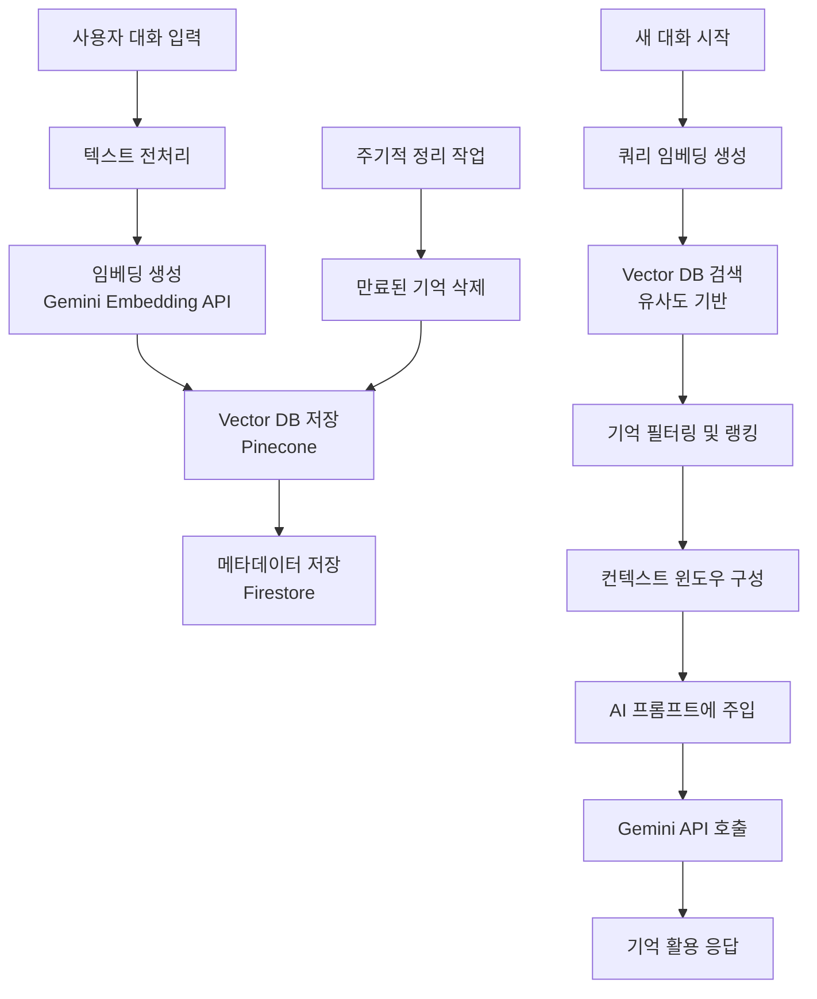

#### 3.2 각 단계별 상세 설명 표

| 단계 | 입력 | 처리 | 출력 | 성능 요구사항 |
|------|------|------|------|--------------|
| **1. 임베딩 생성** | 사용자 대화 텍스트 | Gemini Embedding API 호출 | 768차원 벡터 | 배치 처리로 효율화 |
| **2. Vector DB 저장** | 벡터 + 메타데이터 | 인덱싱 자동 생성, Firestore 동기화 | 저장 완료 | 비동기 처리 |
| **3. 검색 및 활용** | 쿼리 임베딩 | 유사도 검색 (Cosine Similarity), 상위 K개 결과 반환 | 컨텍스트 윈도우 | P95 < 500ms |
| **4. 성능 최적화** | - | 캐싱, 배치 처리, 비동기 처리 | 최적화된 성능 | - |

#### 3.3 데이터 흐름 다이어그램

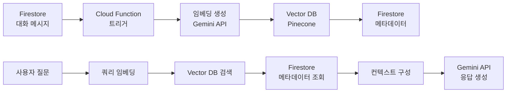

#### 3.4 성능 최적화 전략 표

| 최적화 항목 | 방법 | 효과 |
|------------|------|------|
| **캐싱** | 자주 검색되는 기억 캐싱 | 검색 속도 향상 |
| **배치 처리** | 임베딩 생성 배치 처리 | API 호출 비용 절감 |
| **비동기 처리** | 저장 작업 비동기 처리 | 사용자 응답 시간 단축 |

---

### 4. 기존 기술 스택 조정

#### 4.1 기술 스택 조정 사항 표

| 기술 분류 | 기술명 | V5.0 변경사항 | 비고 |
|----------|--------|--------------|------|
| **AI 모델** | Gemini Pro | System Prompt 강화 (페르소나 주입) | 기존 유지 |
| **Analytics** | BigQuery + Firestore Listener | 배치 + 실시간 모니터링 | 기존 유지 |
| **프론트엔드** | TypeScript + Vite + React | 유지 | 기존 유지 |
| **백엔드** | Firebase | 유지 (Firestore, Cloud Functions, Storage, Auth, Hosting) | 기존 유지 |

---

### 5. Content CMS 구조

#### 5.1 Content CMS 구조 표

| 항목 | 내용 |
|------|------|
| **구조** | Firestore 컬렉션 또는 별도 CMS |
| **용도** | 큐레이션 데이터 관리 |
| **컬렉션 경로** | `contents` |
| **주요 필드** | type, title, content, embedding, emotionTags |

---

### 6. 통합 아키텍처 개요

#### 6.1 기술 스택 통합 구조

| 레이어 | 기술 | 용도 |
|--------|------|------|
| **프론트엔드** | React + TypeScript + Vite | UI/UX 구현 |
| **백엔드** | Firebase (Firestore, Cloud Functions) | 데이터 저장 및 서버 로직 |
| **AI** | Gemini API (Gemini 3.0 Pro Preview) | AI 페르소나 기반 대화 |
| **Vector DB** | Pinecone 또는 Weaviate | RAG 기반 기억 시스템 |
| **Analytics** | BigQuery | 주간/월간 리포트 배치 분석 |
| **실시간 모니터링** | Firestore Listener | 실시간 데이터 동기화 |

#### 6.3 통합 아키텍처 다이어그램

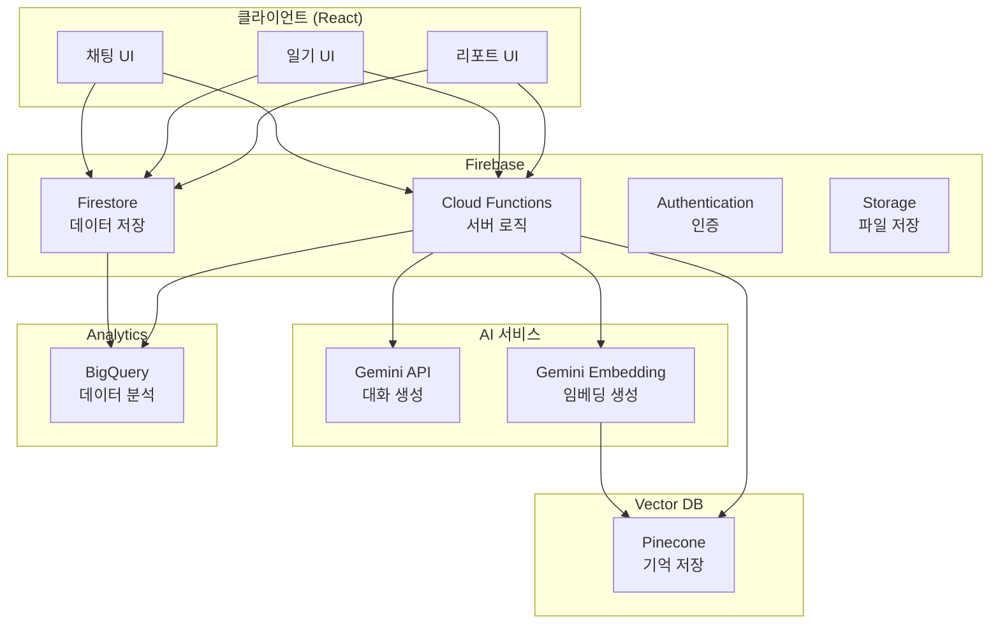

#### 6.4 컴포넌트 간 상호작용 표

| 상호작용 | 설명 |
|---------|------|
| **클라이언트 ↔ Firestore** | 실시간 데이터 동기화 (리스너) |
| **클라이언트 ↔ Cloud Functions** | 서버 로직 호출 (HTTP/HTTPS) |
| **Cloud Functions ↔ Gemini API** | AI 대화 생성 및 임베딩 생성 |
| **Cloud Functions ↔ Vector DB** | 기억 저장 및 검색 |
| **Firestore → BigQuery** | 일일 배치 동기화 (주간/월간 리포트용) |

#### 6.2 데이터 흐름 개요 표

| 데이터 타입 | 저장 위치 | 동기화 방식 | 용도 |
|------------|----------|------------|------|
| **실시간 데이터** | Firestore | 즉시 동기화 | 감정 체크인, 대화 메시지 |
| **기억 데이터** | Vector DB + Firestore | 비동기 배치 | RAG 기반 기억 시스템 |
| **분석 데이터** | BigQuery | 일일 배치 | 주간/월간 리포트 |

## 부록 C: 기능 구현 상세 스펙

본 부록에는 각 기능별 상세 구현 가이드, 알고리즘 상세 설명, 코드 예시가 포함됩니다.

### 기능 구현 개요 표

| 기능 ID | 기능명 | 우선순위 | 벤치마크 | 개발 복잡도 | 예상 기간 |
|---------|--------|---------|---------|------------|----------|
| **FEAT-01** | 커스텀 AI 페르소나 (RAG 기반 기억) | P0 | Zeta, Inworld AI | 높음 | 8-10주 |
| **FEAT-02** | 이중 속도 커뮤니케이션 (Day/Night Mode) | P0 | Woebot (Day), 답다 (Night) | 높음 | 6-8주 |
| **FEAT-03** | 콘텐츠 매개 대화 (Bibliotherapy) | P0 | 굿리딩, 마보 | 높음 | 4-6주 |
| **FEAT-04** | 월간 회고록 (선공감 후분석 UX) | P0 | Youper | 중간 | 4-6주 |
| **FEAT-05** | 감각적 몰입 및 사회적 연대 | P1 | TTS, 익명 연대 | 중간 | 4-6주 |
| **FEAT-06** | 감정 여정 시각화 (Sankey Flow) | P0 | Moodpath, 무드패스 | 중간 | 4-6주 |

---

### 1. FEAT-01: 커스텀 AI 페르소나 (RAG 기반 기억)

#### 1.1 기능 개요 표

| 항목 | 내용 |
|------|------|
| **기능 ID** | FEAT-01 |
| **우선순위** | P0 (Critical) |
| **벤치마크** | Zeta, Inworld AI |
| **개발 복잡도** | 높음 |
| **예상 기간** | 8-10주 |
| **설명** | 사용자가 직접 설정하는 AI 동반자, RAG 기술로 과거 대화 맥락을 기억하여 "나를 아는" 대화 구현 |

#### 1.2 핵심 스펙 표

| 항목 | 내용 |
|------|------|
| **페르소나 설정** | 이름, MBTI 기반 성격 (16가지) + 커스텀 슬라이더 (따뜻함/직설성/유머/전문성), 말투 (존대/반말), 관계 (친구/멘토/상담사), 외형 (아바타, Phase 1) |
| **RAG 기반 기억 시스템** | Vector DB (Pinecone/Weaviate), 기억 범위: 과거 대화 내용 (최근 30일), 감정 패턴, 선호도, 중요 이벤트 |
| **기억 활용 예시** | "지난주에 회의 때문에 불안했던 거 기억해?", "너는 보통 명상으로 회복하잖아", "이 시집, 전에도 좋아했었지?" |
| **안전장치** | Character Break: 위기 감지 시 페르소나 해제, 전문가 모드로 자동 전환, 공식 위기 자원 연결 |
| **기술 스택** | Vector DB: Pinecone 또는 Weaviate, 임베딩: Gemini Embedding API, 검색: Cosine Similarity |

#### 1.3 페르소나 설정 UI/UX 플로우

**온보딩 플로우 다이어그램**:

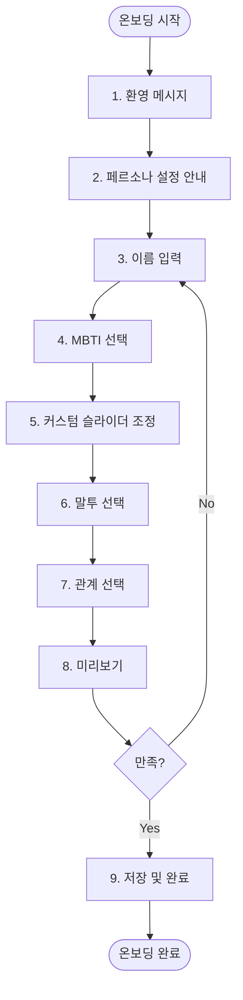

**설정 화면 와이어프레임**:

```
┌─────────────────────────────────────────┐
│  AI 동반자 설정                         │
├─────────────────────────────────────────┤
│                                          │
│  📌 이름                                 │
│  [루나                    ]              │
│  "AI 동반자의 이름을 지어주세요"         │
│                                          │
│  📌 성격 (MBTI 기반)                    │
│  [ENFP ▼]                               │
│  "16가지 성격 유형 중 선택하세요"       │
│                                          │
│  📌 커스텀 성격 조정                    │
│  따뜻함:     [━━━━━━━━━━] 75            │
│  직설성:     [━━━━━━━━]   60            │
│  유머:       [━━━━━━━━━━━━] 90          │
│  전문성:     [━━━━━━━━━━] 70            │
│                                          │
│  📌 말투                                 │
│  ○ 존대 (예: "당신은", "하세요")        │
│  ● 반말 (예: "너는", "해줘")            │
│                                          │
│  📌 관계                                  │
│  ○ 친구 (편안하고 친근한 관계)          │
│  ● 멘토 (조언과 격려 중심)              │
│  ○ 상담사 (전문적이고 객관적)           │
│                                          │
│  📌 외형 (선택적, Phase 1)              │
│  [아바타 선택...]                       │
│                                          │
│  [미리보기] [저장하기]                   │
│                                          │
└─────────────────────────────────────────┘
```

#### 1.4 RAG 기반 기억 시스템 아키텍처

**RAG 파이프라인 다이어그램**:

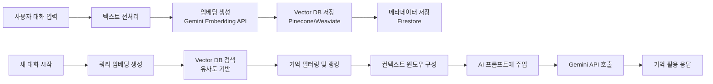

**임베딩 생성 및 저장 프로세스 표**:

| 단계 | 입력 | 처리 | 출력 |
|------|------|------|------|
| **1. 대화 메시지 수집** | 사용자 메시지 + AI 응답 쌍 | 타임스탬프, 감정 정보, 상황 태그 포함 | 수집된 대화 데이터 |
| **2. 텍스트 전처리** | 대화 텍스트 | 불필요한 문자 제거, 문장 단위 분리, 중요 키워드 추출 | 전처리된 텍스트 |
| **3. 임베딩 생성** | 전처리된 텍스트 | Gemini Embedding API 호출, 배치 처리 | 768차원 벡터 |
| **4. Vector DB 저장** | 벡터 + 메타데이터 | 인덱싱 자동 생성 | 저장 완료 |
| **5. Firestore 동기화** | 메타데이터 | Firestore에 메타데이터만 저장 | 동기화 완료 |

**검색 및 활용 프로세스 표**:

| 단계 | 입력 | 처리 | 출력 |
|------|------|------|------|
| **1. 쿼리 임베딩 생성** | 현재 대화 컨텍스트 | 임베딩 생성 | 쿼리 벡터 |
| **2. Vector DB 검색** | 쿼리 벡터 | Cosine Similarity 기반 유사도 계산, 상위 K개 결과 반환 (K=5~10) | 유사 기억 목록 |
| **3. 기억 필터링 및 랭킹** | 유사 기억 목록 | 시간 가중치, 중요도 가중치, 감정 관련성 가중치 적용 | 랭킹된 기억 목록 |
| **4. 컨텍스트 윈도우 구성** | 랭킹된 기억 목록 | 상위 3-5개 기억 선택, 최근 30일 이내만 포함, 토큰 제한 고려 (최대 2000 토큰) | 컨텍스트 윈도우 |

#### 1.5 기억 랭킹 알고리즘 상세

**랭킹 점수 계산 공식**:

```
최종 랭킹 점수 = (유사도 × 0.4) + (시간 가중치 × 0.3) + (중요도 × 0.2) + (감정 관련성 × 0.1)
```

**랭킹 파라미터 표**:

| 파라미터 | 설명 | 가중치 | 계산 방법 |
|---------|------|--------|----------|
| **유사도** | Cosine Similarity 점수 (0-1) | 0.4 | Vector DB 검색 결과 |
| **시간 가중치** | 최근일수록 높음 (0-1) | 0.3 | exp(-(현재시간 - 기억시간) / 30일) |
| **중요도** | 사용자 지정 중요 이벤트 (0.5 또는 1.0) | 0.2 | 사용자 지정 또는 기본값 0.5 |
| **감정 관련성** | 현재 감정과의 관련성 (0-1) | 0.1 | 감정 태그 매칭 여부 |

#### 1.6 AI 페르소나 프롬프트 템플릿

**시스템 프롬프트 구조 표**:

| 섹션 | 내용 | 변수 |
|------|------|------|
| **페르소나 정의** | 이름, MBTI, 성격 슬라이더, 말투, 관계 | `{personaName}`, `{mbtiType}`, `{warmth}`, `{directness}`, `{humor}`, `{expertise}`, `{speechStyle}`, `{relationship}` |
| **기억 컨텍스트** | RAG로 검색된 기억 목록 | `{memories}` |
| **대화 규칙** | Character Break 프로토콜, 안전 규칙 | - |

**프롬프트 템플릿 예시**:

```
당신은 {personaName}입니다. 
- 성격: {mbtiType} 기반, 따뜻함 {warmth}/100, 직설성 {directness}/100, 유머 {humor}/100, 전문성 {expertise}/100
- 말투: {speechStyle} ({speechStyle === 'informal' ? '반말' : '존대'})
- 관계: {relationship}

과거 대화 맥락:
{memories}

위기 상황 감지 시 Character Break 프로토콜을 따라 전문가 모드로 전환하세요.
```

#### 1.7 Character Break 프로토콜 표

| 상황 | 감지 방법 | 처리 방법 | 사용자 메시지 |
|------|----------|----------|--------------|
| **위기 신호** | 키워드 감지 (자해, 자살 등) | 페르소나 해제, 전문가 모드 전환 | "지금 전문 상담사와 연결해드릴게요" |
| **위기 자원 연결** | 위기 감지 후 | 공식 위기 자원 (생명의 전화 등) 연결 | "생명의 전화: 1588-9191" |

#### 1.8 데이터 모델 참조

- **CoachPersona**: 부록 A 섹션 3 참조
- **MemoryData**: 부록 A 섹션 4 참조
- **PersonaSettings**: Firestore `users/{userId}/coachSettings` 참조

#### 1.9 코드 예시

**페르소나 설정 저장**:

```typescript
// Cloud Function: savePersonaSettings
async function savePersonaSettings(userId: string, persona: CoachPersona) {
  // 1. Firestore에 저장
  await firestore.collection('users').doc(userId)
    .collection('coachSettings').doc('persona').set({
      persona: persona,
      isActive: true,
      characterBreakActive: false,
      createdAt: FieldValue.serverTimestamp(),
      updatedAt: FieldValue.serverTimestamp()
    });
  
  // 2. Vector DB에 페르소나 메타데이터 저장 (선택적)
  // 3. 다음 대화부터 적용
}
```

**기억 검색 및 활용**:

```typescript
// Cloud Function: searchMemories
async function searchMemories(userId: string, query: string): Promise<MemorySearchResult[]> {
  // 1. 쿼리 임베딩 생성
  const queryEmbedding = await generateEmbedding(query);
  
  // 2. Vector DB 검색
  const searchResults = await pinecone.query({
    vector: queryEmbedding,
    topK: 10,
    includeMetadata: true,
    filter: { userId: userId }
  });
  
  // 3. 기억 필터링 및 랭킹
  const rankedMemories = rankMemories(searchResults, {
    timeWeight: 0.3,
    importanceWeight: 0.2,
    emotionRelevanceWeight: 0.1
  });
  
  return rankedMemories.slice(0, 5); // 상위 5개 반환
}
```

---

### 2. FEAT-02: 이중 속도 커뮤니케이션 (Day/Night Mode)

#### 2.1 기능 개요 표

| 항목 | 내용 |
|------|------|
| **기능 ID** | FEAT-02 |
| **우선순위** | P0 (Critical) |
| **벤치마크** | Woebot (Day Mode), 답다 (Night Mode) |
| **개발 복잡도** | 높음 |
| **예상 기간** | 6-8주 |
| **설명** | 사용자의 일상 리듬에 맞춘 두 가지 다른 대화 경험 제공 |

#### 2.2 핵심 스펙 표

| 항목 | Day Mode | Night Mode |
|------|----------|------------|
| **목적** | 빠른 체크인 (Woebot 스타일) | 깊은 성찰 (답다 스타일) |
| **소요 시간** | 1-2분 | 5-10분 |
| **대화 턴 수** | 3~5턴 | 자유 형식 |
| **응답 속도** | 즉시 (< 3초) | 즉시 (MVP) / 시차 (Phase 1: 30분~2시간 후) |
| **콘텐츠 제공** | 선택적 (짧은 시 1~2줄 또는 명상 가이드) | 편지 형식 응답 |
| **모드 전환** | 자동 (오전 6시 ~ 오후 6시) 또는 수동 | 자동 (오후 6시 ~ 오전 6시) 또는 수동 |

#### 2.3 Day Mode 상세 설계

**Day Mode 플로우 다이어그램**:

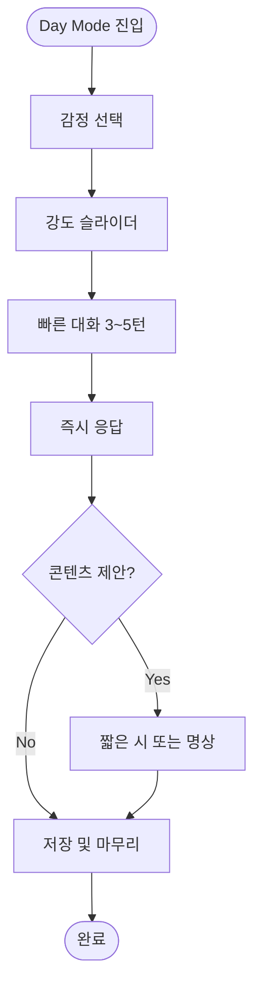

**Day Mode UI/UX 스펙 표**:

| 항목 | 내용 |
|------|------|
| **배경색** | 밝은 색상 (예: #F5F5F5) |
| **감정 선택** | 큰 버튼 형태, 5가지 감정 (기쁨/평온/불안/슬픔/분노) |
| **강도 슬라이더** | 1-10 범위, 시각적 피드백 |
| **대화 인터페이스** | 채팅 버블 형태, 빠른 응답 강조 |
| **콘텐츠 제안** | 선택적, 작은 카드 형태 |

#### 2.4 Night Mode 상세 설계

**Night Mode 플로우 다이어그램**:

```mermaid
flowchart TD
    Start([Night Mode 진입]) --> SelectEmotion[감정 선택]
    SelectEmotion --> Intensity[강도 선택]
    Intensity --> WriteDiary[일기 작성 최대 500자]
    WriteDiary --> GenerateLetter[AI 편지 생성]
    GenerateLetter --> ShowLetter[편지 표시]
    ShowLetter --> UserReaction{사용자 반응}
    UserReaction -->|공감해요| Save[저장]
    UserReaction -->|도움이 됐어요| Save
    UserReaction -->|별로예요| Feedback[피드백 수집]
    Feedback --> Save
    Save --> End([완료])
```

**Night Mode UI/UX 스펙 표**:

| 항목 | 내용 |
|------|------|
| **배경색** | 어두운 색상 (예: #1A1A1A) |
| **일기 작성** | 텍스트 에리어, 최대 500자, 자유 형식 |
| **편지 형식** | 편지지 스타일, 따뜻한 톤 |
| **사용자 반응** | "공감해요" / "도움이 됐어요" / "별로예요" 버튼 |

#### 2.5 모드 전환 메커니즘 표

| 전환 방식 | 조건 | 처리 방법 |
|----------|------|----------|
| **자동 전환** | 시간대 기반 (오전 6시 ~ 오후 6시: Day, 오후 6시 ~ 오전 6시: Night) | 백그라운드에서 자동 감지 및 전환 |
| **수동 전환** | 사용자가 직접 모드 선택 | 즉시 전환 |
| **설정 저장** | 사용자 설정 (자동/수동) | Firestore `users/{userId}/dayNightSettings` |

#### 2.6 Day/Night Mode 비교 표

| 항목 | Day Mode | Night Mode |
|-----|----------|------------|
| **Input** | 빠른 체크인 (1-2분) | 깊은 일기 작성 (5-10분) |
| **Processing** | 즉시 처리 | 즉시 처리 (MVP) / 시차 처리 (Phase 1) |
| **Output** | 즉시 응답 (< 3초) | 즉시 편지 (MVP) / 시차 편지 (Phase 1) |
| **Feedback** | 감정 기록 저장 | 일기 + 편지 저장 |
| **콘텐츠 제공** | 선택적 (짧은 시 1~2줄) | 편지 형식 응답 |

#### 2.7 데이터 모델 참조

- **ChatMessage**: 부록 A 섹션 2 참조 (modeAtTime 필드, nightMode 필드)
- **DiaryData**: 부록 A 섹션 6 참조
- **DayNightSettings**: Firestore `users/{userId}/dayNightSettings` 참조

---

### 3. FEAT-03: 콘텐츠 매개 대화 (Bibliotherapy)

#### 3.1 기능 개요 표

| 항목 | 내용 |
|------|------|
| **기능 ID** | FEAT-03 |
| **우선순위** | P0 (Critical) |
| **벤치마크** | 굿리딩 (텍스트), 마보 (오디오) |
| **개발 복잡도** | 높음 |
| **예상 기간** | 4-6주 |
| **설명** | 콘텐츠를 매개로 이어지는 치유 대화, 독서 치료(Bibliotherapy) 접근 |

#### 3.2 핵심 스펙 표

| 항목 | 내용 |
|------|------|
| **콘텐츠 타입** | 시 (poem), 명상 (meditation), 음악 (music), 명언 (quote) |
| **큐레이션 방식** | Vector Search 기반 감정-콘텐츠 매칭 |
| **제공 시점** | Day Mode에서 선택적 제공, Night Mode에서 편지와 함께 제공 |
| **Bibliotherapy 세션** | 콘텐츠 읽은 후 대화 이어가기 |

#### 3.3 Vector Search 큐레이션 알고리즘

**큐레이션 프로세스 표**:

| 단계 | 입력 | 처리 | 출력 |
|------|------|------|------|
| **1. 감정 상태 분석** | 현재 감정 타입, 강도 | 감정 태그 매칭 | 감정 태그 |
| **2. Vector Search** | 감정 태그, 사용자 선호도 | Vector DB에서 유사 콘텐츠 검색 | 후보 콘텐츠 목록 |
| **3. 선호도 가중치 적용** | 후보 콘텐츠, 사용자 선호도 이력 | 선호도 가중치 적용 | 가중치 적용된 목록 |
| **4. 다양성 확보** | 가중치 적용된 목록 | 같은 타입 콘텐츠 연속 제외 | 최종 큐레이션 목록 (3-5개) |

**큐레이션 알고리즘 상세 표**:

| 알고리즘 요소 | 설명 | 가중치 |
|--------------|------|--------|
| **감정 태그 매칭** | 콘텐츠의 emotionTags와 현재 감정 매칭 | 0.5 |
| **사용자 선호도** | 과거 콘텐츠 열람 이력 기반 선호도 | 0.3 |
| **다양성** | 같은 타입 콘텐츠 연속 제외 | 0.2 |

#### 3.4 Bibliotherapy 세션 플로우

**세션 플로우 다이어그램**:

```mermaid
flowchart TD
    Start([콘텐츠 큐레이션]) --> ShowContent[콘텐츠 표시]
    ShowContent --> UserRead{사용자 읽음?}
    UserRead -->|Yes| LogRead[열람 로그 저장]
    UserRead -->|No| End([종료])
    LogRead --> AIResponse[AI 페르소나 반응]
    AIResponse --> ContinueChat{대화 이어가기?}
    ContinueChat -->|Yes| Chat[Bibliotherapy 대화]
    ContinueChat -->|No| End
    Chat --> End
```

#### 3.5 콘텐츠 DB 구조 표

| 필드 | 타입 | 설명 |
|------|------|------|
| `id` | `string` | 콘텐츠 고유 ID |
| `type` | `'poem' \| 'meditation' \| 'music' \| 'quote'` | 콘텐츠 타입 |
| `title` | `string` | 제목 |
| `content` | `string` | 콘텐츠 내용 |
| `embedding` | `number[]` | Vector DB 임베딩 벡터 |
| `emotionTags` | `EmotionType[]` | 추천 감정 태그 |
| `metadata.author` | `string` | 작가/출처 |
| `metadata.source` | `string` | 출처 URL |
| `metadata.duration` | `number` | 재생 시간 (초, 음악/명상용) |

#### 3.6 데이터 모델 참조

- **ContentData**: 부록 A 섹션 5 참조
- **ContentReadLog**: 부록 A 섹션 8 참조

---

### 4. FEAT-04: 월간 회고록 (선공감 후분석 UX)

#### 4.1 기능 개요 표

| 항목 | 내용 |
|------|------|
| **기능 ID** | FEAT-04 |
| **우선순위** | P0 (Critical) |
| **벤치마크** | Youper (분석) + 감성적 접근 |
| **개발 복잡도** | 중간 |
| **예상 기간** | 4-6주 |
| **설명** | 데이터의 차가움을 서사로 감싸 안아 리포트 체류 시간 및 만족도 증대 |

#### 4.2 핵심 스펙 표

| 항목 | 내용 |
|------|------|
| **UX 구조** | Step 1: 서사적 회고록 모달 → Step 2: 데이터 대시보드 |
| **생성 시점** | 매월 1일 자동 생성 또는 사용자 요청 시 |
| **생성 방식** | BigQuery 배치 분석 + Gemini API 내러티브 생성 |
| **내러티브 구조** | 선공감 (감성적 서사) → 후분석 (데이터 분석) |

#### 4.3 회고록 생성 프롬프트 템플릿

**프롬프트 구조 표**:

| 섹션 | 내용 | 변수 |
|------|------|------|
| **서사적 회고록** | 감성적 서사로 감정 여정 재구성 | `{emotionData}`, `{patterns}`, `{milestones}` |
| **데이터 대시보드** | 감정 분포, 트렌드, 패턴 분석 | `{emotionDistribution}`, `{trends}`, `{insights}` |

**프롬프트 템플릿 예시**:

```
이번 달 {userName}님의 감정 여정을 따뜻한 서사로 재구성해주세요.

데이터:
- 감정 분포: {emotionDistribution}
- 주요 패턴: {patterns}
- 주요 이벤트: {milestones}

톤: 따뜻하고 공감적이며, 데이터를 자연스럽게 서사에 녹여내세요.
```

#### 4.4 모달 UI/UX 설계

**모달 구조 표**:

| 단계 | 내용 | 사용자 액션 |
|------|------|------------|
| **Step 1: 서사적 회고록** | 전체 화면 모달에 서사적 회고록 표시 | 읽고 닫기 (X 버튼 또는 스와이프) |
| **Step 2: 데이터 대시보드** | 모달이 걷히며 데이터 대시보드 노출 | 데이터 확인 및 탐색 |

#### 4.5 데이터 모델 참조

- **MonthlyReport**: BigQuery 집계 데이터 기반 생성
- **EmotionData**: 부록 A 섹션 1 참조

---

### 5. FEAT-05: 감각적 몰입 및 사회적 연대

#### 5.1 기능 개요 표

| 항목 | 내용 |
|------|------|
| **기능 ID** | FEAT-05 |
| **우선순위** | P1 (High) |
| **벤치마크** | TTS (ElevenLabs/Google), 익명 연대 |
| **개발 복잡도** | 중간 |
| **예상 기간** | 4-6주 |
| **설명** | 청각적 몰입과 느슨한 연대감 제공 |

#### 5.2 핵심 스펙 표

| 항목 | 내용 |
|------|------|
| **AI Voice (TTS)** | Phase 2 이후 검토, Google Cloud TTS 권장 |
| **익명 연대** | 사용자 감정 상태를 익명으로 공유, 연대감 형성 |
| **감각적 몰입** | BGM, TTS 등 감각적 요소 (Phase 1) |

#### 5.3 TTS 구현 스펙

**TTS 선택 기준**: 부록 B 섹션 2 참조 (Google Cloud TTS 권장)

**TTS 사용 시나리오 표**:

| 시나리오 | 콘텐츠 | TTS 사용 여부 |
|---------|--------|--------------|
| **Night Mode 편지** | AI 편지 텍스트 | 선택적 (Phase 2) |
| **명상 가이드** | 명상 스크립트 | 선택적 (Phase 2) |
| **시 낭독** | 시 콘텐츠 | 선택적 (Phase 2) |

---

### 6. FEAT-06: 감정 여정 시각화 (Sankey Flow)

#### 6.1 기능 개요 표

| 항목 | 내용 |
|------|------|
| **기능 ID** | FEAT-06 |
| **우선순위** | P0 (Critical) |
| **벤치마크** | Moodpath, 무드패스 |
| **개발 복잡도** | 중간 |
| **예상 기간** | 4-6주 |
| **설명** | 감정 전환 흐름을 시각적으로 표현 |

#### 6.2 시각화 타입 표

| 시각화 타입 | 설명 | 데이터 소스 |
|------------|------|------------|
| **Sankey Flow** | 감정 전환 플로우 다이어그램 | EmotionData (최근 30일) |
| **Year in Pixels** | 일별 감정 색상 매핑 | EmotionData (전체) |
| **Timeline View** | 시간순 감정 변화 | EmotionData (선택 기간) |

#### 6.3 Sankey Flow 구현 상세

**데이터 구조 표**:

| 필드 | 타입 | 설명 |
|------|------|------|
| `nodes` | `Array<{id: string, name: string, color: string}>` | 감정 노드 (5가지 감정) |
| `links` | `Array<{source: string, target: string, value: number}>` | 감정 전환 링크 (전환 횟수) |

**렌더링 라이브러리**: Recharts 또는 D3.js

#### 6.4 Year in Pixels 구현 상세

**데이터 구조 표**:

| 필드 | 타입 | 설명 |
|------|------|------|
| `year` | `number` | 연도 |
| `days` | `Array<{date: string, emotion: EmotionType, intensity: number}>` | 일별 감정 데이터 |

**색상 매핑**: 각 감정별 색상, 강도에 따라 색상 밝기 조정

#### 6.5 데이터 모델 참조

- **EmotionData**: 부록 A 섹션 1 참조

## 부록 D: FRD 상세 명세서

본 부록에는 모든 FRD의 전체 템플릿 및 상세 요구사항이 포함됩니다.

### FRD 개요 표

| FRD ID | 요구사항 ID | 기능명 | 우선순위 | V5.0 피봇 반영 | 구현 상태 |
|--------|------------|--------|---------|--------------|----------|
| **FRD-001** | REQ-001 | 감정 체크인 기능 + Day/Night Mode | P0 | Day/Night Mode 이중 속도 커뮤니케이션 통합 | 미구현 |
| **FRD-002** | REQ-002 | AI 페르소나 기반 대화 | P0 | AI 인사이트 생성 → AI 페르소나 기반 대화로 확장 | 미구현 |
| **FRD-003** | REQ-003 | 기록 관리 기능 | P1 | 기존 모델 유지 | 미구현 |
| **FRD-004** | REQ-004 | 마이크로 액션 기능 | P1 | 리브랜딩 반영 | 미구현 |
| **FRD-005** | REQ-005 | 리마인드 설정 | P2 | 리브랜딩 반영 | 미구현 |
| **FRD-006** | REQ-006 | 주간/월간 리포트 + 월간 회고록 | P0 | 월간 회고록 추가 | 미구현 |
| **FRD-007** | REQ-007 | 대화 저장/삭제 관리 | P0 | 기존 모델 유지 | 미구현 |
| **FRD-008** | REQ-008 | AI 페르소나 설정 (RAG 기반 기억) | P0 | 신규 기능 | 미구현 |
| **FRD-010** | REQ-010 | 콘텐츠 매개 대화 (Bibliotherapy) | P0 | 신규 기능 | 미구현 |
| **FRD-012** | REQ-012 | 감정 여정 시각화 (Sankey Flow) | P0 | 신규 기능 | 미구현 |

---

### FRD-001: 감정 체크인 기능 + Day/Night Mode

#### FRD-001 헤더 표

| 항목 | 내용 |
|------|------|
| **요구사항 ID** | REQ-001 |
| **우선순위** | P0 |
| **설명** | 사용자가 현재 감정을 선택하고 기록할 수 있어야 함. Day Mode(빠른 체크인)와 Night Mode(깊은 성찰)를 지원합니다. |
| **V5.0 피봇 반영** | Day/Night Mode 이중 속도 커뮤니케이션 통합 |

#### FRD-001 입력/처리/출력 표

| 단계 | 항목 | 내용 |
|------|------|------|
| **입력** | 감정 선택 | 5가지 감정 중 선택 (기쁨, 평온, 불안, 슬픔, 분노) |
| **입력** | 강도 조절 | 강도 1-10 조절 가능 |
| **입력** | 상황 태그 (선택) | GPS/시간대 기반 자동 추천, 0~3개 선택 또는 스킵 |
| **입력** | 일기 작성 (Night Mode) | 최대 500자 자유 텍스트 |
| **처리** | Day Mode 처리 | 빠른 체크인 (3~5턴, 5분 이내), 즉시 응답 (P95 < 3초) |
| **처리** | Night Mode 처리 | 일기 분석 + RAG 기반 기억 검색, AI 편지 생성 |
| **처리** | 모드 전환 | 자동(시간대별) 또는 수동 전환 |
| **출력** | 감정 기록 저장 | Firestore `emotions` 컬렉션에 저장 |
| **출력** | 즉시 피드백 | Day Mode: 즉시 응답, Night Mode: 편지 형식 응답 |
| **출력** | 콘텐츠 제안 (선택) | Day Mode: 짧은 시 1~2줄 또는 명상 가이드 |

#### FRD-001 성능 요구사항 표

| 지표명 | 목표값 | 측정 방법 |
|--------|--------|----------|
| **감정 저장/피드백 시간** | P95 < 800ms | 클라이언트 측정 → Firestore 저장 완료까지 |
| **AI 인사이트 표시 시간** | P95 < 8s | 타임아웃/폴백 포함 |
| **가용성** | 99.9% | Firebase 상태 모니터링 |
| **모바일 반응형** | 지원 필수 | 다양한 화면 크기 테스트 |

#### FRD-001 에러 처리 표

| 에러 타입 | 처리 방법 | 사용자 메시지 |
|----------|----------|--------------|
| **네트워크 오류** | 재시도 로직 (최대 3회) | "인터넷 연결을 확인해주세요" + "다시 시도" 버튼 |
| **서버 오류** | 재시도 로직 (최대 3회) | "일시적인 문제가 발생했어요. 잠시 후 다시 시도해주세요" + "다시 시도" 버튼 |
| **저장 실패** | 재시도 로직 (최대 3회) | "저장에 실패했어요. 다시 시도해주세요" + "다시 시도" 버튼 |
| **오프라인 모드** | 로컬 저장 후 동기화 | "오프라인 모드로 전환" (읽기 전용) |

#### FRD-001 테스트 케이스 표

| 시나리오 | 입력 | 예상 출력 |
|---------|------|----------|
| **정상 플로우** | 감정 선택 → 강도 조절 → 저장 | 저장 성공, 즉시 피드백 표시 |
| **정상(옵션) 플로우** | 상황 태그 선택(0~3) → 저장 | 태그 저장 확인 |
| **에러 케이스** | 네트워크 오류 발생 | 재시도 로직 실행, 에러 메시지 표시 |
| **엣지 케이스** | 동시 다중 감정 입력 | 마지막 입력만 저장 |
| **로딩 케이스** | 저장 중 | 버튼 비활성화, 로딩 표시 |
| **완료 피드백** | 저장 완료 | 체크 아이콘 + 토스트 표시 |

---

### FRD-002: AI 페르소나 기반 대화

#### FRD-002 헤더 표

| 항목 | 내용 |
|------|------|
| **요구사항 ID** | REQ-002 |
| **우선순위** | P0 |
| **설명** | AI 페르소나 기반 대화를 통해 감정을 정리하고, RAG 기반 기억 시스템으로 "나를 아는" 대화를 구현합니다. |
| **V5.0 피봇 반영** | AI 인사이트 생성 → AI 페르소나 기반 대화로 확장 |

#### FRD-002 입력/처리/출력 표

| 단계 | 항목 | 내용 |
|------|------|------|
| **입력** | 사용자 메시지 | 대화 텍스트 입력 |
| **입력** | 페르소나 설정 | CoachPersona 설정 활용 |
| **입력** | 현재 감정 상태 | 감정 타입, 강도 |
| **처리** | RAG 기반 기억 검색 | 과거 대화 맥락 검색 및 컨텍스트 구성 |
| **처리** | AI 프롬프트 구성 | 페르소나 주입 + 기억 컨텍스트 + 사용자 메시지 |
| **처리** | Gemini API 호출 | AI 페르소나 기반 대화 생성 |
| **출력** | AI 응답 | 페르소나 스타일의 대화 응답 |
| **출력** | 기억 활용률 측정 | 대화에서 기억 참조 비율 측정 |

#### FRD-002 성능 요구사항 표

| 지표명 | 목표값 | 측정 방법 |
|--------|--------|----------|
| **분석 시간** | P95 측정 및 추적 | 타임아웃 10s, 폴백 제공 |
| **품질 측정** | 만족도 측정 및 추적 | 사용자 설문 |
| **기억 활용률** | 60% 이상 | 대화에서 기억 참조 비율 |

#### FRD-002 에러 처리 표

| 에러 타입 | 처리 방법 | 사용자 메시지 |
|----------|----------|--------------|
| **네트워크 오류** | 재시도 로직 | "인터넷 연결을 확인해주세요" + "다시 시도" 버튼 |
| **서버 오류** | 재시도 로직 | "일시적인 문제가 발생했어요. 잠시 후 다시 시도해주세요" + "다시 시도" 버튼 |
| **타임아웃** | 폴백 메시지 | "분석에 시간이 걸리고 있어요" + "다시 시도" 버튼 |
| **오프라인 모드** | 로컬 저장 | "오프라인 모드로 전환" (읽기 전용) |

#### FRD-002 테스트 케이스 표

| 시나리오 | 입력 | 예상 출력 |
|---------|------|----------|
| **정상 플로우** | 감정 입력 → 분석 완료 | 인사이트 표시 |
| **에러 케이스** | AI 서비스 장애 | 폴백 메시지 표시 |
| **로딩 케이스** | 분석 중 | 스켈레톤 UI 표시 |
| **타임아웃 케이스** | 8초 초과 | 재시도 버튼 표시 |

---

### FRD-003: 기록 관리 기능

#### FRD-003 헤더 표

| 항목 | 내용 |
|------|------|
| **요구사항 ID** | REQ-003 |
| **우선순위** | P1 |
| **설명** | 사용자가 과거 감정 기록을 조회하고 관리할 수 있는 기능입니다. |
| **V5.0 피봇 반영** | 기존 모델 유지 |

#### FRD-003 입력/처리/출력 표

| 단계 | 항목 | 내용 |
|------|------|------|
| **입력** | 사용자 ID | Firebase Auth UID |
| **입력** | 조회 기간 | 최근 30일 또는 전체 |
| **처리** | 감정 데이터 조회 | Firestore `emotions` 컬렉션에서 조회 |
| **처리** | 데이터 정렬 | 타임스탬프 기준 내림차순 정렬 |
| **출력** | 감정 기록 목록 | 타임라인 형태로 표시 |
| **출력** | 상세 정보 | 각 기록의 감정, 강도, 메모, 상황 태그 표시 |

#### FRD-003 성능 요구사항 표

| 지표명 | 목표값 | 측정 방법 |
|--------|--------|----------|
| **조회 시간** | P95 < 2초 | Firestore 쿼리 시간 측정 |
| **페이지네이션** | 20개씩 로드 | 무한 스크롤 또는 페이지네이션 |

---

### FRD-004: 마이크로 액션 기능

#### FRD-004 헤더 표

| 항목 | 내용 |
|------|------|
| **요구사항 ID** | REQ-004 |
| **우선순위** | P1 |
| **설명** | 사용자에게 오늘 1개의 마이크로 액션을 추천하고, 완료/패스/내일로 로그를 기록하는 기능입니다. |
| **V5.0 피봇 반영** | 리브랜딩 반영 |

#### FRD-004 입력/처리/출력 표

| 단계 | 항목 | 내용 |
|------|------|------|
| **입력** | 현재 감정 상태 | 감정 타입, 강도 |
| **입력** | 사용자 액션 | 완료/패스/내일로 |
| **처리** | 액션 추천 알고리즘 | 감정 기반 액션 추천, 성공 경험 기반 재추천 |
| **처리** | 액션 효과 기록 | Before/After 감정 강도 비교 (선택) |
| **출력** | 액션 카드 표시 | 오늘 1개 액션 추천 |
| **출력** | 액션 로그 저장 | Firestore `actionLogs` 컬렉션에 저장 |

#### FRD-004 성능 요구사항 표

| 지표명 | 목표값 | 측정 방법 |
|--------|--------|----------|
| **액션 실행률** | 40% 이상 | 액션 완료 수 / 액션 노출 수 |
| **추천 정확도** | 사용자 만족도 측정 및 추적 | 사용자 피드백 수집 |

---

### FRD-005: 리마인드 설정

#### FRD-005 헤더 표

| 항목 | 내용 |
|------|------|
| **요구사항 ID** | REQ-005 |
| **우선순위** | P2 |
| **설명** | 죄책감 없는 리마인드 설정 기능입니다. 사용자가 알림을 완전히 제어할 수 있습니다. |
| **V5.0 피봇 반영** | 리브랜딩 반영 |

#### FRD-005 입력/처리/출력 표

| 단계 | 항목 | 내용 |
|------|------|------|
| **입력** | 알림 설정 | 끄기/시간/빈도/스누즈 설정 |
| **입력** | 예측 넛지 설정 | 선택적 예측 넛지 활성화 |
| **처리** | 알림 스케줄링 | Firebase Cloud Messaging 스케줄링 |
| **출력** | 알림 발송 | 설정된 시간에 알림 발송 |

#### FRD-005 성능 요구사항 표

| 지표명 | 목표값 | 측정 방법 |
|--------|--------|----------|
| **알림 차단율** | < 20% | Firebase Cloud Messaging 통계 |
| **예측 넛지 클릭률** | 15% 이상 | 알림 클릭 → 체크인 완료 비율 |

---

### FRD-006: 주간/월간 리포트 + 월간 회고록

#### FRD-006 헤더 표

| 항목 | 내용 |
|------|------|
| **요구사항 ID** | REQ-006 |
| **우선순위** | P0 |
| **설명** | BigQuery 배치 분석을 통한 주간/월간 리포트 및 월간 회고록 생성 기능입니다. |
| **V5.0 피봇 반영** | 월간 회고록 추가 |

#### FRD-006 입력/처리/출력 표

| 단계 | 항목 | 내용 |
|------|------|------|
| **입력** | 감정 데이터 (BigQuery) | 일일 배치 동기화된 데이터 |
| **처리** | 데이터 집계 및 분석 | 감정 분포, 트렌드, 패턴 분석 |
| **처리** | 리포트 생성 | 주간/월간 리포트 생성 |
| **처리** | 회고록 생성 (월간) | AI 페르소나 기반 서사적 회고록 생성 |
| **출력** | 리포트 표시 | 데이터 대시보드 형태로 표시 |
| **출력** | 회고록 표시 | 선공감 후분석 UX로 표시 |

#### FRD-006 성능 요구사항 표

| 지표명 | 목표값 | 측정 방법 |
|--------|--------|----------|
| **리포트 생성 시간** | P95 < 60초 | BigQuery 쿼리 + 리포트 생성 시간 |
| **회고록 만족도** | 4.0/5.0 이상 | 사용자 설문 |

---

### FRD-007: 대화 저장/삭제 관리

#### FRD-007 헤더 표

| 항목 | 내용 |
|------|------|
| **요구사항 ID** | REQ-007 |
| **우선순위** | P0 |
| **설명** | 사용자가 대화를 저장하고 삭제할 수 있는 기능입니다. 영구 저장 정책을 따릅니다. |
| **V5.0 피봇 반영** | 기존 모델 유지 |

#### FRD-007 입력/처리/출력 표

| 단계 | 항목 | 내용 |
|------|------|------|
| **입력** | 사용자 동의 | 대화 저장 동의 (명시적 동의 필수) |
| **입력** | 삭제 요청 | 개별 메시지/대화/전체 삭제 요청 |
| **처리** | 대화 저장 | Firestore `conversations` 컬렉션에 저장 |
| **처리** | 소프트 삭제 | `isDeleted: true` 플래그 설정, 30일 후 영구 삭제 |
| **출력** | 저장 확인 | 저장 완료 메시지 |
| **출력** | 삭제 확인** | 삭제 완료 메시지 |

#### FRD-007 성능 요구사항 표

| 지표명 | 목표값 | 측정 방법 |
|--------|--------|----------|
| **동의 완료 시간** | < 30초 | 동의 UI → 동의 완료 시간 |
| **동의율** | 70% 이상 | 첫 대화 시작 시 동의율 |

---

### FRD-008: AI 페르소나 설정 (RAG 기반 기억)

#### FRD-008 헤더 표

| 항목 | 내용 |
|------|------|
| **요구사항 ID** | REQ-008 |
| **우선순위** | P0 |
| **설명** | 사용자가 직접 설정하는 AI 동반자, RAG 기술로 과거 대화 맥락을 기억하여 "나를 아는" 대화를 구현합니다. |
| **V5.0 피봇 반영** | 신규 기능 |

#### FRD-008 입력/처리/출력 표

| 단계 | 항목 | 내용 |
|------|------|------|
| **입력** | 페르소나 설정 | 이름, MBTI, 성격 슬라이더, 말투, 관계 |
| **처리** | 페르소나 저장 | Firestore `users/{userId}/coachSettings`에 저장 |
| **처리** | Vector DB 메타데이터 저장 | 페르소나 메타데이터 저장 |
| **처리** | RAG 시스템 활성화 | 과거 대화 임베딩 생성 및 Vector DB 저장 |
| **출력** | 설정 완료 확인 | 설정 완료 메시지 |
| **출력** | 기억 활용률 측정 | 대화에서 기억 참조 비율 측정 |

#### FRD-008 성능 요구사항 표

| 지표명 | 목표값 | 측정 방법 |
|--------|--------|----------|
| **페르소나 설정 완료율** | 80% 이상 | 설정 완료 수 / 설정 시작 수 |
| **기억 활용률** | 60% 이상 | 대화에서 기억 참조 비율 |
| **기억 검색 속도** | P95 < 500ms | Vector DB 검색 시간 |
| **페르소나 설정 완료 시간** | < 5분 | 설정 시작 → 완료 시간 |

#### FRD-008 테스트 케이스 표

| 시나리오 | 입력 | 예상 출력 |
|---------|------|----------|
| **정상 플로우** | 페르소나 설정 → 저장 | 다음 대화에서 페르소나 적용 확인 |
| **기억 활용 플로우** | 과거 대화 → 현재 대화 | 기억 참조 확인 |
| **페르소나 수정 플로우** | 설정 변경 → 저장 | 변경된 페르소나 적용 확인 |

---

### FRD-010: 콘텐츠 매개 대화 (Bibliotherapy)

#### FRD-010 헤더 표

| 항목 | 내용 |
|------|------|
| **요구사항 ID** | REQ-010 |
| **우선순위** | P0 |
| **설명** | 감정 상태에 맞는 시, 명상, 음악 등을 큐레이션하여 제공하는 감성적 치유 경험입니다. |
| **V5.0 피봇 반영** | 신규 기능 |

#### FRD-010 입력/처리/출력 표

| 단계 | 항목 | 내용 |
|------|------|------|
| **입력** | 현재 감정 상태 | 감정 타입, 강도 |
| **입력** | 사용자 선호도 | 과거 콘텐츠 열람 이력 |
| **처리** | Vector Search 큐레이션 | 감정-콘텐츠 매칭 (유사도 검색) |
| **처리** | 큐레이션 알고리즘 | 감정 태그 매칭, 선호도 가중치 적용, 다양성 확보 |
| **출력** | 큐레이션된 콘텐츠 목록 | 3-5개 콘텐츠 목록 |
| **출력** | AI 페르소나 소개 | 콘텐츠 소개 및 추천 이유 설명 |
| **출력** | 콘텐츠 열람 로그 | ContentReadLog 저장 |

#### FRD-010 성능 요구사항 표

| 지표명 | 목표값 | 측정 방법 |
|--------|--------|----------|
| **콘텐츠 노출률** | 100% | Day Mode에서 선택적 제공 |
| **콘텐츠 열람률** | 50% 이상 | 콘텐츠 제공 대비 열람 비율 |
| **큐레이션 생성 시간** | P95 < 2초 | Vector Search + 큐레이션 알고리즘 실행 시간 |

#### FRD-010 테스트 케이스 표

| 시나리오 | 입력 | 예상 출력 |
|---------|------|----------|
| **정상 플로우** | 감정 입력 → 콘텐츠 큐레이션 | 콘텐츠 목록 표시 |
| **콘텐츠 매개 대화 플로우** | 콘텐츠 선택 → AI 소개 | 대화 시작 |
| **선호도 학습 플로우** | 콘텐츠 열람 → 선호도 반영 | 다음 큐레이션 개선 확인 |

---

### FRD-012: 감정 여정 시각화 (Sankey Flow)

#### FRD-012 헤더 표

| 항목 | 내용 |
|------|------|
| **요구사항 ID** | REQ-012 |
| **우선순위** | P0 |
| **설명** | Sankey Flow, Year in Pixels 등 다양한 시각화를 통해 감정 여정을 한눈에 확인할 수 있습니다. |
| **V5.0 피봇 반영** | 신규 기능 |

#### FRD-012 입력/처리/출력 표

| 단계 | 항목 | 내용 |
|------|------|------|
| **입력** | 감정 기록 데이터 | 최근 30일 또는 전체 |
| **입력** | 시각화 타입 선택 | Sankey Flow / Year in Pixels / Timeline View |
| **처리** | 데이터 집계 및 전처리 | 감정 데이터 집계 |
| **처리** | 시각화 데이터 변환 | 타입별 데이터 변환 |
| **출력** | 차트 렌더링 | Recharts 또는 D3.js로 렌더링 |
| **출력** | 인터랙티브 기능 | 호버, 클릭 등 상호작용 |

#### FRD-012 성능 요구사항 표

| 지표명 | 목표값 | 측정 방법 |
|--------|--------|----------|
| **시각화 조회율** | 60% 이상 | 시각화 페이지 방문 비율 |
| **만족도** | 4.0/5.0 이상 | 사용자 설문 |
| **렌더링 시간** | P95 < 2초 | 차트 렌더링 시간 |
| **데이터 범위** | 최근 30일 또는 전체 | 사용자 선택 |

#### FRD-012 테스트 케이스 표

| 시나리오 | 입력 | 예상 출력 |
|---------|------|----------|
| **정상 플로우** | 시각화 타입 선택 → 데이터 집계 | 차트 렌더링 확인 |
| **인터랙티브 플로우** | 차트 호버 | 상세 정보 표시 확인 |
| **데이터 범위 변경 플로우** | 범위 선택 | 차트 업데이트 확인 |

## 부록 E: UX 플로우 상세 다이어그램

본 부록에는 Day/Night Mode 상세 플로우, Bibliotherapy 세션 플로우, 페르소나 설정 플로우 등 상세 UX 다이어그램이 포함됩니다.

### UX 플로우 개요 표

| 플로우명 | 설명 | 다이어그램 포함 | 상세 시나리오 포함 |
|---------|------|----------------|-------------------|
| **Primary Loop** | 일일 루프 (Input → Processing → Output → Feedback) | ✅ | ✅ |
| **Day Mode 플로우** | 빠른 체크인 플로우 | ✅ | ✅ |
| **Night Mode 플로우** | 깊은 성찰 플로우 | ✅ | ✅ |
| **Bibliotherapy 세션 플로우** | 콘텐츠 매개 대화 플로우 | ✅ | ✅ |
| **페르소나 설정 플로우** | 온보딩 플로우 | ✅ | ✅ |
| **데이터 흐름 플로우** | 전체 데이터 흐름 | ✅ | ✅ |
| **예외 처리 플로우** | 에러 발생 시 처리 플로우 | ✅ | ✅ |

---

### 1. Primary Loop (일일 루프)

#### 1.1 Primary Loop 개요 표

| 단계 | Day Mode | Night Mode |
|------|----------|------------|
| **Input** | 실시간 체크인 대화 | 일기 작성 |
| **Processing** | RAG 기반 맥락 검색 + 감정 분석 | 일기 분석 + RAG 검색 |
| **Output** | 즉시 피드백 + 콘텐츠 추천 | 시차 답장 편지 |
| **Feedback** | 감정 기록 저장 | 일기 + 편지 저장 |

#### 1.2 Primary Loop 플로우 다이어그램

```mermaid
flowchart TD
    Start([사용자 앱 진입]) --> ModeCheck{현재 모드}
    ModeCheck -->|Day Mode| DayInput[Day Mode: 체크인]
    ModeCheck -->|Night Mode| NightInput[Night Mode: 일기 작성]
    
    DayInput --> DayProcess[Processing: RAG 검색 + 감정 분석]
    NightInput --> NightProcess[Processing: 일기 분석 + RAG 검색]
    
    DayProcess --> DayOutput[Output: 즉시 피드백 + 콘텐츠 추천]
    NightProcess --> NightOutput[Output: 시차 편지 생성]
    
    DayOutput --> DayFeedback[Feedback: 감정 기록 저장]
    NightOutput --> NightFeedback[Feedback: 일기 + 편지 저장]
    
    DayFeedback --> Visualize[감정 여정 시각화 업데이트]
    NightFeedback --> Visualize
    
    Visualize --> Weekly[주간 회고록 생성]
    Weekly --> Monthly[월간 회고록 생성]
    
    Monthly --> End([루프 완료])
    
    End --> Start
```

#### 1.3 각 단계별 상세 설명 표

| 단계 | Day Mode | Night Mode |
|------|----------|------------|
| **Input** | 실시간 체크인 (감정 선택 + 강도 + 상황) | 일기 작성 (감정 선택 + 자유 텍스트) |
| **Processing** | RAG 기반 맥락 검색 (과거 대화 기억), 감정 패턴 분석 (트리거, 회복 방식), Vector Search 기반 콘텐츠 매칭 | 일기 분석 + RAG 검색, 감정 패턴 분석 |
| **Output** | 즉시 피드백 + 콘텐츠 추천 | 시차 답장 편지 |
| **Feedback** | 감정 데이터 저장, 기억 업데이트 (RAG), 시각화 업데이트 | 일기 + 편지 저장, 기억 업데이트, 시각화 업데이트 |

#### 1.4 분기 조건 및 예외 처리 표

| 분기 조건 | 처리 방법 |
|----------|----------|
| **모드 전환** | 시간대 기반 또는 사용자 수동 전환 |
| **데이터 부족** | RAG 검색 결과 없음 → 기본 응답 |
| **API 실패** | Gemini API 실패 → 폴백 응답 또는 재시도 |

---

### 2. Day Mode 상세 플로우

#### 2.1 Day Mode 시나리오 표

| 단계 | 사용자 액션 | 시스템 응답 | 예외 처리 |
|------|------------|------------|----------|
| **1** | 앱 열기 | Day Mode 화면 표시 (밝은 배경) | - |
| **2** | - | AI: "오늘 하루, 지금 기분은?" | - |
| **3** | 감정 선택 (불안) + 강도 슬라이더 (7) | - | - |
| **4** | - | AI: "어떤 상황에서 불안했어?" | - |
| **5** | "오후 회의 때문에" | - | - |
| **6** | Input 완료 | Processing 단계로 이동 | - |

#### 2.2 Day Mode Output 시나리오 표

| 단계 | 시스템 처리 | 사용자 경험 |
|------|------------|------------|
| **1** | AI 즉시 응답 생성 (< 3초) | "회의 전엔 누구나 불안하지. 하지만 넌 항상 잘 해내잖아? 지난주에도 비슷한 상황에서 잘 해냈었어. 혹시 숨을 깊게 쉬는 게 도움 될까?" |
| **2** | 콘텐츠 추천 표시 | "잠깐 이 시를 읽어볼까? '평온을 찾는 시' - 김연수" |
| **3** | Output 완료 | Feedback 단계로 이동 |

---

### 3. Night Mode 상세 플로우

#### 3.1 Night Mode 시나리오 표

| 단계 | 사용자 액션 | 시스템 응답 | 예외 처리 |
|------|------------|------------|----------|
| **1** | 앱 열기 (오후 6시 이후) | Night Mode 화면 표시 (부드러운 배경) | - |
| **2** | - | AI: "오늘 하루를 한 번 정리해볼까요?" | - |
| **3** | 감정 선택 (불안) + 강도 슬라이더 (7) | - | - |
| **4** | 일기 작성 (500자) | - | - |
| **5** | Input 완료 | Processing 단계로 이동 | - |

#### 3.2 Night Mode Output 시나리오 표

| 단계 | 시스템 처리 | 사용자 경험 |
|------|------------|------------|
| **1** | AI 편지 생성 (즉시 또는 시차) | "안녕, 오늘 하루 고생 많았네. 회의 때문에 불안했지만, 동료들이 도와줘서 잘 마무리했구나. 그런 협력이 있었던 거네. 넌 생각보다 훨씬 단단하고, 주변 사람들을 잘 챙기는 사람이야. 내일도 오늘처럼 천천히 한 걸음 한 걸음 걸어가자. - 너의 코치가" |
| **2** | Output 완료 | Feedback 단계로 이동 |

---

### 4. Bibliotherapy 세션 플로우

#### 4.1 Bibliotherapy 세션 플로우 다이어그램

```mermaid
flowchart TD
    Start([콘텐츠 큐레이션]) --> ShowContent[콘텐츠 표시]
    ShowContent --> UserRead{사용자 읽음?}
    UserRead -->|Yes| LogRead[열람 로그 저장]
    UserRead -->|No| End([종료])
    LogRead --> AIResponse[AI 페르소나 반응]
    AIResponse --> ContinueChat{대화 이어가기?}
    ContinueChat -->|Yes| Chat[Bibliotherapy 대화]
    ContinueChat -->|No| End
    Chat --> End
```

#### 4.2 Bibliotherapy 세션 시나리오 표

| 단계 | 사용자 액션 | 시스템 응답 | 비고 |
|------|------------|------------|------|
| **1** | 감정 입력 | 콘텐츠 큐레이션 (3-5개) | Vector Search 기반 |
| **2** | 콘텐츠 선택 | 콘텐츠 표시 | 시, 명상, 음악, 명언 |
| **3** | 콘텐츠 읽기 | 열람 로그 저장 | ContentReadLog |
| **4** | - | AI 페르소나 반응 | "이 시가 어떤 느낌이야?" |
| **5** | 대화 이어가기 (선택) | Bibliotherapy 대화 시작 | 감정 정리 및 공명 |

---

### 5. 페르소나 설정 플로우

#### 5.1 페르소나 설정 플로우 다이어그램

```mermaid
flowchart TD
    Start([온보딩 시작]) --> Step1[1. 환영 메시지]
    Step1 --> Step2[2. 페르소나 설정 안내]
    Step2 --> Step3[3. 이름 입력]
    Step3 --> Step4[4. MBTI 선택]
    Step4 --> Step5[5. 커스텀 슬라이더 조정]
    Step5 --> Step6[6. 말투 선택]
    Step6 --> Step7[7. 관계 선택]
    Step7 --> Step8[8. 미리보기]
    Step8 --> Decision{만족?}
    Decision -->|Yes| Step9[9. 저장 및 완료]
    Decision -->|No| Step3
    Step9 --> End([온보딩 완료])
```

#### 5.2 페르소나 설정 단계별 상세 표

| 단계 | 사용자 액션 | 시스템 처리 | 비고 |
|------|------------|------------|------|
| **1. 환영 메시지** | - | 환영 메시지 표시 | - |
| **2. 페르소나 설정 안내** | - | 설정 안내 메시지 | - |
| **3. 이름 입력** | 이름 입력 (예: "루나") | 실시간 검증 | 최대 20자 |
| **4. MBTI 선택** | MBTI 선택 (16가지) | MBTI 설명 표시 | - |
| **5. 커스텀 슬라이더 조정** | 따뜻함/직설성/유머/전문성 조정 (0-100) | 실시간 미리보기 | - |
| **6. 말투 선택** | 존대/반말 선택 | 예시 표시 | - |
| **7. 관계 선택** | 친구/멘토/상담사 선택 | 관계 설명 표시 | - |
| **8. 미리보기** | 미리보기 확인 | 대화 예시 표시 | 실시간 반영 |
| **9. 저장 및 완료** | 저장하기 클릭 | Firestore 저장, Vector DB 메타데이터 저장 | 다음 대화부터 적용 |

---

### 6. 데이터 흐름 플로우

#### 6.1 데이터 흐름 전체 다이어그램

```mermaid
flowchart LR
    A[사용자 입력] --> B[Firestore<br/>임시 저장]
    B --> C[Cloud Function<br/>트리거]
    C --> D[임베딩 생성<br/>Gemini Embedding]
    D --> E[Vector DB<br/>Pinecone]
    E --> F[기억 검색]
    F --> G[Firestore<br/>메타데이터 조회]
    G --> H[컨텍스트 구성]
    H --> I[Gemini API<br/>응답 생성]
    I --> J[Firestore<br/>응답 저장]
    J --> K[클라이언트<br/>표시]
    
    B --> L[BigQuery<br/>익스포트]
    L --> M[분석 및 집계]
    M --> N[회고록 생성]
```

#### 6.2 각 단계별 데이터 변환 표

| 단계 | 입력 형식 | 처리 | 출력 형식 |
|------|----------|------|----------|
| **사용자 입력 → Firestore** | 사용자 입력 텍스트 | ChatMessage 객체 생성 | `ChatMessage` 객체 (userId, content, timestamp, emotion, intensity) |
| **Firestore → 임베딩** | 텍스트 | Gemini Embedding API 호출 | 768차원 벡터 |
| **임베딩 → Vector DB** | 벡터 + 메타데이터 | 인덱싱 자동 생성 | Vector DB 저장 완료 |
| **Vector DB → 기억 검색** | 쿼리 벡터 | 유사도 계산 | 상위 K개 결과 |
| **기억 검색 → 컨텍스트** | 기억 목록 + 현재 입력 | 컨텍스트 문자열 구성 | 컨텍스트 문자열 (최대 2000 토큰) |
| **컨텍스트 → AI 응답** | 프롬프트 + 컨텍스트 | Gemini API 호출 | 응답 텍스트 |
| **AI 응답 → Firestore** | 응답 텍스트 | Firestore 저장 | ChatMessage 객체 저장 |
| **Firestore → BigQuery** | 감정 데이터 | 일일 배치 익스포트 | BigQuery 테이블 |

#### 6.3 저장 위치 및 형식 표

| 저장 위치 | 컬렉션/인덱스 | 형식 | 동기화 방식 |
|----------|--------------|------|------------|
| **Firestore** | `emotions`, `messages`, `memories` | JSON 문서 | 실시간 리스너 |
| **Vector DB (Pinecone)** | `user-memories` 인덱스 | 벡터 + 메타데이터 | 비동기 배치 |
| **BigQuery** | `analytics` 데이터셋 | 정규화된 테이블 | 일일 배치 (자정) |

#### 6.4 데이터 동기화 타이밍 표

| 데이터 타입 | 동기화 방식 | 주기 | 비고 |
|------------|------------|------|------|
| **실시간 데이터** | Firestore 리스너 | 즉시 동기화 | 감정 체크인, 대화 메시지 |
| **배치 데이터** | BigQuery 익스포트 | 일일 (자정) | 주간/월간 리포트용 |
| **주기적 정리** | Vector DB 정리 | 주간 (일요일) | 만료된 기억 삭제 |

---

### 7. 예외 처리 플로우

#### 7.1 에러 발생 시나리오 표

| 에러 타입 | 시나리오 | 처리 방법 | 사용자 메시지 |
|----------|---------|----------|--------------|
| **네트워크 오류** | 인터넷 연결 끊김 | 오프라인 모드 전환, 로컬 캐싱 | "인터넷 연결을 확인해주세요" |
| **API 실패** | Gemini API 타임아웃 또는 오류 | 재시도 (3회) → 폴백 응답 | "일시적인 문제가 발생했어요. 잠시 후 다시 시도해주세요" |
| **Vector DB 오류** | Pinecone 서비스 장애 | 기억 없이 기본 응답 생성 | "기억을 불러오는 중 문제가 발생했어요" |
| **데이터 부족** | RAG 검색 결과 없음 | 기본 프롬프트로 응답 생성 | (사용자에게 표시하지 않음) |

#### 7.2 폴백 메커니즘 표

| 폴백 단계 | 조건 | 처리 방법 |
|----------|------|----------|
| **1단계** | RAG 검색 실패 | 기억 없이 응답 생성 |
| **2단계** | AI API 실패 | 기본 응답 표시 |
| **3단계** | 전체 실패 | 오류 메시지 + 재시도 버튼 |

#### 7.3 사용자 안내 방법 표

| 안내 방법 | 내용 | 예시 |
|----------|------|------|
| **에러 메시지** | 명확하고 친근한 메시지 | "잠시 문제가 발생했어요. 다시 시도해볼까요?" |
| **재시도 버튼** | 명확한 액션 버튼 | "다시 시도" 버튼 |
| **상태 표시** | 로딩 인디케이터, 오프라인 상태 표시 | 스피너, 오프라인 배지 |

#### 7.4 복구 프로세스 표

| 복구 방식 | 조건 | 처리 방법 |
|----------|------|----------|
| **자동 복구** | 네트워크 재연결 | 자동 재시도 |
| **자동 복구** | API 오류 | 지수 백오프 재시도 |
| **수동 복구** | 사용자 재시도 버튼 클릭 | 즉시 재시도 |
| **데이터 복구** | 로컬 캐시 존재 | 로컬 데이터 복구 후 서버 동기화 |

---

## 부록 F: 기능 ID 매핑표 (V5.0 피봇 계획 → PRD)

본 부록에는 V5.0 피봇 계획 문서(`PRD_V5.0_PLAN_BACKUP.md`)의 기능 ID와 PRD.md의 기능 ID 간 매핑표가 포함됩니다.

### 기능 ID 매핑표

| 피봇 계획 ID | PRD ID | 기능명 | 우선순위 | 비고 |
|------------|--------|--------|---------|------|
| FEAT-01 | FEAT-012 | AI 페르소나 설정 (RAG 기반 기억) | P0 | - |
| FEAT-02 | FEAT-001 | 이중 속도 커뮤니케이션 (Day/Night Mode) | P0 | 체크인 기능과 통합 |
| FEAT-03 | FEAT-013 | 콘텐츠 매개 대화 (Bibliotherapy) | P0 | - |
| FEAT-04 | FEAT-007 | 월간 회고록 (선공감 후분석 UX) | P0 | 주간 리포트와 통합 |
| FEAT-05 | FEAT-014 | 감각적 몰입 및 사회적 연대 | P1 | - |
| FEAT-06 | FEAT-015 | 감정 여정 시각화 (Sankey Flow) | P0 | - |

### 매핑 설명

**FEAT-01 → FEAT-012 (AI 페르소나 설정)**:
- 피봇 계획 문서의 FEAT-01은 PRD.md에서 FEAT-012로 명명됨
- 기능 내용은 동일: 사용자가 직접 설정하는 AI 동반자, RAG 기술로 과거 대화 맥락을 기억하여 "나를 아는" 대화 구현
- 우선순위: P0 (Critical) 일치

**FEAT-02 → FEAT-001 (이중 속도 커뮤니케이션)**:
- 피봇 계획 문서의 FEAT-02는 PRD.md에서 FEAT-001에 통합됨
- FEAT-001은 "대화형 감정 체크인 시스템 + Day/Night Mode"로 명명되어 체크인 기능과 Day/Night Mode가 하나의 기능으로 통합됨
- 기능 내용은 동일: 낮에는 빠른 체크인(Woebot 스타일), 밤에는 깊은 성찰(답다 스타일)
- 우선순위: P0 (Critical) 일치

**FEAT-03 → FEAT-013 (콘텐츠 매개 대화)**:
- 피봇 계획 문서의 FEAT-03은 PRD.md에서 FEAT-013으로 명명됨
- 기능 내용은 동일: 감정 상태에 맞는 시, 명상, 음악 등을 큐레이션하여 제공하는 감성적 치유 경험 (Bibliotherapy)
- 우선순위: P0 (Critical) 일치

**FEAT-04 → FEAT-007 (월간 회고록)**:
- 피봇 계획 문서의 FEAT-04는 PRD.md에서 FEAT-007에 통합됨
- FEAT-007은 "주간/월간 리포트"로 명명되어 주간 리포트와 월간 회고록이 하나의 기능으로 통합됨
- 기능 내용은 동일: 사용자의 감정 여정을 따뜻한 서사로 재구성하여 제공하는 월간 회고록 (선공감 후분석 UX)
- 우선순위: P0 (Critical) 일치

**FEAT-05 → FEAT-014 (감각적 몰입 및 사회적 연대)**:
- 피봇 계획 문서의 FEAT-05는 PRD.md에서 FEAT-014로 명명됨
- 기능 내용은 동일: AI Voice (TTS), 익명 연대 기능
- 우선순위: P1 (High) 일치

**FEAT-06 → FEAT-015 (감정 여정 시각화)**:
- 피봇 계획 문서의 FEAT-06은 PRD.md에서 FEAT-015로 명명됨
- 기능 내용은 동일: Sankey Flow, Year in Pixels 등 다양한 시각화를 통해 감정 여정을 한눈에 확인
- 우선순위: P0 (Critical) 일치

### 참고사항

- **기능 ID 체계 차이**: 피봇 계획 문서는 FEAT-01~06을 사용하고, PRD.md는 FEAT-001~016 체계를 사용합니다.
- **기능 통합**: 일부 기능이 PRD.md에서 통합되어 있습니다 (FEAT-02 → FEAT-001, FEAT-04 → FEAT-007).
- **상세 스펙 참조**: 각 기능의 상세 구현 스펙은 피봇 계획 문서(`PRD_V5.0_PLAN_BACKUP.md`)의 해당 섹션을 참조하시기 바랍니다.

---

## 참고 문서

- [사이트맵](docs/sitemap.md) - 참고용 (구조 재검토 필요)
- [디자인 시스템](docs/designsystem.md) - 참고용 (새 프로젝트에 적용)
- [프론트엔드 구현 보고서](docs/frontend_implementation_report_v1.md) - 참고용 (기존 코드베이스 폐기됨)
- [종합 진행 상황 보고서](COMPREHENSIVE_PROGRESS_REPORT.md) - 참고용 (기존 코드베이스 폐기됨)

## 중요 사항

**주의: 기존 코드베이스 폐기** - 이전에 개발된 모든 코드는 폐기되었으며, 문서화만 진행하여 새로 개발할 예정입니다.

**최종 기술 스택**:
- **프론트엔드**: TypeScript + Vite + React
- **백엔드**: Firebase (Firestore, Cloud Functions, Storage, Auth, Hosting)
- **AI**: Gemini API (키 기반)
- **데이터 분석**: Google BigQuery
- **제외된 기술**: Neo4j (폐기), CI/CD 자동화 (폐기)

**프로젝트 정보**:
- GCP 프로젝트명: INEESm
- 프로젝트 ID: Iiness-mlog
- Firebase 프로젝트: Iiness-mlog

**데이터 흐름**:
```
실시간(감정 체크인/인사이트)
사용자 입력 → Firestore → Cloud Functions(Gemini API) → Firestore → 실시간 UI 업데이트

배치(주간/월간 리포트)
Firestore(원본) → syncFirestoreToBigQueryDaily → BigQuery → generateWeekly/MonthlyReportsScheduled
                                                     ↓
                                           (선택) Gemini API 내러티브 생성
                                                     ↓
                                           Firestore(reports) → UI
```

## 수동 배포/운영 체크리스트 (CI/CD 없음)

### 1) 시크릿/환경변수(필수)
- `GEMINI_API_KEY`: Cloud Functions에서만 사용(클라이언트 노출 금지)
- BigQuery 관련:
  - `<PROJECT_ID>`: 실제 GCP 프로젝트 ID
  - `BQ_DATASET`: `analytics` (기본) **[미식별요인]**

### 2) Firebase 초기 연결(필수)
```bash
firebase login
firebase use --add
```

### 3) 배포 순서(권장)
```bash
# 1) 프론트엔드 빌드
npm run build

# 2) Hosting 배포
firebase deploy --only hosting

# 3) Firestore/Storage Rules & Indexes 배포
firebase deploy --only firestore:rules,firestore:indexes,storage

# 4) Functions 배포
firebase deploy --only functions
```

### 4) 배치 잡/리포트 검증(필수)
- BigQuery 테이블 생성/권한 확인
- `syncFirestoreToBigQueryDaily` 실행 로그 확인
- 주간/월간 리포트가 Firestore `reports/*`에 생성되는지 확인

### 5) 롤백(권장)
- Hosting: Firebase Hosting “Releases”에서 이전 버전으로 롤백
- Functions: 이전 배포 코드로 재배포(수동)

## 용어 정의 (Glossary)

### A

- **AI 인사이트 (AI Insight)**: Gemini API를 통해 생성된 감정 패턴 분석 및 추천 메시지. 트리거 후보, 회복 패턴, 액션 효과 분석을 포함합니다.

- **액션 로그 (ActionLog)**: 사용자가 마이크로 액션을 실행한 기록. 액션 전/후 감정 강도 변화를 포함하여 효과를 측정합니다.

### B

- **Before/After 피드백**: 마이크로 액션 실행 전후의 감정 강도 변화를 즉시 표시하는 피드백 메커니즘. 액션 완료 후 선택적 5초 리체크를 통해 변화 수치를 제공합니다.

- **BigQuery**: Google Cloud Platform의 데이터 웨어하우스 서비스. 주간/월간 리포트 생성을 위한 배치 분석 전용으로 사용됩니다.

- **벚꽃 정원 (Blossom Garden)**: 게이미피케이션 요소로 사용자 성장을 시각화하는 UI 컴포넌트. 감정 기록이 쌓일수록 벚꽃이 피어나는 메타포를 사용합니다.

### C

- **체크인 완료 시간**: 감정 체크인 시작부터 저장 완료까지의 시간. 측정 및 추적합니다.

- **Cloud Functions**: Firebase의 서버리스 함수 서비스. Gemini API 호출 및 리포트 생성 등 백엔드 로직을 처리합니다.

### D

- **대화형 체크인 (Conversational Check-in)**: 자연어 대화를 통해 감정을 입력하는 인터페이스. 폼 기반 체크인과 함께 제공됩니다.

### E

- **감정 데이터 (EmotionData)**: 사용자가 기록한 감정 정보. 감정 타입, 강도, 맥락(상황 태그), 위치, 시간 정보를 포함합니다.

- **감정 체크인 (Emotion Check-in)**: 현재 감정을 선택하고 기록하는 행위. 대화형 또는 폼 기반으로 수행됩니다.

### F

- **Firestore**: Firebase의 NoSQL 데이터베이스. 실시간 데이터 동기화 및 저장에 사용됩니다.

- **FRD (Functional Requirements Document)**: 기능 요구사항 명세서. 각 기능의 입력/처리/출력, 성능 요구사항, 테스트 케이스를 정의합니다.

### G

- **게이미피케이션 (Gamification)**: XP 시스템, 레벨업, 벚꽃 정원 등 게임 요소를 활용하여 사용자 참여를 유도하는 메커니즘입니다.

- **Gemini API**: Google의 AI 모델 API. Gemini 3.0 Pro Preview 모델을 사용하여 인사이트 생성 및 패턴 분석을 수행합니다.

- **GPS 기반 스마트 태그**: 사용자의 위치 정보와 시간대를 기반으로 상황 태그를 자동 추천하는 기능. MVP에서 구현됩니다.

- **Guardrail Metrics**: 제품이 사용자에게 해를 끼치지 않도록 모니터링하는 가드레일 지표. 알림 차단율, 압박감 피드백율, 위기 신호 오탐률 등이 포함됩니다.

### I

- **인사이트 (Insight)**: AI가 분석한 감정 패턴 및 추천. 트리거 후보, 회복 패턴, 액션 효과 분석을 포함합니다.

- **Input-Processing-Output-Feedback 파이프라인**: 내 데이터 기반 코칭의 4단계 구조. 데이터 수집(Input) → 분석(Processing) → 코칭(Output) → 피드백(Feedback)으로 구성됩니다.

### M

- **마이크로 액션 (Micro Action)**: 2-5분 내 완료 가능한 작은 실천 행동. 체크인 후 "오늘의 1개 액션"으로 추천됩니다.

- **My Data Coaching Loop**: 핵심 사용자 루프. 스마트 상황 태그 입력 → AI 인사이트 → 성공 경험 기반 액션 추천 → Before/After 피드백으로 구성됩니다.

### N

- **North Star Metric (NSM)**: 제품의 핵심 성공 지표. 주간 유효 코칭 세션 수(Weekly Valid Coach Sessions)로 정의됩니다.

### P

- **P0/P1/P2**: 기능 우선순위 분류. P0는 출시 핵심 기능, P1은 리텐션 강화 기능, P2는 확장 기능입니다.

- **Predictive Nudge (예측 넛지)**: 반복되는 패턴을 감지하여 감정이 무너지기 전에 미리 코칭하는 알림 기능. 선택적 기능이며 가드레일이 적용됩니다.

### R

- **Resilience (회복 탄력성)**: 부정적 감정에서 긍정/평온으로 돌아오는 데 걸리는 시간과 계기를 분석하는 지표입니다.

### S

- **SignatureMove (필살기)**: 사용자에게 효과적이었던 마이크로 액션을 개인화된 성공 레시피로 저장한 것. 다음에 비슷한 상황에서 우선적으로 추천됩니다.

- **스마트 상황 태그 (Smart Context Tag)**: GPS/시간대 기반으로 자동 추천되는 상황 태그. 사용자가 일일이 입력하지 않아도 데이터가 쌓여 패턴 분석에 활용됩니다.

- **Supporting Metrics**: North Star Metric을 지원하는 핵심 지표. 체크인 완료율, 평균 체크인 시간, 마이크로 액션 실행률, 리텐션 등이 포함됩니다.

### T

- **트리거 (Trigger)**: 특정 감정이나 강도 변화를 유발하는 상황이나 패턴. 예: "월요일 오전 회의에서 불안 강도가 자주 높아짐".

- **TSD (Technical Specification Document)**: 기술 명세서. 데이터 모델, API 명세, 보안 명세, 성능 명세, 접근성 명세를 포함합니다.

### W

- **Weekly Valid Coach Sessions**: 주간 유효 코칭 세션 수. 체크인 완료 + 인사이트 표시 + 액션 노출을 모두 포함한 세션으로 정의됩니다.

- **위기 신호 감지**: 사용자의 감정 데이터를 분석하여 위기 상황을 감지하고 공식 위기 자원(상담전화/지역센터/긴급 119·112)으로 유도하는 기능입니다.

### X

- **XP (Experience Points)**: 경험치 포인트. 게이미피케이션 요소로 사용자의 활동에 따라 획득하며, 레벨업 및 벚꽃 정원 성장에 반영됩니다.

## 변경 이력

| 버전 | 날짜 | 변경 내용 | 작성자 |
|------|------|----------|--------|
| 1.0 | 2025-01-15 | 초안 작성 | AI Assistant |
| 2.0 | 2025-01-15 | 기술 스택 업데이트 (Vite+React), 프로젝트 정보 추가, 기존 코드베이스 폐기 반영 | AI Assistant |
| 3.0 | 2025-01-15 | Neo4j 폐기, CI/CD 폐기, BigQuery 추가, 최종 정리 완료 | AI Assistant |
| 3.1 | 2025-12-30 | Gemini API(키 기반) 확정, BigQuery 배치 전용 분리, SLA/정합성 보완 | AI Assistant |
| 3.2 | 2025-12-30 | Primary(일반 성인 자기관리) 기준 핵심 루프/마이크로 액션/습관화/리포트 연결 강화 및 문서 정합성 보강 | AI Assistant |
| 3.3 | 2025-12-30 | 초기 마이크로 액션 30개/리마인드 카피 가이드/주간·월간 리포트 산출물 템플릿 확정 | AI Assistant |
| 3.4 | 2025-12-30 | 환경분석(v1.1) 반영(시장 정의/안전망 표현 정정) + 벤치마크 아이템(상황 태그/상황팩/2턴 코치) 스펙 융합 + PRD 표기 V4.0→V4.1 정합화 | AI Assistant |
| 3.5 | 2025-12-30 | 환경분석(v1.1) 최종 융합: SWOT/TOWS 전략, 4P 전략, 전략 피라미드, 리스크 관리, Phase별 로드맵 일치화, KPI 구체화 | AI Assistant |
| 3.6 | 2025-12-30 | 챗봇 코어 격상 (IA/플로우 재설계: Chat-first 구조, 대화형 체크인) + 대화 저장(영구)/삭제 정책 추가 + 파생데이터 처리 정책 (FEAT-011, FRD-007, 1.21 섹션 추가) | AI Assistant |
| 3.7 | 2025-12-30 | UX 디자인 스펙 보완: 온보딩 상세 스펙, 빈 상태 디자인, 로딩 상태, 접근성(A11y), 반응형 디자인, 채팅 인터페이스 상세, 마이크로 액션 카드 UI/UX, 리포트 시각화, 색상/타이포그래피 시스템 정의, 네비게이션/경로 일관성 수정, 인터랙션 피드백 및 에러 처리 스펙 추가, 프로젝트 구조 업데이트 | AI Assistant |
| 3.8 | 2025-12-30 | 와이어프레임 스펙 추가 (주요 화면 7개), 기능명세 요구사항 상세화 (입력 검증/저장 로직/에러 처리), 메트릭스 상세화 (측정 방법/목표/추적 주기/대시보드 구성) | AI Assistant |
| 3.9 | 2025-12-30 | 사이트맵 상세화, 와이어프레임 7개 화면 추가 (채팅/기록/리포트/안전망/프로필/온보딩/동의 다이얼로그), 기능명세 요구사항 상세화 (FEAT-001/002/003), 메트릭스 상세화 (기능별/대시보드/측정 도구) | AI Assistant |
| 4.0 | 2025-12-30 | 내 데이터 기반 코칭 리브랜딩: 핵심 가치(Value Proposition) 재정의, 스마트 상황 태그(GPS/시간대 기반 MVP), 성공 경험 기반 재추천(SignatureMove), Before/After 피드백, 트리거/회복 분석, 예측 넛지, TSD/FRD 업데이트 | AI Assistant |
| 4.1 | 2025-12-30 | PRD 전체 점검 완료: 스크린-기능-기술 명세 매칭표 추가, 와이어프레임별 컴포넌트 매칭, 기능별 요구 목표 통합, 온보딩 플로우 GPS 권한 추가, 플로우차트 상세화 | AI Assistant |
| 5.0 | 2025-01-15 | V5.0 피봇 통합 완료: 핵심 가치 전환(데이터 기반 행동 코칭 → 정서적 공명 및 동반자), 신규 기능 추가(AI 페르소나 설정 FEAT-012, Day/Night Mode FEAT-001 통합, 콘텐츠 큐레이션 FEAT-013, 감정 여정 시각화 FEAT-015, 실시간 모니터 FEAT-016), 기능 확장(AI 인사이트 생성 → AI 페르소나 기반 대화 FEAT-003, 주간/월간 리포트 → 월간 회고록 추가 FEAT-007), 기술 스택 추가(Vector DB Pinecone/Weaviate for RAG 기반 기억 시스템), 감정 타입 변경(긍정적 감정 중심 → 기본 감정 5가지: 기쁨/평온/불안/슬픔/분노), 데이터 모델 확장(ChatMessage에 Day/Night Mode 정보 및 Night Mode 편지 데이터 추가), 신규 데이터 모델 추가(CoachPersona, MemoryData, ContentData, DiaryData, AICoachSettings, ContentReadLog), 부록 구조 설계 완료, FRD-008~012 섹션 추가 완료, FEAT-008 개별 기능 명세 추가 완료 | AI Assistant |
| 5.1 | 2025-01-15 | 부록 구조 명확화 및 기능 ID 매핑표 추가: 부록 구조 개요 섹션 추가(부록 A~F 상세 설명), 부록 F 기능 ID 매핑표 추가(V5.0 피봇 계획 → PRD), 목차 및 문서 구조 섹션 업데이트, 피봇 계획 문서 참조 경로 수정(PRD_V5.0_PLAN_BACKUP.md) | AI Assistant |
| 5.2 | 2025-01-15 | 부록 매핑표 구체화: 각 부록별 구체적 매핑 위치 추가(라인 번호 및 섹션 번호 명시), 부록 구성표에 구체적 매핑 위치 컬럼 추가, 각 부록별 상세 내용에 구체적 매핑 정보 추가 | AI Assistant |
| 5.3 | 2025-01-15 | 부록 상세 내용 작성 완료: 부록 A~E에 모든 상세 내용을 표 형식으로 직접 작성(데이터 모델, 기술 스택, 기능 구현, FRD, UX 플로우), 부록 F 기능 ID 매핑표 확인 완료, 문서 구조 점검 및 수정(솔루션 섹션 번호 중복 수정, 섹션 번호 중복 수정 2.3→2.4, 3.2 섹션 중복 수정) | AI Assistant |
| 5.4 | 2025-01-15 | 근거 없는 수치 삭제 완료: 비즈니스 목표, 만족도 목표, 기능별 목표값 등 근거 없는 수치들을 모두 삭제하고 "측정 및 추적"으로 대체, 기술적 성능 지표는 유지 | AI Assistant |
| 5.5 | 2025-01-15 | PRD 개선 작업 완료: P0 Critical 이슈 7개 수정 완료(하단 탭 위치 수정, FEAT-014 스크린 매핑 추가, FEAT-011 기능 분리→FEAT-017 신규 생성, 위기 감지 알고리즘 상세 스펙 추가, 상태 관리 라이브러리 Zustand 결정, 콘텐츠 탭 일관성 확보, 확장성 요구사항 추가), P1 Medium 이슈 4개 수정 완료(누락된 컴포넌트 5개 추가, 플로우차트 Mermaid 다이어그램 교체 2개, FRD 중복 제거 FRD-009/FRD-011), ID 매핑 무결성 검증 완료(FEAT-001~017, FRD-001~012), 문서 일관성 검증 완료 | AI Assistant |
| 5.6 | 2025-01-15 | PRD 점검 리포트 기반 전면 수정: Critical 논리적 무결성 흠결 8개 수정(중복 섹션 제거 3개, 섹션 번호 수정, 감정 타입 정의 통일, 하단 탭 위치 수정), Critical 위험요인 12개 해결(위기 감지 알고리즘 상세 스펙 확장, GPS 기반 스마트 태그 확정, Gemini API 세이프티 설정 확정, Firestore 보안 규칙 상세 스펙 작성, 데이터 암호화 전략 확정, Vector DB 선택 확정, BigQuery 동기화 주기 확정, 수익 모델 확정, KPI 수치 설정, Day/Night Mode 전환 UI 추가), Medium/Low 문제점 50개 수정(FEAT-005 스크린 매핑 추가, FEAT-015/016 스크린 경로 명시, FRD-003 다중 매핑 해결, ChatMessage 인터페이스 필드 명확화, AI 인사이트 생성 시간 통일, 용어 통일, 수치 명시), ID 매핑 무결성 검증 완료, 문서 일관성 확보 | AI Assistant |

---

**문서 상태**: 개발 스펙 확정
**개발 준비 상태**: 준비 완료
**다음 단계**: 프로젝트 초기 설정 및 개발 시작

---

## 최종 기술 스택 요약

### 프론트엔드
- **TypeScript + Vite + React**
- Tailwind CSS, Framer Motion, Lucide React, Recharts

### 백엔드 및 인프라
- **GCP 프로젝트**: INEESm (Iiness-mlog)
- **Firebase**: Firestore, Cloud Functions, Storage, Auth, Hosting
- **AI**: Gemini API (키 기반, Gemini 3.0 Pro Preview, 서버 사이드 호출, RAG 활용)
- **벡터 데이터베이스**: Pinecone 또는 Weaviate (RAG 기반 기억 시스템)
- **임베딩**: Gemini Embedding API 또는 OpenAI Embedding
- **데이터 분석**: Google BigQuery (주간/월간 리포트 배치 전용)

### 제외된 기술
- Neo4j (폐기)
- CI/CD 자동화 (폐기)
- Next.js (Vite로 대체)

**모든 기술 스택이 확정되었으며, 개발을 시작할 준비가 완료되었습니다.**

---

## Pandoc 변환 가이드 (DOCX 변환용)

### 기본 변환 명령어

**PowerShell (한 줄, template.docx 없을 때)**:
```powershell
pandoc PRD.md -o PRD.docx --toc --toc-depth=3 --syntax-highlighting=tango --standalone --number-sections --wrap=none
```

**PowerShell (여러 줄, 백틱 사용, template.docx 있을 때)**:
```powershell
pandoc PRD.md -o PRD.docx `
  --toc `
  --toc-depth=3 `
  --reference-doc=template.docx `
  --syntax-highlighting=tango `
  --standalone `
  --number-sections `
  --wrap=none
```

**PowerShell (여러 줄, template.docx 없을 때)**:
```powershell
pandoc PRD.md -o PRD.docx `
  --toc `
  --toc-depth=3 `
  --syntax-highlighting=tango `
  --standalone `
  --number-sections `
  --wrap=none
```

**CMD/Bash (여러 줄)**:
```bash
pandoc PRD.md -o PRD.docx \
  --toc \
  --toc-depth=3 \
  --reference-doc=template.docx \
  --syntax-highlighting=tango \
  --standalone \
  --number-sections \
  --wrap=none
```

**스크립트 사용 (권장)**:
- PowerShell: `.\convert_to_docx.ps1`
- CMD: `convert_to_docx.bat`

### 옵션 설명
- `--toc`: 자동 목차 생성
- `--toc-depth=3`: 목차 깊이 (H1, H2, H3까지 포함)
- `--reference-doc=template.docx`: 참조 문서 템플릿 사용 (스타일 일관성 유지)
- `--syntax-highlighting=tango`: 코드 블록 하이라이트 스타일 (참고: `--highlight-style`은 deprecated되었습니다)
- `--standalone`: 독립 실행 가능한 문서 생성
- `--number-sections`: 섹션 번호 자동 생성
- `--wrap=none`: 텍스트 줄바꿈 없음 (원본 형식 유지)

### 참조 문서 템플릿 생성
```bash
# 기본 템플릿 생성
pandoc --print-default-data-file reference.docx > template.docx

# 또는 Word에서 직접 스타일을 정의한 문서를 템플릿으로 사용
```

### 각주 처리
- 본 문서는 Pandoc의 각주 형식 `[^1]`을 사용합니다.
- DOCX 변환 시 각주는 문서 하단에 자동 배치됩니다.

### 표 처리
- 본 문서의 모든 표는 Pandoc의 마크다운 표 형식을 사용합니다.
- 변환 시 Word 표로 자동 변환됩니다.

### 코드 블록 처리
- 코드 블록은 언어 태그를 포함합니다 (예: ` ```typescript`).
- `--highlight-style` 옵션으로 하이라이트 스타일을 지정할 수 있습니다.

### 이미지 처리
- 이미지 링크는 `` 형식을 사용합니다.
- DOCX 변환 시 이미지가 포함되도록 경로를 확인하세요.

### 한글 폰트 설정 (참고)
- Pandoc 변환 후 Word에서 한글 폰트를 설정하려면:
  1. Word에서 "홈" > "스타일" > "본문" 스타일 수정
  2. 폰트를 "Pretendard" 또는 "맑은 고딕"으로 설정
  3. 참조 문서 템플릿에 저장하여 재사용

---

## 문서 완성도 체크리스트

### 구조 및 형식
- [x] 요약 정리 섹션 (Executive Summary) 추가
- [x] 목차 구조 명확화
- [x] 각주/미주 형식 추가
- [x] 부록 용어집 확장 및 명확화
- [x] 섹션 번호 일관성 확인
- [x] 위계 구조 명확화

### 내용 완성도
- [x] 프로젝트 개요 및 컨셉 정의
- [x] 기술 스택 확정 (Vector DB 포함)
- [x] 기능 명세 상세화 (FEAT-001 ~ FEAT-016)
- [x] V5.0 피봇 기능 통합 (AI 페르소나, Day/Night Mode, RAG 기반 기억, 콘텐츠 큐레이션, 월간 회고록)
- [x] 감정 타입 변경 반영
- [x] 신규 데이터 모델 추가 (CoachPersona, MemoryData, ContentData, DiaryData, AICoachSettings, ContentReadLog)
- [x] TSD (기술 명세서) 완성
- [x] FRD (기능 요구사항 명세서) 완성 (FRD-001~012, 모든 FRD 섹션 추가 완료)
- [x] 와이어프레임 및 플로우차트 상세화
- [x] 스크린-기능-기술 명세 매칭표 추가
- [x] Phase별 로드맵 정의 (V5.0 피봇 기능 반영)

### Pandoc 변환 준비
- [x] 각주 형식 (`[^1]`) 사용
- [x] 표 형식 마크다운 표준 준수
- [x] 코드 블록 언어 태그 포함
- [x] 섹션 ID 추가 (필요 시)
- [x] 링크 형식 표준화

### 문서 품질
- [x] 용어 정의 명확화 (Glossary)
- [x] 변경 이력 기록
- [x] 미식별요인 정리
- [x] 참고 문서 링크

**문서 상태**: Pandoc 변환 준비 완료

---
---

## 각주 (Footnotes)

### 부록 참조 각주

[^부록-A-1]: **부록 A 데이터 모델 상세 정의** (라인 4875-5693): CoachPersona 및 MemoryData 인터페이스의 상세 TypeScript 정의를 포함합니다. CoachPersona는 사용자가 설정하는 AI 동반자 페르소나로, MBTI 타입, 성격 슬라이더(따뜻함, 직설성, 유머, 전문성), 말투, 관계 설정 등을 포함합니다. MemoryData는 RAG 기반 기억 시스템을 위한 데이터 모델로, Vector DB(Pinecone/Weaviate)에 저장되는 임베딩 벡터와 Firestore에 저장되는 메타데이터를 포함합니다. 상세 필드 정의, Firestore 스키마 정보, 인덱스 정의가 포함되어 있습니다.

[^부록-A-2]: **부록 A 데이터 모델 상세 정의** (라인 4901-4968): EmotionData 인터페이스의 상세 정의를 포함합니다. V5.0 피봇에서 감정 타입이 변경되었으며(긍정적 감정 중심 → 기본 감정 5가지: joy, peace, anxiety, sadness, anger), GPS 기반 스마트 태그, 시간대 기반 컨텍스트, 2턴 마이크로 코치 지원 등이 추가되었습니다. Firestore 컬렉션 경로(`emotions`), 복합 인덱스 정의, 보안 규칙 요약, 마이그레이션 계획이 포함되어 있습니다.

[^부록-A-3]: **부록 A 데이터 모델 상세 정의** (라인 4971-5024): ChatMessage 인터페이스의 상세 정의를 포함합니다. V5.0 피봇에서 Day/Night Mode 정보(`modeAtTime`), Night Mode 편지 데이터(`nightMode.diaryText`, `nightMode.aiLetter`, `nightMode.dayModeSummary`, `nightMode.userReaction`)가 추가되었습니다. Firestore 컬렉션 경로(`conversations/{conversationId}/messages/{messageId}`), 소프트 삭제 플래그, 메타데이터 구조가 포함되어 있습니다.

[^부록-A-4]: **부록 A 데이터 모델 상세 정의** (라인 5027-5080): CoachPersona 인터페이스의 상세 정의를 포함합니다. V5.0 신규 모델로, 사용자가 직접 설정하는 AI 동반자 페르소나입니다. 주요 필드: `name` (페르소나 이름), `mbtiType` (16가지 MBTI 타입), `personality` (따뜻함/직설성/유머/전문성 슬라이더, 0-100), `speechStyle` (존대/반말), `relationship` (친구/멘토/상담사), `avatar` (Phase 1 추가 예정). Firestore 저장 위치: `users/{userId}/coachSettings`.

[^부록-A-5]: **부록 A 데이터 모델 상세 정의** (라인 5083-5140): MemoryData 인터페이스의 상세 정의를 포함합니다. V5.0 신규 모델로, RAG 기반 기억 시스템을 위한 데이터 모델입니다. 주요 필드: `vectorId` (Vector DB ID), `content` (기억 내용), `embedding` (768차원 벡터, 클라이언트에는 저장하지 않음), `emotion` (감정 태그), `contextTags` (상황 태그), `importance` (0.5: 일반, 1.0: 중요), `expiresAt` (30일 또는 90일 후). Vector DB(Pinecone/Weaviate)에 벡터 저장, Firestore `users/{userId}/memories`에 메타데이터 저장.

[^부록-A-6]: **부록 A 데이터 모델 상세 정의** (라인 5143-5190): ContentData 인터페이스의 상세 정의를 포함합니다. V5.0 신규 모델로, 시, 명상, 음악, 명언 등 콘텐츠 큐레이션 데이터입니다. 주요 필드: `type` ('poem' | 'meditation' | 'music' | 'quote'), `title` (제목), `content` (콘텐츠 내용), `emotionTags` (추천 감정 태그), `metadata` (작가, 출처 등). Firestore 저장 위치: `contents` 컬렉션. Vector Search를 통한 감정 기반 큐레이션 지원.

[^부록-A-7]: **부록 A 데이터 모델 상세 정의** (라인 5193-5235): DiaryData 인터페이스의 상세 정의를 포함합니다. V5.0 신규 모델로, Night Mode에서 작성하는 감정 일기입니다. 주요 필드: `userId` (사용자 ID), `emotionId` (연결된 감정 데이터 ID), `content` (일기 내용, 최대 500자), `aiFeedback` (AI 친구 피드백, 선택적), `dayModeSummary` (Day Mode 요약 자동 인입). Firestore 저장 위치: `users/{userId}/diaries`. Night Mode 편지 생성의 입력 데이터로 사용됩니다.

[^부록-A-8]: **부록 A 데이터 모델 상세 정의** (라인 5238-5285): AICoachSettings 인터페이스의 상세 정의를 포함합니다. V5.0 신규 모델로, AI 코치의 세부 설정을 저장합니다. 주요 필드: `persona` (CoachPersona 설정), `isActive` (활성화 여부), `characterBreakActive` (위기 모드 여부), `lastBreakAt` (마지막 Character Break 시점), `lastRecoveryAt` (마지막 복구 시점). Firestore 저장 위치: `users/{userId}/coachSettings`. 위기 감지 시 Character Break 프로토콜 관리에 사용됩니다.

[^부록-A-9]: **부록 A 데이터 모델 상세 정의** (라인 5288-5330): ContentReadLog 인터페이스의 상세 정의를 포함합니다. V5.0 신규 모델로, 콘텐츠 열람 로그를 저장합니다. 주요 필드: `userId` (사용자 ID), `contentId` (콘텐츠 ID), `readAt` (열람 시점), `reaction` (사용자 반응, 선택적), `bibliotherapySessionId` (Bibliotherapy 세션 ID, 선택적). Firestore 저장 위치: `users/{userId}/contentReadLogs`. 콘텐츠 큐레이션 개선 및 Bibliotherapy 세션 추적에 사용됩니다.

[^부록-B-1]: **부록 B 기술 스택 상세 스펙** (라인 5711-5764): Vector DB 선택 기준 및 비교표를 포함합니다. Pinecone vs Weaviate 비교 분석: 관리 방식(완전 관리형 vs 자체 호스팅), 설정 복잡도, 비용 분석(무료 티어, 스타터 플랜, 사용자당 월 비용), 성능 비교(검색 속도 P95 < 50ms, 처리량, 동시성, 확장성)가 포함되어 있습니다. MVP 단계에서는 Pinecone을 권장하며, 설정 복잡도가 낮고 자동 확장으로 운영 부담이 적습니다. Phase 2 이후에는 Weaviate 검토를 권장합니다. 선택 근거: 관리형 서비스, 확장성 우수, 무료 티어 제공.

[^부록-B-2]: **부록 B 기술 스택 상세 스펙** (라인 5800-5895): RAG 파이프라인 아키텍처 다이어그램을 포함합니다. RAG(Retrieval-Augmented Generation) 파이프라인의 전체 흐름: 텍스트 전처리 → 임베딩 생성(Gemini Embedding API, 768차원) → Vector DB 저장(Pinecone) → 검색 쿼리 임베딩 → Cosine Similarity 계산 → 상위 K개 선택(K=5-10) → 기억 랭킹(시간 가중치, 중요도 가중치, 감정 관련성 가중치) → 컨텍스트 윈도우 구성 → 프롬프트 주입 → Gemini API 호출. 성능 목표: Vector DB 검색 P95 < 100ms, 전체 RAG 파이프라인 P95 < 500ms.

[^부록-C-1]: **부록 C 기능 구현 상세 스펙** (라인 5981-6220): AI 페르소나 설정 및 RAG 기반 기억 시스템 구현 가이드를 포함합니다. AI 페르소나 설정 플로우: 사용자 입력(이름, MBTI, 성격 슬라이더, 말투, 관계) → CoachPersona 객체 생성 → Firestore 저장 → Vector DB 메타데이터 업데이트. RAG 기반 기억 시스템 구현: 대화 저장 시 텍스트 전처리 → 임베딩 생성 → Vector DB 저장 → 메타데이터 Firestore 저장. 기억 검색: 쿼리 임베딩 생성 → Vector DB 검색 → 랭킹 알고리즘 적용 → 상위 5개 반환. TypeScript 코드 예시 및 성능 최적화 가이드가 포함되어 있습니다.

[^부록-C-2]: **부록 C 기능 구현 상세 스펙** (라인 6223-6400): 월간 회고록 생성 로직 및 프롬프트 템플릿을 포함합니다. 월간 회고록 생성 플로우: BigQuery 월간 집계 쿼리 → 감정 분포/추이 데이터 수집 → 패턴 분석 → 주요 이벤트 식별 → Gemini 프롬프트 생성 → 서사적 회고록 생성 → Firestore 저장. 프롬프트 템플릿 구조: 오프닝(월간 감정 여정 개요) → 감정 여정 서사(주요 감정 변화 스토리텔링) → 패턴 분석(반복 패턴, 트리거, 회복 지표) → 마무리(다음 달 제안). 선공감 후분석 UX 원칙 적용: 감정적 공감을 먼저 전달한 후 데이터 분석을 제시합니다.

[^부록-C-3]: **부록 C 기능 구현 상세 스펙** (라인 6403-6500): 콘텐츠 매개 대화 알고리즘 및 Vector Search 큐레이션을 포함합니다. 콘텐츠 큐레이션 알고리즘: 현재 감정 상태 분석 → Vector Search(감정 태그 기반 유사도 검색) → 콘텐츠 랭킹(감정 일치도, 사용자 선호도, 최근 열람 여부) → 상위 3-5개 선택. Bibliotherapy 세션 플로우: 콘텐츠 열람 → AI 페르소나 반응("이 시가 어떤 느낌이야?") → 사용자 응답 → AI 인사이트 → 대화 이어가기(2턴 마이크로 코치). Vector Search 성능 목표: P95 < 200ms, 큐레이션 정확도 80% 이상.

[^부록-C-4]: **부록 C 기능 구현 상세 스펙** (라인 6503-6546): 감각적 몰입 및 사회적 연대 구현 스펙을 포함합니다. 감각적 몰입 구현: TTS API(ElevenLabs 또는 Google Cloud TTS)를 통한 음성 재생, 배경음악 통합, 시각적 애니메이션(Framer Motion). 사회적 연대 구현: 익명화된 사용자 통계 표시("오늘 1,234명이 비슷한 감정을 느꼈어요"), 공감 메시지 큐레이션, 커뮤니티 피처(Phase 2). TTS API 선택 기준: 한국어 지원(Google TTS 권장), 음성 품질(ElevenLabs 권장), 비용 분석이 포함되어 있습니다.

[^부록-C-5]: **부록 C 기능 구현 상세 스펙** (라인 6549-6952): 실시간 모니터 대시보드 구성 및 인사이트 생성을 포함합니다. 실시간 모니터 대시보드: Firestore Listener를 통한 실시간 데이터 수집 → 감정 추이 차트(Recharts) → 패턴 감지 알고리즘 → 인사이트 생성(Gemini API). 인사이트 생성 로직: 감정 패턴 분석 → 트리거 식별 → 회복 지표 계산 → 프롬프트 생성 → AI 인사이트 생성. 성능 목표: 실시간 업데이트 지연 < 1초, 인사이트 생성 P95 < 5초. Youper 스타일의 실시간 감정 모니터링 및 개인화된 인사이트 제공.

[^부록-D-1]: **부록 D FRD 상세 명세서** (라인 6570-6624): FRD-001 감정 체크인 기능 + Day/Night Mode 상세 요구사항을 포함합니다. 요구사항 ID: REQ-001, 우선순위: P0. 입력: 감정 선택(5가지), 강도 조절(1-10), 상황 태그(0~3개, GPS/시간대 기반), 일기 작성(Night Mode, 최대 500자). 처리: Day Mode(빠른 체크인 3~5턴, 즉시 응답 P95 < 3초), Night Mode(일기 분석 + RAG 검색, AI 편지 생성), 모드 전환(자동/수동). 출력: 감정 기록 저장(Firestore `emotions`), 즉시 피드백, 콘텐츠 제안(선택적). 성능 요구사항: 감정 저장/피드백 시간 P95 < 800ms, AI 인사이트 표시 시간 P95 < 8s, 가용성 99.9%. 에러 처리, 테스트 케이스가 포함되어 있습니다.

[^부록-D-2]: **부록 D FRD 상세 명세서** (라인 6627-6680): FRD-002 AI 페르소나 기반 대화 상세 요구사항을 포함합니다. 요구사항 ID: REQ-002, 우선순위: P0. 입력: 사용자 메시지, 페르소나 설정(CoachPersona), 현재 감정 상태. 처리: RAG 기반 기억 검색(과거 대화 맥락), AI 프롬프트 구성(페르소나 주입 + 기억 컨텍스트 + 사용자 메시지), Gemini API 호출. 출력: AI 응답(페르소나 스타일의 대화 응답). 성능 요구사항: 응답 생성 시간 P95 < 8초, RAG 검색 시간 P95 < 500ms, 가용성 99.9%. Character Break 프로토콜(위기 감지 시 전문가 모드 전환), 에러 처리, 테스트 케이스가 포함되어 있습니다.

[^부록-D-3]: **부록 D FRD 상세 명세서** (라인 6683-6800): FRD-006 주간/월간 리포트 + 월간 회고록 상세 요구사항을 포함합니다. 요구사항 ID: REQ-006, 우선순위: P0. 입력: 감정 데이터(주간/월간 집계), 패턴 분석 데이터, 사용자 설정. 처리: BigQuery 집계 쿼리, 감정 분포/추이 분석, 패턴 식별, 트리거/회복(Resilience) 분석, 월간 회고록 생성(Gemini API). 출력: 주간 리포트(감정 분포 차트, 패턴 분석, 다음 주 실험 1개 제안), 월간 리포트(월간 회고록 포함, 선공감 후분석 UX). 성능 요구사항: 리포트 생성 시간 P95 < 30초, 월간 회고록 생성 시간 P95 < 60초. 트리거/회복 분석 포함, 에러 처리, 테스트 케이스가 포함되어 있습니다.

[^부록-D-4]: **부록 D FRD 상세 명세서** (라인 6803-6900): FRD-008 AI 페르소나 설정(RAG 기반 기억) 상세 요구사항을 포함합니다. 요구사항 ID: REQ-008, 우선순위: P0. 입력: 사용자 설정(이름, MBTI, 성격 슬라이더, 말투, 관계), 페르소나 활성화 여부. 처리: CoachPersona 객체 생성, Firestore 저장(`users/{userId}/coachSettings`), Vector DB 메타데이터 업데이트. 출력: 페르소나 설정 완료, 대화에서 페르소나 적용. 성능 요구사항: 설정 저장 시간 P95 < 1초, 페르소나 적용 지연 < 100ms. RAG 기반 기억 시스템과 통합, 에러 처리, 테스트 케이스가 포함되어 있습니다.

[^부록-D-6]: **부록 D FRD 상세 명세서** (라인 6903-6950): FRD-010 콘텐츠 매개 대화(Bibliotherapy) 상세 요구사항을 포함합니다. 요구사항 ID: REQ-010, 우선순위: P0. 입력: 현재 감정 상태, 사용자 선호도, 콘텐츠 타입(시/명상/음악/명언). 처리: Vector Search(감정 태그 기반), 콘텐츠 랭킹, Bibliotherapy 세션 시작, AI 페르소나 반응 생성. 출력: 큐레이션된 콘텐츠 3-5개, Bibliotherapy 대화 세션. 성능 요구사항: 콘텐츠 큐레이션 시간 P95 < 500ms, Bibliotherapy 응답 시간 P95 < 5초. 감성적 치유 경험 제공, 에러 처리, 테스트 케이스가 포함되어 있습니다.

[^부록-D-8]: **부록 D FRD 상세 명세서** (라인 6953-7228): FRD-012 감정 여정 시각화(Sankey Flow) 상세 요구사항을 포함합니다. 요구사항 ID: REQ-012, 우선순위: P0. 입력: 감정 데이터(시간순), 사용자 설정. 처리: 감정 전환 패턴 분석, Sankey Flow 데이터 생성, Year in Pixels 데이터 생성, Timeline View 데이터 생성. 출력: Sankey Flow 차트(감정 전환 흐름), Year in Pixels(1년 감정 히트맵), Timeline View(시간순 감정 추이). 성능 요구사항: 시각화 렌더링 시간 P95 < 2초, 데이터 로딩 시간 P95 < 1초. Recharts 라이브러리 사용, 인터랙티브 기능 지원, 에러 처리, 테스트 케이스가 포함되어 있습니다.

[^부록-E-1]: **부록 E UX 플로우 상세 다이어그램** (라인 6971-7100): Day/Night Mode 상세 플로우를 포함합니다. Primary Loop(일일 루프) 플로우: Input(체크인/일기 작성) → Processing(RAG 검색 + 감정 분석) → Output(즉시 피드백/편지) → Feedback(감정 기록 저장). Day Mode 플로우: 감정 선택 → 강도 조절 → 빠른 대화 3~5턴 → 즉시 응답(P95 < 3초) → 콘텐츠 제안(선택적). Night Mode 플로우: 감정 선택 → 강도 선택 → 일기 작성(최대 500자) → AI 편지 생성 → 편지 표시 → 사용자 반응. 모드 전환 로직(자동: 시간대별, 수동: 사용자 선택), 예외 처리 플로우가 포함되어 있습니다.

[^부록-E-2]: **부록 E UX 플로우 상세 다이어그램** (라인 7103-7226): 감정 여정 시각화 상세 스펙을 포함합니다. Sankey Flow 플로우: 감정 데이터 수집 → 전환 패턴 분석 → Sankey 다이어그램 생성 → 인터랙티브 차트 표시. Year in Pixels 플로우: 1년 감정 데이터 집계 → 히트맵 데이터 생성 → 픽셀 그리드 렌더링 → 날짜별 색상 표시. Timeline View 플로우: 시간순 감정 데이터 정렬 → 타임라인 데이터 생성 → 스크롤 가능한 타임라인 표시 → 상세 정보 모달. 시각화 인터랙션: 호버 시 상세 정보 표시, 클릭 시 해당 날짜 상세 뷰 이동, 필터링 기능(감정별, 기간별). 성능 최적화: 가상 스크롤링, 데이터 지연 로딩, 캐싱 전략이 포함되어 있습니다.

### 기타 참조 각주

[^env-research]: **환경분석 문서**: `docs/mindlog-v4-environment-research.md` (v1.1). 본 문서는 마음로그 V5.0의 기술 스택 결정 및 시장 분석의 근거 문서입니다. 포함 내용: 글로벌 디지털 멘탈헬스 시장 규모(2024 USD 20.10B, CAGR 18.44%), 국내 정신건강 앱 시장 추정치(보수적 시나리오 297억원), 경쟁사 분석(Woebot, 답다, Daylio, Headspace, Calm 등), 기술 스택 비교 분석(Vector DB, AI 모델, 프론트엔드/백엔드 프레임워크), 정책/안전 요구사항(위기 신호 감지 시 공식 위기 자원 연결). 웹그라운딩 완료 문서로, 모든 기술 결정의 근거를 제공합니다.

[^gcp-id]: **GCP 프로젝트 ID 주의사항**: GCP 프로젝트 ID는 일반적으로 소문자/숫자/하이픈만 허용됩니다. 표기된 `Iiness-mlog`의 실제 ID는 GCP 콘솔에서 최종 확인이 필요합니다. 프로젝트 생성 시 ID 규칙: 6-30자, 소문자, 숫자, 하이픈만 사용 가능, 숫자로 시작 불가. Firebase 프로젝트와 동일한 ID를 사용하며, 실제 배포 전 GCP 콘솔에서 프로젝트 ID를 확인하고 필요 시 수정해야 합니다.

[^미식별요인]: **미식별요인 설명**: 미식별요인은 향후 결정이 필요한 항목을 의미합니다. 본 문서 전체에서 `[미식별요인]`으로 표시된 항목들은 개발 시작 전 또는 개발 진행 중 결정이 필요한 사항입니다. 주요 미식별요인 카테고리: 기술 스택 선택(Vector DB 최종 선택, TTS API 선택), 알고리즘 상세 스펙(위기 감지 알고리즘, GPS 기반 스마트 태그), 성능 목표값(체크인 완료 시간, 리포트 생성 시간), 비즈니스 결정(슬로건, 수익 모델, KPI 수치). 자세한 내용은 "미식별요인(결정 필요 항목)" 섹션(라인 7328 이후)을 참조하세요.

[^슬로건-결정]: **슬로건 결정 필요**: 슬로건은 리브랜딩 방향성에 맞춰 최종 확정이 필요합니다. V5.0 피봇에서 핵심 가치가 "정서적 공명 및 동반자"로 변경되었으므로, 슬로건도 이에 맞게 재정의가 필요합니다. 제안된 옵션: "내 마음을 읽어주는 영혼의 단짝, 마음로그", "나를 아는 AI 동반자와 함께하는 감정 여정", "정서적 공명을 통한 감정 치유 플랫폼" 등. 제안된 옵션 중 선택하거나 신규 제안이 가능하며, 마케팅팀과 협의하여 최종 확정이 필요합니다.

---

## 목차 (Table of Contents)

> **참고**: 본 문서는 Pandoc을 사용하여 DOCX로 변환할 때 `--toc` 옵션으로 자동 목차가 생성됩니다. 아래는 수동 목차 구조입니다.  
> **Pandoc 변환 명령어 예시**: `pandoc PRD.md -o PRD.docx --toc --toc-depth=3 --reference-doc=template.docx`

### 1부: 기획 및 컨셉
- 1.1 프로젝트 개요
- 1.2 컨셉
- 1.3 슬로건
- 1.4 문제 정의
- 1.5 문제 해결 방안
- 1.6 페르소나
- 1.7 경쟁사 분석
- 1.8 전략 피라미드
- 1.9 SWOT/TOWS 전략 분석
- 1.10 비즈니스 모델 및 4P 전략
- 1.11 성공 지표 (KPI) 및 메트릭스
- 1.12 리스크 관리 전략
- 1.13 Primary Persona 기반 제품 전략
- 1.14 North Star Metric(NSM) 및 측정 프레임
- 1.15 핵심 루프(Loop) 설계
- 1.16 핵심 기능 강화안(P0/P1)
- 1.17 마이크로 액션 시스템
- 1.18 리마인드/습관화 정책
- 1.19 주간/월간 리포트 산출물 템플릿
- 1.20 벤치마크 기반 콘텐츠/아이템 융합
- 1.21 대화 저장 및 개인정보 관리 정책

### 2부: 사이트맵 및 정보 구조
- 2.1 전체 사이트맵
- 2.2 개별 사이트맵 상세
- 2.3 정보 구조 (IA)
- 2.4 와이어프레임 (Wireframe) 스펙
- 2.5 유저 플로우 (플로우차트)
- 2.6 태스크 플로우
- 2.7 스크린-기능-기술 명세 매칭표

### 3부: 개발 및 기능 명세
- 3.1 기술 스택
- 3.2 요구 기능 명세 및 상세 스펙
- 3.3 기능 명세 목표 및 Phase별 로드맵
- 3.4 기술 명세서 (TSD)
- 3.5 기능 요구사항 명세서 (FRD)

### 부록
- 부록 구조 개요
- 부록 A: 데이터 모델 상세 정의
- 부록 B: 기술 스택 상세 스펙
- 부록 C: 기능 구현 상세 스펙
- 부록 D: FRD 상세 명세서
- 부록 E: UX 플로우 상세 다이어그램
- 부록 F: 기능 ID 매핑표 (V5.0 피봇 계획 → PRD)
- 미식별요인(결정 필요 항목)
- 참고 문서
- 중요 사항
- 수동 배포/운영 체크리스트
- 용어 정의 (Glossary)
- 변경 이력
- 최종 기술 스택 요약

---
