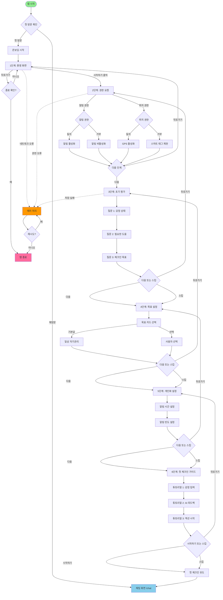
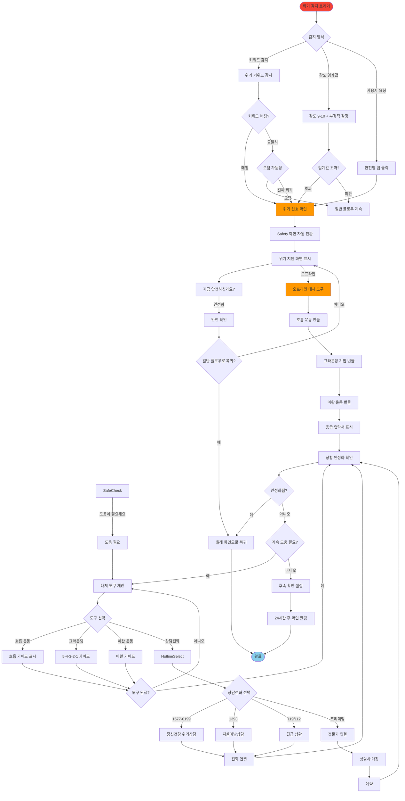
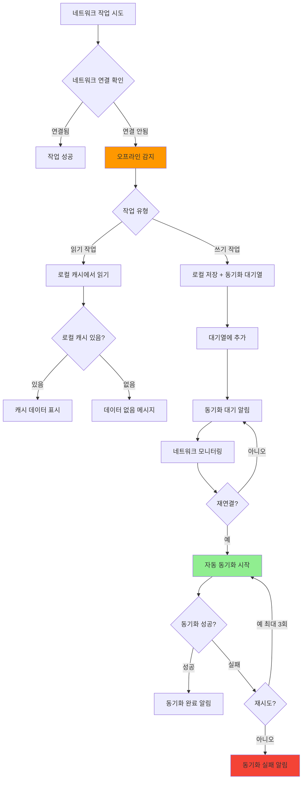
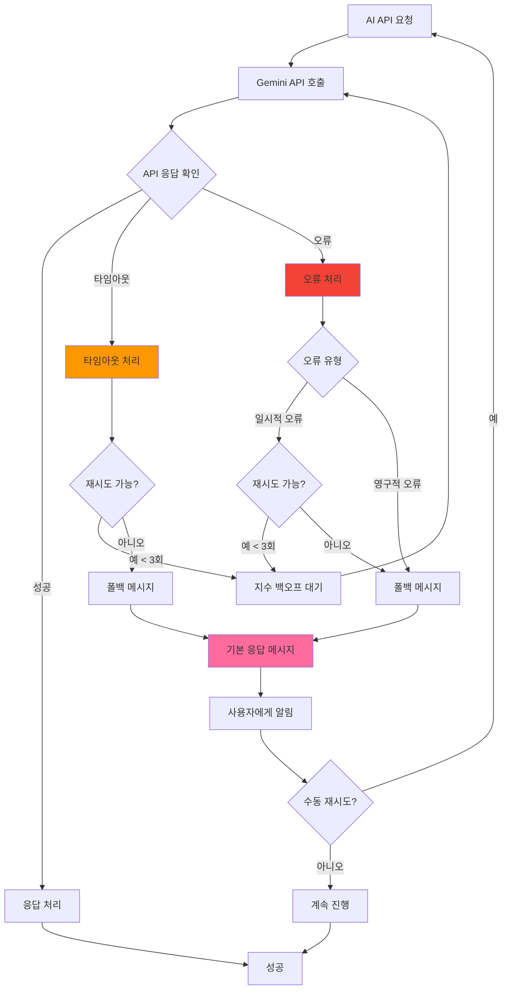
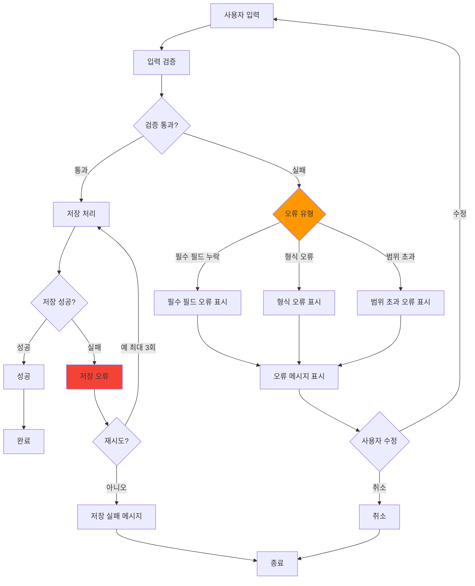
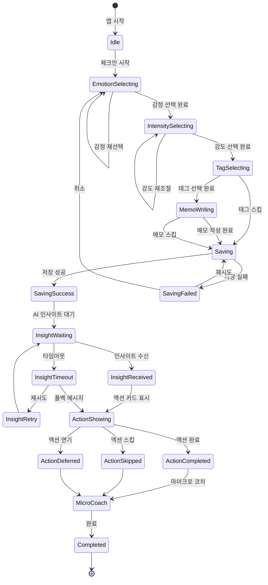
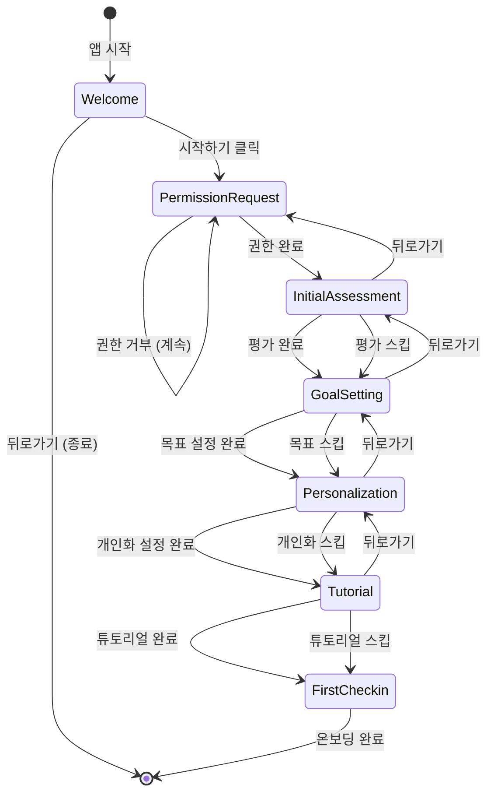
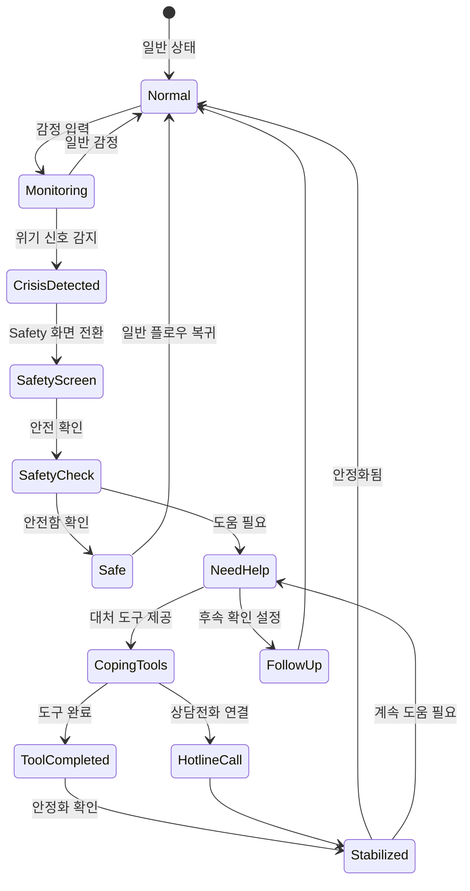

# 마음로그 V5.0 플로우차트 고도화 분석 및 개선 제안서

**작성일**: 2025-01-15  
**분석자**: UX/UI 디자이너 & 프론트엔드 개발자  
**분석 대상**: PRD.md 플로우차트 섹션 (2.4 유저 플로우, 2.5 태스크 플로우)  
**목적**: 플로우차트의 완전성, 명확성, 실행 가능성 향상

---

## 목차

1. [현재 플로우차트 분석](#1-현재-플로우차트-분석)
2. [플로우차트 문제점 및 개선 필요 사항](#2-플로우차트-문제점-및-개선-필요-사항)
3. [고도화된 플로우차트 제안](#3-고도화된-플로우차트-제안)
4. [예외 처리 및 에러 경로 상세화](#4-예외-처리-및-에러-경로-상세화)
5. [상태 머신 다이어그램](#5-상태-머신-다이어그램)
6. [사용자 여정 맵 (User Journey Map)](#6-사용자-여정-맵-user-journey-map)
7. [개선 우선순위 및 실행 계획](#7-개선-우선순위-및-실행-계획)

---

## 1. 현재 플로우차트 분석

### 1.1 현재 플로우차트 구조

PRD.md에는 다음 3개의 주요 플로우가 정의되어 있습니다:

1. **플로우 1: 온보딩** (라인 1799-1895)
   - 6단계 구조
   - 텍스트 기반 플로우차트
   - 조건 분기 부족

2. **플로우 2: 대화형 일일 감정 체크인** (라인 1897-1988)
   - 상세 플로우차트
   - 비동기 처리 명시
   - 예외 처리 부족

3. **플로우 3: 위기 상황 대응** (라인 1989-2026)
   - 간단한 플로우차트
   - 위기 감지 알고리즘 미명시

### 1.2 현재 플로우차트의 강점

✅ **명확한 단계 구분**: 각 플로우가 단계별로 잘 구분됨  
✅ **비동기 처리 명시**: AI 인사이트 생성 등 비동기 작업 표시  
✅ **선택적 단계 표시**: 스킵 가능한 단계 명시

### 1.3 현재 플로우차트의 문제점

#### 🔴 Critical: 시각적 표현 부족
- **문제**: 텍스트 기반 플로우차트로 시각적 이해 어려움
- **영향**: 개발자/디자이너 간 소통 비효율
- **해결**: Mermaid 다이어그램 또는 플로우차트 도구 활용

#### 🔴 Critical: 예외 처리 경로 부족
- **문제**: 에러 케이스 및 예외 상황 처리 경로 불명확
- **영향**: 개발 시 엣지 케이스 처리 누락 가능성
- **해결**: 모든 분기점에 예외 처리 경로 추가

#### 🟡 Medium: 병렬 처리 명시 부족
- **문제**: 동시에 실행 가능한 작업이 순차적으로 표시됨
- **영향**: 성능 최적화 기회 놓침
- **해결**: 병렬 처리 가능 작업 명시

#### 🟡 Medium: 상태 전환 불명확
- **문제**: 각 단계 간 상태 전환 조건 불명확
- **영향**: 상태 관리 로직 설계 어려움
- **해결**: 상태 머신 다이어그램 추가

---

## 2. 플로우차트 문제점 및 개선 필요 사항

### 2.1 플로우 1: 온보딩

#### 문제점
1. **진행 상태 표시 부재**: 사용자가 어느 단계인지 알 수 없음
2. **뒤로가기 처리 미명시**: 각 단계에서 뒤로가기 시 동작 불명확
3. **에러 처리 부족**: 네트워크 오류, 권한 거부 등 예외 상황 처리 없음
4. **조건 분기 불명확**: 스킵 가능 여부가 단계별로 다르나 명확한 분기 없음

#### 개선 필요 사항
- 진행 바 추가
- 뒤로가기 동작 명시
- 에러 처리 경로 추가
- 조건 분기 다이어그램 추가

### 2.2 플로우 2: 대화형 일일 감정 체크인

#### 문제점
1. **Day/Night Mode 분기 부재**: 핵심 기능인 모드 전환이 플로우에 없음
2. **감정 선택 UI 불명확**: 칩 선택과 자유 입력의 우선순위 불명확
3. **스마트 태그 타이밍 불명확**: 언제 추천되는지 불명확
4. **재시도 로직 부족**: AI 인사이트 실패 시 재시도 플로우 불명확
5. **오프라인 처리 부족**: 네트워크 없을 때 처리 방법 없음

#### 개선 필요 사항
- Day/Night Mode 분기 추가
- 감정 선택 UI 플로우 명확화
- 스마트 태그 추천 타이밍 명시
- 재시도 및 폴백 로직 상세화
- 오프라인 처리 경로 추가

### 2.3 플로우 3: 위기 상황 대응

#### 문제점
1. **위기 감지 알고리즘 부재**: 감지 기준 및 로직 없음
2. **복귀 경로 불명확**: 안정화 후 원래 화면으로 복귀하는 방법 불명확
3. **오탐 처리 부족**: 오탐 시 사용자 경험 처리 없음
4. **전문가 연결 플로우 부족**: 프리미엄 사용자 연결 과정 없음

#### 개선 필요 사항
- 위기 감지 알고리즘 플로우 추가
- 복귀 경로 명시
- 오탐 처리 로직 추가
- 전문가 연결 플로우 상세화

---

## 3. 고도화된 플로우차트 제안

### 3.1 플로우 1: 온보딩 (고도화 버전)

**주요 개선 사항**:
- ✅ 진행 상태 표시 (각 단계 번호)
- ✅ 뒤로가기 처리 명시
- ✅ 에러 처리 경로 추가
- ✅ 조건 분기 명확화

### 3.2 플로우 2: 대화형 일일 감정 체크인 (고도화 버전)

```mermaid
flowchart TD
    Start([진입점]) --> EntryPoint{진입 방식}
    EntryPoint -->|채팅 화면| ChatScreen[채팅 화면]
    EntryPoint -->|알림 클릭| NotificationClick[알림에서 진입]
    EntryPoint -->|위젯 탭| WidgetTap[위젯에서 진입]
    
    ChatScreen --> ModeCheck{현재 모드 확인}
    NotificationClick --> ModeCheck
    WidgetTap --> ModeCheck
    
    ModeCheck -->|Day Mode<br/>06:00-18:00| DayMode[Day Mode 플로우]
    ModeCheck -->|Night Mode<br/>18:00-06:00| NightMode[Night Mode 플로우]
    ModeCheck -->|수동 전환| ManualSwitch{모드 선택}
    ManualSwitch -->|Day| DayMode
    ManualSwitch -->|Night| NightMode
    
    %% Day Mode 플로우
    DayMode --> DayGreeting[AI: 오늘 기분은 어때요?]
    DayGreeting --> EmotionSelect{감정 선택 방식}
    EmotionSelect -->|칩 선택| ChipSelect[5가지 감정 칩]
    EmotionSelect -->|자유 입력| FreeInput[자연어 입력]
    ChipSelect --> EmotionChosen[감정 선택 완료]
    FreeInput --> NLPProcess{자연어 처리}
    NLPProcess -->|성공| EmotionChosen
    NLPProcess -->|실패| EmotionRetry{재입력?}
    EmotionRetry -->|예| EmotionSelect
    EmotionRetry -->|아니오| Exit[종료]
    
    EmotionChosen --> IntensitySelect[강도 선택 1-10]
    IntensitySelect --> SmartTagCheck{스마트 태그 추천}
    SmartTagCheck -->|GPS/시간대 기반| TagRecommend[태그 추천 0-3개]
    SmartTagCheck -->|수동 입력| ManualTag[수동 태그 입력]
    TagRecommend --> TagSelected{태그 선택}
    ManualTag --> TagSelected
    TagSelected -->|0-3개 선택| MemoCheck{메모 입력?}
    TagSelected -->|스킵| MemoCheck
    
    MemoCheck -->|입력| MemoInput[한 줄 메모 최대 200자]
    MemoCheck -->|스킵| SaveProcess
    MemoInput --> SaveProcess[저장 처리]
    
    SaveProcess --> Validation{입력 검증}
    Validation -->|성공| FirestoreSave[Firestore 저장]
    Validation -->|실패| ValidationError[검증 오류 표시]
    ValidationError --> SaveProcess
    
    FirestoreSave --> SaveSuccess{저장 성공?}
    SaveSuccess -->|성공| ImmediateFeedback[즉시 피드백 P95 < 800ms]
    SaveSuccess -->|실패| SaveRetry{재시도?}
    SaveRetry -->|예 최대 3회| FirestoreSave
    SaveRetry -->|아니오| SaveError[저장 실패 알림]
    SaveError --> Exit
    
    ImmediateFeedback --> AsyncInsight[AI 인사이트 생성 비동기]
    AsyncInsight --> InsightCheck{인사이트 생성 완료?}
    InsightCheck -->|8초 이내| InsightSuccess[AI 피드백 표시]
    InsightCheck -->|타임아웃 8초| InsightTimeout[폴백 메시지 + 재시도]
    InsightCheck -->|실패| InsightFail[기본 메시지 + 재시도]
    InsightTimeout --> InsightRetry{재시도?}
    InsightFail --> InsightRetry
    InsightRetry -->|예| AsyncInsight
    InsightRetry -->|아니오| InsightSuccess
    
    InsightSuccess --> ActionRecommend[마이크로 액션 추천]
    ActionRecommend --> ActionCard[오늘의 1개 액션 카드]
    ActionCard --> ActionChoice{액션 선택}
    ActionChoice -->|완료| ActionComplete[액션 완료]
    ActionChoice -->|오늘은 패스| ActionSkip[액션 스킵]
    ActionChoice -->|내일로| ActionDefer[다음날 재제안]
    
    ActionComplete --> Recheck{5초 리체크?}
    Recheck -->|예| BeforeAfter[Before/After 표시]
    Recheck -->|아니오| MicroCoach
    ActionSkip --> MicroCoach{2턴 마이크로 코치?}
    ActionDefer --> MicroCoach
    
    MicroCoach -->|더 말해보기| CoachQ1[질문 1]
    CoachQ1 --> CoachA1[답변 1]
    CoachA1 --> CoachQ2[질문 2]
    CoachQ2 --> CoachA2[답변 2]
    CoachA2 --> CoachSummary[요약 1줄 생성]
    MicroCoach -->|스킵| GrowthReflect
    CoachSummary --> GrowthReflect[성장 반영]
    BeforeAfter --> GrowthReflect
    
    GrowthReflect --> XPGain[XP 획득]
    XPGain --> LevelCheck{레벨업?}
    LevelCheck -->|예| LevelUp[레벨업 축하]
    LevelCheck -->|아니오| BlossomUpdate
    LevelUp --> BlossomUpdate[벚꽃 정원 업데이트]
    BlossomUpdate --> Complete([완료])
    
    %% Night Mode 플로우
    NightMode --> NightGreeting[AI: 오늘 하루를 정리해볼까요?]
    NightGreeting --> NightEmotionSelect[감정 선택]
    NightEmotionSelect --> NightIntensity[강도 선택]
    NightIntensity --> DaySummaryCheck{Day Mode 요약 있음?}
    DaySummaryCheck -->|예| AutoFill[Day Mode 요약 자동 인입]
    DaySummaryCheck -->|아니오| DiaryWrite
    AutoFill --> DiaryWrite[일기 작성 최대 500자]
    DiaryWrite --> NightSave[저장 처리]
    NightSave --> LetterGenerate[AI 편지 생성]
    LetterGenerate --> LetterShow[편지 표시]
    LetterShow --> UserReaction{사용자 반응}
    UserReaction -->|공감해요| NightComplete
    UserReaction -->|도움이 됐어요| NightComplete
    UserReaction -->|별로예요| FeedbackCollect[피드백 수집]
    FeedbackCollect --> NightComplete[저장 완료]
    NightComplete --> Complete
    
    %% 오프라인 처리
    FirestoreSave -.->|오프라인| OfflineMode[오프라인 모드]
    OfflineMode --> LocalSave[로컬 저장 IndexedDB]
    LocalSave --> SyncQueue[동기화 대기열]
    SyncQueue -->|온라인 복귀| AutoSync[자동 동기화]
    AutoSync --> FirestoreSave
    
    %% 위기 감지
    EmotionChosen -.->|위기 신호 감지| CrisisDetect[위기 감지]
    NightEmotionSelect -.->|위기 신호 감지| CrisisDetect
    CrisisDetect --> SafetyFlow[안전망 플로우로 전환]
    
    style Start fill:#90EE90
    style Complete fill:#87CEEB
    style Exit fill:#FF6B9D
    style CrisisDetect fill:#F44336
    style OfflineMode fill:#FF9800
```

**주요 개선 사항**:
- ✅ Day/Night Mode 분기 추가
- ✅ 감정 선택 UI 플로우 명확화
- ✅ 스마트 태그 추천 타이밍 명시
- ✅ 재시도 및 폴백 로직 상세화
- ✅ 오프라인 처리 경로 추가
- ✅ 위기 감지 인터셉트 추가

### 3.3 플로우 3: 위기 상황 대응 (고도화 버전)

**주요 개선 사항**:
- ✅ 위기 감지 알고리즘 플로우 추가
- ✅ 오탐 처리 로직 추가
- ✅ 복귀 경로 명시
- ✅ 전문가 연결 플로우 상세화
- ✅ 오프라인 처리 추가

---

## 4. 예외 처리 및 에러 경로 상세화

### 4.1 네트워크 오류 처리 플로우

### 4.2 AI API 실패 처리 플로우

### 4.3 데이터 검증 실패 처리 플로우

---

## 5. 상태 머신 다이어그램

### 5.1 체크인 상태 머신

### 5.2 온보딩 상태 머신

### 5.3 위기 감지 상태 머신

---

## 6. 사용자 여정 맵 (User Journey Map)

### 6.1 첫 사용자 여정 (First-Time User Journey)

| 단계 | 액션 | 생각/감정 | 터치포인트 | 기회 | 통증점 |
|------|------|----------|----------|------|--------|
| **발견** | 앱 다운로드 | "감정 관리 앱이 필요해" | 앱스토어 검색 | 명확한 가치 제안 | - |
| **온보딩** | 앱 실행 | "빠르게 시작하고 싶어" | 환영 화면 | 진행 상태 표시 | 6단계가 많음 |
| **권한** | 권한 요청 | "왜 필요한지 모르겠어" | 권한 요청 화면 | 명확한 설명 | 위치 권한 거부 시 기능 제한 |
| **첫 체크인** | 감정 기록 | "어떻게 하는 거지?" | 채팅 화면 | 튜토리얼 제공 | UI 혼란 가능 |
| **AI 응답** | 인사이트 확인 | "기다리는 시간이 길어" | AI 인사이트 로딩 | 빠른 응답 | 타임아웃 시 혼란 |
| **액션** | 마이크로 액션 | "뭘 해야 할지 모르겠어" | 액션 카드 | 명확한 가이드 | 액션 선택 어려움 |

### 6.2 재방문 사용자 여정 (Returning User Journey)

| 단계 | 액션 | 생각/감정 | 터치포인트 | 기회 | 통증점 |
|------|------|----------|----------|------|--------|
| **알림** | 알림 클릭 | "오늘도 기록해야지" | 푸시 알림 | 적절한 타이밍 | 알림 차단 가능 |
| **빠른 체크인** | Day Mode 체크인 | "빨리 끝내고 싶어" | 채팅 화면 | 빠른 입력 | 단계가 많음 |
| **패턴 확인** | 리포트 확인 | "내 패턴이 궁금해" | 리포트 화면 | 인사이트 제공 | 리포트 생성 대기 |
| **성장 확인** | 벚꽃 정원 확인 | "얼마나 성장했지?" | 프로필 화면 | 시각적 피드백 | 변화가 느림 |

---

## 7. 개선 우선순위 및 실행 계획

### 7.1 P0 (즉시 수정 필요)

1. **Day/Night Mode 분기 추가** (플로우 2)
   - 작업량: 4시간
   - 담당: UX 디자이너 + 프론트엔드 개발자
   - 마감: 1주일 내

2. **예외 처리 경로 추가** (모든 플로우)
   - 작업량: 8시간
   - 담당: 프론트엔드 개발자
   - 마감: 2주일 내

3. **위기 감지 알고리즘 플로우 상세화** (플로우 3)
   - 작업량: 1일
   - 담당: 백엔드 개발자 + UX 디자이너
   - 마감: 1주일 내

### 7.2 P1 (단기 개선 필요, 1-2주)

1. **진행 상태 표시 추가** (플로우 1)
   - 작업량: 4시간
   - 담당: UX 디자이너
   - 마감: 2주일 내

2. **오프라인 처리 경로 추가** (플로우 2)
   - 작업량: 1일
   - 담당: 프론트엔드 개발자
   - 마감: 2주일 내

3. **상태 머신 다이어그램 작성** (모든 플로우)
   - 작업량: 1일
   - 담당: UX 디자이너
   - 마감: 2주일 내

### 7.3 P2 (중기 개선 필요, 1개월)

1. **사용자 여정 맵 상세화**
   - 작업량: 2일
   - 담당: UX 디자이너
   - 마감: 1개월 내

2. **성능 최적화 플로우 추가**
   - 작업량: 3일
   - 담당: 프론트엔드 개발자
   - 마감: 1개월 내

---

## 결론

### 주요 개선 사항 요약

1. **시각적 표현 개선**: Mermaid 다이어그램으로 플로우차트 시각화
2. **예외 처리 강화**: 모든 분기점에 에러 경로 추가
3. **상태 관리 명확화**: 상태 머신 다이어그램으로 상태 전환 명시
4. **Day/Night Mode 통합**: 핵심 기능인 모드 전환 플로우 추가
5. **오프라인 처리**: 네트워크 없을 때 처리 방법 명시

### 다음 단계

1. 개발팀과 디자인팀 리뷰 미팅
2. 고도화된 플로우차트를 PRD.md에 반영
3. 프로토타입 제작 시 플로우차트 참조
4. 사용자 테스트 계획 수립

---

**문서 버전**: 1.0  
**최종 업데이트**: 2025-01-15  
**다음 검토 예정일**: 개발 시작 전
