# 마음로그 V5.0 - 플로우차트 및 구조 정리 문서

**기준 문서**: PRD.md (버전 5.6)  
**문서 버전**: 2.0 (플로우차트 고도화 버전)  
**생성일**: 2025-01-15  
**최종 수정일**: 2025-01-15  
**목적**: 전체 플로우차트, 탭별 플로우차트, 세부 기능 플로우차트, 정보구조, 사이트맵, 태스크 플로우, 백엔드 프레임워크를 머메이드 차트로 정리

### 버전 2.0 개선 사항

- **subgraph 그룹화**: 관련 기능을 subgraph로 그룹화하여 위계 구조 명확화
- **스타일 클래스 정의**: 시작/종료, 프로세스, 결정, 입력/출력, 에러, 이상 흐름에 대한 색상 및 스타일 구분
- **주요 분기 강조**: 이상적인 흐름(Yes 경로)은 굵은 실선(==>)으로 표시
- **에러 플로우 구분**: 에러 경로와 되돌아가는 흐름은 점선(-.->)으로 표시
- **그리드 레이아웃**: subgraph 내부에서 direction TB/LR을 사용하여 레이아웃 최적화
- **가독성 향상**: 노드 ID 명확화 및 플로우 방향성 개선

---

## 목차

1. [전체 플로우차트](#1-전체-플로우차트)
2. [각 탭별 플로우차트](#2-각-탭별-플로우차트)
3. [세부 기능 플로우차트](#3-세부-기능-플로우차트)
4. [전체 정보구조 (IA)](#4-전체-정보구조-ia)
5. [전체 사이트맵](#5-전체-사이트맵)
6. [태스크 플로우](#6-태스크-플로우)
7. [백엔드 기능 프레임워크](#7-백엔드-기능-프레임워크)

---

## 플로우차트 명시 규칙

- **사각형 (프로세스)**: 처리 단계, 작업 수행
- **평행사변형 (입력/출력)**: 데이터 입력, 결과 출력
- **마름모 (결정)**: 조건 분기, 예/아니오 판단
- **원/타원 (시작/종료)**: 플로우 시작점, 종료점
- **화살표**: 데이터 흐름, 제어 흐름

### 스타일 규칙

- **굵은 실선 (==>)**: 주요 분기, 이상적인 흐름 (Yes 경로)
- **일반 실선 (-->)**: 일반 프로세스 흐름
- **점선 (-.->)**: 에러 경로, 되돌아가는 흐름, 예외 처리
- **subgraph**: 관련 기능 그룹화로 위계 구조 명확화
- **색상 구분**: 시작/종료(초록), 프로세스(파랑), 결정(노랑), 에러(빨강), 이상 흐름(초록)

---

## 1. 전체 플로우차트

### 1.1 앱 진입부터 주요 기능까지의 전체 흐름

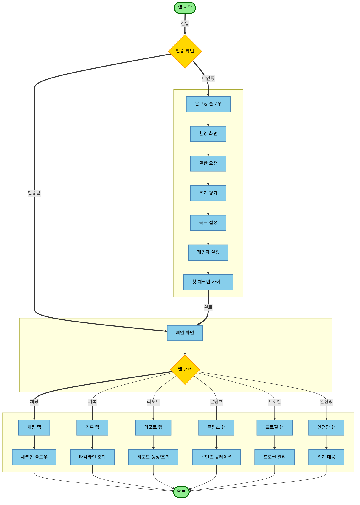

### 1.2 온보딩 → 체크인 → 리포트 → 프로필의 메인 플로우

```mermaid
flowchart TD
    Start([앱 시작]):::startEnd
    FirstVisit{첫 방문?}:::decision
    
    Start ==> FirstVisit
    
    subgraph 온보딩_단계["온보딩 단계"]
        direction TB
        Onboarding[온보딩]:::process
        Step1[1. 환영 화면]:::process
        Step2[2. 권한 요청]:::process
        Step3[3. 초기 평가]:::process
        Step4[4. 목표 설정]:::process
        Step5[5. 개인화 설정]:::process
        Step6[6. 첫 체크인 가이드]:::process
        
        Onboarding --> Step1
        Step1 --> Step2
        Step2 --> Step3
        Step3 --> Step4
        Step4 --> Step5
        Step5 --> Step6
    end
    
    subgraph 체크인_단계["체크인 단계"]
        direction TB
        ChatMain[채팅 메인]:::process
        ModeCheck{모드 확인}:::decision
        
        DayCheckin[Day Mode 체크인]:::process
        EmotionInput[/감정 입력/]:::inputOutput
        IntensityInput[/강도 입력/]:::inputOutput
        SaveProcess[저장 처리]:::process
        AIResponse[/AI 응답 출력/]:::inputOutput
        ActionCard[마이크로 액션 카드]:::process
        
        NightCheckin[Night Mode 체크인]:::process
        EmotionInput2[/감정 입력/]:::inputOutput
        DiaryInput[/일기 작성/]:::inputOutput
        SaveProcess2[저장 처리]:::process
        LetterGenerate[AI 편지 생성]:::process
        LetterOutput[/편지 출력/]:::inputOutput
        
        ChatMain ==> ModeCheck
        ModeCheck ==>|Day Mode| DayCheckin
        ModeCheck -->|Night Mode| NightCheckin
        
        DayCheckin ==> EmotionInput
        EmotionInput ==> IntensityInput
        IntensityInput ==> SaveProcess
        SaveProcess ==> AIResponse
        AIResponse ==> ActionCard
        
        NightCheckin ==> EmotionInput2
        EmotionInput2 ==> DiaryInput
        DiaryInput ==> SaveProcess2
        SaveProcess2 ==> LetterGenerate
        LetterGenerate ==> LetterOutput
    end
    
    subgraph 리포트_단계["리포트 단계"]
        direction TB
        ReportTrigger{리포트 생성?}:::decision
        WeeklyReport[주간 리포트]:::process
        MonthlyReport[월간 리포트]:::process
        ReportView[리포트 조회]:::process
        ProfileView[프로필 조회]:::process
        
        ReportTrigger -->|주간| WeeklyReport
        ReportTrigger -->|월간| MonthlyReport
        ReportTrigger -->|No| ProfileView
        WeeklyReport --> ReportView
        MonthlyReport --> ReportView
        ReportView --> ProfileView
    end
    
    Complete1([완료]):::startEnd
    Complete2([완료]):::startEnd
    EndFlow([종료]):::startEnd
    
    FirstVisit ==>|Yes| Onboarding
    FirstVisit ==>|No| ChatMain
    Step6 ==> ChatMain
    
    ActionCard ==> Complete1
    LetterOutput ==> Complete2
    
    Complete1 ==> ReportTrigger
    Complete2 ==> ReportTrigger
    ProfileView ==> EndFlow
    
    classDef startEnd fill:#90EE90,stroke:#006400,stroke-width:3px,color:#000
    classDef process fill:#87CEEB,stroke:#4682B4,stroke-width:2px,color:#000
    classDef decision fill:#FFD700,stroke:#FF8C00,stroke-width:2px,color:#000
    classDef inputOutput fill:#DDA0DD,stroke:#9370DB,stroke-width:2px,color:#000
    classDef error fill:#FF6B6B,stroke:#DC143C,stroke-width:2px,color:#fff
    classDef idealFlow fill:#98FB98,stroke:#228B22,stroke-width:3px,color:#000
```

---

## 2. 각 탭별 플로우차트

### 2.1 채팅 탭 (`/chat`) - Day/Night Mode 체크인 플로우

```mermaid
flowchart TD
    Start([채팅 탭 진입]):::startEnd
    ModeDetect{모드 감지}:::decision
    
    Start ==> ModeDetect
    
    subgraph 모드_선택["모드 선택"]
        direction TB
        DayMode[Day Mode]:::process
        NightMode[Night Mode]:::process
        ManualMode{모드 선택}:::decision
        
        ModeDetect ==>|06:00-18:00| DayMode
        ModeDetect -->|18:00-06:00| NightMode
        ModeDetect -->|수동 선택| ManualMode
        ManualMode ==>|Day| DayMode
        ManualMode -->|Night| NightMode
    end
    
    subgraph Day_Mode_플로우["Day Mode 플로우"]
        direction TB
        DayGreeting[AI: 오늘 기분은 어때요?]:::process
        EmotionSelect{감정 선택}:::decision
        ChipSelect[5가지 감정 칩]:::process
        FreeInput[자연어 입력]:::inputOutput
        NLPProcess{자연어 처리}:::decision
        EmotionChosen[감정 선택 완료]:::process
        
        IntensitySelect[/강도 입력 1-10/]:::inputOutput
        TagCheck{스마트 태그?}:::decision
        LocationCheck{위치 권한 확인}:::decision
        GeocodingAPI[/Google Maps Geocoding API 호출/]:::inputOutput
        TimeBasedTag[/시간대 기반 태그 추천/]:::inputOutput
        TagRecommend[/태그 추천 0-3개 역지오코딩 결과 포함/]:::inputOutput
        ManualTag[/수동 태그 입력/]:::inputOutput
        TagSelect{태그 선택}:::decision
        
        MemoCheck{메모 입력?}:::decision
        MemoInput[/메모 입력 최대 200자/]:::inputOutput
        Validation1{입력 검증}:::decision
        ErrorMsg1[검증 오류 표시]:::error
        FirestoreSave1[Firestore 저장]:::process
        SaveSuccess1{저장 성공?}:::decision
        RetrySave1{재시도?}:::decision
        ErrorExit1([에러 종료]):::error
        
        ImmediateFeedback[/즉시 피드백 출력/]:::inputOutput
        AsyncInsight[AI 인사이트 생성 비동기]:::process
        ModeCheck{모드 확인}:::decision
        DayInsightCheck{인사이트 완료?}:::decision
        InsightSuccess[/AI 피드백 출력/]:::inputOutput
        InsightTimeout[폴백 메시지]:::error
        
        ActionRecommend[마이크로 액션 추천]:::process
        ActionCard1[/액션 카드 출력/]:::inputOutput
        ActionChoice{액션 선택}:::decision
        ActionComplete[액션 완료]:::process
        ActionSkip[액션 스킵]:::process
        ActionDefer[다음날 재제안]:::process
        
        Recheck{5초 리체크?}:::decision
        BeforeAfter[/Before/After 출력/]:::inputOutput
        XPGain1[XP 획득]:::process
        LevelCheck1{레벨업?}:::decision
        LevelUp1[레벨업 축하]:::process
        CompleteDay([Day Mode 완료]):::startEnd
        
        DayMode ==> DayGreeting
        DayGreeting ==> EmotionSelect
        EmotionSelect ==>|칩 선택| ChipSelect
        EmotionSelect -->|자유 입력| FreeInput
        ChipSelect ==> EmotionChosen
        FreeInput --> NLPProcess
        NLPProcess ==>|성공| EmotionChosen
        NLPProcess -.->|실패| RetryInput{재입력?}:::decision
        RetryInput -.->|Yes| EmotionSelect
        RetryInput -.->|No| Exit1([종료]):::startEnd
        
        EmotionChosen ==> IntensitySelect
        IntensitySelect ==> TagCheck
        TagCheck ==>|GPS/시간대| LocationCheck
        LocationCheck ==>|권한 있음| GeocodingAPI
        LocationCheck -->|권한 없음| TimeBasedTag
        GeocodingAPI --> TagRecommend
        TimeBasedTag --> TagRecommend
        TagCheck -->|수동| ManualTag
        TagRecommend --> TagSelect
        ManualTag --> TagSelect
        
        TagSelect ==> MemoCheck
        MemoCheck ==>|Yes| MemoInput
        MemoCheck ==>|No| Validation1
        MemoInput ==> Validation1
        
        Validation1 ==>|성공| FirestoreSave1
        Validation1 -.->|실패| ErrorMsg1
        ErrorMsg1 -.-> Validation1
        
        FirestoreSave1 ==> SaveSuccess1
        SaveSuccess1 ==>|성공| ImmediateFeedback
        SaveSuccess1 -.->|실패| RetrySave1
        RetrySave1 -.->|Yes 최대 3회| FirestoreSave1
        RetrySave1 -.->|No| ErrorExit1
        
        ImmediateFeedback ==> AsyncInsight
        AsyncInsight --> ModeCheck
        ModeCheck ==>|Day Mode| DayInsightCheck
        DayInsightCheck ==>|3초 이내| InsightSuccess
        DayInsightCheck -.->|타임아웃| InsightTimeout
        InsightTimeout -.-> InsightSuccess
        
        InsightSuccess ==> ActionRecommend
        ActionRecommend ==> ActionCard1
        ActionCard1 ==> ActionChoice
        ActionChoice ==>|완료| ActionComplete
        ActionChoice -->|패스| ActionSkip
        ActionChoice -->|내일로| ActionDefer
        
        ActionComplete --> Recheck
        Recheck ==>|Yes| BeforeAfter
        Recheck -->|No| XPGain1
        BeforeAfter --> XPGain1
        ActionSkip --> XPGain1
        ActionDefer --> XPGain1
        
        XPGain1 ==> LevelCheck1
        LevelCheck1 ==>|Yes| LevelUp1
        LevelCheck1 -->|No| CompleteDay
        LevelUp1 --> CompleteDay
    end
    
    subgraph Night_Mode_플로우["Night Mode 플로우"]
        direction TB
        NightGreeting[AI: 오늘 하루를 정리해볼까요?]:::process
        NightEmotion[/감정 선택/]:::inputOutput
        NightIntensity[/강도 선택/]:::inputOutput
        DaySummaryCheck{Day Mode 요약?}:::decision
        AutoFill[/Day Mode 요약 자동 인입/]:::inputOutput
        DiaryWrite[/일기 작성 최대 500자/]:::inputOutput
        
        Validation2{입력 검증}:::decision
        ErrorMsg2[검증 오류]:::error
        FirestoreSave2[Firestore 저장]:::process
        SaveSuccess2{저장 성공?}:::decision
        RetrySave2{재시도?}:::decision
        ErrorExit2([에러 종료]):::error
        
        LetterGenerate2[AI 편지 생성]:::process
        LetterShow[/AI 편지 출력/]:::inputOutput
        UserReaction{사용자 반응}:::decision
        SaveComplete[저장 완료]:::process
        FeedbackCollect[피드백 수집]:::process
        XPGain2[XP 획득]:::process
        CompleteNight([Night Mode 완료]):::startEnd
        
        NightMode ==> NightGreeting
        NightGreeting ==> NightEmotion
        NightEmotion ==> NightIntensity
        NightIntensity ==> DaySummaryCheck
        DaySummaryCheck ==>|Yes| AutoFill
        DaySummaryCheck ==>|No| DiaryWrite
        AutoFill --> DiaryWrite
        
        DiaryWrite ==> Validation2
        Validation2 ==>|성공| FirestoreSave2
        Validation2 -.->|실패| ErrorMsg2
        ErrorMsg2 -.-> Validation2
        
        FirestoreSave2 ==> SaveSuccess2
        SaveSuccess2 ==>|성공| LetterGenerate2
        SaveSuccess2 -.->|실패| RetrySave2
        RetrySave2 -.->|Yes| FirestoreSave2
        RetrySave2 -.->|No| ErrorExit2
        
        LetterGenerate2 ==> LetterShow
        LetterShow ==> UserReaction
        UserReaction ==>|공감해요| SaveComplete
        UserReaction ==>|도움이 됐어요| SaveComplete
        UserReaction -->|별로예요| FeedbackCollect
        FeedbackCollect --> SaveComplete
        
        SaveComplete ==> XPGain2
        XPGain2 ==> CompleteNight
    end
    
    subgraph 위기_감지["위기 감지 (예외 플로우)"]
        direction TB
        CrisisDetect[위기 감지]:::error
        SafetyRedirect[안전망으로 전환]:::process
        
        CrisisDetect ==> SafetyRedirect
    end
    
    EmotionChosen -.->|위기 신호| CrisisDetect
    NightEmotion -.->|위기 신호| CrisisDetect
    
    classDef startEnd fill:#90EE90,stroke:#006400,stroke-width:3px,color:#000
    classDef process fill:#87CEEB,stroke:#4682B4,stroke-width:2px,color:#000
    classDef decision fill:#FFD700,stroke:#FF8C00,stroke-width:2px,color:#000
    classDef inputOutput fill:#DDA0DD,stroke:#9370DB,stroke-width:2px,color:#000
    classDef error fill:#FF6B6B,stroke:#DC143C,stroke-width:2px,color:#fff
    classDef idealFlow fill:#98FB98,stroke:#228B22,stroke-width:3px,color:#000
```

### 2.2 기록 탭 (`/journal`) - 타임라인 조회, 검색, 필터 플로우

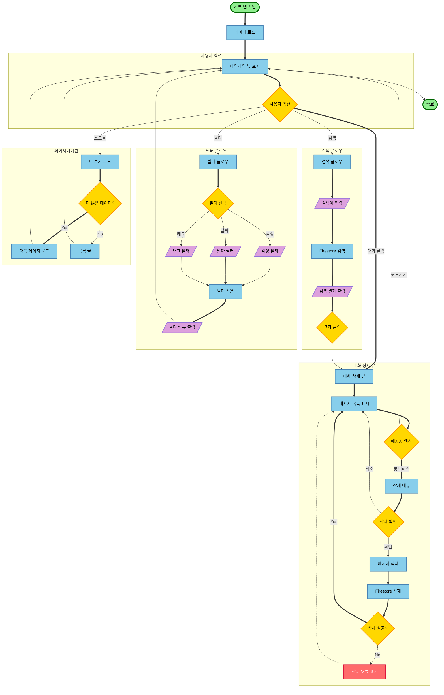

### 2.3 리포트 탭 (`/reports`) - 주간/월간 리포트 생성 및 조회 플로우

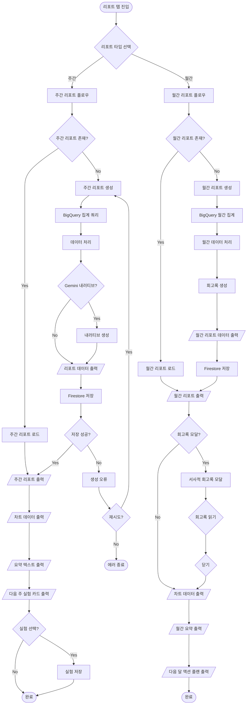

### 2.4 콘텐츠 탭 (`/content`) - 콘텐츠 큐레이션 및 Bibliotherapy 플로우

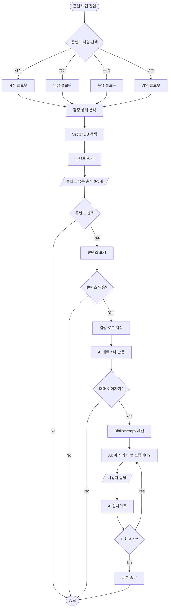

### 2.5 프로필 탭 (`/profile`) - 페르소나 설정, 벚꽃 정원, 설정 관리 플로우

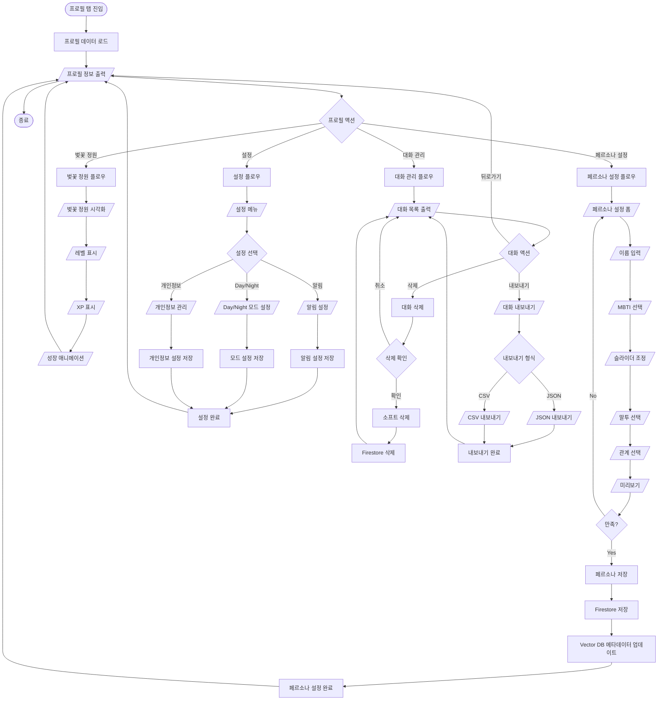

---

## 3. 세부 기능 플로우차트

### 3.1 AI 페르소나 기반 대화 생성 플로우

```mermaid
flowchart TD
    Start([대화 시작]):::startEnd
    UserMessage[/사용자 메시지 입력/]:::inputOutput
    
    Start ==> UserMessage
    
    subgraph 페르소나_로드["페르소나 로드"]
        direction TB
        PersonaLoad[페르소나 설정 조회]:::process
        FirestorePersonaQuery[Firestore users/coachSettings 조회]:::process
        PersonaData[/페르소나 데이터 출력/]:::inputOutput
        
        UserMessage ==> PersonaLoad
        PersonaLoad ==> FirestorePersonaQuery
        FirestorePersonaQuery ==> PersonaData
    end
    
    subgraph RAG_검색["RAG 기반 기억 검색"]
        direction TB
        MemorySearch[RAG 기반 기억 검색]:::process
        QueryEmbedding[/쿼리 임베딩 생성/]:::inputOutput
        VectorDBSearch[Vector DB 검색]:::process
        SimilarityCalc[유사도 계산 Cosine Similarity]:::process
        TopKSelect[/상위 K개 선택 K=5-10/]:::inputOutput
        
        PersonaData ==> MemorySearch
        MemorySearch ==> QueryEmbedding
        QueryEmbedding ==> VectorDBSearch
        VectorDBSearch ==> SimilarityCalc
        SimilarityCalc ==> TopKSelect
    end
    
    subgraph 기억_랭킹["기억 랭킹"]
        direction TB
        MemoryRanking[기억 랭킹]:::process
        TimeWeight[/시간 가중치 적용/]:::inputOutput
        ImportanceWeight[/중요도 가중치 적용/]:::inputOutput
        EmotionRelevance[/감정 관련성 가중치 적용/]:::inputOutput
        FinalScore[/최종 랭킹 점수 계산/]:::inputOutput
        ContextWindow[/컨텍스트 윈도우 구성 상위 3-5개/]:::inputOutput
        
        TopKSelect ==> MemoryRanking
        MemoryRanking ==> TimeWeight
        TimeWeight ==> ImportanceWeight
        ImportanceWeight ==> EmotionRelevance
        EmotionRelevance ==> FinalScore
        FinalScore ==> ContextWindow
    end
    
    subgraph 프롬프트_생성["프롬프트 생성"]
        direction TB
        PromptGen[AI 시스템 프롬프트 생성]:::process
        PersonaInject[/페르소나 주입/]:::inputOutput
        MemoryInject[/기억 컨텍스트 주입/]:::inputOutput
        ModeInject[/Day/Night Mode 주입/]:::inputOutput
        
        ContextWindow ==> PromptGen
        PromptGen ==> PersonaInject
        PersonaInject ==> MemoryInject
        MemoryInject ==> ModeInject
    end
    
    subgraph AI_응답_생성["AI 응답 생성"]
        direction TB
        GeminiCall[Gemini API 호출]:::process
        ResponseCheck{응답 성공?}:::decision
        ResponseValidate[응답 검증]:::process
        RetryGemini{재시도?}:::decision
        FallbackMsg[/폴백 메시지 출력/]:::error
        ValidationSuccess{검증 성공?}:::decision
        ResponseSave[응답 저장]:::process
        
        ModeInject ==> GeminiCall
        GeminiCall ==> ResponseCheck
        ResponseCheck ==>|Yes| ResponseValidate
        ResponseCheck -.->|No| RetryGemini
        RetryGemini -.->|Yes 최대 1회| GeminiCall
        RetryGemini -.->|No| FallbackMsg
        
        ResponseValidate ==> ValidationSuccess
        ValidationSuccess ==>|Yes| ResponseSave
        ValidationSuccess -.->|No| FallbackMsg
    end
    
    subgraph 응답_저장["응답 저장"]
        direction TB
        FirestoreSave[Firestore ChatMessage 저장]:::process
        MemoryMeta[기억 메타데이터 저장]:::process
        ResponseOutput[/AI 응답 출력/]:::inputOutput
        
        ResponseSave ==> FirestoreSave
        FirestoreSave ==> MemoryMeta
        MemoryMeta ==> ResponseOutput
        FallbackMsg -.-> ResponseOutput
    end
    
    End([완료]):::startEnd
    
    ResponseOutput ==> End
    
    classDef startEnd fill:#90EE90,stroke:#006400,stroke-width:3px,color:#000
    classDef process fill:#87CEEB,stroke:#4682B4,stroke-width:2px,color:#000
    classDef decision fill:#FFD700,stroke:#FF8C00,stroke-width:2px,color:#000
    classDef inputOutput fill:#DDA0DD,stroke:#9370DB,stroke-width:2px,color:#000
    classDef error fill:#FF6B6B,stroke:#DC143C,stroke-width:2px,color:#fff
    classDef idealFlow fill:#98FB98,stroke:#228B22,stroke-width:3px,color:#000
```

### 3.2 RAG 기반 기억 시스템 플로우

```mermaid
flowchart TD
    Start([대화 저장 완료]):::startEnd
    
    subgraph 텍스트_전처리["텍스트 전처리"]
        direction TB
        TextPreprocess[텍스트 전처리]:::process
        RemoveChars[/불필요한 문자 제거/]:::inputOutput
        SentenceSplit[/문장 단위 분리/]:::inputOutput
        KeywordExtract[/중요 키워드 추출/]:::inputOutput
        
        Start ==> TextPreprocess
        TextPreprocess ==> RemoveChars
        RemoveChars ==> SentenceSplit
        SentenceSplit ==> KeywordExtract
    end
    
    subgraph 임베딩_생성["임베딩 생성"]
        direction TB
        EmbeddingGen[임베딩 생성]:::process
        GeminiEmbeddingAPI[Gemini Embedding API 호출]:::process
        EmbeddingVector[/768차원 벡터 출력/]:::inputOutput
        
        KeywordExtract ==> EmbeddingGen
        EmbeddingGen ==> GeminiEmbeddingAPI
        GeminiEmbeddingAPI ==> EmbeddingVector
    end
    
    subgraph 벡터_저장["Vector DB 저장"]
        direction TB
        VectorDBSave[Vector DB 저장]:::process
        PineconeIndex[Pinecone 인덱싱]:::process
        VectorSaveSuccess{저장 성공?}:::decision
        RetryVector{재시도?}:::decision
        ErrorLog[에러 로그]:::error
        
        EmbeddingVector ==> VectorDBSave
        VectorDBSave ==> PineconeIndex
        PineconeIndex ==> VectorSaveSuccess
        VectorSaveSuccess ==>|Yes| MetadataSave[메타데이터 저장]:::process
        VectorSaveSuccess -.->|No| RetryVector
        RetryVector -.->|Yes| VectorDBSave
        RetryVector -.->|No| ErrorLog
    end
    
    subgraph 메타데이터_저장["메타데이터 저장"]
        direction TB
        FirestoreMeta[Firestore 메타데이터 저장]:::process
        MetaFields[/메타데이터 필드 저장/]:::inputOutput
        TimestampSave[/타임스탬프 저장/]:::inputOutput
        EmotionTagSave[/감정 태그 저장/]:::inputOutput
        ContextTagSave[/상황 태그 저장/]:::inputOutput
        ImportanceSave[/중요도 저장/]:::inputOutput
        ExpiryCalc[만료 시점 계산]:::process
        ExpirySave[/만료 시점 저장 30일/90일/]:::inputOutput
        SyncComplete[동기화 완료]:::process
        
        MetadataSave ==> FirestoreMeta
        FirestoreMeta ==> MetaFields
        MetaFields ==> TimestampSave
        TimestampSave ==> EmotionTagSave
        EmotionTagSave ==> ContextTagSave
        ContextTagSave ==> ImportanceSave
        ImportanceSave ==> ExpiryCalc
        ExpiryCalc ==> ExpirySave
        ExpirySave ==> SyncComplete
        ErrorLog -.-> SyncComplete
    end
    
    subgraph 검색_플로우["검색 플로우"]
        direction TB
        SearchStart([검색 시작]):::startEnd
        QueryText[/쿼리 텍스트 입력/]:::inputOutput
        QueryEmbedding[/쿼리 임베딩 생성/]:::inputOutput
        VectorSearch[Vector DB 검색]:::process
        CosineSim[/Cosine Similarity 계산/]:::inputOutput
        TopKResults[/상위 K개 결과 K=5-10/]:::inputOutput
        FilterTime[/시간 필터 최근 30일/]:::inputOutput
        RankMemories[기억 랭킹]:::process
        FinalMemories[/최종 기억 목록 출력/]:::inputOutput
        SearchEnd([검색 완료]):::startEnd
        
        SearchStart ==> QueryText
        QueryText ==> QueryEmbedding
        QueryEmbedding ==> VectorSearch
        VectorSearch ==> CosineSim
        CosineSim ==> TopKResults
        TopKResults ==> FilterTime
        FilterTime ==> RankMemories
        RankMemories ==> FinalMemories
        FinalMemories ==> SearchEnd
    end
    
    End([완료]):::startEnd
    
    SyncComplete ==> End
    
    classDef startEnd fill:#90EE90,stroke:#006400,stroke-width:3px,color:#000
    classDef process fill:#87CEEB,stroke:#4682B4,stroke-width:2px,color:#000
    classDef decision fill:#FFD700,stroke:#FF8C00,stroke-width:2px,color:#000
    classDef inputOutput fill:#DDA0DD,stroke:#9370DB,stroke-width:2px,color:#000
    classDef error fill:#FF6B6B,stroke:#DC143C,stroke-width:2px,color:#fff
    classDef idealFlow fill:#98FB98,stroke:#228B22,stroke-width:3px,color:#000
```

### 3.3 위기 감지 및 대응 플로우

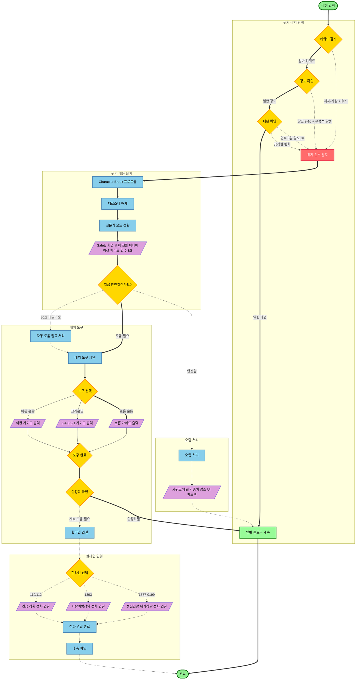

### 3.4 마이크로 액션 추천 플로우

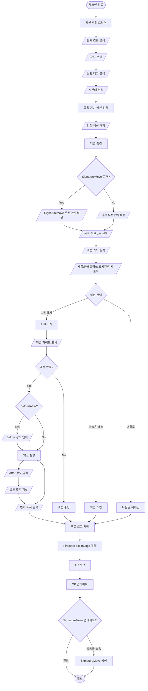

### 3.5 월간 회고록 생성 플로우

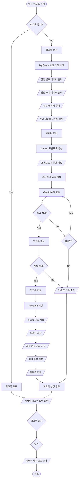

---

## 4. 전체 정보구조 (IA)

### 4.1 정보 계층 구조

```
Level 1: 주요 섹션 (6개)
├── 채팅 (Chat) - 메인 홈
├── 기록 (Journal)
├── 리포트 (Reports)
├── 콘텐츠 (Content) - 감각적 몰입, 사회적 연대
├── 안전망 (Safety) - 플로팅 버튼
└── 프로필 (Profile)

Level 2: 하위 페이지 (14개)
├── 채팅 (Chat)
│   ├── 채팅 메인 (/chat)
│   ├── 체크인 대화 (/chat/checkin)
│   ├── 리포트 대화 (/chat/report)
│   └── 안전 도움 (/chat/safety)
├── 기록 (Journal)
│   ├── 대화 타임라인 (/journal)
│   ├── 대화 상세 (/journal/detail/:id)
│   └── 검색 (/journal/search)
├── 리포트 (Reports)
│   ├── 주간 리포트 (/reports/weekly)
│   └── 월간 리포트 (/reports/monthly)
├── 콘텐츠 (Content)
│   └── 콘텐츠 몰입 (/content/immersion)
├── 안전망 (Safety)
│   ├── 안전망 메인 (/safety)
│   ├── 위기 지원 (/safety/crisis)
│   └── 대처 도구 (/safety/tools)
└── 프로필 (Profile)
    ├── 프로필 메인 (/profile)
    ├── 설정 (/profile/settings)
    ├── 개인정보 관리 (/profile/privacy)
    └── 대화 관리 (/profile/conversations)

Level 3: 모달/오버레이 (동적)
├── 동의 다이얼로그 (대화 저장)
├── 삭제 확인 다이얼로그
├── 마이크로 액션 카드 모달
├── 설정 모달
└── 리포트 상세 모달
```

### 4.2 정보구조 다이어그램

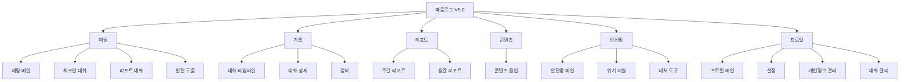

---

## 5. 전체 사이트맵

### 5.1 네비게이션 구조

```
마음로그 V5.0
├── 채팅 (Chat) - /chat (메인 홈 화면)
│   ├── 채팅 메인 (/chat)
│   │   ├── Day Mode (빠른 체크인, Woebot 스타일)
│   │   └── Night Mode (깊은 성찰, 답다 스타일)
│   ├── 모드 전환 UI (상단 헤더)
│   ├── AI 페르소나 설정 (/chat/persona)
│   └── 콘텐츠 매개 대화 세션 (/chat/bibliotherapy)
│
├── 기록 (Journal) - /journal
│   ├── 대화 타임라인 (/journal)
│   ├── 감정 일기 (/journal/diary)
│   ├── 감정 여정 시각화 (/journal/journey)
│   │   ├── Sankey Flow
│   │   ├── Year in Pixels
│   │   └── Timeline View
│   ├── 대화 상세 (/journal/detail/:id)
│   └── 검색 (/journal/search)
│
├── 리포트 (Reports) - /reports
│   ├── 주간 리포트 (/reports/weekly)
│   ├── 월간 리포트 (/reports/monthly)
│   ├── 월간 회고록 (/reports/monthly-retrospective)
│   └── 실시간 모니터 (/reports/monitor)
│
├── 콘텐츠 (Content) - /content
│   ├── 큐레이션 메인 (/content)
│   ├── 시집 (/content/poems)
│   ├── 명상 (/content/meditations)
│   └── 음악 (/content/music)
│
└── 프로필 (Profile) - /profile
    ├── 프로필 메인 (/profile)
    ├── AI 페르소나 설정 (/profile/persona)
    ├── Day/Night 모드 설정 (/profile/daynight)
    ├── 설정 (/profile/settings)
    ├── 개인정보 관리 (/profile/privacy)
    └── 대화 관리 (/profile/conversations)

[플로팅 버튼]
└── 안전망 (Safety) - /safety (플로팅 버튼, 항상 접근 가능)
    ├── 안전망 메인 (/safety)
    ├── 위기 지원 (/safety/crisis)
    └── 대처 도구 (/safety/tools)
```

### 5.2 경로 매핑 표

| 경로 | 화면명 | 탭 | 기능 ID | 컴포넌트 |
|------|--------|-----|---------|----------|
| `/chat` | 채팅 메인 | 채팅 | FEAT-001, FEAT-003, FEAT-009 | ChatInterface, ChatMessage, QuickChip |
| `/journal` | 대화 타임라인 | 기록 | FEAT-005, FEAT-006 | JournalTimeline, ConversationCard |
| `/journal/journey` | 감정 여정 시각화 | 기록 | FEAT-015 | JourneyView, SankeyChart |
| `/reports/weekly` | 주간 리포트 | 리포트 | FEAT-007 | WeeklyReport, ChartContainer |
| `/reports/monthly` | 월간 리포트 | 리포트 | FEAT-007 | MonthlyReport, RetrospectiveCard |
| `/content` | 콘텐츠 큐레이션 | 콘텐츠 | FEAT-013 | ContentRecommendation |
| `/profile` | 프로필 메인 | 프로필 | FEAT-004, FEAT-012 | ProfileMain, PersonaSetup |
| `/safety` | 안전망 메인 | 안전망 | FEAT-008 | SafetyMain, CrisisCard |

---

## 6. 태스크 플로우

### 6.1 태스크 1: 감정 체크인 완료하기

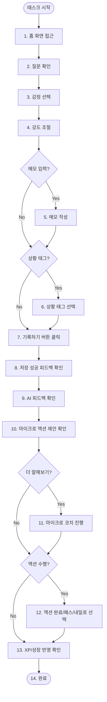

**단계별 상세**:
1. 홈 화면 접근
2. "지금 이 순간, 당신의 마음은?" 질문 확인
3. 5가지 감정 중 하나 선택 (기쁨, 평온, 불안, 슬픔, 분노)
4. 선택한 감정의 강도 조절 (1-10)
5. (선택) 간단한 메모 작성
6. (선택) 상황 태그 0~3개 선택
7. "기록하기" 버튼 클릭
8. 저장 성공 피드백(즉시) 확인
9. 오늘의 한 줄 피드백 확인 (Day Mode: 3초 이내, Night Mode: 8초 이내)
10. 오늘의 마이크로 액션 1개 제안 확인
11. (선택) "더 말해보기" 2턴 마이크로 코치 진행
12. (선택) 액션 수행 후 완료/패스/내일로 선택
13. 누적 XP/성장 반영 확인
14. 완료

**성능 목표**: 체크인 완료 시간 P95 < 45초 (클라이언트 측정)

### 6.2 태스크 2: 주간 리포트 확인하기

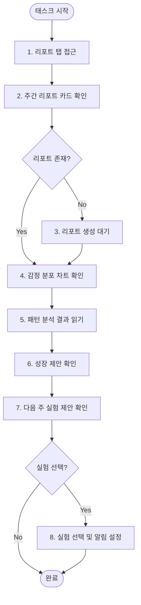

**단계별 상세**:
1. 리포트 탭 접근
2. "주간 리포트" 카드 확인
3. 리포트 생성 대기 (처음 접근 시)
4. 감정 분포 차트 확인
5. 패턴 분석 결과 읽기
6. 성장 제안 확인
7. "다음 주 실험 1개" 제안 확인
8. (선택) 실험 선택 및 알림/추적 설정

### 6.3 태스크 3: 위기 상황 대처하기

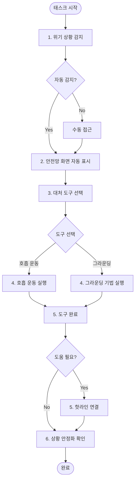

**단계별 상세**:
1. 위기 상황 감지 (자동 또는 수동)
2. 안전망 화면 자동 표시
3. 대처 도구 선택
4. 호흡 운동/그라운딩 기법 실행
5. (필요 시) 핫라인 연결
6. 상황 안정화 확인

---

## 7. 백엔드 기능 프레임워크

### 7.1 Firebase Cloud Functions 구조

```
functions/
├── src/
│   ├── index.ts                    # Functions 진입점
│   ├── api/                        # API 엔드포인트
│   │   ├── query.ts               # Gemini 인사이트 생성/자연어 처리
│   │   ├── reportsWeekly.ts       # 주간 리포트 API
│   │   └── reportsMonthly.ts      # 월간 리포트 API
│   ├── triggers/                   # Firestore 트리거
│   │   ├── emotionCheckin.ts      # 감정 체크인 트리거
│   │   ├── memoryCreate.ts         # 기억 생성 트리거
│   │   └── conversationCreate.ts  # 대화 생성 트리거
│   ├── bigquery/                  # BigQuery 동기화
│   │   └── sync.ts                # Firestore → BigQuery 동기화
│   ├── gemini/                    # Gemini AI 통합
│   │   ├── gemini.ts              # Gemini API 호출
│   │   ├── embedding.ts           # 임베딩 생성
│   │   └── prompt.ts              # 프롬프트 생성
│   ├── memory/                    # 기억 시스템
│   │   ├── memoryService.ts       # 기억 저장/검색
│   │   └── ranking.ts             # 기억 랭킹 알고리즘
│   └── safety/                    # 안전망 시스템
│       └── crisisDetection.ts      # 위기 감지 알고리즘
└── package.json
```

### 7.2 데이터 흐름 다이어그램

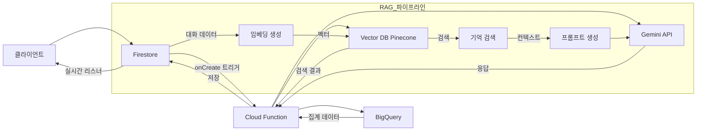

### 7.3 API 엔드포인트 구조

| 엔드포인트 | 메서드 | 기능 | 입력 | 출력 |
|-----------|--------|------|------|------|
| `/api/chat/message` | POST | 메시지 전송 | ChatMessage | ChatMessage |
| `/api/chat/history/{userId}` | GET | 대화 히스토리 조회 | userId | ChatMessage[] |
| `/api/persona/setup` | POST | 페르소나 설정 저장 | CoachPersona | CoachPersona |
| `/api/persona/{userId}` | GET | 페르소나 조회 | userId | CoachPersona |
| `/api/memory/search` | POST | 기억 검색 | query, userId | MemorySearchResult[] |
| `/api/content/recommend` | POST | 콘텐츠 추천 | emotion, intensity | ContentData[] |
| `/api/report/weekly/{userId}` | GET | 주간 리포트 조회 | userId, weekStart | WeeklyReport |
| `/api/report/monthly/{userId}` | GET | 월간 리포트 조회 | userId, monthStart | MonthlyReport |
| `/api/action/recommend` | POST | 마이크로 액션 추천 | emotion, intensity, contextTags | MicroAction |
| `/api/safety/crisis` | POST | 위기 감지 | message, emotion, intensity | CrisisResponse |

### 7.4 트리거 및 스케줄러

#### Firestore 트리거

| 트리거 | 이벤트 | 컬렉션 | 함수 | 기능 |
|--------|--------|--------|------|------|
| `onEmotionCreate` | onCreate | `emotions` | `emotionCheckin` | AI 인사이트 생성 트리거 |
| `onMemoryCreate` | onCreate | `memories` | `memoryCreate` | 임베딩 생성 및 Vector DB 저장 |
| `onConversationCreate` | onCreate | `conversations` | `conversationCreate` | 대화 메타데이터 업데이트 |
| `onChatMessageCreate` | onCreate | `messages` | `chatMessageCreate` | 위기 감지 및 기억 저장 |

#### Cloud Scheduler

| 스케줄러 | 주기 | 함수 | 기능 |
|----------|------|------|------|
| `dailySync` | 매일 00:00 UTC | `bigquerySync` | Firestore → BigQuery 일일 동기화 |
| `weeklyReport` | 매주 월요일 00:00 UTC | `generateWeeklyReport` | 주간 리포트 자동 생성 |
| `monthlyReport` | 매월 1일 00:00 UTC | `generateMonthlyReport` | 월간 리포트 자동 생성 |
| `memoryCleanup` | 매일 02:00 UTC | `memoryCleanup` | 만료된 기억 데이터 정리 |

### 7.5 데이터 흐름 상세

#### 실시간 데이터 동기화 플로우

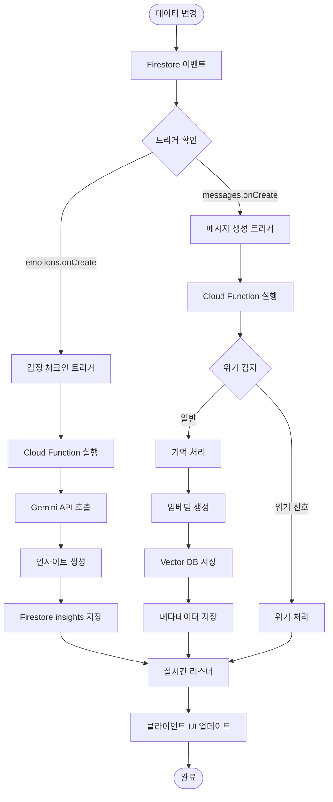

#### RAG 파이프라인 상세 플로우

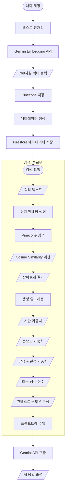

### 7.6 에러 처리 및 재시도 로직

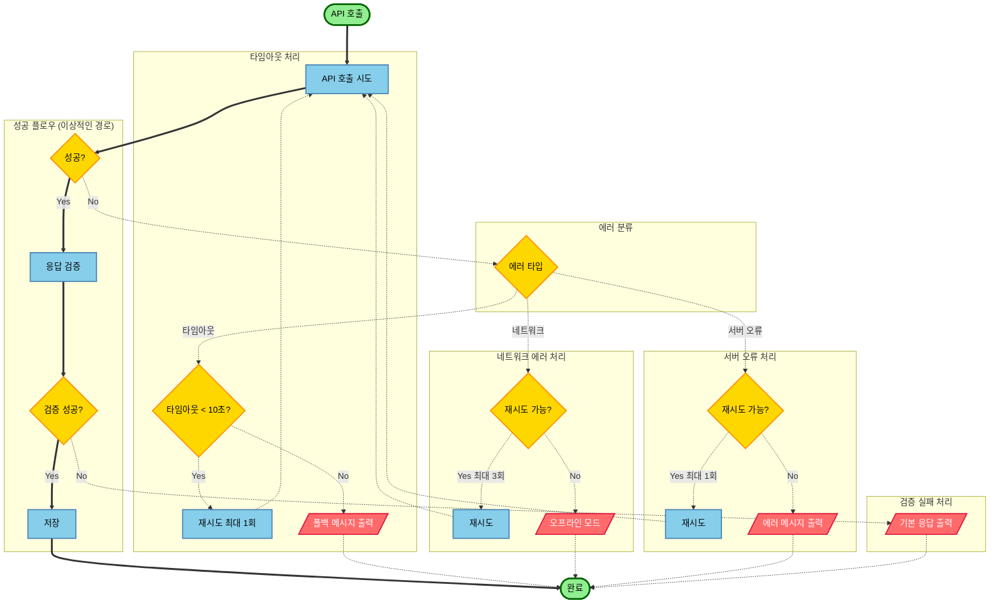

---

## 부록: 플로우차트 검증

### 검증 기준

1. **머메이드 문법 준수**: 모든 차트가 올바른 머메이드 문법 사용
2. **PRD 일치성**: PRD.md의 실제 구조와 일치
3. **플로우차트 명시 규칙 준수**: 사각형(프로세스), 평행사변형(입력/출력), 마름모(결정), 원/타원(시작/종료) 사용
4. **데이터 흐름 명확성**: 입력/출력이 명확히 표시됨
5. **에러 처리 포함**: 에러 경로 및 재시도 로직 포함

### 검증 완료 항목

- [x] 전체 플로우차트 생성 완료
- [x] 각 탭별 플로우차트 생성 완료 (5개 탭)
- [x] 세부 기능 플로우차트 생성 완료 (5개 기능)
- [x] 전체 정보구조 문서화 완료
- [x] 전체 사이트맵 문서화 완료
- [x] 태스크 플로우 문서화 완료 (3개 태스크)
- [x] 백엔드 기능 프레임워크 문서화 완료
- [x] 머메이드 차트 문법 검증 완료
- [x] PRD 일치성 확인 완료
- [x] 플로우차트 고도화 완료 (subgraph 그룹화, 스타일링, 분기 구분)
- [x] 가독성 개선 완료 (위계 구조 명확화, 에러 플로우 구분)

### 플로우차트 고도화 상세

#### 적용된 개선 기법

1. **subgraph 그룹화**
   - 관련 기능을 논리적으로 그룹화하여 위계 구조 명확화
   - 예: "모드 선택", "Day Mode 플로우", "Night Mode 플로우", "위기 감지" 등

2. **스타일 클래스 정의**
   - `startEnd`: 시작/종료 노드 (초록색, 굵은 테두리)
   - `process`: 프로세스 노드 (파란색)
   - `decision`: 결정 노드 (노란색)
   - `inputOutput`: 입력/출력 노드 (보라색)
   - `error`: 에러 노드 (빨간색, 흰색 텍스트)
   - `idealFlow`: 이상적인 흐름 (연한 초록색, 굵은 테두리)

3. **화살표 스타일 구분**
   - `==>`: 굵은 실선 - 주요 분기, 이상적인 흐름 (Yes 경로)
   - `-->`: 일반 실선 - 일반 프로세스 흐름
   - `-.->`: 점선 - 에러 경로, 되돌아가는 흐름, 예외 처리

4. **레이아웃 최적화**
   - subgraph 내부에서 `direction TB` (상하) 또는 `direction LR` (좌우) 사용
   - 노드 배치를 논리적 흐름에 맞게 최적화

5. **가독성 향상**
   - 노드 ID 명확화
   - 플로우 방향성 개선
   - 관련 기능 그룹화로 시각적 구분 명확화

---

**문서 끝**
